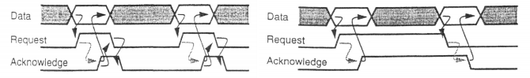
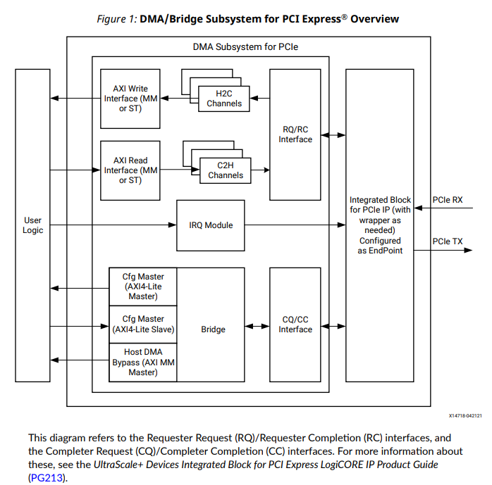
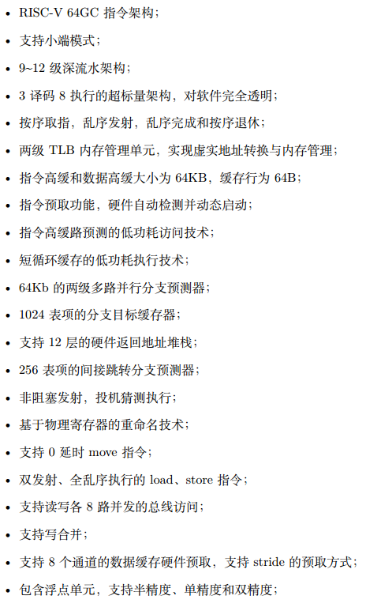

## FAQ

```
Q: IC芯片设计基本流程

A:
* 前端: 架构设计, RTL实现, Coding Style Check, 功能验证, 逻辑综合, 一致性验证, 时序仿真
* 后端: Floor plan, IO plan, Placement, Clock Tree Synthesis, Routing, Signoff, Tapeout
* 静态时序分析 贯穿 一致性检查, 综合, 布局, 布线, 时钟树综合
```

```
Q: 什么是综合

A: 将RTL代码映射为与工艺库相关的网表, translation + optimization + mapping
```

```
Q: FPGA和ASIC的区别

A: 
* 构成不同: Gate vs. LUT
* 设计流程不同
* 可重构性, 时钟频率
* 用途不同, 原型验证
```

```
Q: 什么是FPGA原型验证以及为什么要用FPGA做原型验证

A: 
* 通过将RTL移植到现场可编程门阵列（FPGA）来验证专门应用的集成电路（ASIC）和片上系统（SoC）的功能和性能
* 原因
    - 利用可重构的特点,避免多次流片造成的高成本; 
    - 软硬件协同验证;
    - FPGA通常建立在最新的制造流程上，以实现最高的密度和运行速度。
    - FPGA板可以在与最终SoC相同的嘈杂环境中进行测试。
    - 加速仿真
```

```
Q: FPGA上的组成有什么

A: LUT, IO, BRAM, LUTRAM, FF, MMCM, Primitive
```


```
Q: FPGA的基本结构和工作原理

A: 可编程逻辑单元中阵列(包括查找表和FF), 四周可编程IO, 丰富的布线资源, 通过控制一系列的开关满足特定单元间的互联
```

```
Q: FPGA和CPLD的区别

A: 
CPLD主要是由可编程逻辑宏单元（LMC，Logic Macro Cell）围绕中心的可编程互连矩阵单元组成，其中LMC逻辑结构较复杂，并具有复杂的I/O单元互连结构，可由用户根据需要生成特定的电路结构，完成一定的功能。

FPGA通常包含三类可编程资源：可编程逻辑功能块、可编程I/O块和可编程互连。可编程逻辑功能块是实现用户功能的基本单元，它们通常排列成一个阵列，散布于整个芯片；可编程I/O块完成芯片上逻辑与外部封装脚的接口，常围绕着阵列排列于芯片四周；可编程内部互连包括各种长度的连线线段和一些可编程连接开关，它们将各个可编程逻辑块或I/O块连接起来，FPGA在可编程逻辑块的规模，内部互连线的结构和采用的可编程元件上存在较大的差异。

①CPLD更适合完成各种算法和组合逻辑，FPGA更适合于完成时序逻辑。换句话说，FPGA更适合于触发器丰富的结构，而CPLD更适合于触发器有限而乘积项丰富的结构。
②CPLD的连续式布线结构决定了它的时序延迟是均匀的和可预测的，而FPGA的分段式布线结构决定了其延迟的不可预测性。
③在编程上FPGA比CPLD具有更大的灵活性。CPLD通过修改具有固定内连电路的逻辑功能来编程，FPGA主要通过改变内部连线的布线来编搜索程；FPGA可在逻辑门下编程，而CPLD是在逻辑块下编程。
④FPGA的集成度比CPLD高，具有更复杂的布线结构和逻辑实现。
⑤CPLD比FPGA使用起来更方便。CPLD的编程采用E2PROM或FASTFLASH技术，无需外部存储器芯片，使用简单。而FPGA的编程信息需存放在外部存储器上，使用方法复杂。
⑥CPLD的速度比FPGA快，并且具有较大的时间可预测性。这是由于FPGA是门级编程，并且CLB之间采用分布式互联，而CPLD是逻辑块级编程，并且其逻辑块之间的互联是集总式的。
⑦在编程方式上，CPLD主要是基于E2PROM或FLASH存储器编程，编程次数可达1万次，优点是系统断电时编程信息也不丢失。CPLD又可分为在编 程器上编程和在系统编程两类。FPGA大部分是基于SRAM编程，编程信息在系统断电时丢失，每次上电时，需从器件外部将编程数据重新写入SRAM中。其 优点是可以编程任意次，可在工作中快速编程，从而实现板级和系统级的动态配置。
⑧CPLD保密性好，FPGA保密性差。
⑨一般情况下，CPLD的功耗要比FPGA大，且集成度越高越明显。
```

```
Q: 多bit的跨时钟域

A: 
* 带反馈的开环或闭环的使能信号反馈,MCP
* FIFO
* Dmux
```

```
Q: 数字IC流程中插入扫描链的作用

A:
将普通寄存器换成带扫描功能的寄存器用于将来的测试

```


```
Q: skew 和 jitter 分别是啥

A:
skew: 同一个周期到不同寄存器的延迟不同导致的时钟扭斜
jitter: 不同周期的时长, 占空比都可能不一样, 一般是由于源的问题
```

```
Q: 按键防抖如何实现

A: 
* 确定按键抖动时长, 假设为20ms
* 直接整个20ms的时钟, 检测下降沿就行
```

```
Q: 异步复位和同步复位的优缺点

A: 
同步复位优点: 可以过滤高于时钟频率的毛刺, 产生同步时序电路, 有利于时序分析
同步复位缺点: 综合后生成组合逻辑, 产生额外延迟, 且复位有效时长必须大于时钟周期.
异步复位优点: 不生成组合逻辑, 不产生额外延迟, 异步复位信号识别方便
异步复位缺点: 释放时如果恰好在时钟有效沿附近, 容易出现亚稳态。容易收到毛刺影响 (对异步复位进行滤波和去抖是非常重要的)
```

```
Q: 异步复位产生的时序问题

A: 
复位释放（Release）有时候也被称为复位去除（Removal）
当复位撤除时，它必须满足异步微建立时间，即µtSU. 也叫Trecover时间
复位撤除时，它也必须要满足微保持时间，即µtH. 也叫Tremoval时间
不能通过时序分析里的Recovery和Removal检查时，那么复位信号边沿就会很可能落入了一个亚稳态区域
增加同步器进行同步, 使用set_false_path进行时序分析的分割
```


```
Q: 亚稳态产生的原因

A: 数据信号违反了setup hold时间或者复位信号违反了recovery或removal时间
```

```
Q: 为什么寄存器有setup和hold时间

A: 
在上升沿处，如果D还处于变化状态，那就有可能采到它的不确定区，从而导致寄存器Q端输出不确定态，也就是我们所说的亚稳态。
由于工艺、寄生参数、触发器结构等原因决定
主要原因还是门延迟 + 反馈导致震荡

```

```
Q: WC和BC分别是什么环境下

A:
WC: P slow, T highest, V lowerst
BC: P fast, T lowerst, V highest
```

```
Q: 有效数据是一个脉冲的慢信号到快的跨时钟域

A: 
* 如果频率比大于1.5倍, 则直接两个寄存器同步即可
* 将脉冲变成电平, 到目标时钟域再变回来

```

```
Q: 异步FIFO最小深度求解

A: 
原理： FIFO深度/(写入速率-读出速率) = FIFO填满的时间 应该 大于 数据包传送的时间=写入数据量/写入速率

写时钟频率 w_clk,
读时钟频率 r_clk,
写时钟周期里，每B个时钟周期会有A个数据写入FIFO
读时钟周期里，每Y个时钟周期会有X个数据读出FIFO
则，FIFO的最小深度是？

具体： fifo_depth = burst_len - [burst_len * (1/w_clk)]/[Y *(1/r_clk) /X]; 

* 如果burst之间没有足够长的间隔，必须要满足写一个的时间大于等于读一个时间，这样才不会满。

* 如果数据连续，则burst_len在背靠背情况下最坏，为2A
* burst_len * 1/w_clk 是这个传输最少持续的时间，如果严格来算应该还需要和AB有关
* Y *(1/r_clk) /X 是读出一个数据需要的时间
* 两者一除就是在持续时间内读出了多少个数，在和burst_len相减


```

```
Q: 非满就写，非空就读，没有突发长度，这个时候fifo深度应该怎么设置

A: 
假如写一个的时间大于读一个时间，则fifo深度有意义，此时突发长度按背靠背情况计算
加入写一个的时间小于读一个时间，则fifo深度无意义，肯定会被填满
```


```
Q: 什么是DRC

A: design rule check, 包括max_transition, max_fanout, max_area, max_capacitance
```

```
Q: Dmux如何实现多位宽信号同步

A: 将多Bit数据信号和单bit控制信号成对的从发送时钟域发往接受时钟域，控制信号在接收时钟域以两级同步器（打两拍）的形式接收，多Bit数据信号由同步后的单Bit控制信号控制的MUX决定数据是否通过。Dmux就是mux
```


```
Q: 常见的握手协议有什么

A: 
异步四相,两相握手协议
ready valid握手协议
```



```
Q: 阻塞赋值和非阻塞赋值

A: 
阻塞: 同一个always块中，其后面的赋值语句从概念上是在前一条赋值语句结束后开始赋值的。
非阻塞: 首先计算语句块内部所有右边表达式(RHS)的值，然后完成对左边寄存器变量的赋值操作。
```

```
Q: 使用PMOS和NMOS实现一个NAND，写出真值表，再用NAND实现一个XOR，只能用NAND。

A: 与非门和或非门可以实现任何组合逻辑功能

首先实现非门: F = ~(A&B)中令B=A, 则 F = ~A.
然后实现与门: 与非门+非门就是与门
然后实现或门: 非门+或非门就是或门
然后就随便搭了
```

```
Q: 使用veilrog实现检测8位数第一个1的位置

A: 二分,检测高4位是否为0(同时给位置高位赋值),然后检测高2位是否为0(同时给位置中间位赋值),最后检测高1位是否为0(同时给位置低位赋值)
```

```
Q: 使用单口ram实现FIFO

A: 

如果想使用单端口SRAM，为保证读写同时进行，需要使用双倍数据位宽的SRAM。
例如，一个1024*8bit的SRAM，要改为512*16bit大小。
在同时连续读写时，需要两倍的存储带宽才能保证写入和读出不停顿。
读写部分另有两倍位宽的写Reg和单倍位宽的读Reg
而写入/读出的数据也变成了两倍位宽。
这会产生一些问题，比如：读写的数据是奇数个、写入1个数据之后立即读出时，尚未凑齐足够的数据写入SRAM，但多出的这个数据又要被读出。
所以，在SRAM的前后，需要添加一些辅助的寄存器。

```

```
Q: xdma.png的IP框架

A: 
```




```
Q: 统计输入[7:0]data_in中1的个数，要求优化资源的使用

A: 
area: for cnt <= cnt + in[i]
speed: sigma_data[i]

```


```
Q: 补码的意义是什么

A: 
* 是一种唯一码
* 统一了符号位和数值位, 符号位权重是-1
* 因此运算会相对方便,简化硬件设计

```


```
Q: AXI有哪些信号

A: 
ACLK, ARESETn, 5个通道 AW(写地址), W(写数据), B(写响应), AR(读地址), R(读数据)
AW: AWID, AWADDR, AWLEN, AWSIZE, AWBURST, AWLOCK, AWCACHE, AWPROT, AWVALID, AWREADY
W: WID, WDATA, WSTRB, WLAST, WVALID, WREADY
B: BID, BRESP, BVALID, BREADY
AR: ARID, ARADDR, ARLEN, ARSIZE, ARBURST, ARLOCK, ARCACHE, ARPROT, ARVALID, ARRAEDY
R: RID, RDATA, RRESP, RLAST, RVALID, RREADY
```

```
Q: AXI有什么Burst类型

A: 
FIXED: 每个beat都是同一个地址, 给FIFO用的
INCR: 递增
WRAP: 回卷
```

```
Q: AXI的RESP有几位, 分别代表什么

A:2位, 分别代表OKAY, EXOKAY, SLVERR, DECERR
```


```
Q: APB有那些信号

A:
PCLK, PRESETn
Bridge: PADDR, PPROT, PWRITE, PADDR, PWDATA, PENABLE(penable为0的时候pready无所谓), PSEL
Slave: PSELx, PENABLE, PADDR, PWRITE, PWDATA, PRDATA
```

```
Q: AHB有哪些信号

A: 
HCLK, HRESTn
MASTER: HADDR, HTRANS, HWRITE, HWDATA, HVALID, HSIZE, HBURST(用于指定type,支持wrap和incr和burst len,支持1,4,8,16和无限), HPROT
SALVE: HRDATA, HBURST, HPROT, HWRITE, HREADY, HRESP(对于error, retry, split三种resp需要一个two-cycle的reponse)
ARBITER: HBUSREQ, HGRANT, HLOCK, HMASTER(表明占用总线主机号), HMASTLOCK(锁定主机信号), HSPLIT(指示那个主机能完成split传输), HSELx

```

```
Q: AHB的组件

A: 
decoder: 根据地址产生Hsel信号
arbiter: 产生hrant信号
master, slave

```


```
Q: 在AHB中,resp为error时ready保持几拍

A: ready先低, 后高一共两个周期,第一个周期让主机进入idle状态,第二个周期让主机根据resp的值做对应的操作, 如split, error, retry

```

```
Q: 竞争和冒险的区别、成因、危害、处理方法

A:
1. 延时不同导致状态改变时刻有先有后, 是竞争
2. 竞争的结果会导致冒险发生, 产生毛刺, 影响工作称为非临界竞争

如果输出稳态为0, 但是出现了正的毛刺, 称为静态0冒险
如果输出稳态为1, 但是出现了负的毛刺, 称为静态1冒险
如果输入变化前后, 输出稳态值不同, 称为动态冒险

如何减少消除毛刺:
Gray码
脉冲/latch选择法: 在脉冲的时候进行采样, 也就是在稳定的时候才采样, 消除毛刺信号
时序逻辑: 使用同步电路

```

```
Q: 低功耗常见的办法

A: 降低电压电容, 多电压域，多阈值，门控电源, 门控时钟, 减少毛刺, 采用异步电路, 流水可以在相同吞吐率的情况下减少周期, 并行则可以减小Vdd，高活跃的信号放在后边
```

```
Q: 功耗的来源

A: 
动态: 直通, 翻转
静态: 泄漏 亚阈值漏电 PN结漏电
```

```
Q: 时序约束的意义是什么?

A: 
对已经完成了排版布线的电路，加入时序约束的静态时序分析可以检验生成的电路是否满足设计要求，并且生成时序分析报告便于用户分析关键路径以便修改电路。 
通过附加约束可以控制逻辑的综合、映射、布局和布线，以减小逻辑和布线延时，从而提高工作频率
```

```
Q: 什么是Resolution Time?

A: 
一个触发器一旦进入亚稳态状态，则无法预测触发器的输出电平，也无法预测什么时候可以稳定在某个确定的电平上，此时触发器的输出端Q在较长时间内处于振荡状态，不等于输入端D。
这段时间称作决断时间（resolution time）。经过resolution time之后，输出端Q将会稳定在某个电平上，但是这个稳定之后的电平与输入端D是没有关系的。
```


```
Q: 仲裁器方案

A:
1. 严格优先级轮循
2. 公平轮循
3. 权重轮循
    一个用户可以(或者不可以)连续获得许可, 获得许可的次数由预先的权重决定, 每次访问都减1, 等全部轮循结束之后恢复预先的权重
    加入ABC权重为321, 许可序列可以为
    1. A B C A B A
    2. A A A B B C
4. 混合优先级(分组,组间优先级轮循,组内公平轮循)
```

```
Q: verilog 延迟模型

A: 
Lumped delay，块延时：延时全部集中在最后一个门
Distributed Delay，分布延时：延时分布在每一个门上
Pin-to-pin Delay，路径延时：用专用块说明每一个路径pin-to-pin延时
```

```
Q: FPGA的LUT

A：LUT是通过查表方式实现的，一个四输入的LUT就是一个16 * 1的RAM，因为四输入的信号最多只有16 * 1种组合，每一种组合对应一种输出，就像给这个RAM一个地址一样。
所以XILINX的四输入LUT是可以配置成一个16 * 1的RAM的，所谓分布式RAM就是拿一些LUT组合成你所需大小的RAM。这种存储器适合小块的RAM，是对BLOCK　RAM的一个很好补充。
```

```
Q: AXI里，如果2个master和4个slave，transaction id原来ID 3位，那么传递给slave时的transcation ID是几位

A: 4位，会在前边多加一位表示是哪个master
```

```
Q: risc和cisc的区别

A: 
寻址方式: 立即数寻址+寄存器寻址+基址寻址+PC相对取值   后者更多，例如自增自减，RV不支持间接寻址
指令：数目，长度，访存指令模型，使用频率，控制方式（微程序和组合逻辑），通用寄存器数量risc多
代码大小：risc更大

```

```
Q: RISCV指令集特点

A: 
模块化，可扩展，x0硬编码为0，方便mv, nop之类的，减少指令数量
寻址方式四种, 立即数寻址+寄存器寻址+基址寻址+PC相对取值
权限4个  U S M H(为虚拟机准备)
扩展指令
```

```
Q: RISCV的中断处理过程

A: 
U/S->M，更新csr
mepc: exception发生的时候pc位置, 中断为下一条，异常为自己，因此需要mepc=mepc+4
mtval: badaddr
mstatus: 一大堆
    1. MPIE = MIE
    2. MIE = 0
    3. MPP = U/S
mcause: excepation原因
pc  = mtvec.mode ? base + 4*cause : base;

MRET：恢复csr
mstatus:
    1. MIE = MPIE
    2. MIE = 1
    3. U/S
pc = mepc

```

```
Q: RISCV的mie和mip是干嘛的，CSR类型而非mmap

A:
mie寄存器和mip寄存器用来屏蔽中断的:
    MEIE (external interrupt)
    MTIE
    MSIE
mip表示等待状态
```

```
Q: RISCV有那些mmap的CSR

A:
mtime: 计时器
mtimecmp: 计时器比较值
msip: 软件中断等待寄存器，用于产生软件中断或清除软件中断
PLIC: 所有寄存器
```

```
Q: ASIC在FPGA上验证要注意什么

A: 存储单元和时钟需要转换为FPGA上使用的。
时序如果不满足需要加流水。
如果没有latch做门控时钟，建议在FPGA设计改成中要使用时钟使能
```

```
Q: 门控时钟实现

A: ~clock时钟沿的latch + enable + and gate(与clock gate)
```

```
Q: 门控电源实现

A: 在Vdd侧搞一个高阈值的pmos管，在standby的时候上边不导通，电源被gate掉了
```

```
Q: C910的特点
```



```
Q: AXI ID作用

A: 
1. 为了ordering model，outstanding特性
2. interconnect添加用于表明master

```


```
Q: 如何使用false path

A: 
跨时钟域的sdc
同步释放的异步复位信号
```


```
Q: gray码的sdc

A: set max/min_delay
```

```
Q: moore和mealy状态机的区别

A: 
moore只跟状态有关
mealy跟输入和状态都有关
```

```
Q: non-blocking cache如何实现

```
A: [见ilp](./part4/cache.md)

```
Q: RV中的atomic实现指令有那些，为什么需要多种

A: 
1. CAS受到ABA问题的困扰，而LR/SC避免了这一点，因为它监视到地址的所有写操作，而不是唯一的检查数据值的变化
2. CAS还需要一种新的整数指令格式来支持三个源操作数(地址、比较值、交换值)以及一种不同的内存系统消息格式，这将使微架构复杂化;
3. 此外，为了避免ABA问题，其他系统提供了一个双宽CAS (DW-CAS)，允许计数器被测试，并随着一个数据字而增加。这需要读取5个寄存器，并在一条指令中写入2个寄存器，还需要一个新的更大的内存系统消息类型，使实现更加复杂;
4. LR / SC提供了一个更高效的实现的原语,因为它只需要一个负载。CAS需要两个（one load before the CAS instruction to obtain a value for speculative computation, then a second load as part of the CAS instruction to check if value is unchanged before updating）

LR/SC的缺点：可能有活锁的问题。通过一种架构上保证eventual forward progress来避免
```

```
Q: 什么是ABA问题

A： 
CAS：对于内存中的某一个值V，提供一个旧值A和一个新值B。如果提供的旧值V和A相等就把B写入V。这个过程是原子性的。

CAS执行结果要么成功要么失败，对于失败的情形下一班采用不断重试。或者放弃。

ABA：如果另一个线程修改V值假设原来是A，先修改成B，再修改回成A。当前线程的CAS操作无法分辨当前V值是否发生过变化。
```

```
Q: RV mscratch是干嘛的

A: 上下文栈地址
```

```
Q: RVG

A: IMAFDZifenceZicsr
```

```
Q: RV中call

A: 
auipc rd, offsetHi
jalr x1, offsetLo(rd)
```

```
Q: ret

A: jalr x0, 0(x1)
```

```
Q: 如何分辨call 和 jalr

A: 

一个JAL指令当且仅当rd是x1或x5时push return address到RAS，认为是一个call

JALR指令
* rd不是x1/x5, rs1是x1/x5, pop RAS，认为是一个return
* rd是x1/x5, rs1不是1x/x5, push RAS, 认为是call
* rd是x1/x5, rs1是x1/x5，rd!=rs1, pop然后push
* rd是x1/x5, rs1是x1/x5，rd=rs1, push RAS, 认为是call


```

```
Q: jal的imm20的为什么乱七八糟的

A: 

 改组的目的是减少从不同指令类型的中间体构造全尺寸操作数所涉及的多路复用器的数量。  
 例如，符号扩展位（驱动很多线）总是相同的（inst [31]）。 您还可以看到imm [10]在I-type，S-type，B-type和J-type指令中几乎总是在同一个地方。 
```