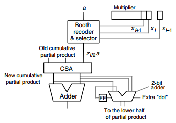

## Basic Multiplication Schemes

* Multiplicand 被乘数
* Multiplier 乘数

### Shift/Add Multiplication Algorithms

* top2bottom
    - add->shift right
    - p(j+1) = (p(j) + xj * a * 2^k) 2^{-1}  with p(0) = 0 and p(k) = p = ax + p(0)2^{-k}
* bottom2top
    - left shift->add
    - p(j+1) = 2p(j) + xk-j-1 * a  with p(0) = 0 and p(k) = p = ax + p(0)2^{k}
* 可以用于Programmed Multiplication

### Basic Hardware Multipliers

* 可以把multiplier和partial product存在一个shift register里边

### Multiplication of Signed Numbers

* 负被乘数 * 正乘数，正常运算，除了移位要考虑符号位扩展
* 负被乘数 * 负乘数，在最后一个bit，用减法而不是加法
* 因为sign extension, 需要1bit wider的加法器
* 注意mux在enable为1的时候才会工作，为0的时候输出0
    - 为1且不是最后选择直接输出
    - 为1且是最后选择1补码输出同时cin为1表示减法

### Booth's Recoding

* -1乘法就是取反+1

### Multiplication by Constants

* multiplier是常数
* 乘以常数113=(1110001)two，第一位不考虑，在1的位置做移位加法，0的位置做移位
    - R3 <- R1 shift-left 1 + R1
    - R7 <- R3 shift-left 1 + R1
    - R113 <- R7 shift-left 4 + R1
* 乘以常数113=(100-10001)two，第一位不考虑，在1的位置做移位加法，在-1的位置做移位减法，0的位置移位。
    - R7 <- R1 shift-left 3 - R1
    - R113 <- R7 shift-left 4 + R1
* 常数119的因式分解 = 7 * 17 = (8-1) * (16+1)
    - R7 <- R1 shift-left 3 - R1
    - R119 <- R7 shift-left 4 + R7

### 加速乘法的办法

1. 降低需要做加法的操作数，一次处理多个multiplier的位数，见高基乘法
2. 添加操作数的速度更快，例如并行或者流水添加操作数，见树形乘法

## High-Radix Multipliers

### Radix-4 Multiplication

* 一次处理multiplier的两位
* T = k/2 + 1，额外的1是因为carry的FF

### Modified Booth’s Recoding

* 需要根据add/substract control来做异或和cin的输入

### Using Carry-Save Adders

### Radix-8 and Radix-16 Multipliers

### Multibeat Multiplier

* 没看明白  Twin-Beat and Three-Beat Multipliers

### Delay and Cost

* 对于基2^b的k-bit mutiplier，因此需要基2^b的CSA树
    - 首先树的Cost=O(k * Ccsa)
    - 同时Ccsa = O(b)，因此总的 C = O(bk)
* 同理
    - 树的T=O(tree height + Tcpa)=O(k/b * logb + logk)

## Tree and Array Multipliers

### Full-Tree Multipliers

* 组件
    - Multiple-forming circuits
    - Partial products reduction tree
    - Redundant-to-binary converter

## Variations in Multipliers