# Addition / Subtraction

* 无符号
    - A+B，cout为1，说明正溢出
    - A-B，cout为1，说明结果是正数
* 有符号
    - cn ^ cn-1为1，说明有溢出，为0说明没溢出
        + cn为1，cn-1为0，说明有正溢出
        + cn为0，cn-1为1，说明有负溢出

## Basic Addition and Counting

### 半加器

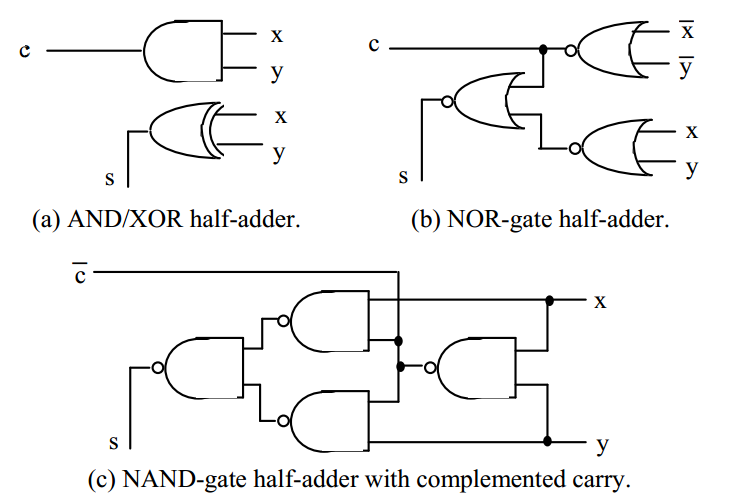

### 全加器
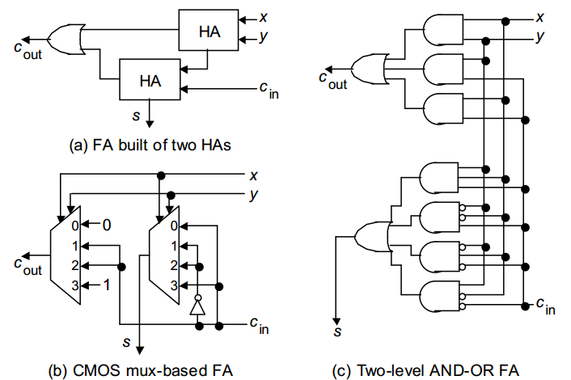

使用 transmission gate 实现 4-1 mux

使用 majority gate 实现全加器：

ab = maj(a, b, 0)
a v b = maj(a, b, 1)

### bit-serial 加法器
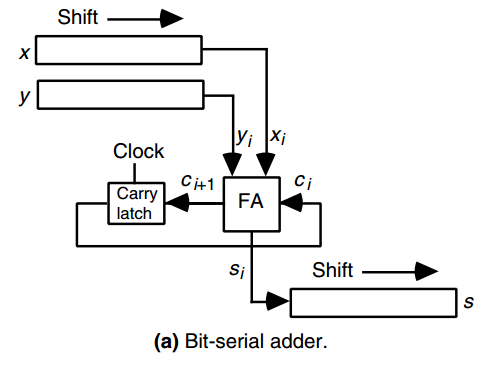

### ripple-carry 加法器
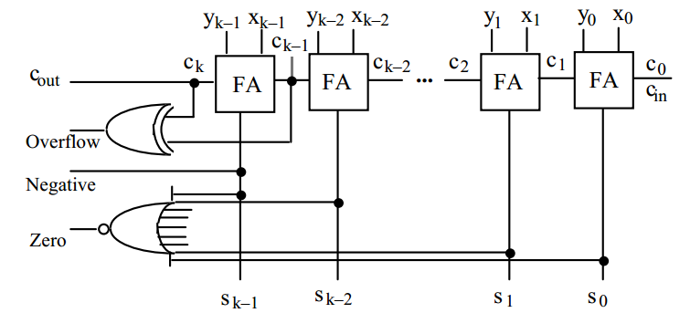
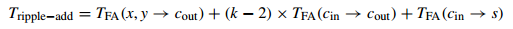

### saturating 加法器

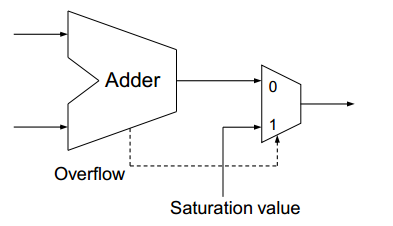

### 进位完成检测

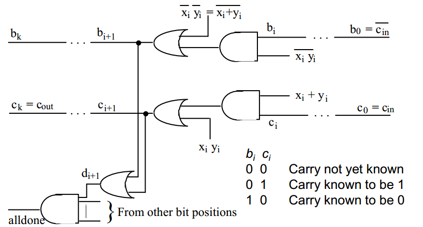

* 如果xi yi都为0，Ci+1为0，Bi+1为1；
* 如果xi yi有一个为1，Ci+1传递Ci，Bi+1传递Bi；（由于xi-1, yi-1也要满足这三条，所以Ci和Bi在进位完成之后必定相反）
* 如果xi yi都为1，Ci+1为1，Bi+1为0；

### Constant Counters

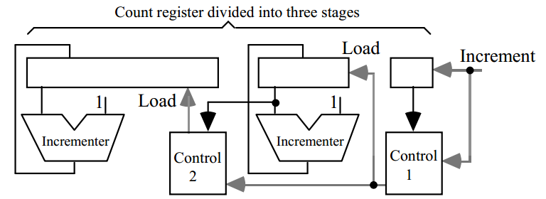

### Manchester Carry Network

* generated: gi = xi \* yi
* propagated: pi = xi ^ yi
* annihilated(absorbed): ai = (xi + yi)'
* transfer: ti = ai' = xi + yi
* carry: ci+1 = gi + ci \* pi = gi + ci * gi + ci * pi = gi + ci * ti
* sum: si = xi ^ yi ^ ci
* 16bit ripple carray adder's latency:
    - 1 gate: generate g, p
    - 2(16-1) gate: generator c15
    - 1 XOR gate: generator sum

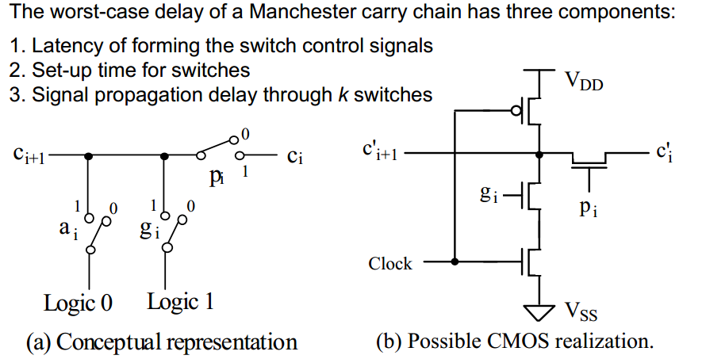

## Carry-Lookahead Adders

* 将ci+1 = gi + ci * pi循环展开
* fanin过多
* g[i,i+3] = gi+3 + gi+2 * pi+3 + gi+1 * pi+2 * pi+3 + g1 * pi+1 * pi+2 * pi+3
* p[i,i+3] = pi * pi+1 * pi+2 * pi+3
* cout = g[0, k-1] + c0 * p[0, k-1] = xk-1 * yk-1 + sk-1 * '(xk-1 + yk-1)
* 16bit CLA adder's latency
    - 1 gate: generate g, p  
    - 2 gate: generate g[k,k+3], p[p, p+3]
    - 2 gate: generate c4, c8, c12 (将g[i,i+3], p[i,i+3]和cout公式合并了)
    - 2 gate: generate ci
    - 1 gate: generate sum
* Tlookahead-add = 4 * log4k + 1 

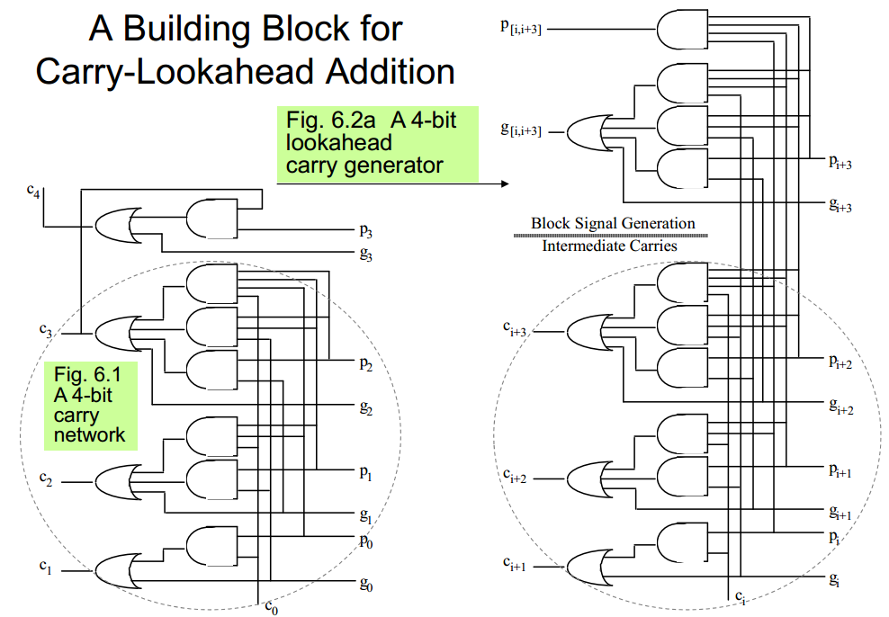

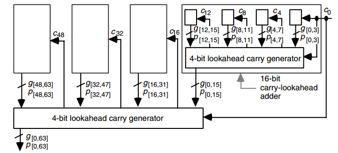

### Ling Adder

* ci = gi-1 + ci-1 * ti-1
* 令 hi = ci + ci-1
* hi = gi-1 + hi-1 * ti-2 = gi-1 + gi-2 + gi-3 * ti-2 + gi-4 * ti-3 * ti-2 + hi-4 * ti-4 * ti-3 * ti-2
* si = pi ^ ci = pi ^ (hi * ti-1)
* 16bit Ling adder's latency
    - 1 gate: generate g, p, t
    - 2 gate: generate g[k, k+3], p[p, p+3]
    - 2 gate: generate h4, h8, h12 (将g[i,i+3], p[i,i+3], t[i,i+3]和hi公式合并了)
    - 2 gate: generate hi (虽然延迟没变，fanin少了，利用线或更少，gi-1和gi-2可以线或)
    - 1 gate: generate sum

### Prefix Computation Adder

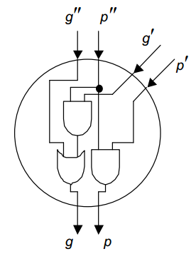

* 两个连续的block，(g'',p'') (g',p')，显然合并之后g = g' + g' * p''； p = p' + p''
* 用$表示这种运算的话： (g,p) = (g'',p'') $ (g',p')
* 可以将(g-1,p-1)看做(cin,0)
* 进位网络的问题就等价于
    - 给定 (g-1,p-1) (g0,p0) ... (gk-1,pk-1)
    - 寻找 (g[0,0],p[0,0]) ... (g[0,k-1],p[0,k-1])
    - 因为下面对应c1~ck
* 可以验证 $ 操作具有结合律，不具有交换律
    - 因此只需要找到符合结合律的网络用于计算所有的 g[0,l]即可
    - 称为 Prefix-Based Carry Network
* 利用计算步骤的结合律并行地求解问题，以减少电路延迟（latency）。
* 发现计算步骤中的重复部分并共用计算结果，以减少电路面积（area）。

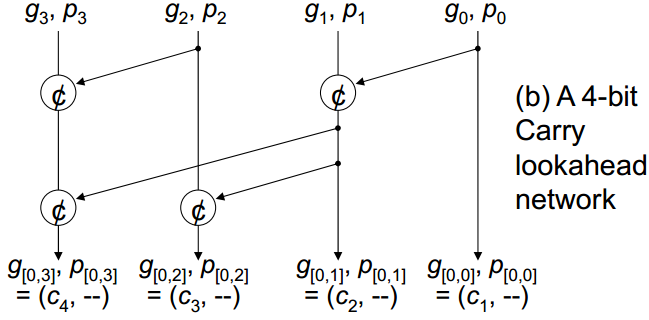

#### Lookahead Parallel Prefix Networks

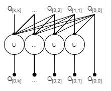

#### Ripple Parallel Prefix Networks

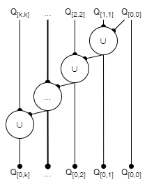

#### Ladner-Fischer

* Delay: log2k
* Cost($单元的面积): k/2 * log2k

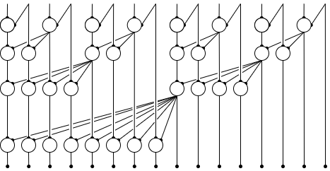

#### Brent–Kung

* Delay: 2 * log2k - 2
* Cost($单元的面积): 2k -2 - log2k

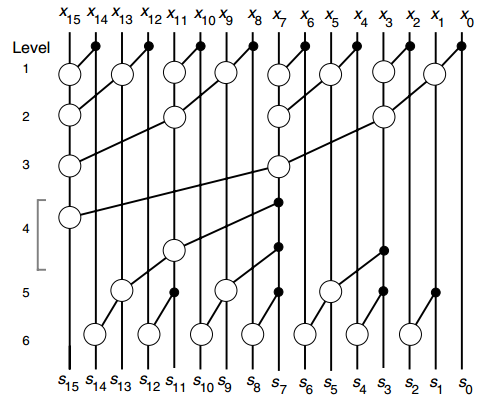

#### Kogge–Stone

* Delay: log2k
* Cost($单元的面积): k * log2k -k + 1

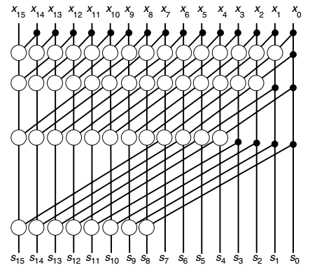

#### hybrid

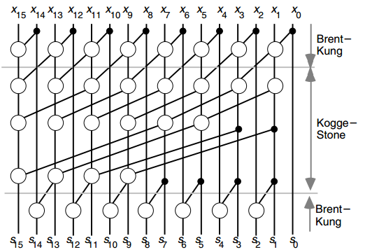

### 4bit Manchester Carry chain

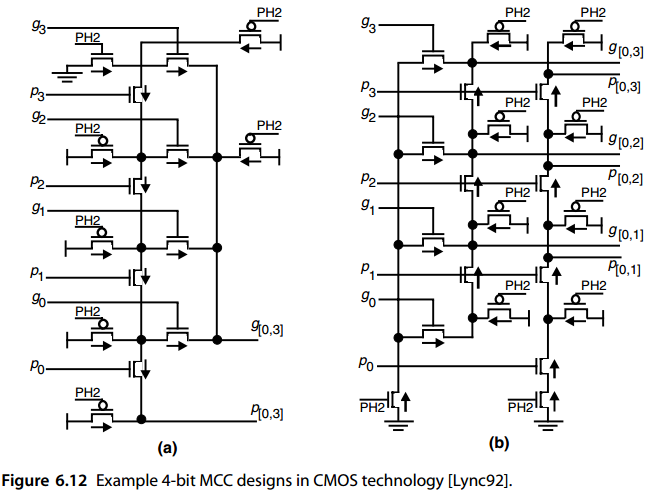

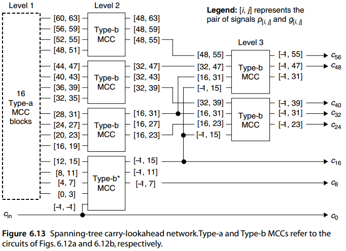

## Variations in Fast Adder

### Simple Carry-Skip Adders

* Block width b; k/b blocks to form a k-bit adder (assume b divides k)
* 最差情况
    - 假如一个中间block的p为0，但是在ci=0的情况下他已经产生了进位，那么他多选器必输出1
    - 假如一个中间block的p为0，但是在ci=1的情况下他才产生进位，很显然，这不可能发生，因为这个时候p应该为1
    - 假如一个中间block的p为1，那么他进位的mux应该立刻选择ci
    - 因此最差的情况下为在第一位产生了进位，最后一位进位才消除。
    - 也就是0000 0000 0000 0001 + 0111 1111 1111 1111
* T = (b-1) + 1 + (k/b-2) + (b-1) = 2b + k/b -3
* T = block0 + mux + skips + last block
* dT/dB = 2 - k/b^2 = 0
* b^opt = sqrt{k/2}; T^opt = 2 * sqrt{2k} -3

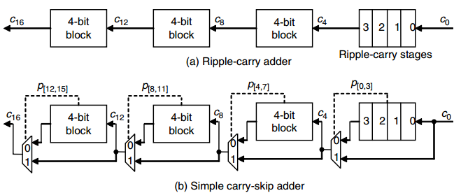

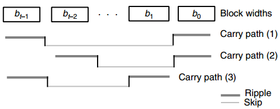

* 在carry path(1)和(2)的对比中，可以看到bt-2大1不会影响关键路径1的延时，因此bt-2可以设为b+1
* 同理，对比(1)和(3)的对比中，同理b1可以设为b+1
* 在变长的block大小的时候，optimal block widths为以下的时候，关键路径的delay最小
    - | b | b + 1 | · · · | b + t/2 − 1 | b + t/2 − 1 | · · · | b + 1 | b |
    - 所有长度加起来等于k
    - b = k/t – t/4 + 1/2
* 这样变长的延迟 T = 2(b-1) + t - 1 = 2k/t + t/2 - 2
* t^opt = 2 * sqrt{k}; T^opt = 2 * sqrt{k} -2

### Multilevel Carry-Skip Adders

* 相当复杂

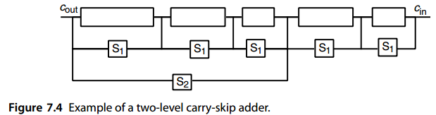
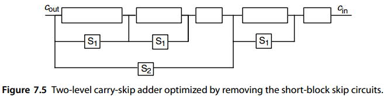

### Carry-Select Adders

* T(k) = T(k/2) + 1
* C(k) = 3 * C(k/2) + k/2 + 1

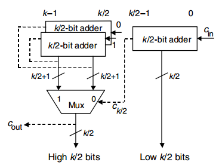

### Multilevel Carry-Select Adders

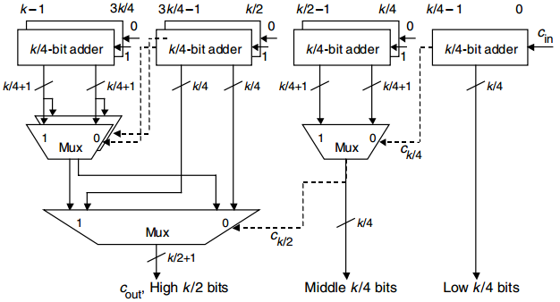

### Conditional-Sum Adder

* Carry-Select的极限情况下，block大小为1bit
* 多选器的个数计算：
    - (k/2+1) + 3(k/4+1) + 7(k/8+1) + ... +(k-1)2 = (k - 1)(log2k + 1)
    - 最后一层 + ... + 第一层
    - a*(b+1)的a是该层mux该有的个数，b是sum的位数，1是c的位数，b+1表明总共需要选择的位数
* C(k) ~= 2C(k/2) + k + 2 = (k - 1)(log2k + 1) + kC(1)
* T(k) = T(k/2) + 1 = log2k + T(1)
* C1和T1都是一下的top-level block(也称 Conditional-Sum Adder)的cost和delay

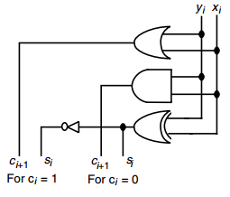
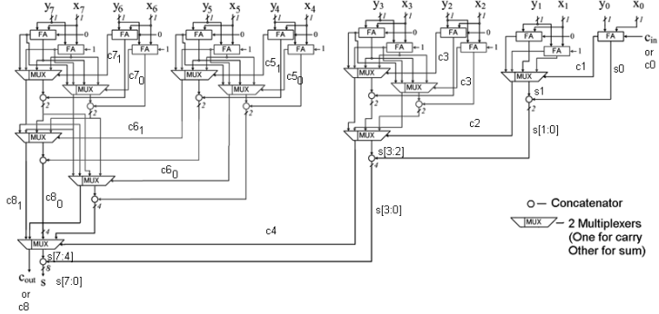

### Hybrid

* Lookahead with select

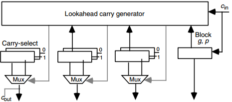

* ripple with lookahead

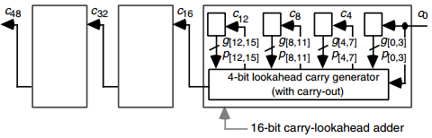

### General Modular Adders

* x + y = (x + y) mod m;
* if x + y >= m then x + y – m else x + y

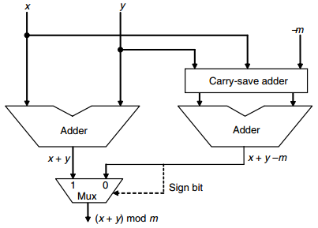

## Multioperand Addition

### Serial Implementation with One Adder

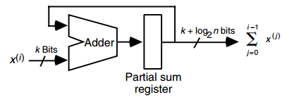

* n个k位数相加
* 部分和register 位宽必须大于等于 log2(n * (2^k-1) + 1) 约等于 k + log2n 位宽
* 假设使用一个对数时间加法器，那么总延迟
* T = O(n(log(k + log2n))) = O(nlogk + nloglogn)
* 因此当k固定，随n超线性增长，当n固定，随k对数增长

### Parallel Implementation as Tree of Adders

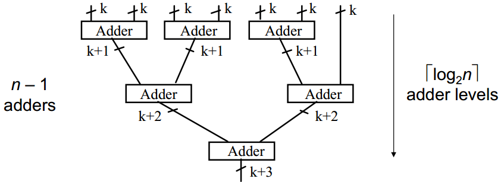
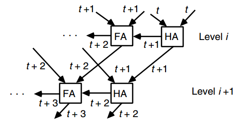

* 深度为 log2n 的向上取整，用[log2n]表示向上取整
* 对于对数时间加法器：T = O(log k + log (k+1) +...+ log(k + [log2n] - 1)) = O(log n log k + log n log log n)
* 对于行波进行加法器：T = O(k + log n)
    - 在i+1层的不需要等i层的full carry propagation
    - 每一层的进位传播比前一层慢1个时间单位
* 显然最好的T应该为O(logk + logn)

### Carry-Save Adders

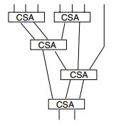
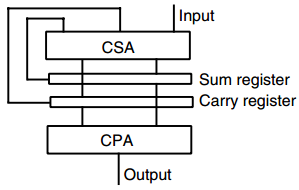

* CPA: carry-propagate adder 
* 也叫32压缩器
* T = O(tree height + Tcpa) = O(logn + logk)
* C = (n-2)Ccsa + Ccpa
* CPA的宽度最大为k+log2n，CSA的宽度则基本都是k量级

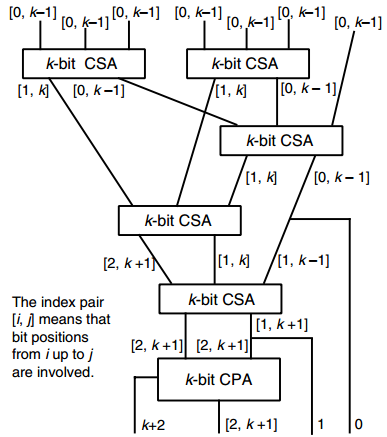

### Wallace and Dadda Trees

* 一个n输入的Wallace tree会将k-bit的input转化为两个(k+logn-1-1)-bit的输出。
* CSA降低的倍率为1.5，因此容易得到最小深度h(n)应该满足
    - h(n) = 1 + h([2n/3])
* 反过来，h级数能够压缩的input最大为
    - n(h) = [3n(h-1)/2]，这里想下取整
* 递归解出来就是：
    - 2 * 1.5^{h–1} < n(h) <= 2 * 1.5^h
* Wallace Tree: Reduce the number of operands at the earliest possible opportunity
* Dadda tree: Postpone the reduction to the extent possible without causing added delay
* 还有更细的优化办法，考虑利用一下最后一级加法器的cin，分别对应下边的123图

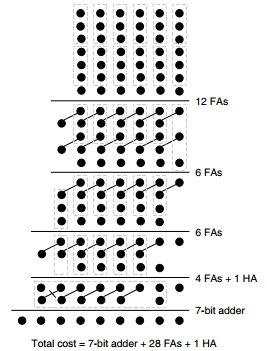
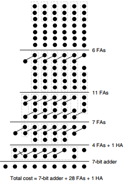
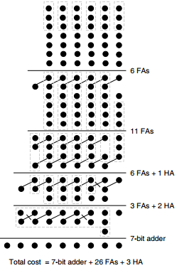

### Parallel Counters and Compressors

* 1-bit full-adder = (3; 2)-counter
* 3-bit sum = (7; 3)-counter
* [log2(n + 1)]-bit sum = (n; [log2(n+1)])-counter
* 一个n输入的counting network可以由两个 [n/2]-counter(此处向下取整) 加一个 [log2n]-bit adder(此处向下取整)组成

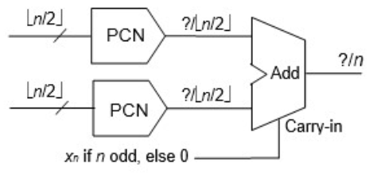
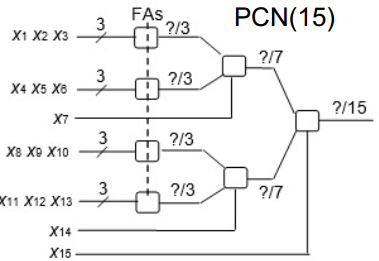
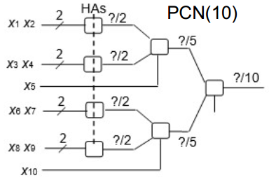

### Generalized Parallel Counters

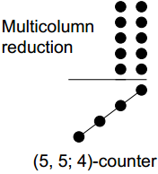
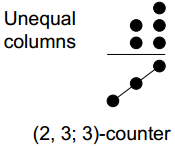

* (n;2)压缩器，通常指电路的一小部分slice，帮助我们减少到两个bit，而不是指一次性减少到两bit
* 第i个slice接第i位置的n个input bits，加上1个或多个位置传输过来的进位，然后产生在i和i+1的两个位置的输出在加上传给更高层slice的进位
* ψj denotes the number of transfer bits from slice i to slice i + j
* 如果需要正常工作，则需要满足 n + ψ1 + ψ2 + ψ3 + · · · ≤ 3 + 2ψ1 + 4ψ2 + 8ψ3 + · · ·
    - 也就是 n – 3 ≤ ψ1 + 3ψ2 + 7ψ3 + . . .
* 7;2压缩器能够通过让 ψ1 = 1 和 ψ2 = 1 满足
* 11;2压缩器能够通过让 ψ1 = 5, ψ2 = 1 或者 ψ1 = ψ2 = 2满足
* 4;2压缩器能够通过让 ψ1 = 1 满足，因此比较好实现

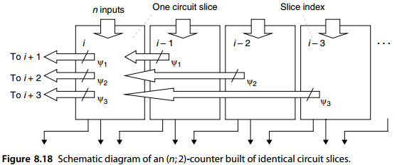

### Signed Numbers Adders

* 要么是符号位扩展，要么是把符号位看作负权重
* -b = (1-b) + 1 -2 = b' - 1
* 鉴于 (k +5) 位 2 的补码算术是以 2k+5 为模执行的，从最左边位置移出的 -1 并不重要

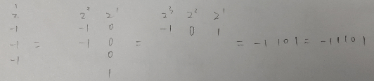

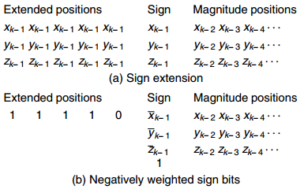

* 负权重符号位的作用:

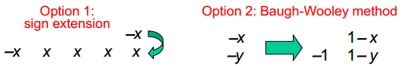

### Modular multioperand adders

