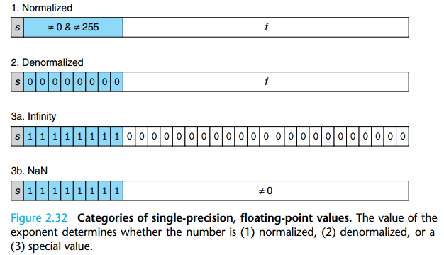
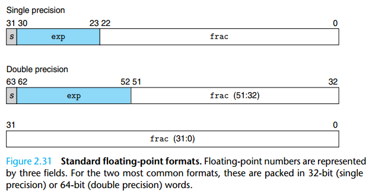

# Float Operations

IEEE754: $V=(-1)^s\times M\times 2^{E}$

1. sign: neg(-1) pos(0)
2. significand: M(1~2-epsilon or 0~1-epsilon)
3. exponent: E(can be neg)

The bit representation of a floating-point number is divided into three fields to encode these values:

1. The single sign bit s directly encodes the sign s.
2. The k-bit exponent field $e_{k-1}...e_1e_0$ encodes the exponent E
3. The n-bit fraction field $frac = f_{n-1}...f_1f_0$ encodes the significand M, but the value encoded also depends on whether or not the exponent field equals 0.

1. Normalized:
    1. E = e - Bias, e: unsigned $e_{k-1}...e_1e_0$, Bias: $2^{k-1}-1$
        1. single: -126~+127
        2. double: -1022~1023
    2. M = 1 + f, f: $f_{n-1}...f_1f_0$, 0≤f<1
2. Denormalized:
    1. E = 1 - Bias, Bias:  $2^{k-1}-1$
    2. M = f
3. Infinity & NaN:
    1. exp = f..
    2. frac = 0 / !0