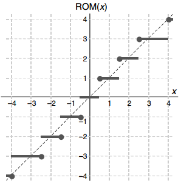

# Float Operations

## Floating-point number system

IEEE754: $V=(-1)^s\times M\times 2^{E}$

1. sign: neg(-1) pos(0)
2. significand: M(1~2-epsilon or 0~1-epsilon)
3. exponent: E(can be neg)

The bit representation of a floating-point number is divided into three fields to encode these values:

1. The single sign bit s directly encodes the sign s.
2. The k-bit exponent field $e_{k-1}...e_1e_0$ encodes the exponent E
3. The n-bit fraction field $frac = f_{n-1}...f_1f_0$ encodes the significand M, but the value encoded also depends on whether or not the exponent field equals 0.

1. Normalized:
    1. E = e - Bias, e: unsigned $e_{k-1}...e_1e_0$, Bias: $2^{k-1}-1$
        1. single: -126~+127
        2. double: -1022~1023
    2. M = 1 + f, f: $f_{n-1}...f_1f_0$, 0≤f<1
2. Denormalized:
    1. E = 1 - Bias, Bias:  $2^{k-1}-1$
    2. M = f
3. Infinity & NaN:
    1. exp = f..
    2. frac = 0 / !0
    

* special values
    - Ordinary number ÷ (+∞) = ±0
    - (+∞) × Ordinary number = ±∞
    - NaN + Ordinary number = NaN
* Sub(De)normals, or subnormal values, are defined as numbers without a hidden 1 and with the smallest possible exponent.
    - -0.f * 2^-126 ~ 0.f * 2^-126
* Extended Formats
    - Single-extended: ≥ 11 bits for exponent, ≥ 32 bits for significand
    - Double-extended: ≥ 15 bits for exponent, ≥ 64 bits for significand
    

基本算法：

* 加 
    - 
    - 可能需要preshifting
    - 需要舍入
* 乘 
    - 
    - postshifting可能需要
* 除 
    - 
    - postshifting可能需要
* 开方
    - 
    - 基数需要给出一个b用于开方，也就是bs一起开方
    - 给出一个b之后sb的范围在[1,4)之间，所以开方之后也在[1,2）之间，符合IEE标准
    - 因此不可能产生上下溢出，也不需要post normalization

舍入方式：

* 2~6 是IEEE的标准，3是IEEE的default
* chop: 就是truncation
    - 对于一个signed-magnitude数，是和round to zero一样
    - 对于一个2进制补码，和round to 负无穷一样
* rtna: round to nearest, ties away from 0(远离0)
* rtne: round to nearest, 靠近偶数
* inward: round to zero
* upward: round to 正无穷
* downward: round to 负无穷
* Jamming or von Neumann rounding: chop然后强制LSB为1
    - 最差情况下误差是两倍。但是好处是简单，并且对称
* ROM Rounding
    - (y3y2y1y0)two = (x3x2x1x0)two when x−1 = 0 or x3 = x2 = x1 = x0 = 1
    - (y3y2y1y0)two = (x3x2x1x0)two + 1 otherwise
    - 这样在x3 = x2 = x1 = x0 = 1的时候误差会更大，如图所示
* 我们可能需要在一个趋向于一个方向的舍入存在，比如说计算上界或者下界，因此就有了upward和downward的出现，也叫做deirected rounding

异常：

* divide by zero
* overflow
* underflow
* invalid operation：产生NaN
    - 正无穷+负无穷
    - 0乘无穷
    - 0/0 无穷乘无穷
    - 平方根操作数小于0
    
## Logarithmic Number Systems

暂略

## Floating-Point Operations

### Adder

### Multiplier/Divider

### Fused-Multiply-Add

### Logarithmic Arithmetic Unit

暂略

## Errors and Error Control

分类：

* Representation errors
    - 1/3, sqrt{2}
* Arithmetic errors
    - 2^-24
