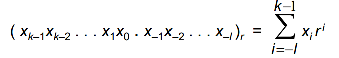
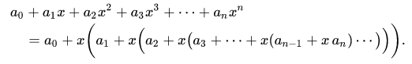
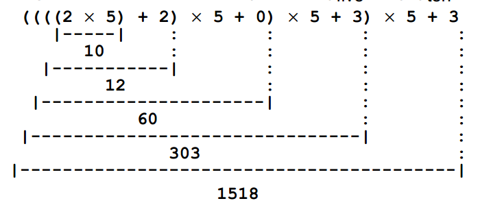
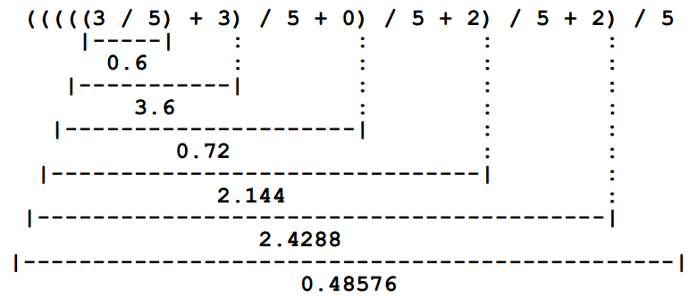
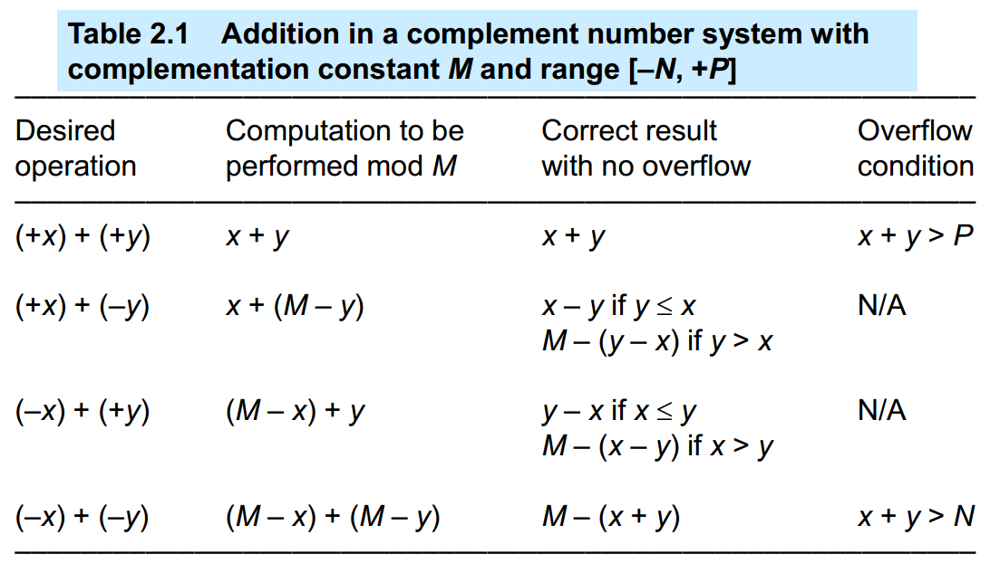
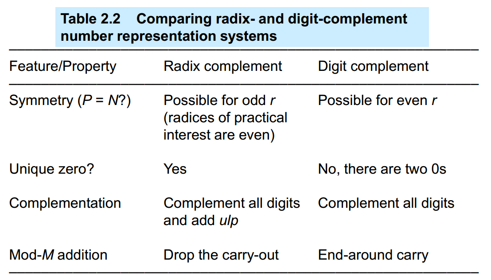
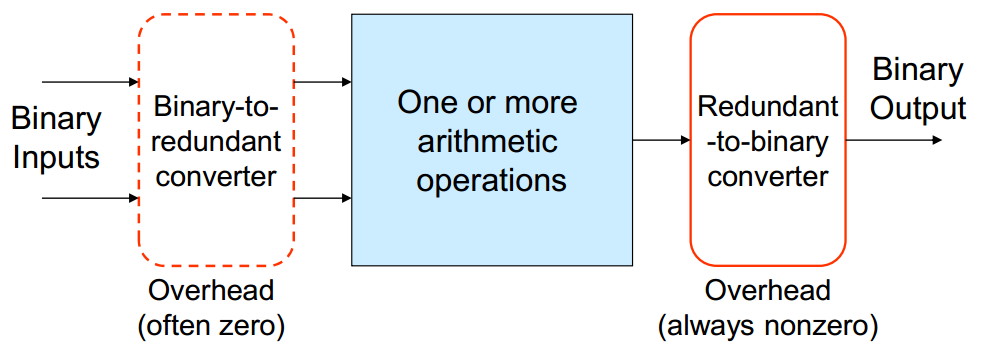
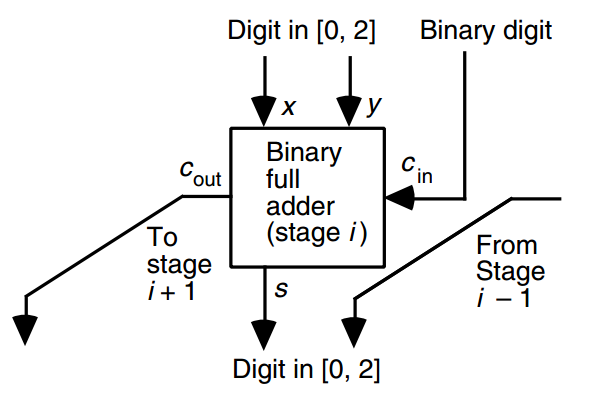
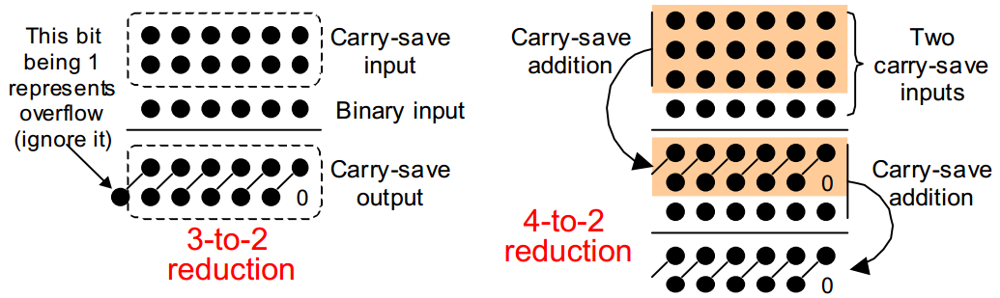
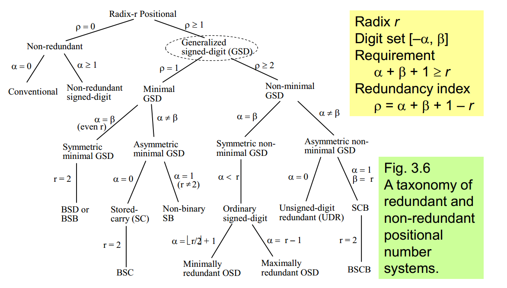

# 数字表示

* 无符号
* 有符号非补码
* 有符号补码
* 某位小数点定点: $xxx.x$
* 有符号分数: $\pm.xxx$
* 二进制补码分数: $x.xxx$
* 浮点: $s\times 2^e$
* 对数表示: $\log = xx.xx$

## 定基正数系统



Horner's Rule: 求多项式值的一个快速算法，可以用于快速进制转换：


（22033）5进制转化为10进制：


（0.22033）5进制转化为10进制（反过来）：


## 有符号数系统

### Signed-Magnitude Representation
```
0000: 0
0001: 1
0111: 7
1000: 0
1111: -7
```
该加法器由： 符号控制和加法器和取反器 组成

### Biased Representations
```
bias = 8
0000: -8
0001: -7
0111: -1
1000: 0
1111: 7
```
x + y + bias = (x + bias) + (y + bias) – bias
x – y + bias = (x + bias) – (y + bias) + bias
因此如果bias是2的幂可以简化加法器

### Complement Representations
```
0: 0
1: 1
P: P
M-N: -N
M-1: -1
```


所以合适的M可以用于简化计算，k是整数位数，r是小数位数：

* Radix complement: M = r^k
* Digit complement(diminished radix compl): M = r^k - ulp 
* ulp: unit in least position， r^-l；就是最后1位代表的数，比如说2进制下整数表示最后1位单位为1，2进制下1位小数定点最后1位单位为0.5

#### Radix complement system
```
M = 2^k
M - x = 2^k - x = [(2^k - ulp) - x] + ulp = 反码(x) + ulp；说明数x的补是反码+1
能表示 -2^{k-1} ~ 2^{k-1} - ulp 的数， 其实就是 [-M, P]

example: k = 4, M = 16
0000: 0
0001: 1
0111: 7
1000: -8
1111: -1

```
#### Digit complement system
```
M = 2^k - ulp
M - x = (2^k - ulp) - x = 反码(x)； 说明数x的补是反码
能表示 -2^{k-1} + ulp ~ 2^{k-1} - ulp 的数， 其实就是 [-M, P]

example: k = 4, M = 16
0000: 0
0001: 1
0111: 7
1000: -7
1111: -0
```



### Signed-digit representation

Digit set [-a, b] instead of [0, r – 1]

### Redundant Signed-Digit Representation

Digit set [-a, b], with r = a + b + 1 – r > 0
不唯一

## Redundant Number Systems

解决进位传播问题：

* 只允许部分位数进行进位传播
* 检测进位是否结束
* 通过lookahead加速进位传播
* 消除进位 (Carry-free, using redundant)



redundant在计算机算数中最早的例子就是CSA（carry-save addition, stored-carry representation）





### Generalized Signed-Digit Numbers



对于一个signed digits，编码方式非常多，以BSD（binary signed digit）[-1,1]编码三个数中的-1为例，可以有：

* 符号位 + 值：11
* 2进制补码：11
* <n, p\>：10
* <n, z, p\>：100

### Carry-Free Addition Algorithms

Compute the position sums pi = xi + yi
Divide pi into a transfer ti+1 and interim sum wi = pi - rti+1
Add incoming transfers to get the sum digits si = wi + ti


如果要让 transfer digits ti处于 [-l, m]的区间内，则中间结果必须要处于 -a + l 和 b - m 之间。

–a + l <= pi – rti+1 <= b – m


最小的-a+l要加一个cin被吸收，则必须大于最小值，数字上必须小于rl
-a + l >= rl

最大的b-m要被吸收，则必须大于最小值，数字上必须小于rl

b - m <= rm


## Residue Number Systems

之后在看


