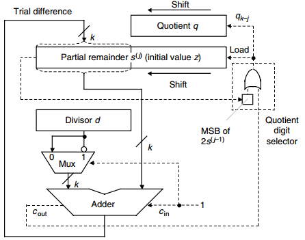
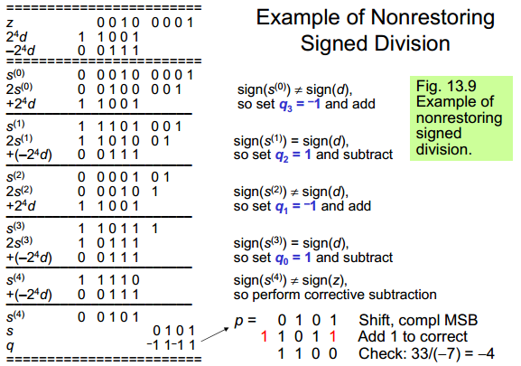
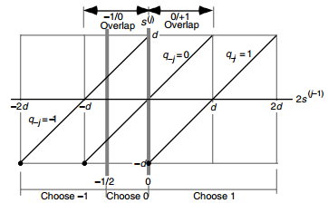

## Basic Division Schemes

* Dividend z: 2k-bit
* Divisor d: k-bit
* Quotient q: k-bit
* Remainder s: k-bit
* 对于有符号除法，结果必须满足s和z的符号位一致，并且|s|<|d|

### Shift/Subtract Division Algorithms

* 对于无符号除法，z的高k-bit一定比d小，不然结果会溢出（这个溢出检测也可以检测d是否为0？）
* sj = 2s{j-1} - q_{k-j}(2^k * d)，s0 = z，sk = 2^k * s
* 先left shift，然后subtract，无right算法

### Programmed Division


### Restoring Hardware Dividers

* 无符号的减法也是使用取反加1实现，因为无符号数的补码是他本身
* 无符号数除法
    - 如果MSB是1，说明必定减法不会为负值，则需要load为1
    - 如果做减法结果是正值，cout=1，则需要load为1
    - 否则使用原来的值在左移1位，即load为0
    - load为0说明不更新，也就是恢复



### Nonrestoring Division

* 不恢复而是将错误的结果继续左移，只不过之后一次使用加法
    - 2(u - 2^kd) + 2^kd = 2u - 2^kd = 2(u - 2^kd)


### Nonrestoring Division with Signed Operands

* 改用{1,-1}的基数
    - 如果移位前的sign(s)和sign(d)不一致，则做加法(q=-1)，否则做减法(q=1)
    - q = sign(d) ^ ~移位出来的FF
* 如果最后的s和z的符号不一致，则需要在进行一次对应的减法
* 最后根据z,d的符号确定q的符号，如果需要则需要取反+1
* 我还是感觉这个图有问题




### Division by Constants


* 方法1: 常数的倒数乘法，定点小数乘法
* 方法2: 对于每个奇数 d，存在一个奇数m，使得d * m = 2^n - 1；因此
    - z/d = zm/(2^n-1) = zm/[2^n(1-2^-n)]=zm/2^n(1+2^-n)(1+2^-2n)...
    - zm/2^n是乘以常数，后边都是shift-adds


### Radix-2 SRT Division

```
ifdelta_ 2s(j-1) < -1/2
- delta_p = 
thdelta_en q-j = -1
- delta_p = 
eldelta_se if 2s(j-1) ≥ 1/2
- delta_p = 
thdelta_en q-j = 1
- delta_p = 
eldelta_se q-j = 0
- delta_p = 
endif
endif
```

* Sweeney, Robertson, and Tocher
* 该算法成功的要点就是要保证shifted PR应该处于[-d,d)的范围（这样就可以有更多的空操作，加快速度），这是不容实现的，SRT算法就是为了解决这个
    - 假设d >= 1/2（如果不在这个范围，可以左移变成在这个范围），将PR限制在[-1/2,1/2)之间，最刚开始PR可能不再这个范围内，因此将z右移1位
    - 一旦s(0)在[-1/2, 1/2)之间，后续的所有s都可以在这个范围内，因为被框住了，具体看上面的伪代码
* 可以使用检测连续0和连续1的电路简化选择q=0的时间，Use leading 0s or leading 1s detection circuit to determine how many quotient digits can be spewed out at once
* This method was useful in early computers, because the choice q-j = 0 requires shifting only, which was faster than shift-and-subtract
* One can use an on-the-fly conversion algorithm to convert the binary signed-digit (BSD) quotient to binary 


## High-Radix Dividers

* 两种基本加速方法
    - 降低操作数的数量
    - 加的速度更快，可以以carry-save的形式保存partial remainder
* 只不过除法难点在于：需要加或者减在dividend的这个数事先不可知，而是在quotient digit知道的时候才知道
    - 但好处在于quotient digits依赖于partial remainders 和 divider
* 最差的情况下，divider所有的k位和partial sum的k+1位都需要用来选择正确的q。
* PR: partial remainder


### USING CARRY-SAVE ADDERS


* Sum part of 2s(j-1): u = (u1u0 . u-1u-2 . . .)2’s-compl
* Carry part of 2s(j-1): v = (v1v0 . v-1v-2 . . .)2’s-compl

```
t := u[-2,1] + v[-2,1]
if t < -1/2
then q-j = -1
else if t ≥ 0
then q-j = 1
else q-j = 0
endif
endif
```




这么设的好处：

* overlaps可以给一定的选择quotient digit的容错率。
    - 允许容错，因此不需要使用Carry-save的所有位用来计算结果，这样进位延迟更小
* 如果t < -1/2，那么2s的真实值一定小于0，因为截断误差会小于1/4
* 如果t < 0，一定有2s小于1/2 <= d
* 为什么不能使用基2 SRT 的除法分区法
    - overlap的范围为1-d，当d趋近于1的时候容错率太低了


* shifted partial remainder vs. divisor


* 设计SELECT LOGIC
    - 可以用CSA，也可以用展开成SOP或者POS


### Radix-4 SRT Division


### General High-Radix Dividers

描述：

* 基数r
* Digit set，q可以选的位处于[-a, a]
* 需要检查p(u,v)和d的一些位数来确定quotient digit
* quotient digit可以通过逻辑或者查找表(PLA)获得
* multiple generation, 多乘数需要事先生成，例如基4中的2d, -2d, 3d, -3d
* 最后还需要将BSD（redundant）的q转化为补码

组件一：multiple generation

* 例如基8的multiple，设计q可选的位有[-6,6]，那么可以从两组数结合除multiple
    - {0,a,2a} +/- {0,a,4a}


组件二：quotient digit selection

* 可选quotient digit范围假设为[-a, a]
* 限制PR的范围，假如需要限制到[-hd, hd)
    - 限制如果太大，容错率会很低，因为overlap变少了
* 那么rs的范围限制到了[-rhd, rhd)，通过添加±qd（正的减，负的加）回到他的原始范围内的最坏情况值，rhd-ad
* 需要保证一个valid quotient digit是存在的，最差情况下也在[-hd, hd)的范围内，这样就锁住了
    - rhd-ad <= hd
* 因此 h  <= a/(r-1)；很显然 h要大于 1/2，不然都没有overlap了，有些值选不出quotient digit
* 为了容错率提高，h选最大，这样限制最小
    - 例如在r=4, a=2的时候，h=2/3
* 在做选择的时候，被截断的p和d的值都可以接受，只要你满足你的uncertainty region的区域完全处于一个quotient digit区间
* 所以实际上，肯定是希望uncertainty可以更大，这样p和d需要的位数就更少，逻辑更快
* 划分的办法为：
    - p-d画出来
    - 然后在重叠区画一个阶梯线，保证不与交叉区的边界相交
    - 如果有多个选择，那就使用实现和技术相关的准则来选择
* p如果是Carry-Save形式，如果要获取l-bit的精度，需要让l+1的v和u相加，所以如果p-d的精度，优先级肯定先设置低精度的p
    - 格子尽可能的粗粒度，因此可以用发生异常的代价换取更粗的uncertainty（下图的 * 区域可以当作异常来处理，来获取更粗粒度的阶梯线）


* 可以通过这个图来初步计算需要的d和p位数的lower bounds
    - delta_d = dmin * (2h - 1)/(-h + α)
    - delta_p = dmin * (2h − 1)
* Theorem: Once lower bounds on precision are determined based on delta_p and delta_d, one more bit of precision in each direction is always adequate
* 同时需要注意对于正数的截断和对于负数的截断并不是严格对称的，而都是往不确定区域的右下角截断的。因此选择可能也不一样


## Variations in Dividers

* Prescaling: Restricting the divisor to the shaded area simplifies quotient digit selection
    - 可选范围更大，可容忍误差更大，用于简化quotient digit selection logic
    - 一个互补的好处是，预缩放使使用更高的基数成为可能
    - 一般该方法用在设计非常高基的dividers，例如1024-radix的。最终目的还是为了实现全组合逻辑的dividers
* overlapped selection circuits
    - a radix-16 divider can be built of four overlapped radix-2 or two overlapped radix-4, stages
    - 传统的SRT算法中，我们只有知道qk-j之后才能知道qk-j+1的值。
    - 但是由于只有三种情况，我可以实现先算好，用qk-j来mux qk-j+2的三种情况


### Combinational and Array Dividers

暂略

* restoring array divider
    -  full subtractor
* nonrestoring array divider
    - XOR + FA
* Pass the partial remainder downward in carry-save form to speed up the operation of each row


### Modular Dividers and Reducers

暂略

### 倒数 Reciprocation

* 可以做到双倍加速
* 如果Q是1/d的一个在2^-k/2的误差内的近似，那么t=Q(2-Qd)能够给出一个误差在2^-k范围内的近似


### Combine Multiply/Divide Units

暂略

## Division by Convergence

* 通过收敛来进行除法运算

### 重复乘法解决除法


* 通过乘法来解决除法
* 四次方收敛 di+1 = di(2-di)
* 一次迭代2次乘法和一个补码加法
* kbit的情况下2m-1次乘法和m次补码加法，m=[log2k]

### 倒数求除法

* 求得1/d再用乘法即可
* 1/d是f(x) = 1/x - d的根
* f'(x) = 1/x^2
* x(i+1) = x(i) - f(x(i))/f'(x(i))来迭代求根 1/d （牛顿法）
* 也就是x(i+1) = x(i)(2-x(i)d)
* 一次迭代两次乘法和一个补码加法
* 要保证收敛，初始值x要在0到2/d之间。
* 对于d在[1/d,1)的情况下
    - x0可以简单取0.5
    - 也可以稍微估计一下 x(0) = 4(sqrt{3} - 1) - 2d

### 加速方法

* Fewer multiplications (reduce m)
* Narrower multiplications (reduce the width of some x(i)s)
* Faster multiplications


暂略

* Initial Approximation via Table Lookup
* Using Truncated Multiplicative Factors
