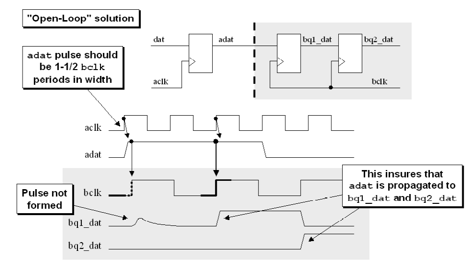
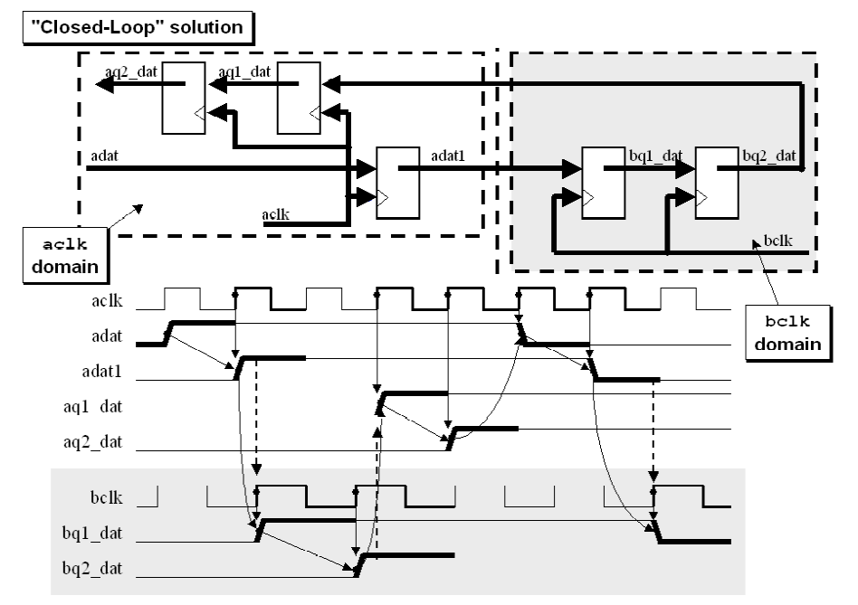
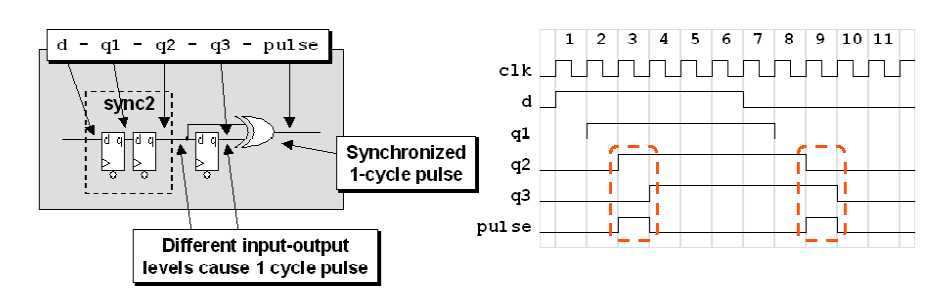
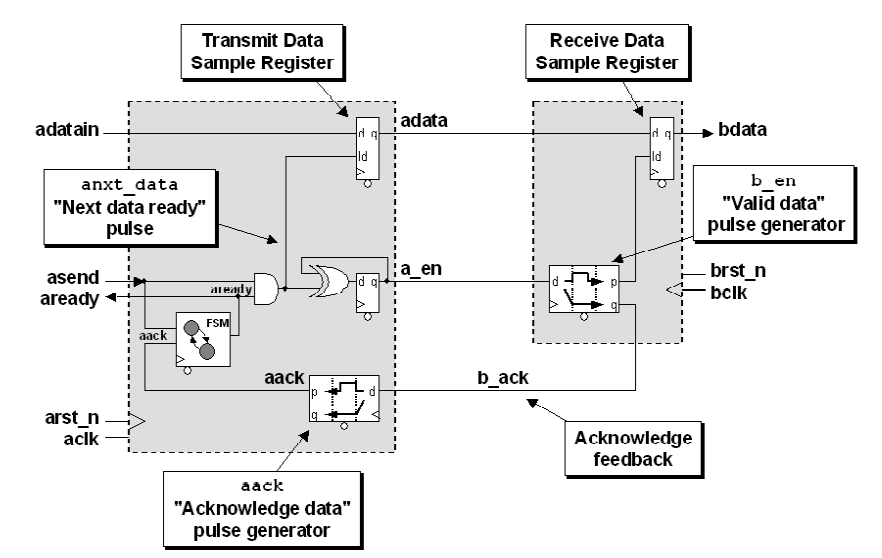
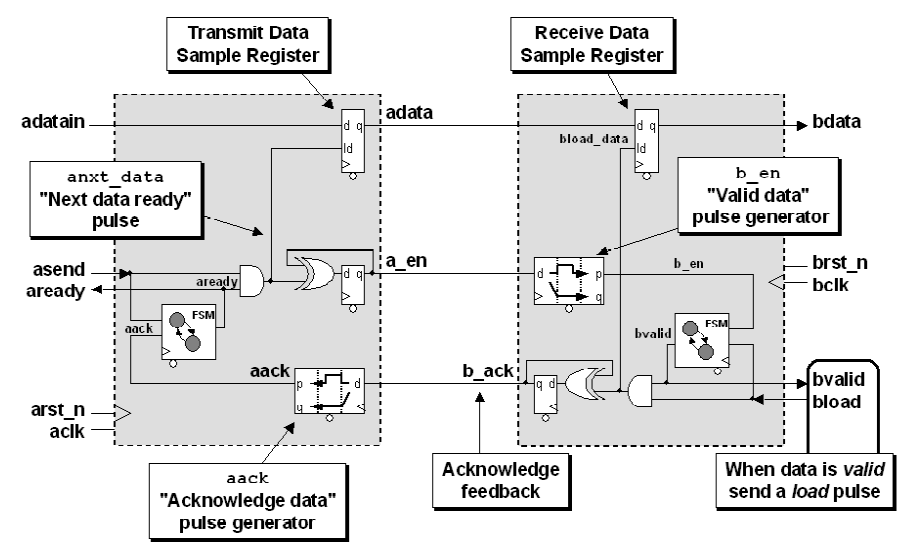
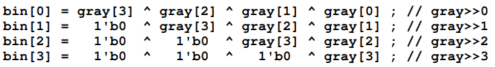
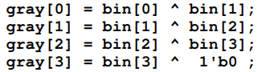
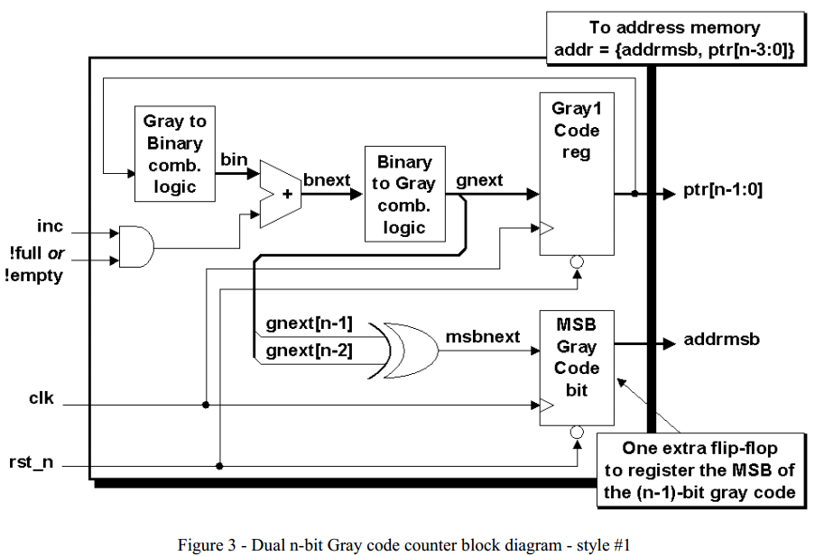
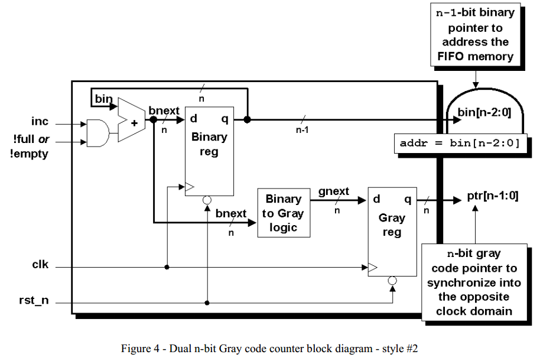
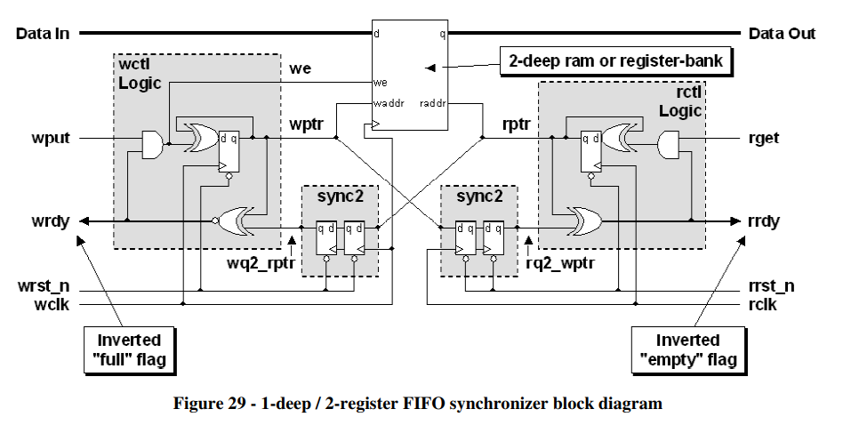

1. 是否允许错过一些采样
    1. 异步fifo，判空和判满都不需要采样所有的信号，只需要采到的信号是真实的就行，因此使用格雷码
2. 每一个信号都必须被采样

tips:

1. 送入其他时钟域之前寄存

# 快到慢必须采样

## 单信号

1. open-loop solution (three edge)
    
    
    
2. closed-loop solution
    
    
    

## 多信号

### Multi-bit signal consolidation

### Multi-cycle path formulations (MCP)

    

1. Closed-loop - MCP formulation with feedback
    

    
    
2. Closed-loop - MCP formulation with acknowledge feedback
    
    

### Pass multiple CDC bits using gray codes

1. conversion
    
    
    
    assign bin = gray
    
    
    
    assign gray = (bin>>1) ^ bin
    
2. counter
    
    
    
    
    
3. 1-deep / 2-register FIFO synchronizer
    
    