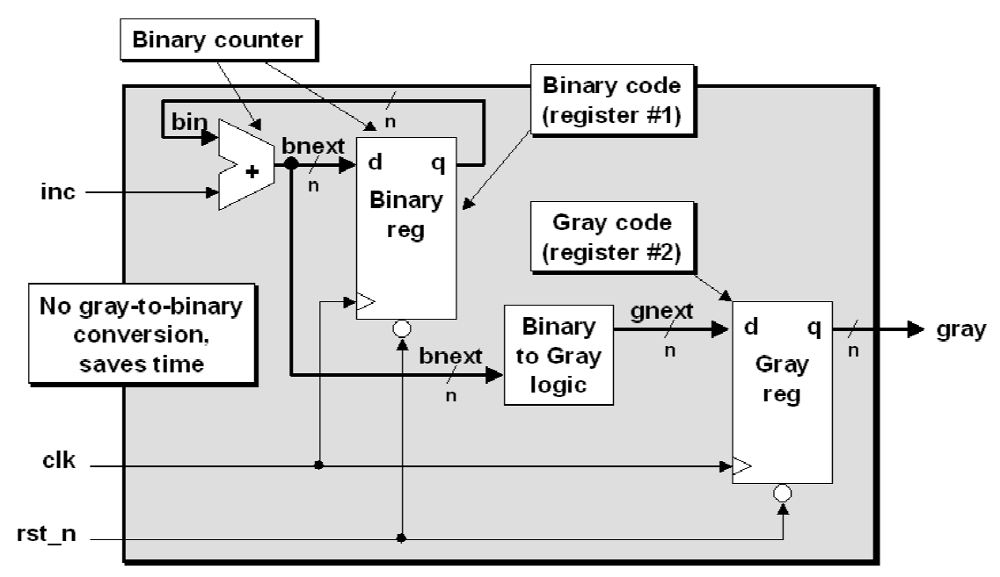

## 原则
1. 是否允许错过一些采样
    1. 异步fifo，判空和判满都不需要采样所有的信号，只需要采到的信号是真实存在过得的就行，因此使用格雷码
    2. 真实存在过，值要不是采样前的，要不是采样后的，用于判空判满已经足够
2. 每一个信号都必须被采样


## 亚稳态


* C1 和 C2 是两个常数，和芯片制造工艺和工作环境（温度，电压）有关
* fclk 和 fdata 和设计本身有关。fclk 即接收异步信号的时钟域的时钟频率，fdata 即异步信号跳变的频率。也就是说，时钟频率越高，异步信号跳变越多，MTBF 越小，电路越容易失败
* tMET 是亚稳态稳定可用的时间，时间越长，亚稳态则越可能恢复到稳定状态，电路则越可靠。其值由寄存器的 timing slack 决定，如果有多个级联寄存器，则是其 timing slack 的和

减少亚稳态的方法有以下几种：

1. 使用同步器：也就是我们常用的2级或者多级FF打拍的方法;同步器后面会专门论述；
2. 降低频率：如果能满足功能要求，那么降低频率能够减少亚稳态的产生;
3. 避免变化过快或者过于频繁的信号进行跨时钟采样；
4. 采用更快的触发器：更快的触发器，也可以减少亚稳态的产生。


MTBF 影响了哪些跨时钟域的设计细节：

* 源时钟域异步信号要寄存器输出
    - 寄存器输出可以避免毛刺，毛刺意味着什么，异步信号的跳变。也就是说寄存器输出可以减少异步信号的跳变，即减小 fdata 的值，使 MTBF 变大，电路则更不容易失败。
* 时钟频率越高时，同步器级联的寄存器数目越多
    - 同步器的目的在于：稳定因为亚稳态而不稳定了一个或多个clk period的信号，也就是延长tMET
* 布局约束时，同步器级联的寄存器越近越好，尤其是当时钟频率很高时
    - FF1 与 FF2 的连线越可能短，FF2 的 timing slack 则越大，tMET 的值便越大，因而 MTBF 越大。


在同步器第一个FF产生亚稳态所造成的可能性：

1. 如果亚稳态维持的时间不止一个周期，在下一个时钟上升沿没有稳定，那么第二级的FF就也会进入亚稳态。
2. 值可能被采错，因此需要格雷码

同步器使用例子除了一下的CDC，还包括异步复位同步释放，下边的FIFO也默认使用该复位器。


## 慢signal到快clock

1. 如果满足3边沿，也就是faster clock频率比slower clock快1.5倍，就一定可以采到。
2. 否则，看原则是否允许错过，如果允许，则直接双寄存器，不允许，则加反馈


## 快signal到慢clock

### 单信号

1. open-loop solution (three edge)
    
    
    
2. closed-loop solution
    
    
    

### 多信号

#### Multi-bit signal consolidation

* 传递两个控制信号可能会不同时到达
* consolidation到一个
* 传递连续的两个控制信号可能会同时到达
* consolidation到一个，然后在本时钟域产生连续两个控制信号
* 传递多个控制信号或数据信号
    - 使用MCP
        + with feedback
        + with acknowledge feedback
    - 使用FIFO
        + Asynchronous FIFO implementation.
        + 2-deep FIFO implementation

#### Multi-cycle path formulations (MCP)

1. Closed-loop - MCP formulation with feedback
    

    
2. Closed-loop - MCP formulation with acknowledge feedback
    
    

#### Pass multiple CDC bits using gray codes

1. conversion
    
    
    
    assign bin[i] = ^(gray>>i)
    
    
    
    assign gray = (bin>>1) ^ bin
    
2. counter
    
    <!-- #  -->

* 具体情况和原理可以去仿真一下，这个address memory
    
    
    <!-- <>  -->
    
    
3. 1-deep / 2-register FIFO synchronizer
    
    
4. FIFO

    

* 读这边判空
* 写这边判满
* 空和满都是悲观推测的，因为在同步结束的时候，可能已经不是空或者满了
* reset都是采用的asynchronously set and synchronously removed （就是异步复位同步释放）
* almost-empty 和 almost-full 可以用 bin+N 的 gray码与指针比较

    ```
    assign rempty_val = (rgraynext == rq2_wptr);
    always @(posedge rclk or negedge rrst_n)
        if (!rrst_n) rempty <= 1'b1;
        else rempty <= rempty_val;
    ```

    ```
    assign wfull_val = ((wgnext[ADDRSIZE] != wq2_rptr[ADDRSIZE] ) &&
                        (wgnext[ADDRSIZE-1] != wq2_rptr[ADDRSIZE-1]) &&
                        (wgnext[ADDRSIZE-2:0] == wq2_rptr[ADDRSIZE-2:0]));
    always @(posedge wclk or negedge wrst_n)
        if (!wrst_n) wfull <= 1'b0;
        else wfull <= wfull_val;
    ```

    ```
    assign wfull_val = (wgraynext=={~wq2_rptr[ADDRSIZE:ADDRSIZE-1],
                                        wq2_rptr[ADDRSIZE-2:0]});
    ```

    
