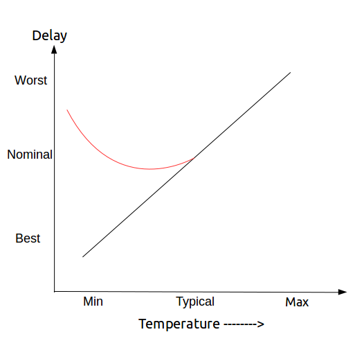

## STA Concepts

* load: C
* drive: R

* Timing Arc
* Cell delay
    - Transition delay，定义由这些参数决定，后面的值为一般值
        + slew_lower_threshold_pct_fall 10
        + slew_upper_threshold_pct_fall 90
        + slew_lower_threshold_pct_rise 10
        + slew_upper_threshold_pct_rise 90
    - Logic gate delay，定义由这些参数决定，后面的值为一般值
        + input_threshold_pct_rise 50
        + output_threshold_pct_rise 50
        + output_threshold_pct_fall 50
        + input_threshold_pct_fall 50
    - The slew thresholds of 30% and 70% with slew derate as 0.5 results in equivalent measurement points of 10% and 90%.
        + 上述设置指定库表中的转换时间必须乘以0.5才能获得与转换阈值(30-70)设置相对应的转换时间。
        + 这意味着转换表中的值(以及相应的索引值)实际上是10-90的值。
* Setup time & hold time
* Timing path
    - start point
        + clock pin
        + input port
    - end point
        + data input pin of a sequential element
        + output port
* Timing group
    - 时序路径按控制终点的时钟划分成组
    - 与每一个时钟相关联的一组路径构成一个组
    - 缺省情况下，其它与时钟无关的所有路径构成一个组
* Clock Domain
* Operating Conditions
    - combination of PVT: Process, Voltage and Temperature
    - Cell delays and interconnect delays are computed based upon the specified operating condition
    - process
        + slow, typical, fast
    - WCS (Worst-Case Slow): process slow, temp highest, voltage lowerst. WCCOM
    - TYP (Typical): process typical, temp nominal, voltage nominal. BCCOM
    - BCF (Best-Case Fast): process is fast, temp lowest, voltage highest. NCCOM




## Non-Linear Delay Model

经过cell内部的timing arc的delay和两个因素有关：

* output load: capacitance
* input signal 的 transition time
> D = D0 + D1 * S + D2 * C
* 其中S是input transition time, C是output load
* table 插值


## Timing Model

* max_transition ?
* related_pin
* timing_sence
    - non-unate: 无关
    - negative_unate: 负相关
* timing_type
    - setup_rising
    - hold_rising
* cell_rise
* rise_transition
* cell_fall
* fall_transition
* rise_constraint
* fall_constraint
    - data transition
    - clock transition

## Wireload model

* 工艺库中存在的数据：
    - resistance
    - capacitance
    - area
    - slop
    - fanout_length对


* 先确定fanout
* 在fanout_length对查找
* 长度乘以电容系数，或者电阻系数或者面积系数就可以知道具体的电容，电阻和面积
* 如果fanout>最大fanout，则使用slop和最大点进行计算length


## STA environment

### Clocks

* source
* period
* duty cycle
    - waveform {上升沿的位置，下降沿的位置}
* edge times

> create_clock -name SYSCLK -period 20 -waveform {0 5} [get_ports GBLCLK]


* uncertainty
    - 包括 clock jitter + clock skew + margin
    - clock jitter: 时钟源产生的抖动，两个时钟周期之间存在差值，在hold的时候检查同一个时钟沿，因此没有jitter，只有skew
    - clock skew: 时钟树不平衡引起的到达两个寄存器的延迟差，在(CTS)clock tree synthesis之后，skew是由工具算出
    - pre-CTS: 
        + setup = jitter + 预估skew + margin (=是指应该设置setup的uncertainty为这三者之和)
        + hold = 预估skew + margin
    - post-CTS: skew确定了
        + set_propagateclock
        + setup = jitter + margin
        + hold = margin
    - -source指source，但是不加指network
> set_clock_uncertainty -from SYS_CLK -to CFG_CLK -setup 0.2 [get_clocks CLK_CONFIG]
> 
> set_clock_uncertainty -from SYS_CLK -to CFG_CLK -hold 0.05 [get_clocks CLK_CONFIG]

* latency
    - network latency
        + the network latency can be ignore after the clock tree is built
        + 网络延迟是在时钟树合成之前对时钟树延迟的估计。
    - source latency
        + the source latency remains even after the clock tree is built
    - After clock tree synthesis, the total clock latency from clock source to a clock pin of a flip-flop is the source latency plus the actual delay of the clock tree from the clock definition point to the flip-flop.

### Generated Clocks

* -divide_by 2
* Advantage
    - generated clock does not require additional constraints
    - source latency 自动被包括，因为the start point of a clock path is always the master clock definition point. 
        + 当然也可以手动指定，这个时候生成的时钟驱动的触发器的时钟引脚的总时钟延迟是主时钟的源延迟、生成的时钟的源延迟和生成的时钟的网络延迟的总和
        

### Input Output

* set_input_delay -min/max
* set_output_delay -min/max

* set_drive: 默认是0
* set_driving_cell: 可以指定port接的是什么工艺下的什么cell
    - > set_driving_cell -lib_cell INV2 -library tech13g [all_inputs]
* set_input_transition: 默认是0ns

* set_load: capacitance，默认是0pf

> Delay_to_first_gate = (drive * load_on_net) + interconnect_delay
> 
> 所以input全delay应该为 input_delay + Delay_to_first_gate + logic gate delay 到 timing path 的 endpoint


### DRC (Design Rule Checks)

These rules check that all ports and pins in the design meet the specified limits for transition time 1 and capacitance.

* DRV（Design Rule Violation）

* set_max_transition
    - 设置端口或设计中的最大转换时间.
    - 对于input: transition time = drive * max_cap = dirve * (C_wireload + C_gate)
    - 对于output: transition time = drive * max_cap = drive_gate * (C_wireload + C_load)
* set_max_capacitance
* set_max_fanout
    - fanout_load是无量纲数，而不是电容，它表示对总有效扇出的数值贡献，在lib里有值
    - 为指定的输入端口或设计的所有输入端口指定允许的最大扇出。综合或优化工具会确保连接到输入端口的负载数量足够小，使扇出不超过指定的最大值。
    - set_fanout_load，可以设置外部的fanout_load，也可以设置某个cell的input pin的等效fanout
    - 必须满足 external fanout_load + internal fanout_load < max_fanout
* set_max_area


### Virtual Clock


### Refining the Timing Analysis


* set_case_analysis: Specifies constant value on a pin of a cell, or on an input port
    - 可以用于DFT
* set_disable_timing: Breaks a timing arc of a cell
* set_false_path: Specifies paths that are not real which implies that these paths are not checked in STA
    - > set_false_path -from [get_clocks USBCLK] -to [get_clocks MEMCLK]
* set_multicycle_path: Specifies paths that can take longer than one clock cycle

## Setup

In the setup timing reports, the arrival time and the required time are computed and the slack is computed to be the (required time - arrival time).


## Hold
In the hold timing reports, the arrival time and the required time are computed and the slack is computed to be the - (required time - arrival time).


## Multicycle Path

default意思是指如果不加end或者start。默认就是对应表格上面的行为；如果移动capture或者launch，则hold的检查沿默认将会是移动后的capture前一个沿

|| Source Clock (-start) Moves the launch edge | Destination Clock (-end) Moves the capture edge|
|---|---|---|
|Setup| <---- (backward) |----> (forward) (default)|
|Hold| ----> (forward) (default) |<---- (backward|

### 同时钟域

> set_multicycle_path 5 -setup -from [get_pins data0_reg/C] -to [get_pins data1_reg/D]
> 
> set_multicycle_path 4 -hold (-end) -from [get_pins data0_reg/C] -to [get_pins data1_reg/D]
> 
> -end向前移动capture和向后移动launch 效果都一样


### 同时钟域的shift来的

**情况一：**

destination是source的+0.3ns的shift，这个时候STA分析的时候可能采用的下面的setup和hold，这对于setup过于紧张，对于hold过于宽松，因此需要multicycle


> set_multicycle_path 2 -setup -from [get_clocks CLK1] -to [get_clocks CLK2]


**情况二：**

destination是source的-0.3ns的shift，这时候STA分析的时候可能不需要使用multicycle，但是如果shift过多则可能需要


### Slow 到 Fast Clock

> set_multicycle_path 3 -setup -from [get_clocks CLK1] -to [get_clocks CLK2]
> 
> set_multicycle_path 2 -hold -end -from [get_clocks CLK1] -to [get_clocks CLK2]
> 
> 这里的end则不能省略，因为要移动的是capture的位置


### Fast 到 Slow Clocks

默认情况如下：


> set_multicycle_path 3 -setup -start -from [get_clocks CLK1] -to [get_clocks CLK2]
> 
> set_multicycle_path 2 -hold -from [get_clocks CLK1] -to [get_clocks CLK2]


## Half-Cycle Path

这种情况下hold都满足，看是否半周期内满足setup即可


## False Path

false path中的startpoints和endpoints的定义：

* startpoints
    - clock
    - input(inout) port
    - instance output pin
* endpoints
    - clock
    - output(inout) port
    - instance input pin

> set_false_path -from [get_port reset] -to [all_registers]
> 
> set_false_path -through cell1/pin1 -through cell2/pin2
> 
> set_false_path -from [get_clocks CLKA] -to [get_clocks CLKB]
> 
> set_false_path -from [get_clocks CLKB] -to [get_clocks CLKA]
> 
> set_clock_groups -group CLKA -group CLKB


## OCV (on chip variations)

The PVT variations are referred to as On-Chip Variations (OCV), these variations can affect the wire delays and cell delays in different portions of the chip


The worst condition for setup check occurs when:

* the launch clock path and the data path have the OCV conditions which result in the largest delays
* while the capture clock path has the OCV conditions which result in the smallest delays
* LaunchClockPath + MaxDataPath <= ClockPeriod + CaptureClockPath - Tsetup_UFF1


The worst condition for hold check occurs when:

* the launch clock path and the data path have the OCV conditions which result in the smallest delays
* while the capture clock path has the OCV conditions which result in the largest delays
* LaunchClockPath + MinDataPath - CaptureClockPath - Thold_UFF1 >= 0


对相同部分的时间树的derating factors也叫CPP (Common Path Pessimism)，在分析的时候很明显应该去除：

* CPP = LatestArrivalTime@CommonPoint – EarliestArrivalTime@CommonPoint
* 在path report里边，也有去除掉CPP的item，叫做CPPR(Common Path Pessimism Removal)或者CRPR(Clock Reconvergence Pessimism Removal)

```
set_timing_derate -early 0.9
set_timing_derate -late 1.2
set_timing_derate -early 0.95 -cell_check: 值hold时间 
set_timing_derate -late 1.1 -cell_check: 指setup时间
```


## Time Borrowing

## Data To Data Checks

## Clock Gating Checks
