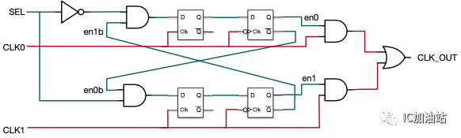

## IC设计流程

前端：

* 功能指标定义
* 架构设计
* 详细设计
* 功能验证（前仿）
* 逻辑综合、优化
    -  translation + optimization + mapping
* 一致性验证，综合前和后是否一致

后端：

* DFT
* Place
* CTS(时钟树综合)
* Route
* DRC/LVS
* 版图生成
* 功能验证（后仿）
* 流片Tape out

STA在逻辑综合优化、Place、CTS、Route都需要


1. 规格制定
        芯片规格，也就像功能列表一样，是客户向芯片设计公司（称为Fabless，无晶圆设计公司）提出的设计要求，包括芯片需要达到的具体功能和性能方面的要求。

2. 详细设计
        Fabless根据客户提出的规格要求，拿出设计解决方案和具体实现架构，划分模块功能。

3. HDL编码
        使用硬件描述语言（VHDL，Verilog HDL，业界公司一般都是使用后者）将模块功能以代码来描述实现，也就是将实际的硬件电路功能通过HDL语言描述出来，形成RTL（寄存器传输级）代码。

4. 仿真验证
        仿真验证就是检验编码设计的正确性，检验的标准就是第一步制定的规格。看设计是否精确地满足了规格中的所有要求。规格是设计正确与否的黄金标准，一切违反，不符合规格要求的，就需要重新修改设计和编码。 设计和仿真验证是反复迭代的过程，直到验证结果显示完全符合规格标准。
        仿真验证工具Synopsys的VCS，还有Cadence的NC-Verilog。

5. 逻辑综合――Design Compiler
        仿真验证通过，进行逻辑综合。逻辑综合的结果就是把设计实现的HDL代码翻译成门级网表netlist。综合需要设定约束条件，就是你希望综合出来的电路在面积，时序等目标参数上达到的标准。逻辑综合需要基于特定的综合库，不同的库中，门电路基本标准单元（standard cell）的面积，时序参数是不一样的。所以，选用的综合库不一样，综合出来的电路在时序，面积上是有差异的。一般来说，综合完成后需要再次做仿真验证（这个也称为后仿真，之前的称为前仿真）。
        逻辑综合工具Synopsys的Design Compiler。

6. STA
        Static Timing Analysis（STA），静态时序分析，这也属于验证范畴，它主要是在时序上对电路进行验证，检查电路是否存在建立时间（setup time）和保持时间（hold time）的违例（violation）。这个是数字电路基础知识，一个寄存器出现这两个时序违例时，是没有办法正确采样数据和输出数据的，所以以寄存器为基础的数字芯片功能肯定会出现问题。
        STA工具有Synopsys的Prime Time。

7. 形式验证
        这也是验证范畴，它是从功能上（STA是时序上）对综合后的网表进行验证。常用的就是等价性检查方法，以功能验证后的HDL设计为参考，对比综合后的网表功能，他们是否在功能上存在等价性。这样做是为了保证在逻辑综合过程中没有改变原先HDL描述的电路功能。
       形式验证工具有Synopsys的Formality。

前端设计的流程暂时写到这里。从设计程度上来讲，前端设计的结果就是得到了芯片的门级网表电路。

Backend design flow ：

1. DFT
        Design For Test，可测性设计。芯片内部往往都自带测试电路，DFT的目的就是在设计的时候就考虑将来的测试。DFT的常见方法就是，在设计中插入扫描链，将非扫描单元（如寄存器）变为扫描单元。关于DFT，有些书上有详细介绍，对照图片就好理解一点。
        DFT工具Synopsys的DFT Compiler

2. 布局规划(FloorPlan)
        布局规划就是放置芯片的宏单元模块，在总体上确定各种功能电路的摆放位置，如IP模块，RAM，I/O引脚等等。布局规划能直接影响芯片最终的面积。
        工具为Synopsys的Astro

3. CTS
        Clock Tree Synthesis，时钟树综合，简单点说就是时钟的布线。由于时钟信号在数字芯片的全局指挥作用，它的分布应该是对称式的连到各个寄存器单元，从而使时钟从同一个时钟源到达各个寄存器时，时钟延迟差异最小。这也是为什么时钟信号需要单独布线的原因。
        CTS工具，Synopsys的Physical Compiler

4. 布线(Place & Route)
        这里的布线就是普通信号布线了，包括各种标准单元（基本逻辑门电路）之间的走线。比如我们平常听到的0.13um工艺，或者说90nm工艺，实际上就是这里金属布线可以达到的最小宽度，从微观上看就是MOS管的沟道长度。
        工具Synopsys的Astro

5. 寄生参数提取
        由于导线本身存在的电阻，相邻导线之间的互感,耦合电容在芯片内部会产生信号噪声，串扰和反射。这些效应会产生信号完整性问题，导致信号电压波动和变化，如果严重就会导致信号失真错误。提取寄生参数进行再次的分析验证，分析信号完整性问题是非常重要的。
        工具Synopsys的Star-RCXT

6. 版图物理验证
        对完成布线的物理版图进行功能和时序上的验证，验证项目很多，如LVS（Layout Vs Schematic）验证，简单说，就是版图与逻辑综合后的门级电路图的对比验证；DRC（Design Rule Checking）：设计规则检查，检查连线间距，连线宽度等是否满足工艺要求， ERC（Electrical Rule Checking）：电气规则检查，检查短路和开路等电气 规则违例；等等。
        工具为Synopsys的Hercules

## FPGA设计流程

* Synth
* Opt
* Route
* Wirte_bitstream


## 锁存器

锁存器（latch）是一种对脉冲电平敏感的双稳态电路，它具有0和1两个稳定状态，一旦状态被确定，就能自行保持，直到有外部特定输入脉冲电平作用在电路一定位置时，才有可能改变状态。

### SR Latch
SR Latch: Set-Rest Latch

2个或非门互联，R对应Q
2个与非门前加上非门，'S对应Q

| S | R | Qnext |
| ---|---|---|
| 0 |0|Q|
|0|1|0|
|1|0|1|
|1|1|X|

Qnext = 'RQ + 'RS

### JK latch

| S | R | Qnext |
| ---|---|---|
| 0 |0|Q|
|0|1|0|
|1|0|1|
|1|1|'Q|

Qnext = 'RQ + 'RS + RS'Q

### Gated SR Latch


|E/C|     Action|
|---|---|
|0|       No action (keep state)|
|1|       The same as non-clocked SR latch|

### Gated D Latch

只基于NAND的D Latch, data latch


## 寄存器

### 主从SR触发器

两个SR Latch组成的，可以上升沿触发（clock在下降沿触发的基础上再翻转即可），也可以下降沿触发。

但是必须限制输入逻辑是无冒险的电路，主从D触发器让S和R互补消除了1捕获问题

### 主从D触发器

两个D Latch组成的，可以上升沿触发（clock在下降沿触发的基础上再翻转即可），也可以下降沿触发


### D flip-flop

|Clock   |D       |Qnext|
|---|---|---|
|Rising edge|     0|       0|
Rising edge|     1|       1|
Non-rising|      X|       Q|


图中为上升沿触发器，下降沿将NAND改成NOR即可


#### setup和hold时间分析


* 当CLK为0时，G1G2选择D和~D，M由D决定，同时Q锁存
* 当CLK为1时，G5G6选择M和~M，M锁存，同时Q由M决定

* 因此setup时间应该为 Tv1+Tg2+Tg4+Tg3，应该保持至少这么长时间，M在被锁存之前需要稳定
* 同时hold时间应该为Tv2-Tv1，M在被真正锁存之前，还需要保持这么长的时间让clock变为~clock


* 当CLK为0时，T1导通，但必须保证T2在CLK变为1的时候，输入是稳定的，因此setup时间等于Tt1+Tinv * 2
* 当CLK为1时，T2导通，B点被锁存，但是由于clock和~clock存在延迟，因此在T2真正导通之前，还需要保持hold时间等于clock到~clock的延迟inv


### Dual-edge-triggered D flip-flop

可以用两个D触发器（上升沿和下降沿）和一个选择器组成

### T触发器

Q = T'Q + 'TQ = T^Q

### JK触发器
SR flip-flop (J: Set, K: Reset) by interpreting the J = K = 1 condition as a "flip" or toggle command

Q = J'Q + 'KQ

## Timing parameters

Setup time is the minimum amount of time the data input should be held steady before the clock event, so that the data is reliably sampled by the clock.

Hold time is the minimum amount of time the data input should be held steady after the clock event, so that the data is reliably sampled by the clock.

Aperture is the sum of setup and hold time. The data input should be held steady throughout this time period.

Recovery time is the minimum amount of time the asynchronous set or reset input should be inactive before the clock event, so that the data is reliably sampled by the clock. The recovery time for the asynchronous set or reset input is thereby similar to the setup time for the data input.

Removal time is the minimum amount of time the asynchronous set or reset input should be inactive after the clock event, so that the data is reliably sampled by the clock. The removal time for the asynchronous set or reset input is thereby similar to the hold time for the data input.


## 基础数字电路

### 基数分频

* 设置一个计数长度为N的上升沿计数器，和一个信号寄存器;信号寄存器在上升沿计数器为（N-1)/2的时候进行翻转，然后再在计数到N-1的时候进行翻转（这里相当于得到一个N分频信号A）。
* 设置一个计数长度为N的下降沿计数器，和另一个信号寄存器;信号寄存器在下降沿计数器为（N-1)/2的时候进行翻转，然后再在计数到N-1的时候进行翻转（这里相当于得到一个N分频信号B）。
* A和B相或即可得到占空比为50%的奇数分频信号
* 至于占空比非50%的，例如5分频，45个周期为高，123为低即可

### 偶数分频

* N/2-1即可

### 分数分频

8.7分频的原理是用3次8分频和7次9分频的对应的时钟总时间来等效原时钟87个周期的总时间。

把3次8分频平均地插入到7次9分频中，这个过程也叫混频。

这里切换时钟并不等同于下边的切换，应该是切换到另一个完整的几个分频周期，然后在切回来。


## 仲裁器


### Fixed Priority

加法器思路

```
assign gnt = req & (~(req-1));
```

mask思路

```
assign pre_req[0] = 1'b0;
assign pre_req[REQ_WIDTH-1:1] = req[REQ_WIDTH-2:0] | pre_req[REQ_WIDTH-2:0];

assign gnt = req & ~pre_req;
```

### Round Robin

这是换优先级的思路

```
module arbiter_base #(parameter NUM_REQ = 4)
(
  input [NUM_REQ-1:0]    req,
  input [NUM_REQ-1:0]    base,
  output [NUM_REQ-1:0]    gnt
);

wire[2*NUM_REQ-1:0] double_req = {req,req};

wire[2*NUM_REQ-1:0] double_gnt = double_req & ~(double_req - base);

assign gnt = double_gnt[NUM_REQ-1:0] | double_gnt[2*NUM_REQ-1:NUM_REQ];

endmodule


module round_robin_arbiter #(parameter NUM_REQ = 4)
(
  input                      clk,
  input                      rstn,
  input [NUM_REQ-1:0]        req,
  output [NUM_REQ-1:0]       gnt 
);

logic [NUM_REQ-1:0]          hist_q, hist_d;

always_ff@(posedge clk) begin
  if(!rstn) 
    hist_q <= {{NUM_REQ-1{1'b0}}, 1'b1};
  else
    if(|req)
      hist_q <= {gnt[NUM_REQ-2:0, gnt[NUM_REQ-1]}; 
end


arbiter_base #(
  .NUM_REQ(NUM_REQ)
) arbiter(
  .req      (req),
  .gnt      (gnt),
  .base     (hist_q)
);

endmodule

```


也有优先级不变，但是mask request的思路

一个mask掉的，一个没有mask掉的，做选择


```
module round_robin_arbiter #(
parameter N=16
)(
input    clk,
input    rst,
input[N-1:0] req,
output[N-1:0] grant
);

logic[N-1:0] req_masked;
logic[N-1:0] mask_higher_pri_reqs;
logic[N-1:0] grant_masked;
logic[N-1:0] unmask_higher_pri_reqs;
logic[N-1:0] grant_unmasked;
logic no_req_masked;
logic[N-1:0] pointer_reg;


// Simple priority arbitration for masked portion
assign req_masked=req&pointer_reg;
assign mask_higher_pri_reqs[N-1:1]=mask_higher_pri_reqs[N-2:0]|req_masked[N-2:0];
assign mask_higher_pri_reqs[0]=1'b0;
assign grant_masked[N-1:0]=req_masked[N-1:0]&~mask_higher_pri_reqs[N-1:0];

// Simple priority arbitration for unmasked portion
assign unmask_higher_pri_reqs[N-1:1]=unmask_higher_pri_reqs[N-2:0]|req[N-2:0];
assign unmask_higher_pri_reqs[0]=1'b0;
assign grant_unmasked[N-1:0]=req[N-1:0]&~unmask_higher_pri_reqs[N-1:0];

// Use grant_masked if there is any there, otherwise use grant_unmasked.
assign no_req_masked=~(|req_masked);
assign grant=({N{no_req_masked}}&grant_unmasked)|grant_masked;

// Pointer update
always@(posedge clk)begin
if(rst)begin
  pointer_reg<={N{1'b1}};
endelsebegin
 if(|req_masked)begin// Which arbiter was used?
   pointer_reg<=mask_higher_pri_reqs;
 endelsebegin
  if(|req)begin// Only update if there's a req
    pointer_reg<=unmask_higher_pri_reqs;
  endelsebegin
    pointer_reg<=pointer_reg ;
  end
 end
end
end

endmodule
```


### Round Robin with weight

当这一路被grant完之后，它的counter减到了0，所有的credit用完了，那么mask再调整，调整的做法和Round Robin一样，把第0路和第i路的req都mask掉，其余没有被mask掉的再继续这个过程。

load初始值weight：

* 所有的路都被mask掉了，即所有路都被依次轮过一遍了，这个时候我们需要再来一轮公平的仲裁，大家都各自载入自己的权重，再来一轮。
* 没有active req了，也就是所有的request都被许可了。


## 时钟切换

使得真正的gating发生在clock为低的时候，CLK1/2为高的半个周期完整的输出，减少glitch的可能性，如果都是在上升沿，可能就会出现glitch

换为另外一路的时候由于Flop之前的AND门，也保证了即使SELECT立刻变化，AND门的输出也是在另外一路停下来之后才能发生变化，这样就保证了先停一路，再切另外一路。

异步信号select 同步器，但是只有半个周期让他稳定下来，如果MTBF达不到，需要再加一个寄存器




如果没有负沿触发的flop，可以使用clock gating cell 来替代，此时，反馈信号'Q还需要在打一拍。


## 独热码检测

第一位一致，后边异或，得到校验序列

校验序列如果第一个为1，表明有奇数个1，那么还需要判断源信号是不是只有一个1

“容易发现”如果源信号只有一个1，他的反将会与校验序列或全为1

```
A 为源信号， P为校验序列， (P|~A)
00010  -> 校验序列 = 11110
11101  -> 或11110 = 11111

10010  -> 校验序列 = 01110
01101  -> 或01110 = 01111

10110  -> 校验序列 = 10010
01001  -> 或10010 = 11011

猜测偶数个1的位置为0，其他全为1

11111  -> 校验序列 = 10101
00000  -> 或10101 = 10101
```

```

function automatic logic is_onehot(input [WIDTH-1:0] sig);
  logic [WIDTH-1:0] parity;
  parity[0] = sig[0];
  for(int i = 1; i < WIDTH; i++)
     parity[i] = parity[i-1] ^ sig[i];
  is_onehot = parity[i-1] & (&(parity | ~sig));
endfunction

```
