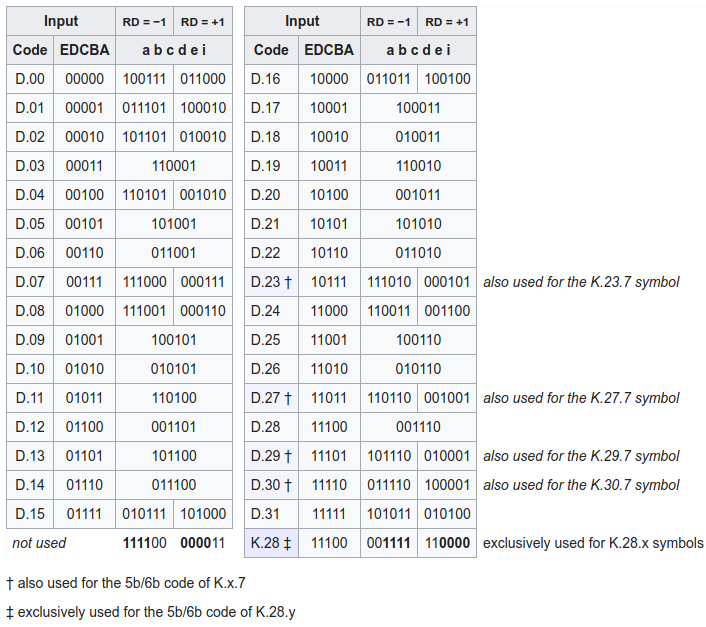

## IC设计流程

前端：

* 功能指标定义
* 架构设计
* RTL设计
* 功能验证（前仿）
* 逻辑综合、优化
    -  translation + optimization + mapping
* 一致性验证，综合前和后是否一致

后端：

* DFT
* Place
* CTS(时钟树综合)
* Route
* DRC/LVS
* 版图生成
* 功能验证（后仿）
* 流片Tape out

STA在逻辑综合优化、Place、CTS、Route都需要


1. 规格制定
        芯片规格，也就像功能列表一样，是客户向芯片设计公司（称为Fabless，无晶圆设计公司）提出的设计要求，包括芯片需要达到的具体功能和性能方面的要求。

2. 详细设计
        Fabless根据客户提出的规格要求，拿出设计解决方案和具体实现架构，划分模块功能。

3. HDL编码
        使用硬件描述语言（VHDL，Verilog HDL，业界公司一般都是使用后者）将模块功能以代码来描述实现，也就是将实际的硬件电路功能通过HDL语言描述出来，形成RTL（寄存器传输级）代码。

4. 仿真验证
        仿真验证就是检验编码设计的正确性，检验的标准就是第一步制定的规格。看设计是否精确地满足了规格中的所有要求。规格是设计正确与否的黄金标准，一切违反，不符合规格要求的，就需要重新修改设计和编码。 设计和仿真验证是反复迭代的过程，直到验证结果显示完全符合规格标准。
        仿真验证工具Synopsys的VCS，还有Cadence的NC-Verilog。

5. 逻辑综合――Design Compiler
        仿真验证通过，进行逻辑综合。逻辑综合的结果就是把设计实现的HDL代码翻译成门级网表netlist。综合需要设定约束条件，就是你希望综合出来的电路在面积，时序等目标参数上达到的标准。逻辑综合需要基于特定的综合库，不同的库中，门电路基本标准单元（standard cell）的面积，时序参数是不一样的。所以，选用的综合库不一样，综合出来的电路在时序，面积上是有差异的。一般来说，综合完成后需要再次做仿真验证（这个也称为后仿真，之前的称为前仿真）。
        逻辑综合工具Synopsys的Design Compiler。

6. STA
        Static Timing Analysis（STA），静态时序分析，这也属于验证范畴，它主要是在时序上对电路进行验证，检查电路是否存在建立时间（setup time）和保持时间（hold time）的违例（violation）。这个是数字电路基础知识，一个寄存器出现这两个时序违例时，是没有办法正确采样数据和输出数据的，所以以寄存器为基础的数字芯片功能肯定会出现问题。
        STA工具有Synopsys的Prime Time。

7. 形式验证
        这也是验证范畴，它是从功能上（STA是时序上）对综合后的网表进行验证。常用的就是等价性检查方法，以功能验证后的HDL设计为参考，对比综合后的网表功能，他们是否在功能上存在等价性。这样做是为了保证在逻辑综合过程中没有改变原先HDL描述的电路功能。
       形式验证工具有Synopsys的Formality。

前端设计的流程暂时写到这里。从设计程度上来讲，前端设计的结果就是得到了芯片的门级网表电路。

Backend design flow ：

1. DFT
        Design For Test，可测性设计。芯片内部往往都自带测试电路，DFT的目的就是在设计的时候就考虑将来的测试。DFT的常见方法就是，在设计中插入扫描链，将非扫描单元（如寄存器）变为扫描单元。关于DFT，有些书上有详细介绍，对照图片就好理解一点。
        DFT工具Synopsys的DFT Compiler

2. 布局规划(FloorPlan)
        布局规划就是放置芯片的宏单元模块，在总体上确定各种功能电路的摆放位置，如IP模块，RAM，I/O引脚等等。布局规划能直接影响芯片最终的面积。
        工具为Synopsys的Astro

3. CTS
        Clock Tree Synthesis，时钟树综合，简单点说就是时钟的布线。由于时钟信号在数字芯片的全局指挥作用，它的分布应该是对称式的连到各个寄存器单元，从而使时钟从同一个时钟源到达各个寄存器时，时钟延迟差异最小。这也是为什么时钟信号需要单独布线的原因。
        CTS工具，Synopsys的Physical Compiler

4. 布线(Place & Route)
        这里的布线就是普通信号布线了，包括各种标准单元（基本逻辑门电路）之间的走线。比如我们平常听到的0.13um工艺，或者说90nm工艺，实际上就是这里金属布线可以达到的最小宽度，从微观上看就是MOS管的沟道长度。
        工具Synopsys的Astro

5. 寄生参数提取
        由于导线本身存在的电阻，相邻导线之间的互感,耦合电容在芯片内部会产生信号噪声，串扰和反射。这些效应会产生信号完整性问题，导致信号电压波动和变化，如果严重就会导致信号失真错误。提取寄生参数进行再次的分析验证，分析信号完整性问题是非常重要的。
        工具Synopsys的Star-RCXT

6. 版图物理验证
        对完成布线的物理版图进行功能和时序上的验证，验证项目很多，如LVS（Layout Vs Schematic）验证，简单说，就是版图与逻辑综合后的门级电路图的对比验证；DRC（Design Rule Checking）：设计规则检查，检查连线间距，连线宽度等是否满足工艺要求， ERC（Electrical Rule Checking）：电气规则检查，检查短路和开路等电气 规则违例；等等。
        工具为Synopsys的Hercules

## FPGA设计流程

* Synth
* Opt
* Route
* Wirte_bitstream

## 门


## 锁存器

锁存器（latch）是一种对脉冲电平敏感的双稳态电路，它具有0和1两个稳定状态，一旦状态被确定，就能自行保持，直到有外部特定输入脉冲电平作用在电路一定位置时，才有可能改变状态。

### SR Latch
SR Latch: Set-Rest Latch

2个或非门互联，R对应Q

2个与非门前加上非门，'S对应Q

| S | R | Qnext |
| ---|---|---|
| 0 |0|Q|
|0|1|0|
|1|0|1|
|1|1|X|

Qnext = 'RQ + 'RS

### JK latch

| S | R | Qnext |
| ---|---|---|
| 0 |0|Q|
|0|1|0|
|1|0|1|
|1|1|'Q|

Qnext = 'RQ + 'RS + RS'Q

### Gated SR Latch


|E/C|     Action|
|---|---|
|0|       No action (keep state)|
|1|       The same as non-clocked SR latch|

### Gated D Latch

只基于NAND的D Latch, data latch


## 寄存器

### 主从SR触发器

两个SR Latch组成的，可以上升沿触发（clock在下降沿触发的基础上再翻转即可），也可以下降沿触发。


但是必须限制输入逻辑是无冒险的电路，主从D触发器让S和R互补消除了1捕获问题

Qn = Sn + Rn'Qn-1
必须满足RnSn = 0，否则会出现不确定

### 主从D触发器

两个D Latch组成的，可以上升沿触发（clock在下降沿触发的基础上再翻转即可），也可以下降沿触发


### D flip-flop

|Clock   |D       |Qnext|
|---|---|---|
|Rising edge|     0|       0|
Rising edge|     1|       1|
Non-rising|      X|       Q|


图中为上升沿触发器，下降沿将NAND改成NOR即可


#### setup和hold时间分析


* 当CLK为0时，G1G2选择D和~D，M由D决定，同时Q锁存
* 当CLK为1时，G5G6选择M和~M，M锁存，同时Q由M决定

* 因此setup时间应该为 Tv1+Tg2+Tg4+Tg3，应该保持至少这么长时间，M在被锁存之前需要稳定
* 同时hold时间应该为Tv2-Tv1，M在被真正锁存之前，还需要保持这么长的时间让clock变为~clock


* 当CLK为0时，T1导通，但必须保证T2在CLK变为1的时候，输入是稳定的，因此setup时间等于Tt1+Tinv * 2
* 当CLK为1时，T2导通，B点被锁存，但是由于clock和 \~clock 存在延迟，因此在T2真正导通之前，还需要保持hold时间等于clock到 \~clock 的延迟inv


### Dual-edge-triggered D flip-flop

可以用两个D触发器（上升沿和下降沿）和一个选择器组成

### T触发器

Q = T'Q + 'TQ = T^Q

### JK触发器
SR flip-flop (J: Set, K: Reset) by interpreting the J = K = 1 condition as a "flip" or toggle command

Q = J'Q + 'KQ

## Timing parameters

Setup time is the minimum amount of time the data input should be held steady before the clock event, so that the data is reliably sampled by the clock.

Hold time is the minimum amount of time the data input should be held steady after the clock event, so that the data is reliably sampled by the clock.

Aperture is the sum of setup and hold time. The data input should be held steady throughout this time period.

Recovery time is the minimum amount of time the asynchronous set or reset input should be inactive before the clock event, so that the data is reliably sampled by the clock. The recovery time for the asynchronous set or reset input is thereby similar to the setup time for the data input.

Removal time is the minimum amount of time the asynchronous set or reset input should be inactive after the clock event, so that the data is reliably sampled by the clock. The removal time for the asynchronous set or reset input is theeby similar to the hold time for the data input.


恢复时间（Recovery Time）是指异步控制信号（如寄存器的异步清除和置位控制信号）在“下个时钟沿”来临之前变无效的最小时间长度。这个时间的意义是，如果保证不了这个最小恢复时间，也就是说这个异步控制信号的解除与“下个时钟沿”离得太近（但在这个时钟沿之前），没有给寄存器留有足够时间来恢复至正常状态，那么就不能保证“下个时钟沿”能正常作用，也就是说这个“时钟沿”可能会失效。


解除时间（Removal Time）是指异步控制信号（如寄存器的异步清除和置位控制信号）在“有效时钟沿”之后变无效的最小时间长度。这个时间的意义是，如果保证不了这个去除时间，也就是说这个异步控制信号的解除与“有效时钟沿”离得太近（但在这个时钟沿之后），那么就不能保证有效地屏蔽这个“时钟沿”，也就是说这个“时钟沿”可能会起作用。

换句话来说，如果你想让某个时钟沿起作用，那么你就应该在“恢复时间”之前是异步控制信号变无效，如果你想让某个时钟沿不起作用，那么你就应该在“解除时间”过后使控制信号变无效。如果你的控制信号在这两种情况之间，那么就没法确定时钟沿是否起作用或不起作用了，也就是说可能会造成寄存器处于不确定的状态。而这些情况是应该避免的。所以恢复时间和去除时间是应该遵守的。

1. 不满足复位恢复时间或者撤离时间，可能会导致亚稳态问题。（注意是可能）因为如果输出本身就是复位后的值，即使当前时钟沿不能判断是否复位，输出也是复位值，这时候就不会产生亚稳态，因为已经是复位态了。
2. 不满足复位恢复时间或者撤离时间可能会导致不同FF复位状态不一致的问题。复位信号和时钟信号一样，通过 复位网络到达各个触发器。复位网络具有非常大的扇出和负载，到达不同的触发器存在不同的延时，不满足复位恢复或者解除时间的情况下，就有可能在不同的触发器的不同时钟周期内进行解复位。注意，这里的假设条件是复位树和时钟树已经做成立平衡状态，不再考虑复位树和时钟树没做好的情况

## 基础数字电路

### 基数分频

* 设置一个计数长度为N的上升沿计数器，和一个信号寄存器;信号寄存器在上升沿计数器为（N-1)/2的时候进行翻转，然后再在计数到N-1的时候进行翻转（这里相当于得到一个N分频信号A）。
* 设置一个计数长度为N的下降沿计数器，和另一个信号寄存器;信号寄存器在下降沿计数器为（N-1)/2的时候进行翻转，然后再在计数到N-1的时候进行翻转（这里相当于得到一个N分频信号B）。
* A和B相或即可得到占空比为50%的奇数分频信号
* 至于占空比非50%的，例如5分频，45个周期为高，123为低即可

### 偶数分频

* N/2-1即可

### 分数分频

8.7分频的原理是用3次8分频和7次9分频的对应的时钟总时间来等效原时钟87个周期的总时间。

把3次8分频平均地插入到7次9分频中，这个过程也叫混频。

这里切换时钟并不等同于下边的切换，应该是切换到另一个完整的几个分频周期，然后在切回来。


## 仲裁器


### Fixed Priority

加法器思路

```
assign gnt = req & (~(req-1));
```

mask思路

```
assign pre_req[0] = 1'b0;
assign pre_req[REQ_WIDTH-1:1] = req[REQ_WIDTH-2:0] | pre_req[REQ_WIDTH-2:0];

assign gnt = req & ~pre_req;
```

### Round Robin

这是换优先级的思路

```
module arbiter_base #(parameter NUM_REQ = 4)
(
  input [NUM_REQ-1:0]    req,
  input [NUM_REQ-1:0]    base,
  output [NUM_REQ-1:0]    gnt
);

wire[2*NUM_REQ-1:0] double_req = {req,req};

wire[2*NUM_REQ-1:0] double_gnt = double_req & ~(double_req - base);

assign gnt = double_gnt[NUM_REQ-1:0] | double_gnt[2*NUM_REQ-1:NUM_REQ];

endmodule


module round_robin_arbiter #(parameter NUM_REQ = 4)
(
  input                      clk,
  input                      rstn,
  input [NUM_REQ-1:0]        req,
  output [NUM_REQ-1:0]       gnt 
);

logic [NUM_REQ-1:0]          hist_q, hist_d;

always_ff@(posedge clk) begin
  if(!rstn) 
    hist_q <= {{NUM_REQ-1{1'b0}}, 1'b1};
  else
    if(|req)
      hist_q <= {gnt[NUM_REQ-2:0, gnt[NUM_REQ-1]}; 
end


arbiter_base #(
  .NUM_REQ(NUM_REQ)
) arbiter(
  .req      (req),
  .gnt      (gnt),
  .base     (hist_q)
);

endmodule

```


也有优先级不变，但是mask request的思路

一个mask掉的，一个没有mask掉的，做选择


```
module round_robin_arbiter #(
parameter N=16
)(
input    clk,
input    rst,
input[N-1:0] req,
output[N-1:0] grant
);

logic[N-1:0] req_masked;
logic[N-1:0] mask_higher_pri_reqs;
logic[N-1:0] grant_masked;
logic[N-1:0] unmask_higher_pri_reqs;
logic[N-1:0] grant_unmasked;
logic no_req_masked;
logic[N-1:0] pointer_reg;


// Simple priority arbitration for masked portion
assign req_masked=req&pointer_reg;
assign mask_higher_pri_reqs[N-1:1]=mask_higher_pri_reqs[N-2:0]|req_masked[N-2:0];
assign mask_higher_pri_reqs[0]=1'b0;
assign grant_masked[N-1:0]=req_masked[N-1:0]&~mask_higher_pri_reqs[N-1:0];

// Simple priority arbitration for unmasked portion
assign unmask_higher_pri_reqs[N-1:1]=unmask_higher_pri_reqs[N-2:0]|req[N-2:0];
assign unmask_higher_pri_reqs[0]=1'b0;
assign grant_unmasked[N-1:0]=req[N-1:0]&~unmask_higher_pri_reqs[N-1:0];

// Use grant_masked if there is any there, otherwise use grant_unmasked.
assign no_req_masked=~(|req_masked);
assign grant=({N{no_req_masked}}&grant_unmasked)|grant_masked;

// Pointer update
always@(posedge clk)begin
if(rst)begin
  pointer_reg<={N{1'b1}};
endelsebegin
 if(|req_masked)begin// Which arbiter was used?
   pointer_reg<=mask_higher_pri_reqs;
 endelsebegin
  if(|req)begin// Only update if there's a req
    pointer_reg<=unmask_higher_pri_reqs;
  endelsebegin
    pointer_reg<=pointer_reg ;
  end
 end
end
end

endmodule
```


### Round Robin with weight

当这一路被grant完之后，它的counter减到了0，所有的credit用完了，那么mask再调整，调整的做法和Round Robin一样，把第0路和第i路的req都mask掉，其余没有被mask掉的再继续这个过程。

load初始值weight：

* 所有的路都被mask掉了，即所有路都被依次轮过一遍了，这个时候我们需要再来一轮公平的仲裁，大家都各自载入自己的权重，再来一轮。
* 没有active req了，也就是所有的request都被许可了。


## 时钟切换

使得真正的gating发生在clock为低的时候，CLK1/2为高的半个周期完整的输出，减少glitch的可能性，如果都是在上升沿，可能就会出现glitch

换为另外一路的时候由于Flop之前的AND门，也保证了即使SELECT立刻变化，AND门的输出也是在另外一路停下来之后才能发生变化，这样就保证了先停一路，再切另外一路。

异步信号select 同步器，但是只有半个周期让他稳定下来，如果MTBF达不到，需要再加一个寄存器


如果没有负沿触发的flop，可以使用clock gating cell 来替代，此时，反馈信号'Q还需要在打一拍。


## 独热码检测

第一位一致，后边异或，得到校验序列

校验序列如果第一个为1，表明有奇数个1，那么还需要判断源信号是不是只有一个1

“容易发现”如果源信号只有一个1，他的反将会与校验序列或全为1

```
A 为源信号， P为校验序列， (P|~A)
00010  -> 校验序列 = 11110
11101  -> 或11110 = 11111

10010  -> 校验序列 = 01110
01101  -> 或01110 = 01111

10110  -> 校验序列 = 10010
01001  -> 或10010 = 11011

猜测偶数个1的位置为0，其他全为1

11111  -> 校验序列 = 10101
00000  -> 或10101 = 10101
```

```

function automatic logic is_onehot(input [WIDTH-1:0] sig);
  logic [WIDTH-1:0] parity;
  parity[0] = sig[0];
  for(int i = 1; i < WIDTH; i++)
     parity[i] = parity[i-1] ^ sig[i];
  is_onehot = parity[i-1] & (&(parity | ~sig));
endfunction

```

## LFSR(线性反馈移位寄存器)

* 用于产生可重复的为随机序列PRBS。n个触发器可以产生最大周期为2^n-1的伪随机序列。
* The bits in the LFSR state that influence the input are called taps（抽头）.
* gn为反馈系数，取值只能为0或1，取为0时表明不存在该反馈之路，取为1时表明存在该反馈之路
* 反馈系数决定了产生随机数的算法的不同。
* 用反馈函数表示成y=a0x^0+a1x+a2x^2.......反馈函数为线性的叫线性移位反馈序列，否则叫非线性反馈移位序列。
* 这个抽头序列构成的多项式加1就是其反馈多项式，下边两个例子都是 x^16+x^14+x^13+x^11+1
* LFSR最长当且反馈多项式为本原多项式primitive，下面是必要条件，但是不充分
    - 抽头个数是偶数
    - 除了1以外没有公约数

Fibonacci LFSR：

* 多到一型LFSR
* 抽头序列对应bit位置的多个触发器的输出通过异或逻辑来驱动一个触发器的输入
* 右边是输出


Galois LFSR：

* 一到多型LFSR，一个触发器的输出通过异或逻辑驱动多个触发器的输入
* 最后一个触发器的输出通过与抽头序列对应位置触发器前一级触发器的输出异或逻辑驱动多个抽头序列对应位置触发器的输入。
* 右边是输出
* 也有反过来的，这个多项式按多数人理解应该是x^16+x^5+x^3+x^2+1,(本原多项式的倒数也是本原多项式)


* 虽然这两种电路都产生伪随机序列，但是一到多型的伽罗瓦LFSR具有更高的速度，因为它的两个触发器之间仅使用一个异或门。
* 避免寄存器进入全为0的禁止态
    - 用额外的电路让寄存器能够从禁止状态自动进入允许状态
    - 想办法给寄存器置位到某个允许的状态
* 应用
    - 计数器，地址计数器提供顺序地址，但是没有必要是传统的二进制地址序列，任何重复的序列都是可以接受的，而LFSR计数器是最有效的
    - BIST，encryption, checksum, PRBS, Pattern Generators
    - 扰码解码

### 扰码解码

* 并行：8倍频串行扰码
* 正常工作要点：
    - 扰码和解码都需要正确初始化
    - 没有数据的时候LFSR应该要被暂停更新，或者在数据流添加SKIP字符，这个时候不需要扰码解码处理
    - 也有data正常数据但是LFSR被更新，但是LFSR输出的数据不使用的情况


## 检错纠错


* 校验：
    - 奇偶校验
    - CRC校验
* 纠错：
    - 纠错编码
        + 块状编码
            * 非线性码
            * 线性码
                - 重复码
                - 奇偶校验位
                    + LDPC
                - 汉明码
                - 循环码
                    + BCH
        + 卷积编码（编码不仅与当前输入有关，还跟此前输入有关）
        
### 汉明码


(7,4)汉明码：4bit数据，3bit冗余

* 计算校验位数
    - 假设用N表示添加了校验码位后整个信息的二进制位数，用K代表其中有效信息位数，r表示添加的校验码位，它们之间的关系应满足：N=K＋r≤2^r－1
* 确定校验码位置
    - 2^n位置，如1，2，4...
* 确定校验码
    - p1（第1个校验位，也是整个码字的第1位）的校验规则是：从当前位数起，校验1位，然后跳过1位，再校验1位，再跳过1位，……。这样就可得出p1校验码位可以校验的码字位包括：第1位（也就是p1本身）、第3位、第5位、第7位、第9位、第11位、第13位、第15位，……。然后根据所采用的是奇校验，还是偶校验，最终可以确定该校验位的值。
    - p2（第2个校验位，也是整个码字的第2位）的校验规则是：从当前位数起，连续校验2位，然后跳过2位，再连续校验2位，再跳过2位，……。这样就可得出p2校验码位可以校验的码字位包括：第2位（也就是p2本身）、第3位，第6位、第7位，第10位、第11位，第14位、第15位，……。同样根据所采用的是奇校验，还是偶校验，最终可以确定该校验位的值。
    - p3（第3个校验位，也是整个码字的第4位）的校验规则是：从当前位数起，连续校验4位，然后跳过4位，再连续校验4位，再跳过4位，……。这样就可得出p4校验码位可以校验的码字位包括：第4位（也就是p4本身）、第5位、第6位、第7位，第12位、第13位、第14位、第15位，第20位、第21位、第22位、第23位，……。同样根据所采用的是奇校验，还是偶校验，最终可以确定该校验位的值。
    - p4（第4个校验位，也是整个码字的第8位）的校验规则是：从当前位数起，连续校验8位，然后跳过8位，再连续校验8位，再跳过8位，……。这样就可得出p4校验码位可以校验的码字位包括：第8位（也就是p4本身）、第9位、第10位、第11位、第12位、第13位、第14位、第15位，第24位、第25位、第26位、第27位、第28位、第29位、第30位、第31位，……。同样根据所采用的是奇校验，还是偶校验，最终可以确定该校验位的值。
* 实现校验
    - 如果最终发现只是一个校验组中的校验结果不符，则直接可以知道是对应校验组中的校验码在传输过程中出现了差错。
    - 对应的校验组进行异或运算
        + 偶校验下，结果应该是0
        + 奇校验下，结果应该是1
* 实现纠错
    - 任何一位数被多个校验位校验，一旦有一个出错，则肯定影响很多个校验位。
    - 所有校验码组成Pn...P1，在偶校验情况下，如果为0，说明没有错误，如果为n，说明第n位错了


### CRC

一个完整的CRC参数模型应该包含以下信息：WIDTH，POLY，INIT，REFIN，REFOUT，XOROUT。

* NAME：参数模型名称。
* WIDTH：宽度，即生成的CRC数据位宽，如CRC-8，生成的CRC为8位
* POLY：十六进制多项式，省略最高位1，如 x8 + x2 + x + 1，二进制为1 0000 0111，省略最高位1，转换为十六进制为0x07。
* INIT：CRC初始值，和WIDTH位宽一致。
* REFIN：true或false，在进行计算之前，原始数据是否翻转，如原始数据：0x34 = 0011 0100，如果REFIN为true，进行翻转之后为0010 1100 = 0x2c
* REFOUT：true或false，运算完成之后，得到的CRC值是否进行翻转，如计算得到的CRC值：0x97 = 1001 0111，如果REFOUT为true，进行翻转之后为11101001 = 0xE9。
* XOROUT：计算结果与此参数进行异或运算后得到最终的CRC值，和WIDTH位宽一致。

通常如果只给了一个多项式，其他的没有说明则：INIT=0x00，REFIN=false，REFOUT=false，XOROUT=0x00。


例子：原始数据：0x34，使用CRC-8/MAXIN参数模型，求CRC值？
```
POLY = 0x31 = 0011 0001(最高位1已经省略)
INIT = 0x00
XOROUT = 0x00
REFIN = TRUE
REFOUT = TRUE
```

```
0.原始数据 = 0x34 = 0011 0100，多项式 = 0x31 = 1 0011 0001
1.INIT = 00，原始数据高8位和初始值进行异或运算保持不变。
2.REFIN为TRUE，需要先对原始数据进行翻转：0011 0100 > 0010 1100
3.原始数据左移8位，即后面补8个0：0010 1100 0000 0000
4.把处理之后的数据和多项式进行模2除法，求得余数：
原始数据：0010 1100 0000 0000 = 10 1100 0000 0000
多项式：1 0011 0001
模2除法取余数低8位：1111 1011
5.与XOROUT进行异或，1111 1011 xor 0000 0000 = 1111 1011 
6.因为REFOUT为TRUE，对结果进行翻转得到最终的CRC-8值：1101 1111 = 0xDF
7.数据+CRC：0011 0100 1101 1111 = 34DF，相当于原始数据左移8位+余数。
```

校验办法：

* 接受到的数据和CRC分离，然后本地进行CRC运算，然后比较，如果一致，说明正确
* 整个数据帧进行CRC运算，如果余数为0，说明正确


#### 串行硬件实现

G(x) = x^4 +x^2 + 1    ->  10101


* 初始值假设为0
* 前4个周期进数据
* 后4个周期进行模2除法，x3为1说明对10101进行异或
* 做完之后寄存器的值为校验结果，X3的输出序列为商


* 初始值假设为0
* 4个周期直接计算出结果
* 输入为1，说明之后的第2个和第4周期需要和输入值进行异或，因此x2和x0需要赋1
* 如果在需要异或的时候又来了个1，则说明需要做两次除法，相当对后续数据不做除法
* 做完之后寄存器的值为校验结果，X3的输出序列为商

#### 并行硬件实现

可以递归推到CRC寄存器的值，在 www.easics.com 中可以查到递归公式和verilog代码

M位宽的并行数据，我们可以根据移位前的N位寄存器值和M位并行数据的位宽数据做逻辑运算计算出（N+1）阶的CRC值

## 8b/10b编码

 8bit原始数据可以分成两部分：低位的5bit EDCBA（设其十进制数值为X）和高位的3bit HGF（设其十进制数值为Y），则该8bit数据可以记为D.X.Y。另外，8B/10B编码中还用到12个控制字符，他们可以作为传输中帧起始、帧结束、传输空闲等状态标识，与数据字符的记法类似，控制字符一般记为K.X.Y。8bit数据有256种，加上12种控制字符，总共有268种。10bit数据有1024种，可以从中选择出一部分表示8bit数据，所选的码型中0和1的个数应尽量相等。8B/10B编码中将K28.1、K28.5和K28.7作为K码的控制字符，称为“comma”。在任意数据组合中，comma只作为控制字符出现，而在数据负荷部分不会出现，因此可以用comma字符指示帧的开始和结束标志，或始终修正和数据流对齐的控制字符。

 编码时，低5bit原数据 EDCBA经过5B/6B编码成为6bit码abcdei，高3bit原数据HGF经3B/4B成为4bit码fghj，最后再将两部分组合起来形成一个10bit码abcdeifghj。10B码在发送时，按照先发送低位在发送高位的顺序发送。

 5B/6B编码和3B/4B编码的映射有标准化的表格，可以通过基于查找表的方式实现。使用 “不一致性（Disparity）”来描述编码中"1"的位数和"0"的位数的差值，它仅允许有"+2"(  "0"比"1"多两个)、"0"（ "0"与"1"个数相等）以及"-2"（"1"比"0"多两个）这三种状况。 由于数据流不停地从发送端向接收端传输，前面所有已发送数据的不一致性累积产生的状态被称为“运行不一致性（Runing Disparity，RD）”。RD仅会出现+1与-1两种状态，分别代表位"1"比位"0"多或位"0"比位"1"多，其初始值是-1。Next RD值依赖于Current RD以及当前6B码或者4B码的Disparity。根据Current RD的值，决定5B/4B和 3B/4B编码映射方式，如下图所示。




 当Current RD=-1时，表示之前传输的数据中"0"的个数多于"1"的个数，若6B或4B编码的Disparity=0，则NextRD=-1；若6B或4B编码的Disparity=+2，则Next RD=+1。同样，当Current RD=+1时，表示之前传输的数据中"0"的个数多于"1"的个数，若6B或4B编码的Disparity=0，则NextRD=+1；若6B或4B编码的Disparity=-2，则Next RD=-1。

Rules for running disparity

|previous RD|  Disparity of code word | Disparity chosen | next RD
|---|---|---|---|
|−1|  0|   0|   −1|
|−1  |±2  |+2  |+1|
|+1  |0   |0   |+1|
|+1 | ±2  |−2  |−1


 这样，经过8B/10B编码以后，连续的“1”和“0”基本上不会超过5bit，只有在使用comma时，才会出现连续的5个0或1。

多字节编码：

* 两个8b/10b编码器串联，然后用联级的disparity保存在RD寄存器中
* 多个8b/10b编码器并联，然后使用mux来确定disparity，最后保存在RD寄存器

## NRZ

|code name | complete name| desciption |
|---|---|---|
|NRZ|Non-return-to-zero level   |   Appears as raw binary bits without any coding
|NRZI|Non-return-to-zero inverted    Refers to either an NRZ(M) or NRZ(S) code.
|NRZM|Non-return-to-zero mark   |Serializer mapping {0: constant, 1: toggle}.
|NRZS|Non-return-to-zero space  |Serializer mapping {0: toggle, 1: constant}.
|NRZC|Non-return-to-zero change |


