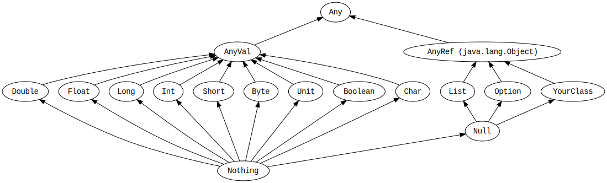

## scala basic

* var and val
* conditional returns a value
* method
    - overload
    - revursive and nest (scope)
* list
* for
* class
* code blocks
    - The last line of Scala code becomes the return value of the code block
    - A one-line code block doesn't need to be enclosed in {}
* List
    - map
    - zip
    - zipWithIndex
    - reduce
    - fold
    - scan
* Seq

### Types

* int
* double
* class java.lang.String
* Unit为返回值的Function不返回任何东西
* Boolean: 用于if
* asInstanceOf 强制转化
* Chisel Types
    - UInt
    - Bool: 用于when
    - asTypeOf asUInt asSInt


### class

* abstract classes
* traits
* objects = static class
* companion objects
* case classes

## Chisel

* Module
* Bundle
* Combinational Logic
    - Wire
* Control Flow
* Sequential Logic
    - Reg
    - RegNext
    - RegInit
    - withReset
    - withClock
    - withClockAndReset
    - 异步呢？


* Map
* map.get returns Option
    - None
    - Some
* Match/Case Statements
* IOs with Optional Fields
    - Optional IO with Option
    - Optional IO with Zero-Width Wires
* case class


* Vec
* Decoupled
* Queue
* arbiters
* Bitwise
    - popCount
    - reverse
* Onehot
    - UIntToOH
    - OHToUInt
* Muxes
    - PriorityMux
    - Mux1H
* Counter


### Tester

* poke
* peek
* step
* expect
* initiate


## Chisel-book-chinese

### 基本组成部分

#### 信号类型和变量

3种数据类型描述信号(signal)，组合逻辑和寄存器：

* Bits(Width)
* UInt: Bits的拓展
* SInt: Bits的拓展， 2-Complement

矢量宽度由Chisel的Width类型指定，scala整型n转换成Chisel的Width:

* n.W

也可以直接scala的整型直接转Chisel类型的常量，例如 -3.S; 0.U。常量也可以定义宽度，例如8.U(4.W)；一般Chisel也会自动推断宽度；字符串也可以表示常量。

* "b1111_1111".U
* "hff".U
* "o377".U

Bool类型，可以表示true或false，可以将scala的Boolean转化为Chisel的Bool:

* true.B


#### 组合电路

val logic = a & b | c

可以先把signal转化为Wire；然后利用:=进行Wire的赋值：

* val w =Wire(UInt())
* w := a & b

signal可以用()进行索引；可以用(start, end)提取；也支持andR；orR等归约操作和Cat操作


#### Mux

Mux(sel, a, b): 

* sel必须是Bool，a和b可以是任何基本类型或是bundlse和vectors

#### Register

* RegInit(Bits)
* RegNext(d, init)

Counter实例：

* val cntReg = RegInit(0.U(8.W))
* cntReg: = Mux(cntReg === 100.U, 0.U, cntReg + 1.U)

#### Bundle和Vec

* Bundle: group不同类型的signals
* Vec(num, type)：可以索引的相同类型的signals

Vec的使用：

* Reg也可以传入Vec作为参数：
* rf = Reg(Vec(32, UInt(32.W)))

Bundle的使用：

* extends Bundle来定义一个自己的Bundle类。
* 使用的时候需要new，然后放入一个Wire中，之后通过.来访问

Vec和Bundle也可以混搭：

* vecBundle = Wire(Vec(8, new Channel()))
* 一个Buddle内也可以带Vec
* 例如想实例化一个valid和data的reg，可以先bundle，然后在调用RegInit
  
### Components

#### Modules

* Bundle->IO->Module
* IO(new Bundle{})

#### Example Modules

* switch() {is(){}}
* fetch.io <> decode.io
  

### Comb Components

* 先声明为Wire，然后使用条件操作，例如when(bool)，在其中使用:=赋值（意思是不是固定的表达，可能会改）
* scala使用的if，else if和else。chisel使用when, .elsewhen，和otherwise。

### Decoder & Encoder

* Wire非完全的switch也会导致锁存器，所以需要赋初值

### Seq Components

* 如何实现非同步复位呢？
* RegEnable
* counter
* timer
* pwm
* shifter
* ram/rom: SyncReadMem

### Input Signal

* 异步输入：同步电路
* 防抖动：采样时间大于抖动时间
* 滤波：输入投票
* 输入合并：继续抽象化

### FSM

* moore & mealy
* DecoupledIO

### 硬件生成器
 
#### scala的内容

* val无法重新赋值，chisel中val只用来命名硬件部分
* var再chisel中不会用于描述硬件，可能会用来编写硬件生成器
* 例如使用循环作为电路生成器，其中的idx就是var
* array能够隐式转化为seq，从而使用map函数，函数式编程 vec.reduceTree(_ + _)
  
#### 参数

* 简单参数：如定义位宽
* 使用类型参数，[T <: Data]定义了一个类型参数T，是Data或者Data的子集
    - cloneType返回定义的Chisel Type
    - 类型参数可以用于func, module和bundle


## Chisel


Read-Write Memories:

* SyncReadMem:
  * If the same memory address is both written and sequentially read on the same clock edge, or if a sequential read enable is cleared, then the read data is undefined.
  * Values on the read data port are not guaranteed to be held until the next read cycle. If that is the desired behavior, external logic to hold the last read value must be added.

```
val countOn = true.B // increment counter every clock cycle
val (counterValue, counterWrap) = Counter(countOn, 4)
when (counterWrap) {
  ...
}
```


Decoupled(...) creates a producer / output ready-valid interface (i.e. bits is an output).
Flipped(Decoupled(...)) creates a consumer / input ready-valid interface (i.e. bits is an input).

Valid: valid & bits
Ready: ready


Seq


PriorityMux(): mux tree, 前边的优先

val hotValue = chisel3.util.PriorityMux(Seq(
 io.selector(0) -> 2.U,
 io.selector(1) -> 4.U,
 io.selector(2) -> 8.U,
 io.selector(4) -> 11.U,
))

PriorityEncoder(): 返回低位高的bit position

PriorityEncoder("b0110".U) // results in 1.U


  


## Scala

### Basic

* Expression
* Values
* Variable
* Block: {}代码块最后一个expr的结果就是整个block的结果
* Function
  * anonymous function
  * name function
* Method
  * def + name + parameter list(s) + return type + body
  * 也可以没有parameter list
  * 支持嵌套
* Class
  * setters: def y_= (newValue: Int): Unit
* Case Class
  * 传入的参数作为val，不可更改
  * 可以用copy进行复制
* Objects
  * companion object, apply method(构造函数)
* Traits
* Main Method

### Unified Types




* Any: 所有类型的超集
  * universal methods: equals, hashCode, toString
* AnyVal: 数值类
  * Double, Float, Long, Int, Short, Byte, Unit, Boolean, Char
  * Unit是没有任何信息的type，能够用()声明；没有返回值的时候可以用Unit返回
* AnyRef: 引用类，非数值类都是这种
  * List, Option, YourClass
* Type Casting:
  * Byte -> Short -> Int -> Long -> Float -> Double
  * Char -> Int
* Nothing: 所有类型的子类
* Null: 所有引用类的子类

### Trait

* subtyping: 能直接用
* methods: 能被重载
* Mixins: with

### Tuple

* Tuple2[String, Int]
* _1, _2访问
* 在需要有名字的element的时候，选择case class会更好
  
### High-Order Function

* higher order function可以将function作为parameter传递，也可以作为结果返回
* method也可能会变成function
* 非常灵活

### Multiple Parameter

* 支持多个参数列表
* implicit parameter

### Match 

* x match {case 1 => '1' case_ => 'other'}
* 可以匹配case class；也可以匹配类型
  * x match {case p: Phone => p.screenOff}

### Collections class

* List, ListBuffer, Vector, ArrayBuffer, Map, Set
* List
  * element +: list
  * list ++: list
  * 1 :: 2 :: 3 :: Nil
* Vec
  * element +: vector
  * vector ++ vector
  * 可以下标访问
* Map
  * Map("AK" -> "Alaska")
  * map += element
  * map ++= map
* Set
  * set += 1
  * set.add()


### Implicit parameters

一个方法可以有一个隐式参数列表，由参数列表开头的隐式关键字标记。如果该参数列表中的参数没有像往常一样传递，Scala 将查看它是否可以获得正确类型的隐式值，如果可以，则自动传递它。

Scala 将查找这些参数的位置分为两类：

* Scala 将首先在调用带有隐式参数块的方法时查找可以直接访问（不带前缀）的隐式定义和隐式参数。
* 然后它在与隐式候选类型关联的所有伴随对象中查找标记为隐式的成员。