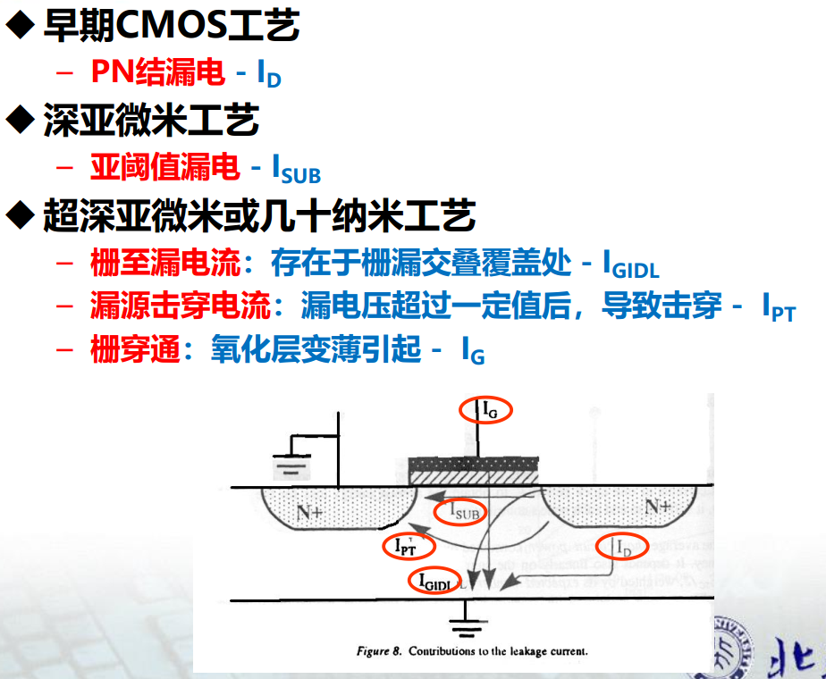
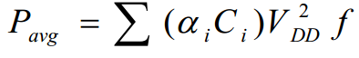
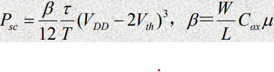
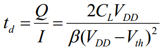
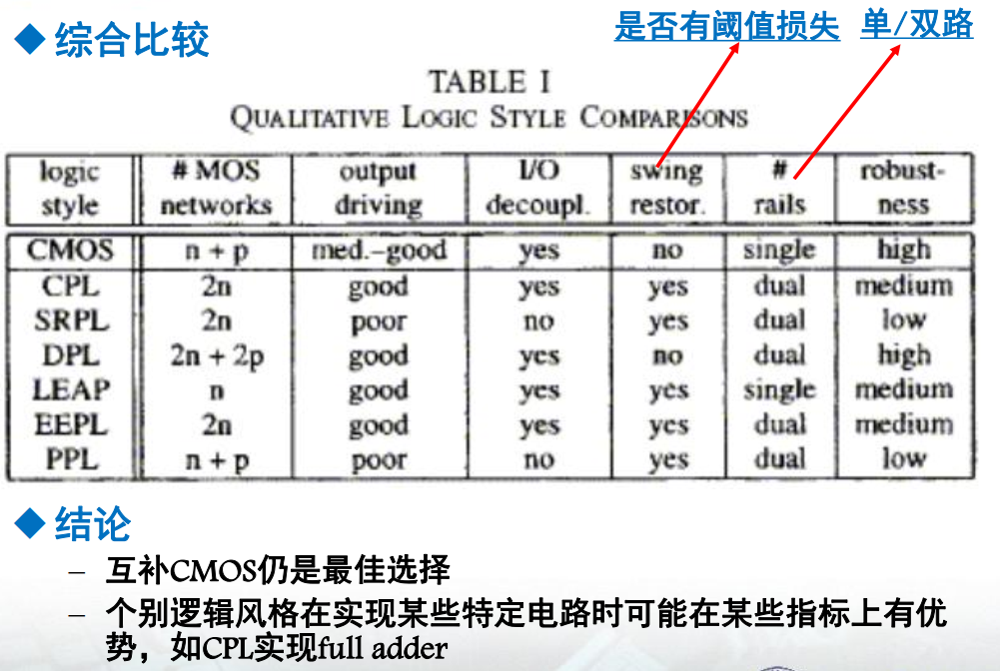
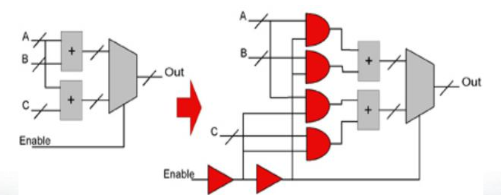

## Sources
* 度量
    - 跳变能耗、峰值功耗、平均功耗、功耗延迟积
* 动态功耗
    - 动态
        + 逻辑值转变对节点电容充电
            * 正比工作频率
            * 正比电压平方
            * 正比节点物理电容
            * 正比活性因子
    - 直通，短路功耗
        + 转换过程中的直通电流
            * 与器件尺寸beta相关
            * 与上升下降延迟tao有关
            * 与周期有关 T
            * 与阈值电压Vth有关
                - Vth越大，功耗越小
                - Vdd<2Vth时，没有功耗
            * 与负载电容相关
                - Cl增大，功耗变小
* 静态功耗
    - 泄漏
        + 寄生反相PN结漏电
            * 基本由工艺、器件数量、结面积和温度决定
        + 亚阈值漏电
            * 亚阈值泄漏功耗与工艺、器件数量、沟道宽度有关
            * Vth增大，泄漏电流下降，但是延迟增大
            * Vth减少，泄漏电流增大，但是延迟变小
            * 原则上在功耗允许的范围内，Vth取最小值，保证速度
    - 静态
        + 节点不调变时，Vdd到Gnd的直通电流
            * 标准CMOS和非标准都有出现，可以消除
            

动态功耗计算：

直通功耗计算：

延迟与Vth的关系：

## 工艺级LP

* 降低动态功耗
    - 特征尺寸
        + 选择先进工艺，以降低节点电容
    - 电源电压
        + 降低电源电压，以降低动态功耗
        + 多电源电压，特殊电路设计技术：并行和流水线
    - 封装
        + 降低压点上的动态功耗
* 降低泄漏功耗
    - 开发LP新工艺
    - 阈值电压
        + 采用多阈值技术，在不影响电路速度的情况下降低亚阈值泄漏功耗
            * 根据路径的不同，采用不同阈值的MOS管
                - 关键路径使用低阈值
                - 非关键使用搞阈值
            * 根据电路工作状态的不同，动态调整阈值
                - standby的电路实现，引申门控电源 Power Gating
                - 强化关断，通过VDD侧插入PMOS或VSS侧插入NMOS
        + 衬底电压控制电路的实现
            * SOI工艺通过调节背栅偏压改变阈值电压
            * 改变衬底电压时充/放电电流小，与体硅CMOS相比，SOI的衬底寄生电容小，充/放电电流比仅为体规CMOS的1/20

## 电路级LP

* 降低动态功耗
    - 准绝热电荷转移技术
        + 低功耗原理
            * 以增加延迟为代价提高能量的利用率
        + 实例
            * 三个全加器的实现方案
    - 减摆幅技术
        + 低功耗原理
            * 降低电压摆幅Vswing能降低动态功耗  P = Vswing * Vdd * f * C * alpha
        + 实例
            * 减摆幅低功耗Domino逻辑电路
            * FIFO memory cells电路片断
    - 电荷再利用技术
        + 低功耗原理
            * Charge Recycling Bus－CRB
        + 实例
            * 采用电荷再循环利用技术的超高速数据传输总线结构

## 逻辑级LP

* 动态逻辑
    - 含预充-求值两个阶段
    - 不适于LP设计，适于高速电路设计
    - 采用门控时钟技术可适当降低功耗
* 静态逻辑
    - CMOS；
    - 传输门逻辑：DPL； LEAP； CPL； EEPL； SRPL； PPL
* 综合来讲，CMOS最佳、最有前途
* 其他在实现某些特定电路时有一定优势
    - 如用CPL实现的乘法器

## RTL级LP

* 降低跳变活性因子alpha
    - 减少正常的、必要的跳变
        + 逻辑重构
            * 改变拓扑结构，以降低活性因子
            * 对于随机输入，链式结构比树型结构的活性因子低（不考虑glitch的影响时）
        + 调整输入信号顺序
            * 延迟
                - 应把晚到的信号安排在靠近输出端
            * LP
                - 应把活性高的输入信号安排在靠近输出端
                - 减少内部节点充放电功耗
            * 具体设计时，需要折衷延迟和LP
        + 门控时钟
            * 在功能模块空闲时屏蔽其时钟信号，减少跳变
            * 在H型时钟树中的不同层级插入时钟控制门
            * 门控使能信号注意glitch，一般用锁存器
        + 操作数隔离
            * EDA自动识别并关闭与Enable有关的电路模块
    - 减少冗余的、不必要的跳变（glitch）
        + 由于门延迟造成的transition state
            * 若一个简单门的所有输入都同时到达，不会有glitch
            * 复杂门，即使输入同时到达，仍会有glitch
        + 平衡路径（加法器、乘法器）
            * 忽略了glitch时，对于随机输入，链式结构比树型结构的跳变率低
            * 考虑glitch后，应选用树型结构
        + 插入锁存器，实现retiming（方向探测电路）
            * 插入flipflop，实现了Retiming，输入信号必须同时送入，阻断了glitch的传递
        + 优化RTL级网表以减少glitch（GCD电路）
            * 实现求最大公约数的算法
            * 用HDL作行为级描述，后综合产生RTL级网表
            * 输入XIN、YIN； 输出OUTPUT
        + 控制信号减少glitch
            * 利用数据之间的相关性，抑制控制信号中glitch的影响
            * 利用数据之间的相关性，重构多选器网络
            * 优选多选器网络，使控制信号的glitch较少
            * 用门控技术减少控制信号glitch的影响
        + 数据通路减少glitch
            * 选择性的插入上升/下降延迟以减少glitch
            * 针对数据glitch程度的不同，逻辑重构
            * 用门控技术减小数据中glitch的传导
        + 寄存器减少glitch
            * 用门控技术减少glitch引起的寄存器功耗

操作数隔离：

## 体系结构级LP

* 并行
    - 保持相同吞吐率下，每个支路速度可减半，VDD可以减小
    - 当VDD接近阈值电压时，延迟急剧增大，附加电路的功耗开销会抵消VDD下降带来的功耗降低
    - 面积开销较大
* 流水
    - 相同吞吐率，周期可以加倍，VDD可以减小
* 并行流水
* 预处理技术
    - 在第t个时钟周期内有选择性的预计算电路的输出逻辑值
    - 在第(t+1)个周期内或其后周期中，利用预计算的结果减少电路内部的跳变行为
    - 多周期预算
        + 第t周期预计算得到的输出值不仅用在第t+1周期，而且是用在第t+2或以后的周期中

## 算法级LP

* 数据传输时跳变率
    - 与数据相关性有关
    - 与位长有关
* 位长充分利用时
    - 原码LP
        + 正相关时补码仅比原码的跳变率稍高一点
        + 不相关和负相关时，补码比原码跳变率高很多
    - 有些系统，初始信号充分利用了位长，但后续的算术操作（如按比例缩小） 可能降低信号的动态范围，使位长得不到充分利用
* 位长未充分利用时
    - 原码更LP
        + 符号扩展对原码无影响，对补码影响甚大
* 采用原码传输数据时，应考虑数据转换电路带来的附加功耗
* 补码
    - 算法简单，易于实现算术运算
    - 电路结构简单，面积小，功耗小
* 如果被处理的数据是正相关，采用补码系统最佳
    - 数据传输时跳变率仅比原码稍高
    - 不需要数据转换电路
    - 数据处理时功耗低
* 原码数据表示系统
    - 可用于符号数据传输，如BUS中
    - 跳变率低
    - 特别是驱动片外总线（负载电容大）
* 补码数据表示系统
    - 可用于数据运算单元的设计，如ALU、Barrel Shifter等
        + 算法简单，电路结构简单，面积小，功耗小
    - 正相关数据的传输与处理系统
* 总线数据传输中的LP技术
    - Bus翻转译码技术
    - 地址总线WZE技术
* Gray码
* 有限状态机中状态编码的LP优化
* 算法变换
    - IIR的循环展开
    - 代数变换
    - 用面积换功耗
    - 对初始算法进行变换，在吞吐率不变的前提下，利用并行技术、流水线技术等，降低对电路速度的要求，最终通过降低电源电压实现低功耗
* 减操作
    - 视频数据流的压缩算法
    - 多项式和复数乘法
* 操作替换
    - 在完成相同功能的前提下，用LP的操作替换HP的操作；乘常数改成移位加
* 优化操作顺序以实现LP
* 硬件资源的共享对LP的影响
    - 同一信号处理流程中的多个操作，通过时间划分，共享同一个硬件资源
    - 时分（Time-Multiplexed）结构，对应的是全并行（Full-Parallel）结构
    

## 系统级LP

* 同步电路
    - 每个模块要消耗功耗
    - 时钟树要消耗功耗
        + 30％~50%的功耗与时钟相关
        + 时钟频率通常很高，如比采样频率高几个数量级，或为了实现硬件（总线、I/O压点、存储器）共享而提高频率
        + 可采用门控时钟技术缓解
    - 存在功耗浪费
        + 时钟频率需满足所有模块、所有输入模式时的正常工作；对低速情形，存在速度（功耗）浪费
* 异步电路
    - 工作模式是“事件驱动”
        + 只在需要时工作，无功耗浪费
    - 不需同步，节省了超过50％的时钟树功耗
    - 局部握手逻辑需要功耗
    
### 异步电路基础

通道类型
握手协议
数据编码
延迟模型
电路实现

## 模拟电路LP

有机会再继续写
