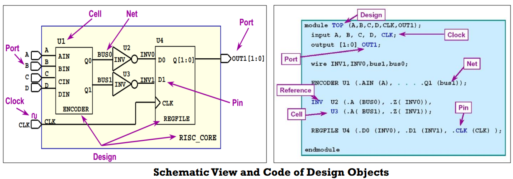

# TCL

```
~$ tclsh
```

## 置换

* $：变量置换，将变量置换为他的值
```
${}
set a "snow"
puts $a
```
* [ ]：命令置换
```
set a [expr 3 + 4]
puts $a
```

* \ ：反斜杠置换，转义

* {}：所有都是普通字符，tcl解释器不会特殊处理

* ""：解释器对里边的$和[ ]进行置换，字符串

* #：注释

## 数据结构

* 变量：set name value
* 数组：set name(key) value
    - array获取数组信息  array attribute(size, names) arrayname
* 列表：set name {ele1 ele2}
    - 列表操作命令：
        + concat：合并两个列表
        + lindex：选取列表中的某个元素
        + llength：列表长度
        + lappend：在列表末端追加元素
        + lsort：列表排序

## 运算

* 数学运算
    - + - * /
    - expr 运算表达式
* 逻辑运算
    - ≤ ≥ == !=


## 控制流

```
if{}{
} else if {}{
} else{
}
```
```
foreach i list{
puts $i
if {$i == 2}{
break(continue)
}
}
```
```
while {$i>0}
for {set i 3} {$i>0} {incr i -1}{
}
```

## 过程函数

```
proc fun_name {arg1 arg2} {
set sum [expr $a + $b]
return sum
}
```
```
fun_name arg1 arg2
global var # 可以在过程内部引用全局变量
```

## 正则匹配


* \w: digit、charactor、_
* \d: digit
* \*: 0次或者0次以上
* +: 1次或者多次
* ?: 0次或者一次
* ^: 开头
* $: 末尾
* \s: 空格
* .: 任意字符
```
regexp -nocase expr string var # 在字符串中使用正则表达式匹配
```
* ()：捕获字符串
```
regexp {^(\w+)\s\w+\s(\d+).\*} "snow is 30 years old" total name age
$total: snow is 30 years old
$name: Snow
$age 30
```

## 文本处理
```
open fd r/w
gets fd
puts fd string
close fd
```

# Synopsys TCL



* reference cell
    - {ENCODER INV REGFILE}
* instance name
    - {U1 U2 U3 U4}

```
get_ports *
get_cells 返回collection
get_nets 返回叫做collection的object
    sizeof_collection
    llength [get_object_name [get_nets *]]
get_pins
```

* object有属性
    - > get(set)\_attribute
    - > list_attribute -class *
    - 部分属性可以set_attribute
    - 常见的object有cell, net, port, pin
* CELL OBJECT
    - > ref_name
    - > get_attribute [get_cells –h U3] ref_name
* PIN OBJECT
    - > owner_net
    - > get_attribute [get_pins U2/A] owner_net
* PORT OBJECT
    - > diretion
    - > get_attribute [get_ports A] direction
* NET OBJECT
    - > full_name
    - > get_pins * -f "direction == out"
* get_* -filter : 过滤
* get_* -of 获得相连接的object
    - > port object <-> net object
    - > net object <-> port object / pin object
    - > pin object <-> net object
    - > cell object <-> pin object
