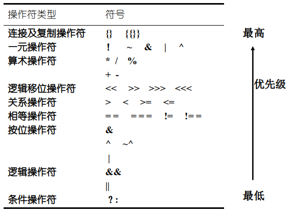
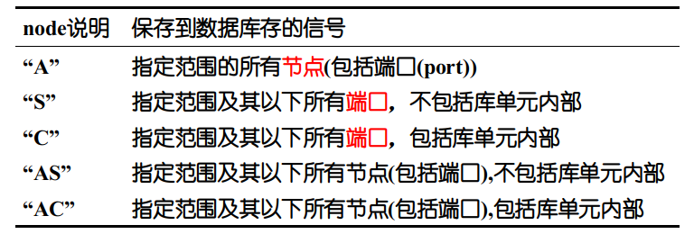
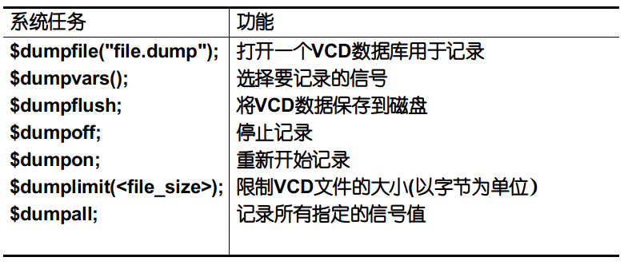
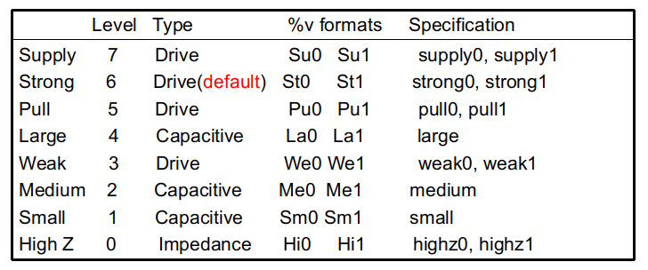

# Introduction

HDL, ASIC, Vendor, Bottom-up design flow, Top-down design flow, RTL level, Tcl

* Levels of Abstraction
    - 行为级 (设计文档/算法描述)
        + 用功能块之间的数据流对系统进行描述，在需要时在函数块之间进行调度赋值。
    - RTL/功能级 (verilog)
        + 用功能块内部或功能块之间的数据流和控制信号描述系统，基于一个已定义的时钟的周期来定义系统模型
    - 门级/结构级 (verilog)
        + 用基本单元(primitive)或低层元件(component)的连接来描述系统以得到更高的精确性，特别是时序方面。在综合时用特定工艺和低层元件将RTL描述映射到门级网表
    - 版图/物理级 (几何图形)
    - 行为综合（行为级转RTL级）→ 综合前仿真 → 逻辑综合（RTL级转门级） → 综合后仿真 → 版图


UDP: user defined primitive

DUT: device under test

**以下斜体无法综合或者综合无效**

# Language Elements

## Identifiers

Charactors, numbers, $, _

First: charactors or _

## Comments

1. //
2. /* \*/

## Value Set

1. literals
    1. integer: <size>'<base><value>
    2. real number: same with C, or <尾数><e或E><指数>
2. string
    1. %h, %o, %d, %b, %c, %s, %v, %m, %t, %0d
    2. hex, oct, dec, bin, ADCII, string, strength, module, time, dec without zero

## Data Type

1. net
    1. type
        1. wire, tri
        2. supply1(vcc), sypply0(gnd)
        3. wor, *trior*
        4. wand, *triand*
        5. *trireg*
        6. *tri1*, *tri0*
    2. declare: <net_type> [[un]signed] [range] [delay] <net_name>[, net_name];
2. register
    1. type
        1. reg
        2. integer
        3. real
        4. time
        5. realtime
    2. declare: <reg_type> [[un]signed] [range] <reg_name>[, reg_name];

## Parameter

1. usually define delay and bit width
2. declare: parameter <list>;
3. *defparam* Udff.n = 8


# Expressions

## Operands

1. const
2. parameter
3. net, reg
4. selected bits
5. user or system function


## Operations



\>>>: 算数

*===*: case等

<LHS\> = <condition\> ? <true_expression\> : <false_expression\>

bus <= { {2{ regb}}, {2{ regc}} };

# Gate level modelling

## Primitives

multi-input gate: and, or, xor, nand, nor, xnor [name] [#delay] [(strength)] (out, in1, in2)

multi-output gate: buf, not

tri-state gate: bufif1, bufif0, notif1, notif0 (out, data, enable)

pull-up gate: pullup, pulldown

mos switch: cmos, nmos, pmos, rcmos, rnmos, rpmos

bi-way switch: tran, tranif0,tranif1, rtran, rtranif0, rtranif1

## Gate Delay

gate_type [delay] [instance_name] (terminal_list);

delay = #(rise, fall, turn-off)

## Array of Instances

gate_type [delay] instance_name [MSB: LSB] (terminal_list);

## *UDP*

only one output, and one or more input. first must output


### Combinational Logic

```verilog
primitive mux_2by1 (
    output y;
    input  a,b,select
);

    table
        // a  b  select : y
             0  ?  1      : 0;
             1  ?  1      : 1;
             ?  0  0      : 0;
             ?  1  0      : 1;
             0  0  x      : 0;
    endtable
endprimitive
```

### Sequential Logic

1. 电平触发
    
    ```verilog
    primitive latch (
        output q;
        input  clk, d
    );
    
        reg q
        table
            // clk d  q(state)  q(next)
                 0   1  :?        :1;
                 0   0  :?        :0;
                 1   ?  :?        :-;
        endtable
    endprimitive
    ```
    
2. 边沿触发
    
    ```verilog
    initial q = 0;
    ```
    
3. 混合行为
       
    ```verilog
    primitive udp_sequential_initial(q, clk, d);
    output q;
    input clk, d; 
    reg q; 
    initial begin q = 0;
    end

    table
    // obtain output on rising edge of clk
    // clk         d        q       q+
       (01)         0   :   ?   :   0   ;
       (01)         1   :   ?   :   1   ;
       (0?)         1   :   1   :   1   ;
       (0?)         0   :   0   :   0   ;
    // ignore negative edge of clk
       (?0)         ?   :   ?   :   -   ; 
    // ignore d changes on steady clk
        ?      (??)      :   ?   :   -   ;
    endtable

    endprimitive
    ```

# Behavior Level Modeling (Data Flow)

## Continuous Assignment

<assign\> [#delay] [strength] <net_name\> = <expressions\>;

## Assignment Delay

assign  #(rise, fall, turn-off)  out = a & b

1. Rise Delay **0, x, z -> 1**
2. Fall Delay  **1, x, z -> 0**
3. Turn-Off Delay **0, 1, x -> z**

## Wire Delay (Inertial delay)

wire #5 write; 与上面的可以叠加，

wire #2 nc_data = data1 & data2；这是赋值延时，不是线延时


# Functional level modeling (RTL, Behavior)

## Procedural Block

1. type:
    1. *initial*
    2. always
2. 过程块中可以有时序控制
    1. 延迟控制
        1. 简单延时 *#delay*
    2. 事件控制
        1. 边沿敏感 @(<signal>)
        2. 电平敏感 *wait*(<expr>)
3. begin end & *fork join*
4. *disable block_name*;

## Procedural assignment

1. 时序控制赋值
    1. 语句内部延迟控制
        
        ```verilog
        frc = #5 1'b1;
        //等价于 语句间延迟控制
        begin
            temp = 1'b1;
            #5 frc = temp;
        end
        ```
        
    2. 语句内事件控制
        
        ```verilog
        q = @(posedge clk) d;
        //等价于 语句间事件控制
        begin
            temp = d;
            @(posedge clk)
                q = temp;
        end
        ```
        
    3. 重复事件控制
        
        ```verilog
        repeat (expr) @(event_expr)
        //eg.
        result = repeat (2) @(negedge clk) data;
        //等价于
        begin
            temp = data;
            @(negedge clk);
            @(negedge clk);
            result = temp;
        end
        ```
        
2. 阻塞过程赋值
3. 非阻塞过程赋值

## Conditional Statement

1. if (<expr\>) begin () end else begin () end
2. case ignore ?
3. casez, ignore ?,z
4. casex, ignore ?,z,x 

* 单if，前面的优先级高，电路靠后
* 多if，后边的优先级高，电路靠后

 

| | full case| parallel case|
|---|---|---|
| 作用 | 指示综合器：case里没提到的状态不用管 | 指示综合器：此case无优先级的概念|
|使用选项可能后果| 如果case不完全，那么仿真器会产生latch，而使用这个选项后综合器综合出来的电路不会有latch。 导致仿真和综合结果不一致。 | 如果此case有优先级（导致优先级的原因：使用Verilog编程时使用case可能会有多重匹配或者使用casez、casex都可以导致多重匹配。多重匹配会自动匹配第一个，可能会导致优先级编码），那么在仿真的时候会有优先级，而使用这个选项后综合出来的电路却没有优先级。导致仿真和综合结果不一致。
| 问题的实质| 使用不完全的case一定会导致latch。当使用了这一个选项后，导致综合器不产生latch，而仿真器却产生latch（的行为），从而产生问题。| 如果verilog存在多重匹配时，一定会有优先级现象。当使用了这一个选项后，导致综合器不产生优先级现象，而仿真器却产生优先级（的行为），从而产生问题。
|被误用的最初目的|防止产生因为case不完全导致的latch|防止因为各匹配项不互斥产生优先级现象|
|解决目的的替代|1、对reg赋初值2、使case的分支覆盖所有，如果不可能或者求简便，加入default分支。（本质的解决方法）|1、如果想使用优先级，那么使用if-else不想使用优先级，那么使用case。2、不使用casez和casex。3、让所有匹配项互斥。（本质的解决方法）|

## Looping Statement

1. *repeat* (次数表达式） <语句>
2. *while* (条件表达式） <语句>
3. *forever* <语句>
4. for (赋初值；条件表达式；计算） <语句>

## *Procedural Continuous Assignment*

1. assign deassign
2. force release


# Structure level modeling

## Module Instances

位置映射时，端口次序与模块的说明相同

comp name ( Q, R, J, K );  //名字必须有

名称映射时，端口次序与位置无关

comp name ( .o1 ( Q ),  .o2 ( R ), .i1 ( J ), .i2 ( K ) );  //名字必须有

```verilog
bufif0  u[2:0]  (out, in, en);
comp m1 [0: 3] (y2, a2, b2);
comp m1 [4: 7] (y3, a3, b3); //  illegal
```

## Generate

1. generate-loop
2. generate-case
3. generate-conditional
4. genvar

```verilog
generate
    genvar i;
        for (i = 0; i <= 7;  i = i + 1)      begin: u  //命名必须要
        adder8 add (sum[i], co[i+1],  a1[i], a2[i], ci[i]);  
        end 
endgenerate

parameter WIDTH =1;
generate
    case(WIDTH)
        1: add1bit x1(co, sum, a1, a2, ci);
        2: add2bit x1(co, sum, a1, a2, ci);
        default: add_c # (WIDTH) x1(co, sum, a1, a2, ci);
    endcase
endgenerate

generate
        genvar i;
        for (i = 0; i <= 7;  i = i + 1)      begin: u
                if(i == 0)
        adder8 add (sum[i], co[i+1],  a1[i], a2[i], ci[i]);  
                else
        adder8 add (sum[i], co[i+1],  a1[i], a2[i], ci[i]);  
        end
endgenerate
```

## Configuration

与 UDP, module同级别


# Task


1. automatic若不指定就静态分配局部变量，每次调用task都使用同一个，反之则每次动态分配
2. 直到任务退出时，赋给输出参变量的值才传递给调用的参变量。
3. 带有时序控制的task不可综合，不带有时序控制的task跟函数一样
4. task只能在过程块中调用，输出只能是寄存器
5. task能够引用模块内的全局变量，也可以修改


```verilog
task [automatic] task_id;
        [declarations including in,out,inout];
        procedural_statement;
endtask
```
    
```verilog
module  task_calling (adc_a, adc_b, adc_a_conv, adc_b_conv);
input [7:0] adc_a, adc_b;
output [7:0] adc_a_conv, adc_b_conv;

reg [7:0] adc_a_conv, adc_b_conv;

task convert;
input [7:0] adc_in;
output [7:0] out;
begin
    out = (9/5) *( adc_in + 32)
end
endtask

always @ (adc_a)
begin
  convert (adc_a, adc_a_conv);
end

always @ (adc_b)
begin
  convert (adc_b, adc_b_conv);
end

endmodule
```

# Function

1. automatic函数可以递归，不可包含时序控制（调用可用时序控制），组合逻辑，不生成latch
2. 函数不可调用任务，但是任务可以调用函数，函数只能在模块内部调用
3. 返回多个值通常可以这么做：{o1, o2, o3, o4} = f_ or_ and (a, b, c, d, e);
4. function可以在过程块调用，也可以持续赋值
5. 函数返回值可以声明为其它register类型：integer, real, 或time。不可包含out,inout

```verilog
function [automatic] [signed] [range_or_type] function_id;
        input_declarations;
        other_declarations;
        procedural_statement;
endfunction
```

```verilog
module  function_calling(a, b, c, d, e, f);

input a, b, c, d, e ;
output f;
wire f;

function  myfunction;
input a, b, c, d;
begin
    myfunction = ((a+b) + (c-d));
end
endfunction

assign f =  (myfunction (a,b,c,d)) ? e :0;

endmodule
```
    
# System Task and Functions

## Display task

1. display and write
    
    $display, displayb, displayh, displayo: write to stdout with \n
    
    $write, writeb, writeh, writeo: write to stdout without \n
    
2. strobe
    
    $strobe, strobeb, strobeh, strobeo: 显示当前时间片结束后状态信号值
    
3. monitor
    
    $monitor, $monitorb, $monitorh, $monitoro: 只要变化，就在时间片结束后打印  (,,=" ") 
    

## File I/O task

1. file open and close
    
    integer fp = $fopen(file, mode) 
    
    $fclose(fp)
    
2. file output
    
    $fdisplay[b,h,o] fwrite[b,h,o] fmonitor[b,h,o]
    
    $fflush
    
3. file in
    
    $readmemb[h]("<数据文件名>",<存储器名>,<起始地址>,<终止地址>); 无论如何都是从低地址开始读数据进去
    
    $fread, fgetc, fgets, ungetc, frewind, fseek, ftell, fscanf, ferror
    
4. $sdf_annotate

## Timescale task

1. $printtimescale
2. $timeformat(units_number={0~-15}, precision, suffix, numeric_field_width)
3. $time(64), stime(32), realtime

## Simulation control task

1. $finish, $stop

## PLA modeling task

## stochastic modeling task

## Conversion function

1. $rtoi  real2integer  $itor  integer2real
2. $realtobits  real2IEEE745(float or double) $bitstoreal 
3. $signed $unsigned

## Probabilistic distribution function

1. $random[(seed)]
2. $dist_uniform(seed, start, end)
3. $dist_normal(seed, mean, std_deviation)
4. $dist_[exponential, poisson](seed, mean)
5. $dist_[chi_squra, t](seed, degree_of_freedom)
6. $dist_erland(seed, k_stage, mean)

## String formatting

1. $swrite[o,b,h]: $swrite(string, "At time %t", $time, ", fifo_empty is %d", fifo_empty);
2. $sformat: $sformat(string, "At time %t", fifo_empty is %d", $time, fifo_empty);
3. $sscanf: $sscanf(string, "%s %d %d"), name, lower, upper);

## Command Line argument

## SHM

1. $shm_open(“waves.shm”);
2. $shm_probe(scope0, node0, scope1, node1, ...);
    1. 每个node都是基于前面scope的说明(层次化的）
    2. scope参数缺省值为当前范围(scope)。node参数缺省值为指定范围的所有输入、输出及输入输出。
    3. 例子：
        1. $shm_probe( ); 观测当前范围(scope)所有端口
        2. $shm_probe(“A”); 观测当前范围所有节点
        3. $shm_probe(alu, adder); 观测实例alu和adder的所有端口
        4. $shm_probe(“S”, top.alu, “AC”); 观测：(1): 当前范围及其以下所有端口，除库单元 (2)：top.alu模块及其以下所有节点，包括库单元
        
3. $shm_close;
4. $shm_save;
## VCD

1. example
    
    ```verilog
    initial begin
            $dumpfile (“verilog.dump”);
            $dumpvars (0, testfixture);
            // Dump所有层次的信号
            $dumpvars; 
            // Dump top模块中的所有信号
            $dumpvars (1, top); 
            // Dump实例top. u1及其下一层的信号
            $dumpvars (2, top.u1); 
            // Dump top.u2及其以下所有信号，以及信号top.u1.u13.q。
            $dumpvars (0, top.u2, top.u1.u13.q);
            // Dump top.u1和top.u2及其下两层中的所有信号。
            $dumpvars (3, top.u2, top.u1); 
    end
    ```
    


## Timing Checks

1. $setup(data_event, clk_event, limit, notifier);
2. $hold( clk_event, data_event, limit, notifier);
3. $setuphold( clk_event, data_event, s_limit, h_limit, notifier);
4. $recovery(reference_event, data_event, limit, notifier);
5. $removal( ctrl_event1, ctrl_event2, limit, notifier);
6. $recrem( reference_event, data_event, rec_limit, rem_limit, notifier);
7. $width( ctrl_event, limit, threshold, notifier);
8. $period( ctrl_event, limit, notifier);
9. $skew( ctrl_event1, ctrl_event2, limit, notifier);

# Compiler Directives

1. \`resetall: 所有编译指令重新设置为缺省值，define的除外，需要用undef
2. \`define, \`undef, \`ifdef, \`ifndef, \`else, \`elseif, \`endif
    1. 在命令行定义文本宏： +define+命令行参数
    2. 语法：+define+MACRO_NAME=“MACRO_TEXT”
3. \`default_nettype
4. \`include: 直接文件内容替换这一行
    1. 命令行 +incdir+directory1+directory2+...directoryN 指定搜索路径
    2. 仿真器首先查找当前目录，若没有找到再沿指定路径顺序查找。
5. \`timescale <time_unit\> / <time_precision\>
    
    time_unit: 延时或时间的测量单位
    
    time_precision: 延时值超出精度要先舍入后使用
    
6. \`celldefine, \`endcelldefine
    1. 库单元包括功能描述和时序描述
        
        ```verilog
        `celldefine
        `timescale 1ns / 100ps
        module full_adder( cout, sum, a_in, b_in, c_in);
             input a_in, b_in, c_in;
             output cout, sum;
        // 功能描述
             . . .
        // 时序描述
             ...
        endmodule
        `endcelldefine
        ```
        
    2. 在Cadence Verilog(前身为Verilog-XL)使用
        1. -v file_name
        2. -y directory_name  +libext+.v
7. \`usblib: 定义设计中使用的库单元（包括UDP）的位置，会覆盖任何命令行选项中库的设置
    
    \`uselib library_reference library_reference:
    
    1. file = file_name_path
    2. dir = directory_name_path libext = .file_extension
8. 仿真时使用-u选项进入大小写不敏感模式。仿真器将所有标识符转换为大写形式，而关键字仍保持为小写。可以用-d选项输出-u选项产生的大小写不敏感的描述。

# Logic Strength Model




1. 用户可以给基本单元实例或net定义强度:
    1. <基本单元名> <强度> <延时> <实例名> (<端口>);
        1. <强度> = (strength_for_1, strength_for_0)
        2. nand (strong1, pull0) #( 2: 3: 4) n1 (o, a, b);
2. 用户可以用%v格式符显示net的强度值:
    1. monitor ($time,, " output = %v", f);
3. 电容强度(large, medium, small)只能用于net类型trireg和基本单元tran:
    1. trireg (small) tl;
4. 在Verilog中，级别高的强度覆盖级别低的强度

# Test Bench

1. 简单的test bench向要验证的设计提供向量，人工验证输出。复杂的test bench是自检测的，其结果自动验证。
2. 产生激励：
    1. 从一个initial块中施加线激励，不规则激励适合用在initial块产生。
    2. 从一个循环或always块施加激励，有效地产生规则激励
    3. 从一个向量或整数数组施加激励
        1. 使用矢量文件输入/输出的优点：激励修改简单，设计反复验证时直接使用工具比较矢量文件。
        2. 用寄存器组（存储器）并用$readmem系统任务从一个文件以读取向量。
    4. 记录一个仿真过程，然后在另一个仿真中回放施加激励
3. 使用文本或文件输出类的系统任务报告错误及警告
    
    ```verilog
    always @( posedge par_err)
            display (" error-bus parity errors detected");
    ```
    
4. 一个更为复杂的test bench可以：
    1. 不但能报告错误，而能进行一些动作，如取消一个激励块并跳转到下一个激励。
    2. 在内部保持错误跟踪，并在每次测试结束时产生一个错误报告。
5. 时钟建立
    1. 门级
    2. 行为级，行为级代码可以很容易地产生一个启动时间不规则的时钟波形，并且可以在时刻零初始化时钟。
6. 使用task
    
    ```verilog
    module bus_ctrl_tb;
        reg [7: 0] data;
        reg data_valid, data_rd;
        cpu u1 (data_valid, data,data_rd);
        initial begin
            cpu_driver (8'b0000_0000);
            cpu_driver (8'b1010_1010);
            cpu_driver (8'b0101_0101);
        end
    
        task cpu_driver;
        input [7:0] data_in;
            begin
                #30 data_valid = 1;
                    wait (data_rd == 1);
                #20 data = data_in;
                    wait (data_rd == 0);
                #20 data = 8'hzz;
                #30 data_valid = 0;
            end
        endtask
    endmodule
    ```
    
7. fork…join块中不但能够赋值，还可以并行执行循环、条件语句、任务或函数调用。

# Delay Model

## Term

1. module path: input/inout → output/inout
2. path delay
3. timing check
4. timing driven design: 从前端到后端的整个设计流程中，用时序信息连接不同的设计阶段
5. inertial delay: 门模型
6. transport delay: 线模型

## Delay Modeling Types

1. Lumped delay，块延时：延时全部集中在最后一个门
    
    ```verilog
    `timescale 1ns/ 1ns
    module noror( Out, A, B, C);
         output Out;
         input A, B, C;
              nor n1 (net1, A, B);
              or #3 o1 (Out, C, net1);
    endmodule
    
    // A -> Out is 3 ns
    // B -> Out is 3 ns
    // C -> Out is 3 ns
    ```
    
2. Distributed Delay，分布延时：延时分布在每一个门上
    
    ```verilog
    `timescale 1ns/ 1ns
    module noror( Out, A, B, C);
         output Out;
         input A, B, C;
              nor #2 n1 (net1, A, B);
              or  #1 o1 (Out, C, net1);
    endmodule
    
    // A -> Out is 3 ns
    // B -> Out is 3 ns
    // C -> Out is 1 ns
    ```
    
3. Pin-to-pin Delay，路径延时：用专用块说明每一个路径pin-to-pin延时
    
    ```verilog
    module noror( O, A, B, C);
         output O;
         input A, B, C;
              nor n1 (net1, A, B);
              or o1 (O, C, net1);
         specify
              (A => O) = 2;
              (B => O) = 3;
              (C => O) = 1;
         endspecify
    endmodule
    
    // A -> Out is 2 ns
    // B -> Out is 3 ns
    // C -> Out is 1 ns
    ```
    

## Specify

1. 精确控制：每个还可以有(min: type: max)
    1. 3: rise, fall, turn-off
    2. 6: 0→1, 1→0, 0→Z, Z→1, 1→Z, Z→0
    3. 12: 0→1, 1→0, 0→Z, Z→1, 1→Z, Z→0, 0→X, X→1, 1→X, X→0, X→Z, Z→X
        1. 如果说明了上升、下降和关断延时，则1→X的延时使用上升和关断延时的最小值。X→0的延时为下降延时；X→Z的延时为关断延时。
        2. 如果只说明了上升和下降延时，则1→X和X→0使用下降延时，X→Z使用上升和下降延时的最小延时
        3. 如果只说明了一个延时，则所有跳变使用这个延时。
        4. 如果说明了六个延时，则1→X使用1→X和1→Z中最小延时；X→0使用1→0和X→0的最大延时；X→Z使用1→Z和0→Z中的最大延时。
2. 路径说明：
    1. 全连接
        
        ```verilog
        (a, b *> q, qb) = 15;
        // 等价于：
        (a => q) = 15;
        (b => q) = 15;
        (a => qb) = 15;
        (b => qb) = 15;
        ```
        
    2. 并行连接
        
        ```verilog
        (a, b => q, qb) = 15;
        // 等价于：
        (a => q) = 15;
        (b => qb) = 15;
        ```
        
3. SPDP：状态依赖路径延时
    
    ```verilog
    module XOR2 (x, a, b);
         input a, b;
         output x;
              xor (x, a, b);
         specify
              if (a) (b=> x) = (5: 6: 7);   // 不使用else，所有状态都应该说明
              if (!a) (b=> x) = (5: 7: 8);  // SDPD说明语法：
              if (b) (a=> x) = (4: 5: 7);   // if <condition> 路径延时说明;
              if (!b) (a=> x) = (5: 7: 9);  // 1,X,Z则成立，多个成立用最小值
         endspecify
    endmodule
    ```
    
4. specparam
    1. 关键字为specparam声明，必须在specify块内声明，只能在specify块内使用，不能使用defparam重载
        
        ```verilog
        module noror (O, A, B, C);
             output O;
             input A, B, C;
                  nor n1 (net1, A, B);
                  or o1 (O, C, net1);
             specify
                  specparam ao = 2, bo = 3, co = 1;
                  (A => O) = ao;
                  (B => O) = bo;
                  (C => O) = co;
             endspecify
        endmodule
        ```
        
    2. 路径脉冲控制：使用specparam参数PATHPULSE$控制模块路径对脉冲的处理。
        1. PATHPULSE$ = (< reject_value>, < error_value>?)
        2. PATHPULSE$< path_source >$< path_destination> = (< reject_value>, < error_value>?)
        
        ```verilog
        specify
             (en => q) = 12;
             (data => q) = 10;
             (clr, pre *> q) = 4;
        specparam
             PATHPULSE$ = 3,  // 全局脉冲控制，等价于 PATHPULSE$ = (3, 3);
             PATHPULSE$en$q = ( 2, 9 ) , // 脉冲宽度小于reject_value的信号将被滤掉
               PATHPULSE$clr$q = 1 ; // 小于error_value的值会使输出产生不定状态
        endspecify
        ```
        
    3. 条件时序检查
        
        ```verilog
        module dff (data, clk, rst, q, qb);
             input data, clk, rst;
             output q, qb;
             // instantiate the primitives for the basic flip-flop
             udp_dff( q_int, data, clk, rst);
             buf b1( q, q_int);
             not n1( qb, q_int);
             // create timing checks
             specify
                  $setup( data, posedge clk &&& rst, 12, notifier); 
                            // rst为高进行setup, hold
                  $hold( posedge clk, data &&& rst, 5);
                  $width( posedge clk, 25);
             endspecify
        endmodule
        
        module test;
             reg ck, d, rst;
             dff_notifier (q, ck, d, rst, notifier);
             // 产生激励并检查响应
             always @( notifier) begin
                  rst = 1; #10 rst = 0;
              end
        endmodule
        ```
        
        1. 条件表达式中条件只能是一个标量信号，这个信号可以：
            1. 用位反操作符（~）取反。
            2. 用等于操作符（= =或！=）与一个标量常量进行比较
            3. 用相同操作符(===或！==）与一个标量常量进行比较
        2. 若条件表达式计算值为1、x或z则认为条件成立。
        3. 由于条件时序检查的条件表达式中只能有一个信号，因此需要多个信号产生条件时必须使用哑逻辑使将它们表达为一个内部信号表示才能用于条件时序检查。
    4. 选择延时模型
        1. 用下列命令行选项选择延时模型
            1. +mindelays
            2. +typdelays
            3. +maxdelays
        2. 用下列命令行选项或编译指令指定单位延时、零延时、分布延时或路径延时
            1. +delay_mode_unit \`delay_mode_unit
                1. 忽略所有specify块，门延时为单位延时，时间精度precision
                2. 不影响过程中的时序控制延时
            2. +delay_mode_zero \`delay_mode_zero
                1. 忽略所有specify块，门延时为零延时
                2. 不影响过程中的时序控制延时
            3. +delay_mode_path \`delay_mode_path
                1. 路径延时忽略门延时，只保留spcify块中延时
            4. +delay_mode_distributed \`delay_mode_distributed
                1. 分布延时忽略所有specify块，只保留门延时

# Logic Synthesis

## Flow

1. 综合是约束驱动的，能够转换到任何工艺上
2. HDL source → GTECH Generic Boolean → Target Technology
3. RTL代码 → 环境约束 → 设计约束 → 使用标准单元库进行编译设计 → 分析 → 输出verilog网表
4. 门级仿真：产生门级网表(verilog .vg)和SDF，然后修改testfixture，SDF反标注，然后仿真
5. 综合对象：
    1. design, 
    2. port, 
    3. clock, 
    4. cell(实例 U1), 
    5. net, 
    6. reference(cell指向的原始设计 ADDER) or design,
    7. pin

## STA

1. 时序路径
    1. start：inPort and clockPinFF
    2. end: outPort and inPinFF
2. 时序路径组
    1. clocks
    2. other
3. timing arc 时序弧


## IP library

1. SYNOPSYS DesignWare, Cadence ChipWare
    1. adder, substractor, comparator, multiplier, divider, sin, cos, tan, sqrt, FIR, IIR
2. synthetic_library = {“dw_foundation.sldb”}
3. search_path
4. 使用方法：
    1. 推断：根据约束选择DesignWare原件
        
        ```bash
        module DW01_add_oper_cla(in1,in2,sum);
            parameter wordlength = 8;
            input [wordlength-1:0] in1,in2;
            output [wordlength-1:0] sum;
            reg [wordlength-1:0] sum;
                always @(in1 or in2) begin :b1
                /* synopsys resource r0:
                    map_to_module = "DW01_add", 
                    implementation = "cla ",   
                    ops = "a1"; */  // label name
                sum = in1 + in2; //synopsys label a1
            end
        endmodule
        ```
        
    2. 实例化：显式
        
        ```bash
        DW01_add #(wordlength) U1(in1,in2,carry_in,sum,carry_out);
        set_implementation implementation_name instance_name
        ```
        

## Constraint

### Environment Constraint

用户定义的真实环境 描述电路的工作条件

1. 工作条件模型scale元件延时。工艺、温度、电压
2. 输入驱动强度-驱动电阻，Ac 电阻应该越小越好，
    1. T_delay = T_0 + Ac * C_load
    2. set_drive value object
3. 输出负载
    1. set_load value object
4. 输出扇出负载
    1. set_fanout_load object
5. Wireload Model
    1. top
    2. enclosed
    3. segmented

### Design Constraint

1. 设计规则约束：与工艺相关的限制，不可以违反
    1. 最大的传输时间
        1. Transition Time = Drive (resistance) * Max_Cap = Drive (resistance) * Load ( sigmaCpins +Cwireload )
        2. set_max_transition 5 all_inputs( ) set_max_transition 3 all_outputs( )
    2. 最大的扇出
        1. $\text{Maximum fanout\_load} = \Sigma \text{fanout\_loads}$ 
        2. set_max_fanout value object
    3. 最大电容
        1. Maximum capacitance = Load(sigmaCpins +C wireload )
        2. set_max_capacitance capacitance_value object
2. 优化约束：设计目标及要求，由自己设计
    1. 最大延时
        1. 输入输出延时的最大延时
        2. 满足setup，hold时间和时钟周期的关系
    2. 最小延时
        1. 同上
    3. 最大面积
    4. 最大功耗
    5. 所有时序路径都需要约束
        1. 组合电路在时序上只要设置最大最小延时

### Other

1. False Path: 不传播信号的通路
    1. set_false_path -from {A} -through {C} -to {OUT}
2. multicycle: 多周期通路
3. 设计检查
4. 多设计实例：
    1. dont_touch
    2. ungroup
    3. uniquify
5. slack

## Design Optimization

### Architectural Level Optimization

1. 数据通路优化
2. 设计结构选择，例如adder的实现
3. 共享子表达式
4. 资源共享
5. 计算重新排序，计算时间长的离输出更近

### Logic Level optimization (technology independent optimization)

1. 对电路的布尔表达式进行优化
2. 对整个设计面积/速度特性有全局的影响
3. 策略：（如果都选则先flatten在structure）
    1. flatten
        1. 消除所有中间变量
        2. 结果为两级积和式
        3. 缺省关闭，适合非结构化电路
    2. structure
        1. 提取共因式作为中间变量
        2. 时序驱动structuring：在structuring过程中考虑时序约束并减小设计面积。
        3. 布尔优化 (缺省为关)产生最可能小的设计。
        4. 适合于结构化电路

### Gate Level Optimazation (mapping)

1. 使用逻辑优化产生的结构
2. 从工艺库中选择元件，以满足电路指定的时间、设计规则和面积目标
3. 局部影响设计的面积/速度特性
4. 策略：
    1. 组合逻辑映射
        1. 映射重新安排元件，组合和重组和逻辑到不同的元件中
        2. 采用不同的算法如cloning, resizing or buffering
        3. 试图满足设计规则、约束以及时间/面积目标
    2. 时序逻辑映射
        1. 对到工艺库中元件的映射进行优化
        2. 分析时序单元周围的组织逻辑，看是否能吸收HDL中的逻辑属性
        3. 利用可选的用户首选的时序单元的嵌入式描述
5. 映射强度：
    1. low, meduim(default), high
