# AMBA片上总线传输原理

- 数据传输靠主设备（Master）发起
- 主设备（Master）靠地址线表明需要访问的从设备（Slave）
- 互联总线（Bus-Arbiter/Bus-Matrix/Bus-NOC）靠地址线路由访问（command/data），并最终选中目标从设备（Slave）
- Master/Bus-Bus/Slave之间要有流量控制，防止数据丢失。

路由原理：

- 单个slave内部的寄存器路由：利用地址线的低位
- 一条总线上的多个slave路由：利用地址线的高位

## APB（Advanced Peripheral Bus）总线

### 概述

APB(Advance Peripheral Bus)是AMBA总线的一部分，有以下几个特点：

- APB主要用在低速且低功率消耗的IP接口上，协议简单，时钟clock也比较低，通常用作AHB/AXI总线的扩展。
- 不需要仲裁器
- 必须在时钟上升沿触发
- 主要构成是：
  - APB Bridge：可以锁存所有的地址、数据和控制信号，并译码产生APB Slave的SEL信号。
  - APB Slave，即总线上的全部Slave设备。

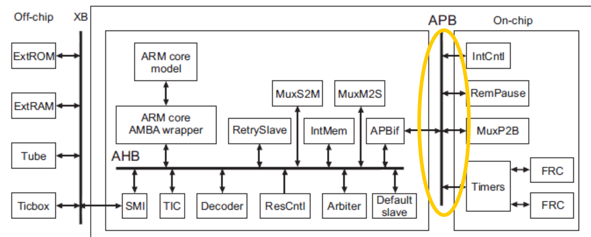

### 版本定义

APB总线协议从1998年第一版至今共有4个版本：

- APB2：1998年，定义最基本的信号interface, 读写transfer, APB bridge, APB slave。系统通常是通过软件的方式去轮询Peripheral的status register（两个clock cycle）来确定Slave当前是否是可读写状态。

- APB3：2003/2004年发布，相较于APB2多了PREADY和PSLVERR两个信号。Slave通过PREADY信号直接来告诉master现在Slave已经READY了，可以接受读写操作，如果此时不READY，那么master就要wait到它Ready，这样就不需要软件时刻去轮询status register了。对于PSLVERR而言，加入了Slave反馈给master error response功能。

- APB4 ：2010年发布，增加了PPROT和PSTRB信号。随着架构的不断发展以及对系统安全性的重视，在新的系统中通常会有security的要求，那么APB4也需要演进，PPROT信号主要就是为了表示当前的这个访问/transaction是secure的还是non-secure的，从而和整个系统的security保持一致性。PSTRB的信号的加入，能够使APB对某个byte进行读写操作。因为即使传输的是32位的信号，但是可能只有部分byte是有效的，用PSTRB的每一个bit来代表每个32位中的4个byte哪些是有效的。本文后续的介绍是围绕这个版本展开的。

- APB5：2021年发布，有点复杂，懒得看。再说吧。

具体版本更新图：

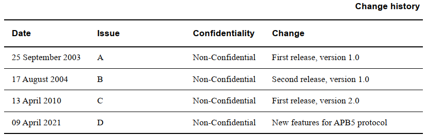

### 信号定义

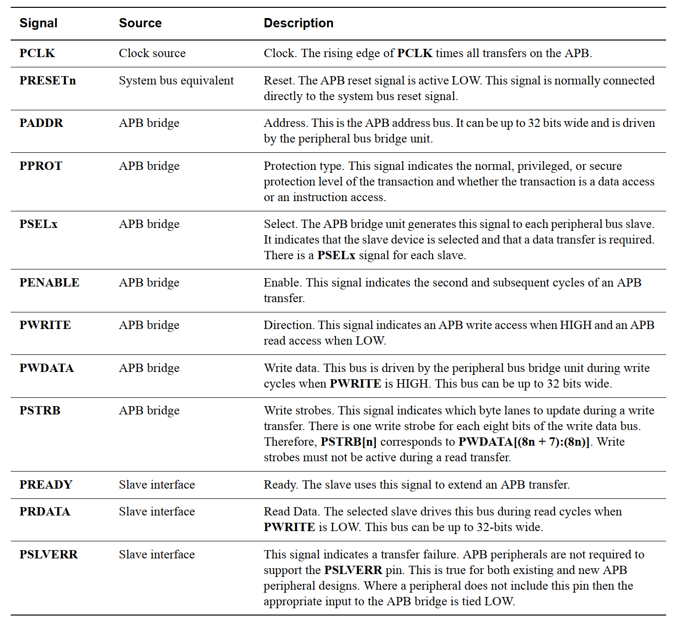

### APB Bridge/Slave

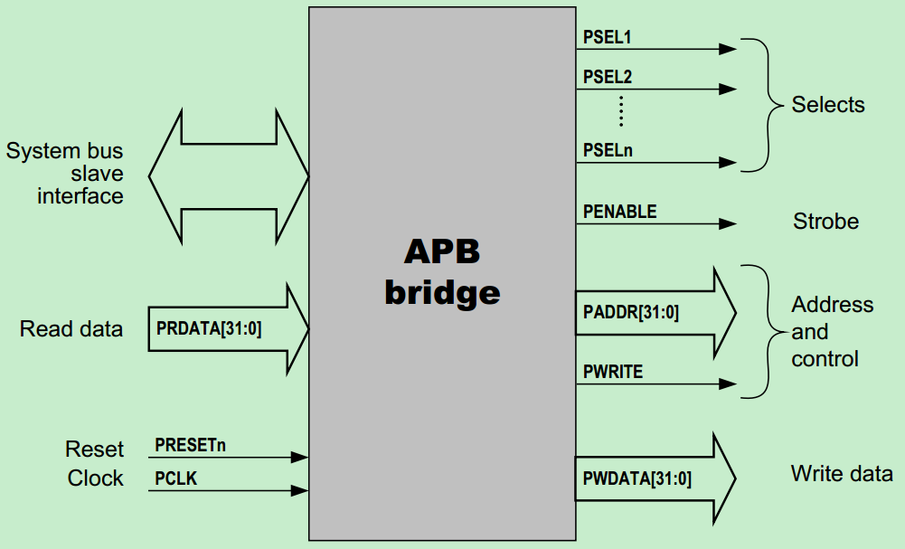

### 状态机

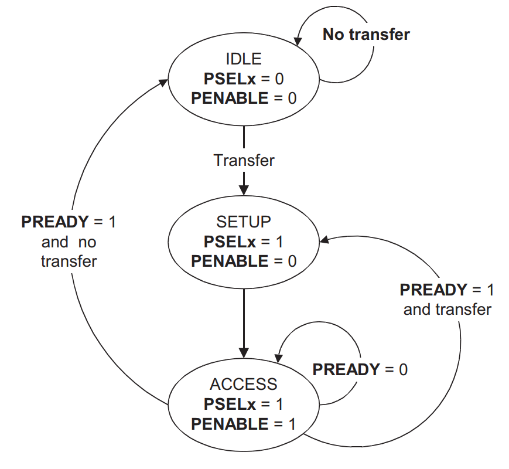

状态机：

- IDLE：  APB的默认状态
- SETUP：当有数据传输申请时，首先进入SETUP阶段，并且此时PSEL会被置为有效。SETUP只会保持一个阶段，然后在下一个Clk posedge就会进入ACCESS阶段。
- ACCESS：在ACCESS阶段，PENABLE会被置为有效。在SETUP→ACCESS的clk posedge时，address, write, select, and write data signals都会保持有效。 并且此时：
  - 如果PREDY无效，APB总线会一直保持在ACCESS阶段；
  - 如果PREADY有效了，则会在该cycle内完成传输，并在下一个阶段：
    - 如果没有数据继续传输，跳转回IDLE；
    - 如果有数据传输，跳转回SETUP。
- **总结：读/写一次，最少需要两个cycle，即SETUP和ACCESS！**

### 写操作

#### 不带等待的写操作

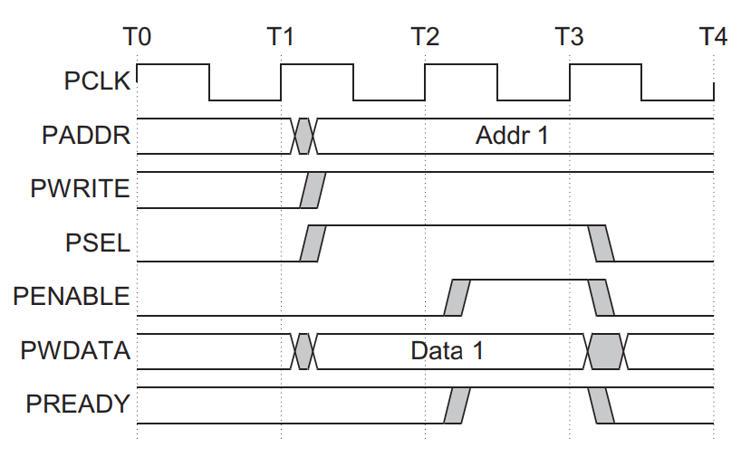

- 在 T0时，有限状态机进入预设的 IDLE 状态；
- 在 T1 时，数据地址、读写控制信号和写入的数据会在频率正沿触发时，开始作写的数据传递准备，这个周期也就是刚才所提及SETUP状态。译码电路在此状态会根据数据地址去译码出所要写入APB Slave，此时所对应到 S 的 PSEL 信号将由 0 变 1；
- 在 T2 时，有限状态机会进入 ENABLE 状态，PENABLE 信号在此状态会被设成 1。T2这个阶段是传输阶段，PENABLE==1代表了传输。
- 在 T3 频率正沿触发时，PENABLE 信号将由 1 变 0，而 PSEL 信号在若没有其它数据的写入动作时，也将由 1 变 0。为了减少功率的消耗，APB 的数据地址和读写控制信号在下一笔数据传递前，将不会作任何改变。

#### 带等待的写操作

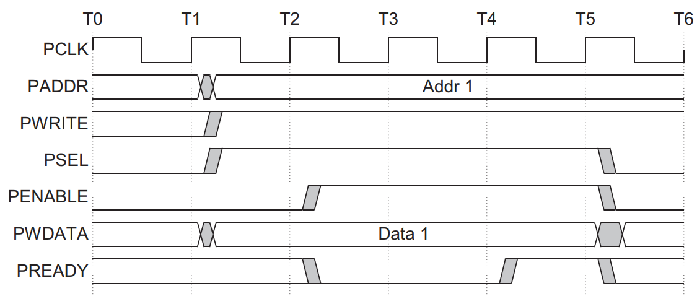

主要的逻辑和不带等待的一致，区别在于：

- 当PENABLE被主机置1后，如果Slave还没准备好，Slave会把PREADY信号拉低，此时PSEL、PENABLE和地址、数据信号等都会寄存状态，保持不变。
- 当Slave准备好了，再将此时的PREADY拉高，在图中T4阶段传输数据。
- T5时传输完毕并将PSEL和PENABLE等拉低（置为无效）。根据Spec，一般情况下，建议在传输完毕后，不改变PADDR和PWRITE信号的值，等到下次有数据传输时才改变（降低功耗）。
- 注意当PENABLE为0时，PREADY无所谓~随便~无效~。

#### Wirte Strobes

APB4中增加了PSTRB这个信号，用来确定PWDATA中的有效字节。PSTRB的每一位代表一个字节，所以当PSTRB[n]有效时，PWDATA[(8n + 7):(8n)]有效，例如一个32bit位宽的PWDATA：

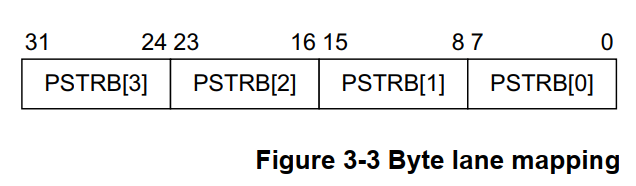

注意在读传输的过程中，PSTRB应该保持为无效（低）。

### 读操作

#### 不带wait的读操作

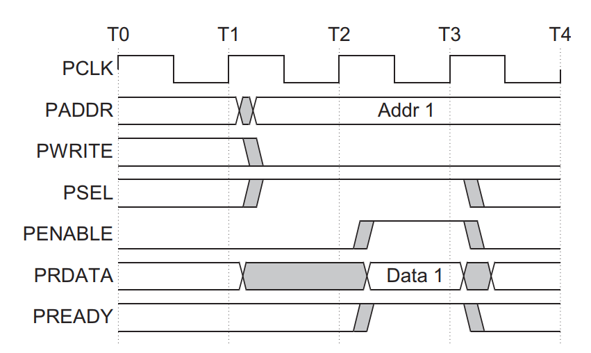

主要时序逻辑和写操作很像，主要区别在于：在 T2后，也就是在进入 ENABLE 周期后，APB 从必须要将 M 所要读取的数据准备好，以便在 ENABLE 周期末在 T3 时钟上升沿触发时，M 可以正确读取数据。

#### 带wait的读操作

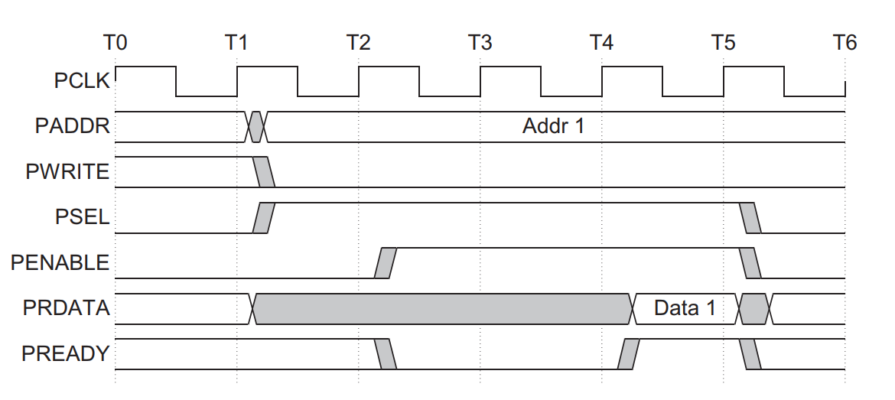

和写类似，可以利用PREADY拉低，代表当前Slave还没准备好。

### Error Response

- 2003/2004版本加入的功能
- PSLVERR（Slave Error的缩写）信号表示发生了读/写错误。
- PSLVERR pin并不是必须的，如果设备不支持，可以将其在Bridge上对应的pin接地。
- PSLVERR仅在PSEL、PENABLE、PREADY都是高（有效）时才被考虑。
- 标准建议在不被采样时（即不满足PSEL、PENABLE、PREADY都为高时），PSLVERR保持为低电平。

#### Write Error

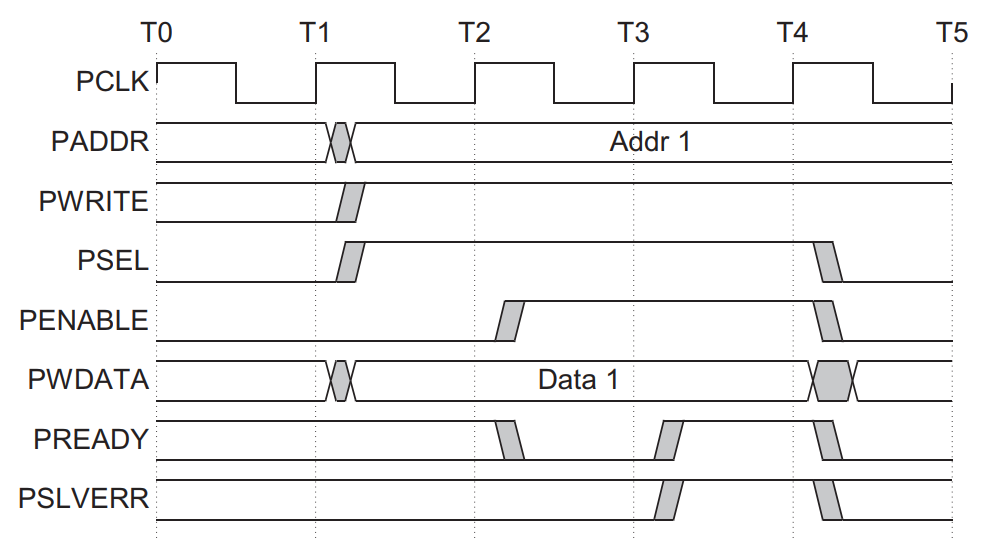

#### Read Error

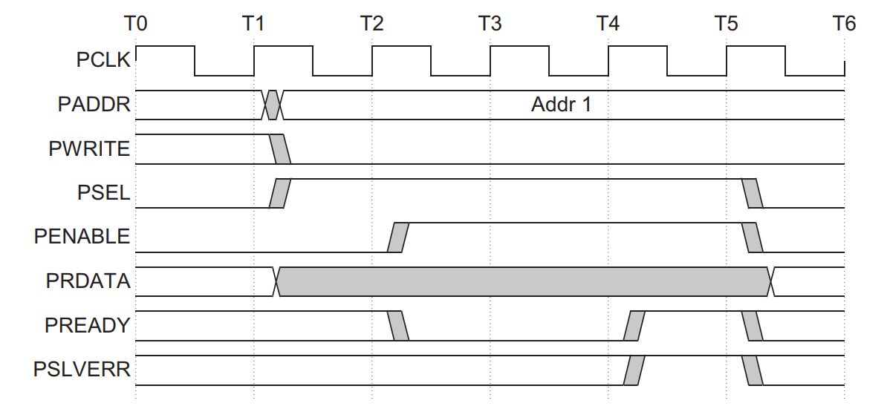

#### Mapping of PSLVERR

- AXI→APB：APB总线上的PSLVERR信号会被映射到AXI总线上的RRESP或者BRSEP上。
  - 读映射：PSLVERR → RRESP[1]。
  - 写映射：PSLVERR → BRESP[1]。

- AHB→APB：读写映射 PSLVERR → HRESP[0]。

### Protection unit

APB4中增加了一个信号PPROT[2:0]，用来表示Protection的相关内容。

- PPROT[0]：
  - Low：normal access
  - High：Privileged access
  - 作用：master用来表明当前的进程模式。Privileged access通常在系统中具有更高的访问级别。
- PPROT[1]：
  - Low：secure access
  - High：non-secure access
- PPROT[2]：
  - Low：data access
  - High：instruction access
  - 作用：此指示作为提示提供，并非在所有情况下都准确。标准建议默认情况下标记为data access，除非明确知道它是指令访问。

## AHB（Advanced High-Performance Bus）总线

### Introduction

**注：本文全部是根据AMBA2.0规范中的AHB规范来进行总结的。**

AHB是高速总线，提供高性能、高带宽，有以下特点：

- Burst传输
- 单时钟沿Operation
- 非三态实现
- 总线宽度64、128、256、512、1024bits可调整

AHB总线包括三个部分，分别是主机、从机和Interconnect

#### 连接关系

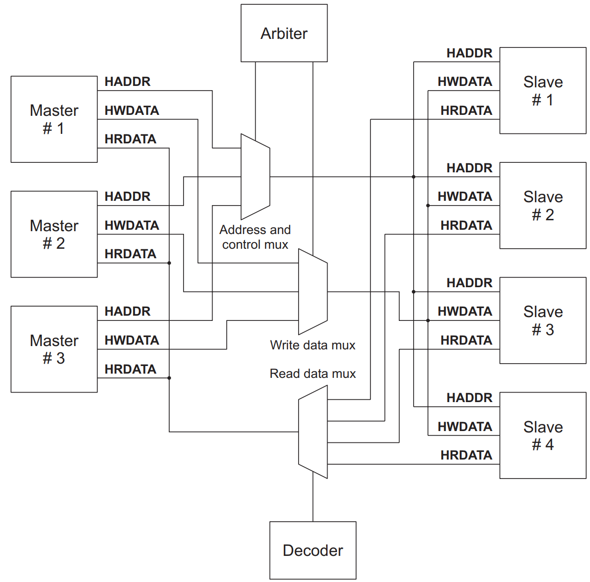

#### Master

信号共分三部分：

- 总线Request信号组，用于Arbiter
- 信号控制Command信号组
- Data+Response信号组

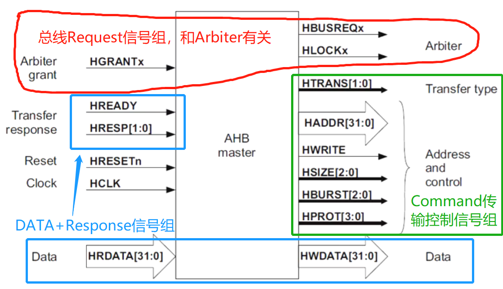

#### Slave

信号也分三部分：注意！没有Request信号组了，因为这是Slave！

- 信号控制Command信号组
- Data+Response信号组
- Split信号组，其作用是：将一次Burst分开。例如，主机请求读16组数据的Burst，但是此时从机仅有三组数据可用，且从机速度非常慢，如果用传统的ready信号拉低的方法，会严重占用总线。这时就可以用split信号，先传输三组数据回主机，等从机将剩下的13组信号准备好，主机再重新读取剩余的13个Burst。

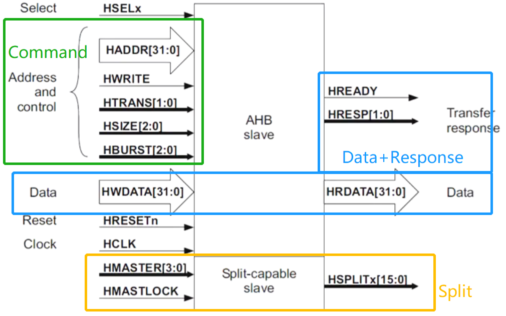

#### Arbiter

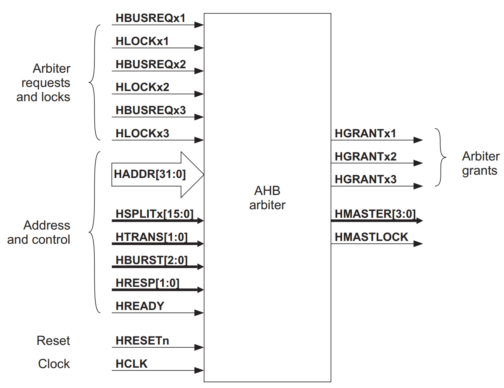

### 信号定义

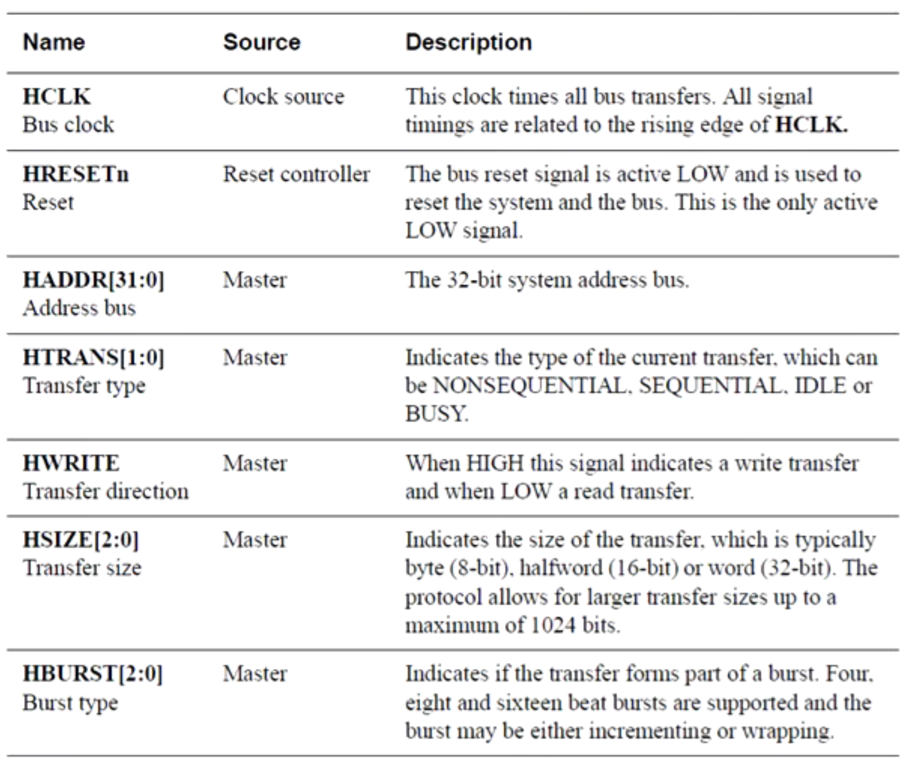

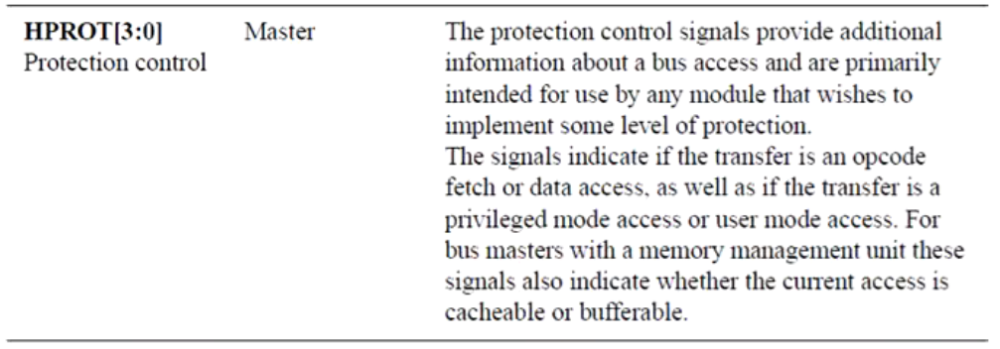

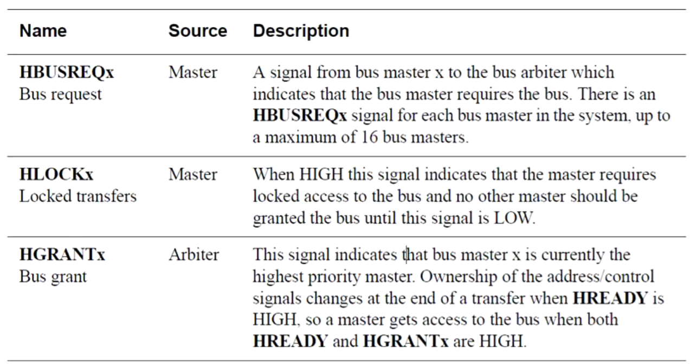

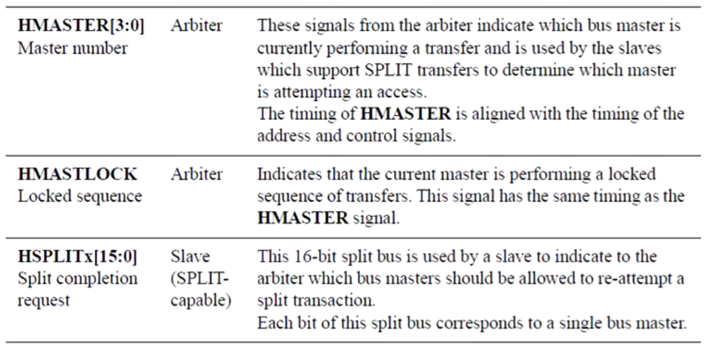

### 传输过程概述

- 首先，Master需要向向Arbiter发送请求。Arbiter根据当前总线的使用情况，决定是否允许该Master占用总线。当Master占用总线后，可以开始执行传输过程。

- 当开始传输后，Master开始传输地址和控制信号。这些信号address、direction、width of the
  transfer，以及 indication if the transfer forms part of a burst。

  其中有两种传输模式：incrementing bursts和wrapping bursts，前者是正常传输，后者是回卷突发模式，突发传输地址可溢出性递增，突发长度仅支持2,4,8,16。地址空间被划分为长度【突发尺寸*突发长度】的块，传输地址不会超出起始地址所在的块，一旦递增超出，则回到该块的起始地址。 

- 每次Transfer都包含两个步骤：

  - 地址阶段：一个cycle，用来传输address和control
  - 数据阶段：一个或多个cycle，用来传输data。（cycle数量由HREADY决定）

- 每次Transfer，slave可以使用HRESP信号作为给master的response：
  - OKAY：表明当前传输正常，即当HREADY拉高时，传输完毕。
  - ERROR：表明当前传输错误，没有成功。
  - RETRY and SPLIT：表明当前传输不能立即完成，但是仍然需要主机继续尝试传输。

### 信号传输过程

#### 单地址传输

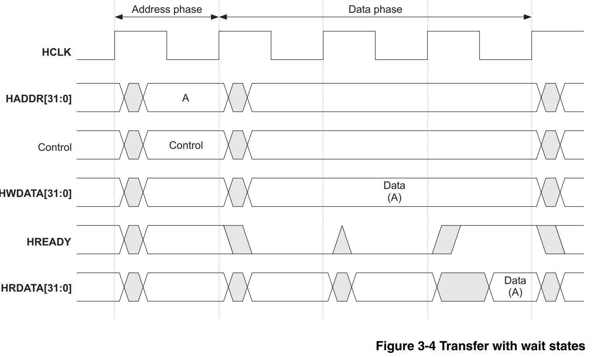

- 第一个时钟上升沿，主机发送address和control信号；
  - 第二个时钟上升沿，从机接收address和control信号，如果从机准备好了则HREADY输出有效，否则HREADY输出无效，且当slave准备好了以后再把HREADY拉高；
- 需要注意的是：
  - 对于写操作（Master -> Slave）主机一定要在第二个时钟周期内把Data给准备好！在wait状态中，所有的数据都需要保持稳定不变。
  - 对于读操作（Slave -> Master）从机需要在拉高HREADY的同时，把数据准备好！在wait状态中，slave提供的数据不一定是有效的。

#### 多地址传输

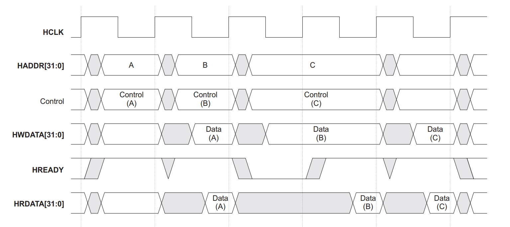由于B的数据阶段传输延迟了一个cycle，导致C的地址阶段也不得不延迟一个cycle。

### 传输类型（HTRANS编码）

- 00/IDLE：当主机占用了总线，但并不想进行数据的收发时，传输类型为IDLE，此时Slave必须忽略相关操作，并回OKAY的HRESP。
- 01/BUSY: 当主机在这次Burst中的本次transfer没有准备好时，就会使用BUSY传输模式；就类似于从机没有准备好，就将HREADY拉低的操作，效果是一样的。只不过一个针对主机，一个针对从机。当从机收到BUSY时，会忽略本次transfer，并回OKAY的HRESP。
- 10/NONSEQ: brust的第一个transfer的是NONSEQUENTIAL。在总线传输中，signle transfer会被当作brust的第一个signle transfer，所以signle transfer也是NONSEQUENTIAL。
- 11/SEQ: 每次Burst除第一次transfer以外的其他transfer都是SEQUENTIAL。The address is related to the previous transfer. The control information is identical to the previous transfer. The address is equal to the address of the previous transfer plus the size (in bytes). In the case of a wrapping burst the address of the transfer wraps at the address boundary equal to the size (in bytes) multiplied by the number of beats in the transfer (either 4, 8 or 16).  

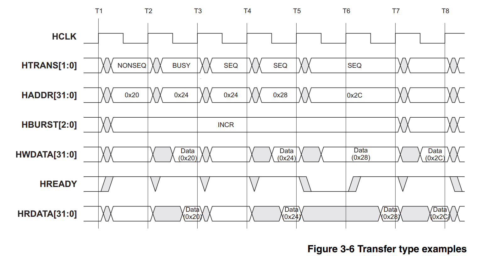

- 在这个例子中，第一个transfer是NONSEQUENTIAL。
- 第二个transfer中，主机无法立即收发数据，所以利用BUSY来延迟一个cycle。
- 第三个transfer中，从机无法立即收发数据，所以利用HREADY来延迟了一个cycle。
- 第四个transfer没有延迟，主从机都正常收发数据，立即完成了传输。

### Burst长度（HBRUST编码）

- AHB协议允许长度为4、8、16以及不定长的burst，也支持single transfer。
- Burst传输的最大边界不能超过1KB！！
- Burst中的长度并不是byte的长度，而是传输次数，总的数据长度=brust大小 x HSIZE 。

- AHB协议支持Incrementing和wrapping两种burst模式：
  - Incrementing：递增的突发访问顺序位置，突发中每次传输的地址只是前一个地址的增量。
  - wrapping：回卷突发模式，突发传输地址可溢出性递增。地址空间被划分为长度【突发尺寸*突发长度】的块，传输地址不会超出起始地址所在的块，一旦递增超出，则回到该块的起始地址。主要是针对Cache Line的更新使用！
- Burst的每次transfer都要地址边界对齐！
- HBURST[2:0]的定义：

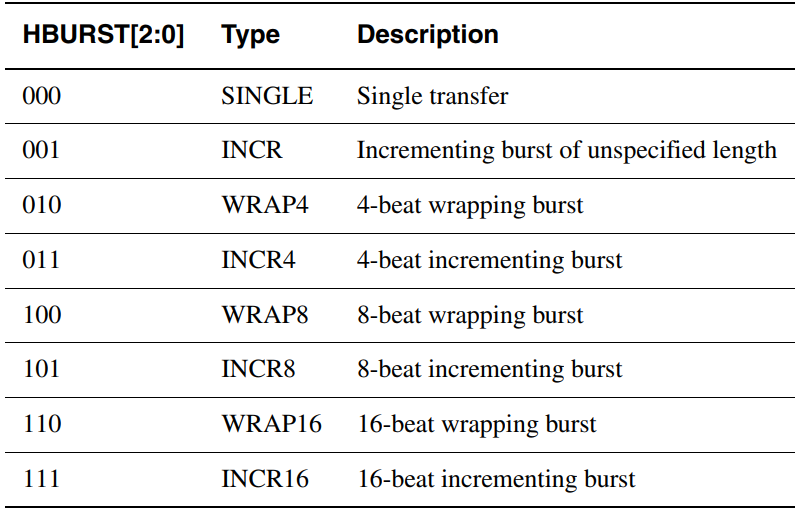

### 传输大小（HSIZE编码）

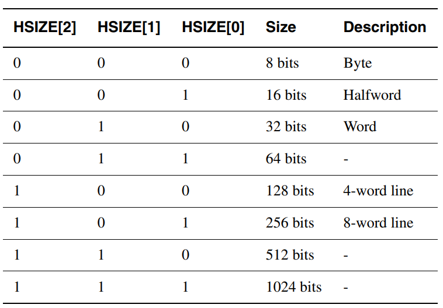

### 保护控制（HPROT编码）

**注意：并不是所有的Master都有能力产生正确的保护信息，所以建议非必要不适用HPROT信号！**

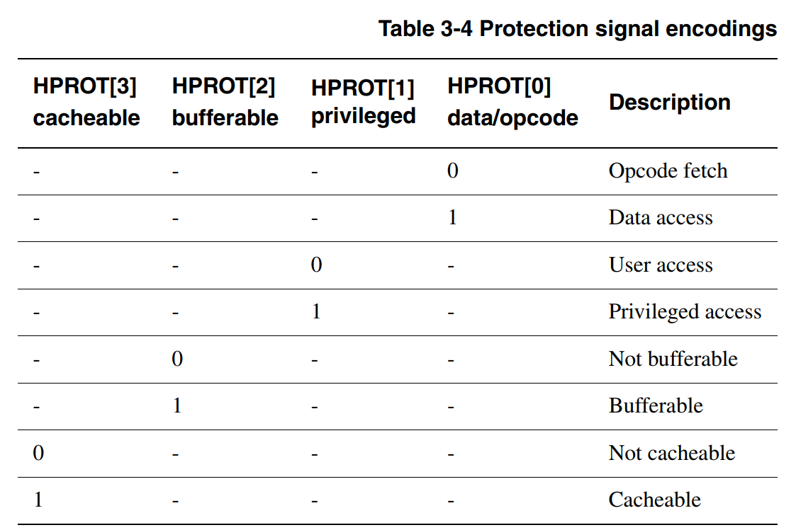

### Transfer Response（HRESP编码）

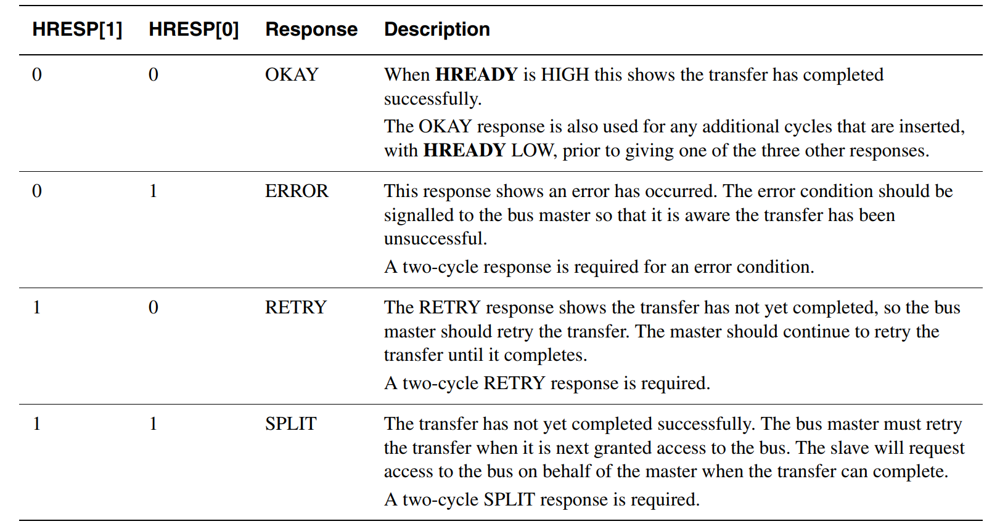

### Arbitration 仲裁

#### 相关信号

- HBUSREQx  ： 总线请求信号，每个master都拥有一个独立的HBUSREQx信号，用来请求使用总线。每个arbiter总共可以拥有16个独立的master。

- HLOCKx  ：总线锁定信号，每个master都拥有一个独立的HLOCKx信号。当需要大量不可分割的数据传输过程时，master会使用HLOCKx信号通知Arbiter锁定总线占用，防止Arbiter将总线分配给其他主机。

- HGRANTx：由Arbiter产生，用来表明某一个Master当前拥有请求总线访问的最高优先级。

  注意：再HGRANTx 和 HREADY 为高的HCLK上升沿，Master拥有总线的控制权。

- HMASTER[3:0]  ：Arbiter使用HMASTER信号来表明哪个主机当前占用总线，用来控制多路选择器等。
- HMASTLOCK  ：仲裁器通过断言 HMASTLOCK 信号指示当前传输是一个锁定序列的一部分，该信号和地址以及控制信号有相同的时序。
- HSPLIT[15:0] ： 这 16 位有完整分块能力的总线被有分块（SPLIT）能力的从机用来指示哪个总线主机能够完成一个 SPLIT 传输。仲裁器需要这些信息以便于授予主机访问总线完成传输。

#### 总线请求访问

- Master通过HBUSREQx 向Arbiter发出总线请求，Arbiter在时钟上升沿采样，采样成功后会通过内部的算法，决定下一个周期中哪一个master使用总线。
- 通常情况下只有当一个brust结束以后，才会让下一个master获得总线使用权。
- 但是，Arbiter也可以提前终止某次brust，然后分配一个更高的优先级给新的master去占用总线。如果某个Master不想被打断，可以使用HLOCKx，向arbiter表明不想被任何其他master打断！
- 当master被授权占用总线，传输固定长度的Burst过程中，master不需要重新请求arbiter。arbiter会观察HBURST[2:0]来决定master进行多少次transfer。当这次传输完毕以后，master想开始第二次burst时，必须重新发起请求。
- 如果master传输到一半被中断了，需要重新发起HBUSREQx 来使用总线。
- 如果是非定长的burst，master需要时钟保持HBUSREQx，直到最后一次transfer要结束时再释放。这是因为arbiter不能够了解到burst的大小。
- master是有可能在不发起HBUSREQx的情况下被granted。例如当前没有master发起请求，则默认的master就会被granted，此时HTRANS需要保持在IDLE状态。

#### Granting bus access

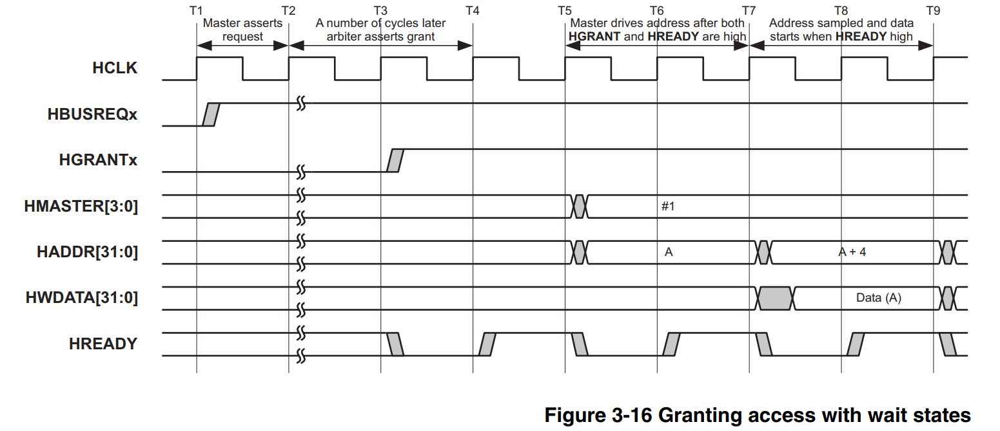

#### Handover after burst

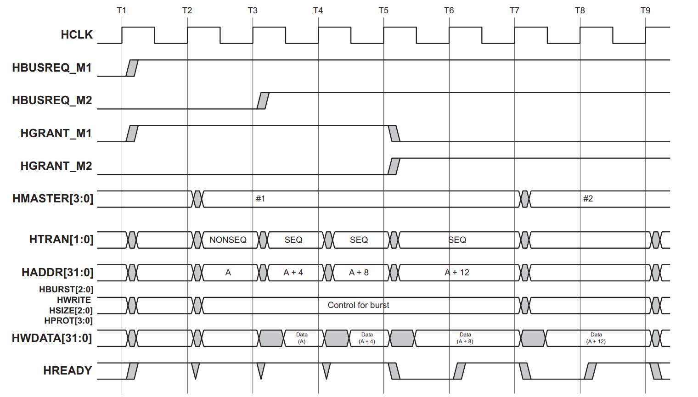

#### Bus master grant signals

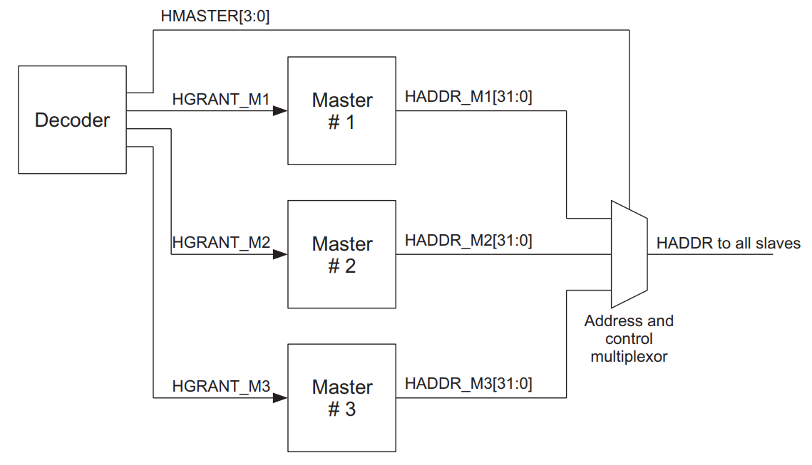

### 流量控制

- Slave：Hready信号、Hsplit信号
- Master：Htrans信号

### AHB Burst Phase

- 从Master的角度来说，AHB总线传输总共有三个阶段：bus req、Address、Data，即：

  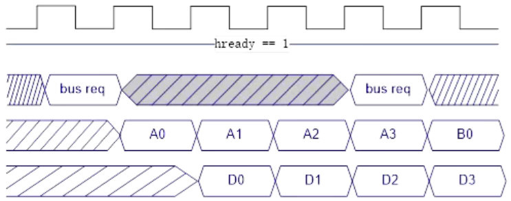

- 从Slave的角度来说，AHB总线传输总共有两个阶段：Address和Data：

  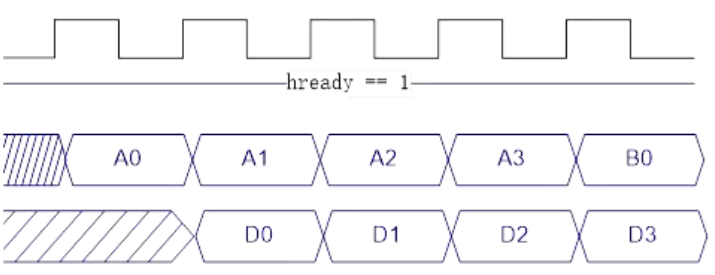

## AXI总线

### introduction

AMBA AXI协议支持支持高性能、高频率系统设计。

- 适合高带宽低延时设计
- 无需复杂的桥就能实现高频操作
- 能满足大部分器件的接口要求
- 适合高初始延时的存储控制器
- 提供互联架构的灵活性与独立性
- 向下兼容已有的AHB和APB接口

关键特点：

- 分离的地址/控制、数据相位
- 使用字节线来支持非对齐的数据传输
- 使用基于burst的传输，只需传输首地址
- 分离的读、写数据通道，能提供低功耗DMA
- 支持多种寻址方式
- 支持乱序传输
- 允许容易的添加寄存器级来进行时序收敛

### AXI总线架构

AXI协议是基于burst的传输，并且定义了以下5个独立的传输通道：读地址通道、读数据通道；写地址通道、写数据通道、写响应通道。

地址通道携带控制消息用于描述被传输的数据属性，数据传输使用写通道来实现“主”到“从”的传输，“从”使用写响应通道来完成一次写传输；读通道用来实现数据从“从”到“主”的传输。

- 读/写地址通道：读、写传输每个都有自己的地址通道，对应的地址通道承载着对应传输的地址控制信息。
- 读数据通道：读数据通道承载着读数据和读响应信号包括数据总线（8/16/32/64/128/256/512/1024bit）和指示读传输完成的读响应信号。
- 写数据通道：写数据通道的数据信息被认为是缓冲（buffered）了的，“主”无需等待“从”对上次写传输的确认即可发起一次新的写传输。写通道包括数据总线（8/16...1024bit）和字节线（用于指示8bit 数据信号的有效性）。
- 写响应通道：“从”使用写响应通道对写传输进行响应。所有的写传输需要写响应通道的完成信号。

读通道：

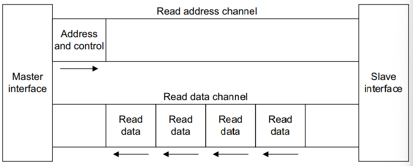

写通道：

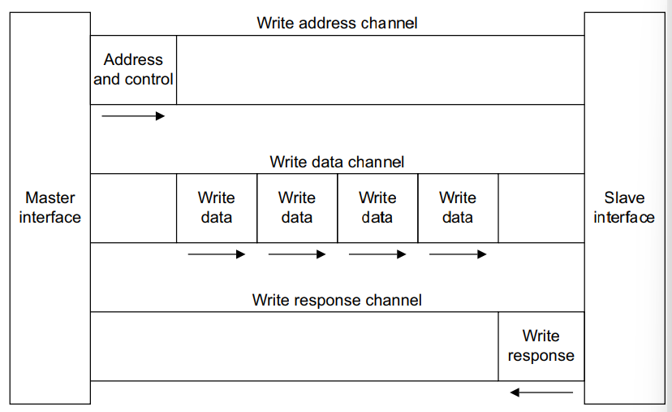

QS：这里为什么读相应通道呢？

A：因为读数据通道中就可以包含了读相应信号。

- 拓扑结构

  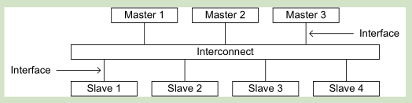

### 信号定义

#### 全局信号

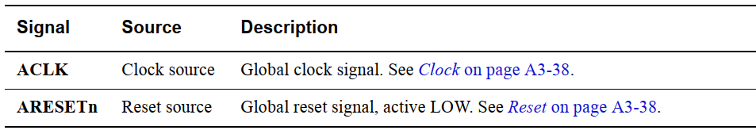

#### 写地址通道信号

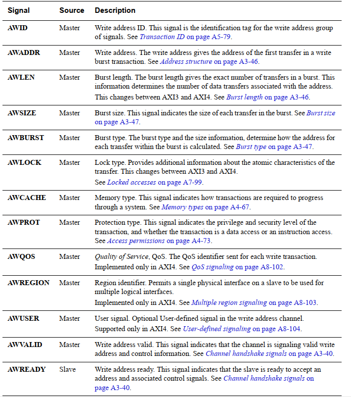

#### 写数据通道信号

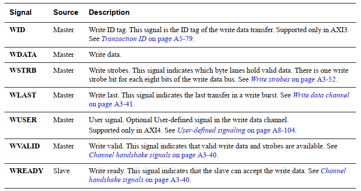

#### 写返回通道信号

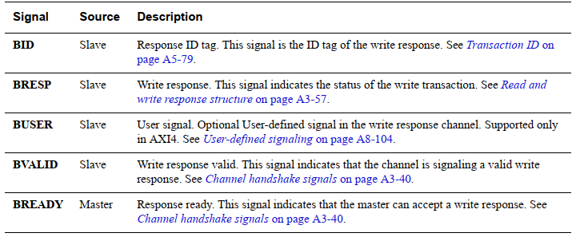

#### 读地址通道信号

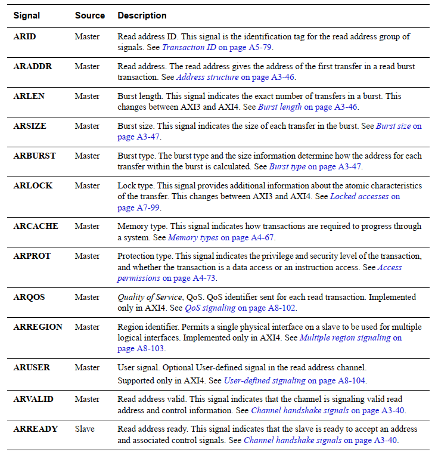

#### 读数据通道信号

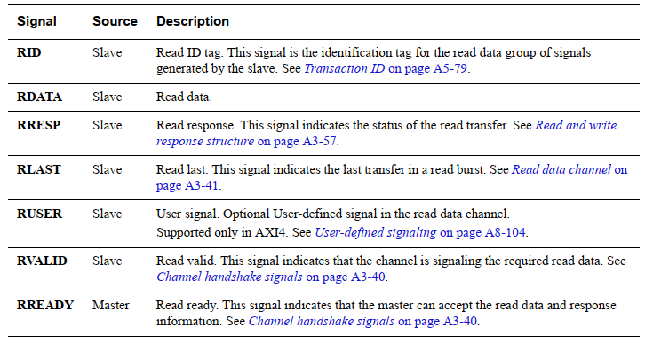

#### 低功耗接口信号

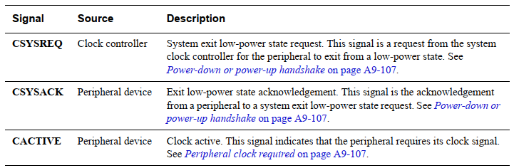

### 读写握手

AXI的5个传输通道均使用VALID/READY信号对传输过程的地址、数据、控制信号进行握手。传输源端使用VALID表明地址/控制信号、数据是有效的，目的端使用READY表明自己能够接受信息。使用双向握手机制，传输仅仅发生在VALID、READY同时有效的时候。

- VALID在READY之前：

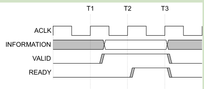

- VALID在READY之后：

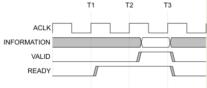

- VALID与READY同时：

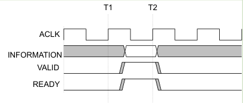

#### 握手信号要求

写地址通道：当主机驱动有效的地址和控制信号时，主机可以断言AWVALID，一旦断言，需要保持AWVALID的断言状态，直到时钟上升沿采样到从机的AWREADY。AWREADY默认值可高可低，推荐为高（如果为低，一次传输至少需要两个周期，一个用来断言AWVALID，一个用来断言AWREADY）；当AWREADY为高时，从机必须能够接受提供给它的有效地址。

写数据通道：在写突发传输过程中，主机只能在它提供有效的写数据时断言WVALID，一旦断言，需要保持断言状态，直到时钟上升沿采样到从机的WREADY。WREADY默认值可以为高，这要求从机总能够在单个周期内接受写数据。主机在驱动最后一次写突发传输是需要断言WLAST信号。

写响应通道：从机只能它在驱动有效的写响应时断言BVALID，一旦断言需要保持，直到时钟上升沿采样到主机的BREADY信号。当主机总能在一个周期内接受写响应信号时，可以将BREADY的默认值设为高。

读地址通道：当主机驱动有效的地址和控制信号时，主机可以断言ARVALID，一旦断言，需要保持ARVALID的断言状态，直到时钟上升沿采样到从机的ARREADY。ARREADY默认值可高可低，推荐为高（如果为低，一次传输至少需要两个周期，一个用来断言ARVALID，一个用来断言ARREADY）；当ARREADY为高时，从机必须能够接受提供给它的有效地址。

读数据通道：只有当从机驱动有效的读数据时从机才可以断言RVALID，一旦断言需要保持直到时钟上升沿采样到主机的BREADY。BREADY默认值可以为高，此时需要主机任何时候一旦开始读传输就能立马接受读数据。当最后一次突发读传输时，从机需要断言RLAST。

#### 握手信号的依耐关系

为防止死锁，通道握手信号需要遵循一定的依耐关系。①VALID信号不能依耐READY信号。②AXI接口可以等到检测到VALID才断言对应的READY，也可以检测到VALID之前就断言READY。下面有几个图表明依耐关系，单箭头指向的信号能在箭头起点信号之前或之后断言；双箭头指向的信号必须在箭头起点信号断言之后断言。

- 读传输握手依耐关系

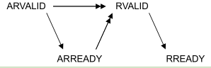

- 写传输握手依耐关系

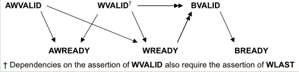

- 从机写响应握手依耐关系

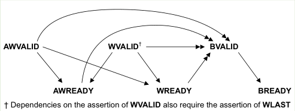

### 传输结构

AXI协议是基于burst的，主机只给出突发传输的第一个字节的地址，从机必须计算突发传输后续的地址。突发传输不能跨4KB边界（防止突发跨越两个从机的边界，也限制了从机所需支持的地址自增数）。

#### 基础概念

在手册的术语表中，与 AXI 传输相关的有三个概念，分别是 transfer(beat)、burst、transaction。用一句话串联就是：

> 在 AXI 传输事务（Transaction）中，数据以突发传输（Burst）的形式组织。一次突发传输中可以包含一至多个数据（Transfer）。每个 transfer 因为使用一个周期，又被称为一拍数据（Beat）。

再展开一层，两个 AXI 组件为了传输一组数据而进行的所有交互称为 **AXI Transaction**，AXI 传输事务，包括所有 5 个通道上的交互。

AXI 是一个 burst-based 协议，AXI 传输事务中的数据传输以 burst 形式组织，称为 **AXI Burst**。每个传输事务包括一至多个 Burst。每个 Burst 中传输一至多个数据，每个数据传输称为 **AXI Transfer**。双方握手信号就绪后，每个周期完成一次数据传输，因此 AXI Transfer 又被称为 **AXI beat**，一拍数据。不严谨地说

> **AXI Transaction** =M***AXI Burst** ,M >= 1
> **AXI Burst** = N *** AXI Transfer（AXI beat）** ,N >= 1

#### 地址结构

##### Burst长度

- ARLEN[7:0]决定读传输的突发长度，即上面所说的“M”
- AWLEN[7:0]决定写传输的突发长度，即上面所说的“N”
- AXI3只支持1~16次的突发传输（Burst_length=AxLEN[3:0]+1）
- AXI4扩展突发长度支持INCR突发类型为1~256次传输（Burst_Length=AxLEN[7:0]+1），对于其他的传输类型依然保持1~16次突发传输。
- wraping burst ,burst长度必须是2,4,8,16
- burst不能跨4KB边界
- 不支持提前终止burst传输

##### Burst大小

- ARSIZE[2:0]决定读传输的大小

- AWSIZE[2:0]决定写传输的大小

  | AxSIZE[2:0] | Bytes in transfer |
  | ----------- | ----------------- |
  | 0b000       | 1                 |
  | 0b001       | 2                 |
  | 0b010       | 4                 |
  | 0b011       | 8                 |
  | 0b100       | 16                |
  | 0b101       | 32                |
  | 0b110       | 64                |
  | 0b111       | 128               |

##### Burst类型

- ARBURST[1:0]决定读传输的Burst类型
- AWBURST[1:0]决定写传输的Burst类型

| AxBURST[1:0] | Burst type |
| ------------ | ---------- |
| 0b00         | FIXED      |
| 0b01         | INCR       |
| 0b10         | WRAP       |
| 0b11         | Reserved   |

- FIXED：突发传输过程中地址固定，用于FIFO访问
- INCR：增量突发，传输过程中，地址递增。增加量取决AxSIZE的值。
- WRAP：回环突发，和增量突发类似，但会在特定高地址的边界处回到低地址处。回环突发的长度只能是2,4,8,16次传输，传输首地址和每次传输的大小对齐。最低的地址整个传输的数据大小对齐。回环边界等于（AxSIZE\*AxLEN）。

##### Burst地址

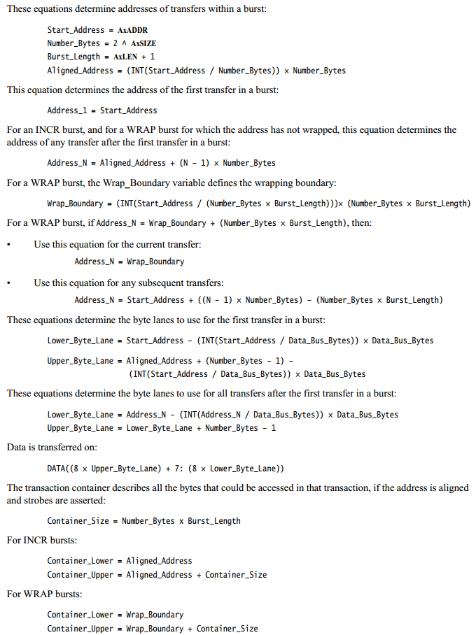

#### 数据读写结构

- Write strobes
  - WSTRB[n:0]对应于对应的写字节，WSTRB[n]对应WDATA[8n+7:8n]。
  - WVALID为低时，WSTRB可以为任意值。
  - WVALID为高时，WSTRB为高的字节线必须指示有效的数据。

- Narrow transfers

  当主机产生比它数据总线要窄的传输时，由地址和控制信号决定哪个字节被传输：

  - 对于INCR和WRAP，不同的字节线决定每次burst传输的数据。
  - 对于FIXED，每次传输使用相同的字节线。
  - 下图给出了5次突发传输，起始地址为0，每次传输为8bit，数据总线为32bit，突发类型为INCR：

  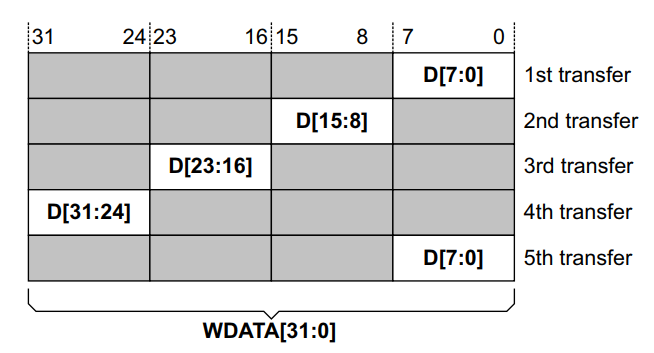

  - 下图给出3次突发，起始地址为4，每次传输32bit，数据总线为64bit：、

    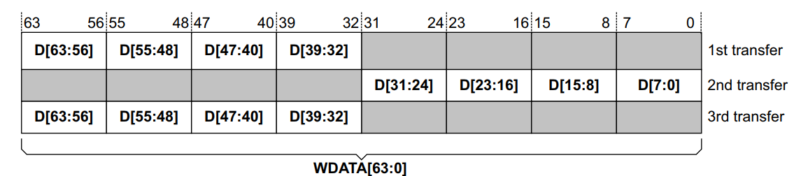

- Unaligned transfers 非对齐传输

  - AXI支持非对齐传输。在大于一个字节的传输中，第一个自己的传输可能是非对齐的。如32-bit数据包起始地址在0x1002，非32bit对齐。

  - 主机可以：

    - 即使起始地址非对齐，也保证**所有传输是对齐**的
    - 在首个 transfer 中增加填充数据，**将首次传输填充至对齐**，填充数据使用 WSTRB 信号标记为无效

  - 对齐非对齐传输32bit总线示例：

    

  - 对齐非对齐传输64bit总线示例：

    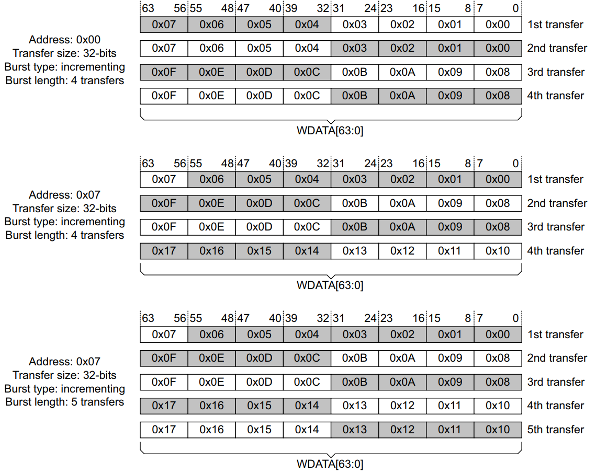

  - 非对齐的Wrapping传输64bit总线示例：

    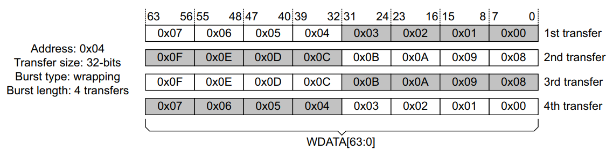

#### 读写响应结构

- RRESP[1:0]，读传输的RESP
- BRESP[1:0]，写传输的RESP
- 0b00/OKAY：正常访问成功
- 0b01/EXOKAY：Exclusive 访问成功
- 0b10/SLVERR：从机错误。表明访问已经成功到了从机，但从机希望返回一个错误的情况给主机。
- 0b11/DECERR：译码错误。一般由互联组件给出，表明没有对应的从机地址。

### Arbition

实在是不想看了。什么时候闲了再看吧。摸个鱼！

