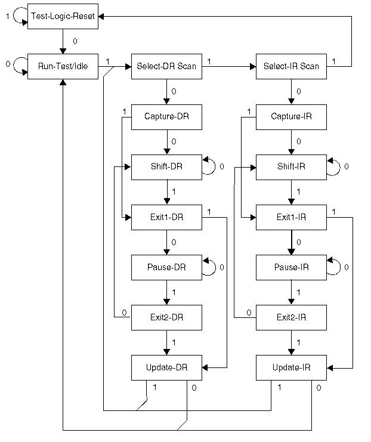

# JTAG

* tdi tdo tck tms trst

TAP状态机：

1. Reset：所有寄存器初始化，TMS低电平同时TCK上升沿进入idle
2. Select-DR Scan：选择数据移位寄存器
3. Select-IR Scan：选择指令移位寄存器
4. Capture DR：对于input，就是capture输入，对于output就是capture core
5. Shift-DR：传输capture的数据，由TCK驱动，在TMS为0的每个时钟周期，被连接在TDI和TDO之间的数据寄存器将从TDI接受一位数据，同时通过TDO输出一位数据。
6. Exit1 DR：提供一个刚刚输入数据生效前，重新修改的机会
7. Update DR：使输入数据生效，锁存信号，将移位寄存器的内容并行读到对应的寄存器。