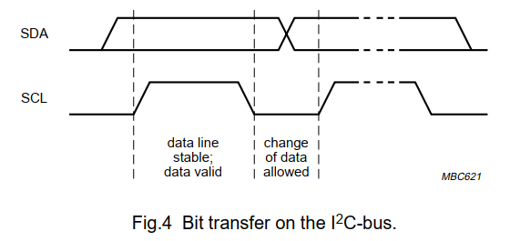

## GPIO

1. GPIO Device Pad and Usage:
    1. Output Strength：输出强度
        
        
        
    2. Output Value：输出值
    3. Output Enable：输出使能
    4. Input Enable：输入使能
    5. Input Value：如果输出使能该值将等于输出值。
    6. Hysreresis Enable (施密特触发器)
        1. 施密特触发器有两个阈值电压，分别称为正向阈值电压和负向阈值电压。在输入信号从低电平上升到高电平的过程中使电路状态发生变化的输入电压称为正向阈值电压，在输入信号从高电平下降到低电平的过程中使电路状态发生变化的输入电压称为负向阈值电压。
        2. 假定高于3V则为高，低于3V则为低。如果某电压在3V左右，比如一会是3.0xV，一会又是2.9xV，这时你判断的状态就一会是低一会是高。 如果此时加入了迟滞，比如说加入了0.25V的迟滞，当电压高于3V时，判断为高，此时，只要电压高于(3-0.25V)，则仍然判断为高。同样的道理，当电压低于3V时，则判断为低，此时只要电压低于(3+0.25V）时，仍然判断为低。这样一来，即使你电压由于噪声在小范围的波动，也不会出现误判了。
    7. Pull-up, Pull-down, None **(Open Drain(Collect), pull-push(Totem-pole))**
        1. GPIO中输入需要上拉下拉，防止悬空时外部干扰；输出一般不需要上拉下拉电阻
        2. 开漏输出的好处：
            1. 方便的调节输出的电平，因为输出电平完全由上拉电阻连接的电源电平决定。所以在需要进行电平转换的地方，非常适合使用开漏输出。
            2. 便于实现“线与”“线或”功能，所谓的"线与"指的是多个信号线直接连接在一起，只有当所有信号全部为高电平时，合在一起的总线为高电平；只要有任意一个或者多个信号为低电平，则总线为低电平。而推挽输出就不行，如果高电平和低电平连在一起，会出现电流倒灌，损坏器件。
            3. 线与，接上拉电阻至电源；线或，接下拉电阻至地
        3. 推挽输出的好处：
            1. 驱动能力比较强，不依赖于外部的电阻。
            2. 电平跳变速度快，开漏输出依赖于外部电阻，电阻越小，反应越快，功耗越大$U^2/R$
    
        
    
2. 主设备使用Verilog应该实现的功能
    
    编码须知：软件通过CPU控制下面所有的寄存器读写，编码前需要给这些寄存器分配地址，确定寄存器大小（取决于有多少个GPIO），读写地址数据信号时序，特别要明确各个Pad的作用等。
    
    1. 必选功能：
        1. 寄存器控制GPIO Device Pad（软件控制模式）
            1. GPIO_IE：输入使能，可读可写
            2. GPIO_OE：输出使能，可读可写
            3. GPIO_IVAL：GPIO输入会由同步器（两个D触发器）同步到该寄存器，可读
            4. GPIO_OVAL：GPIO输出，可写
            5. GPIO_PUE：内部上拉电阻使能，选择Pull-up还是Pull-down，可读可写
            6. GPIO_DS：Driver Strength，可读可写
        2. 寄存器实现中断，包括检测上升沿，下降沿，高电平，低电平
            1. GPIO_RISE_IE：上升沿中断使能信号，置1则检测上升沿，可写可读
            2. GPIO_RISE_IP：pending信号，如果检测到上升沿则置1，直到被软件清零0，可写可读
            3. GPIO_FALL_IE\IP：同上，可读可写
            4. GPIO_HIGH_IE\IP：同上，可读可写
            5. GPIO_LOW_IE\IP：同上，可读可写
            6. 中断信号则是上面4种中断的或，将中断发给中断控制器作为外部中断源。
    2. 可选功能：
        1. 寄存器实现GPIO的复用功能，IOF（IO function）
            1. 举例：GPIO1~4同时也可以作为SPI的SCLK，MISO，MOSI，CS信号。
            2. GPIO_IOF_EN：该寄存器决定使用IOF控制模式还是使用软件控制模式，可读可写
            3. GPIO_IOF_SEL：多种复用选择，GPIO1~2还作为UART的TXD和RXD，可读可写
            4. 复用选择送入PAD的信号IVAL, OVAL, IE, OE等则通过该复用功能模块产生，例如SPI模块应该产生SCLK, MISO, MOSI, CS信号送入OVAL等。
3. 软件需要做的事情
    1. 根据上述寄存器配置好是否使用IOF
    2. 根据上述寄存器输出还是输入模式
    3. 根据上述寄存器输出或者读取输入

## SPI

1. 基本协议说明
    1. Single-SPI
        1. 四线，SCLK，MOSI(master output slave in)，MISO，SS(Slave Select or CS(Chip Select))
            
        
            
        2. 传输模型，全双工，同时接受和发送
            
        
            
        3. 传输模式，两种组合共4种
            1. CPOL(clock polarity)
                
                0：空闲低电平，时钟前沿为上升沿，后沿为下降沿
                
                1：空闲高电平，时钟前沿为下降沿，后沿为上升沿
                
            2. CPHA(clock phase)
                
                0：数据在发送端的时钟后沿改变（蓝），在接收端的时钟前沿被采样（红）
                
                1：数据在发送端的时钟前沿改变（红），在接收端的时钟后沿被采样（蓝）
                
            
        
            
        4. 工作举例
            1. 独立从设备，典型SPI总线
                
        
                
            2. Daisy-chained SPI bus
                
        
                
    2. Dual-SPI
        1. SCLK，SS(CS)，SD0，SD1
        2. 一周期传两bit，SD01同时一段时间做输入一段时间做输出，半双工
    3. Quad-SPI
        1. SCLK，SS(CS)，SD0，SD1，SD2，SD3
        2. 同Dual-SPI，半双工，一周期传4bit。
    4. De facto standard 事实标准而非法定标准(de jure standard)
        
        设备可以在上述的基础上定义自己的协议：
        
        1. 有些设备需要传入8bit，一些设备需要更多；
        2. 有些设备先到的为低位，有些设备先到的为高位；
        3. 有些设备支持命令，接受命令之后需要额外的空闲时钟；
        4. 有些设备有两个时钟，一个时钟用于读取数据，另一个时钟用于将数据传输到设备中；
        5. 有些设备只接受，有些只发送，有些片选信号为高，有些为低；
        6. 有的设备甚至只有三线，将MOSI和MISO合并到一条数据线（SI / SO）中；
2. 主设备使用Verilog应该实现的功能
    
    编码须知：软件通过CPU控制下面所有的寄存器读写，编码前需要给这些寄存器分配地址，确定寄存器大小，读写地址数据信号时序，特别要明确从设备自定的协议包括命令，传输长度等。
    
    1. 必选功能：协议基础功能和中断功能
        1. 时钟功能
            1. SPI_SCLK_DIV：时钟分频系数寄存器，可读可写
            2. SPI_SCLK_MODE：时钟模式配置寄存器，配置极性和相位，可读可写
        2. 片选功能
            1. SPI_CS_ID：使能第ID个片选信号，可读可写
            2. SPI_CS_XDEF：定义使能信号空闲值，ID数对应寄存器数(X: 0,1,...)，可读可写
            3. SPI_CS_MODE：确定片选信号的工作模式，可读可写（可选功能）
                1. AUTO：硬件在数据送完之后自动将其恢复为DEF定义的空闲值
                2. HOLD：硬件在发送数据完后将其保持不变，除非MODE, ID, DEF等寄存器被修改
                3. OFF：硬件不控制该寄存器，完全由软件控制
        3. 传输功能（FIFO发送接受模式）
            1. SPI_TX_DATA：发送数据寄存器，可存放一个只读标志位表示TX_FIFO满，只写
            2. SPI_RX_DATA：接受数据寄存器，可存放一个只读标志位表示RX_FIFO非空，只读（所以可以与上述寄存器同一地址）
            3. SPI_FMT：FIFO模式传输参数配置寄存器，可读可写，某些域只读，某些只写
            4. 配置参数：传输长度，是否接收，传输协议（QSPI，DSPI，SSPI），大小端（低位优先发出还是高位优先发出）
            5. 软件写SPI_TX_DATA就是写TX_FIFO，需要实现根据传输参数顺序发出
            6. 软件读SPI_RX_DATA就是读RX_FIFO，需要触发假发送才能读出从设备的数据
            7. FIFO深度宽度自定，一般宽度为8，若传输长度小于8，则按照大小端配置存放。
            8. 3种传输协议都需要实现，QSPI，DSPI，SSPI。
        4. 中断功能
            1. SPI_TX_UFLOW：FIFO下溢标志寄存器，TX_FIFO小于该值可触发中断，可读可写。
            2. SPI_RX_OFLOW：FIFO上溢标志寄存器，RX_FIFO大于该值可触发中断，可读可写。
            3. SPI_IE：SPI的发送或者接受中断使能寄存器，可读可写
            4. SPI_IP：SPI的发送或者接受中断等待标志寄存器，只读
    2. 可选功能：
        1. 延迟控制功能 SPI_DELAY 可读可写
            1. 定义发送数据之后，在最后一个SCLK时钟之后多少周期将CS保持
            2. 定义发送数据之前，在第一个SCLK时钟之前多少周期将CS保持
            3. 使能从恢复到空闲值（de-assertion）到重新置为有效值（assertion）之间最少应该持续的周期数。
            4. 使能一直保持的情况下，SPI连续传输两个数据帧之间最少的间隔周期数（OFF和HOLD才有效）
        2. DDR模式功能 SPI_DDR 可读可写
            1. SCLK时钟前沿后沿都进行发送数据和接受数据
        3. QSPI Flash XiP功能举例
            1. 下面这个是Face-Z7的QSPI Flash，接到了Bank 500的PS_MIO1~5口；Micron 公司 MT25QL256ABA1EW9 Serial NOR Flash 芯片
                
        
                
            2. XiP功能是指eXecute In Place，Flash将被映射成一块连续的内存地址，CPU进行取指时发送地址到总线，总线判断地址之后负责自动调用SPI模块，使用SPI协议从Flash中获得该地址数据，从而直接在Flash中运行程序，而不是将程序复制到RAM中再运行。
            3. Flash的读方法如下，写类似，详细情况需要查看Flash文档：
                1. 指令阶段：发送8bit指令cmd，例如写使能，扇区擦除，读写内部寄存器，读数据（单线，双线，四线）
                2. 地址阶段：送入3个字节地址，指示操作地址，一般高位优先
                3. 等待阶段：等待Dummy cycles让flash准备数据，四线读数据之前需要等待8个dummy clock，具体查看Flash文档
                4. 接受阶段：数据从MISO或SD读出。
                5. 结束阶段：一条指令操作结束，并给出一个结束标志
                
        
                
                WinBond W25Q128BV Quad SPI Flash存储器单线读时序
                
            4. verilog需要实现的有：
                1. SPI_FLASH_MODE：使能Flash XiP模式寄存器，开启则禁止FIFO模式，可读可写
                2. SPI_FLASH_FMT：Flash XiP模式传输参数配置寄存器，可读可写
                3. 配置参数
                    1. 指令阶段的指令值(8bit，0x03是read指令)
                    2. 发送数据阶段使用的SPI协议（Q，D，S）
                    3. 发送地址阶段使用的SPI协议（Q，D，S）
                    4. 发送指令阶段使用的SPI协议（Q，D，S）
                    5. 等待阶段等待的周期个数，等待时发送的数据
                    6. 发送命令使能
                    7. 地址位数
3. 软件需要做的事情
    1. 根据从设备确定好分频系数并写入
    2. 确定从设备的片选信号
    3. 确定与从设备通信的传输模式
    4. 传输数据到发送寄存器（读写都需要）
    5. 读的话从根据中断从接收FIFO中读出数据

## UART

1. 基本协议功能
    1. 模式0：移位寄存器模式
        1. 数据格式：8位，低位在前，高位在后
        2. RXD为串行数据的发送端或接收端
        3. TXD为同步时钟脉冲
        4. 并行口不够用可通过外接串入并出移位寄存器扩展输出接口；通过外接并入串出移位寄存器扩展输入接口
        
        
        
        
        
    2. 模式1：8N1、7E1
        1. 数据格式：10位， 每帧数据由1个起始位”0”、8个数据位和1个停止位“1”组成
        2. 起始位和停止位在发送时是自动插入的，通过状态机实现
        3. RXD数据移位接收，波特率可变，16倍波特率采样，连续3次选择多数值作为采样结果
        4. TXD数据移位发送，波特率可变
        
        
        
    3. 模式2：8E1，8N2
        1. 数据格式：11位，每帧数据由1个起始位“0”，9个数据位和1个停止位“1”组成
        2. 第9位数据可以由控制寄存器给出作为校验位，接收到的第9位也放入寄存器
        3. 第9位数据也可以用于多机通信用于区分地址还是数据（由软件实现，不用考虑）
        4. RTX，TXD波特率可变。接收时16倍波特率采样，连续3次选择多数值作为采样结果
        
        
        
    4. 模式3：8E2等等
        1. 数据格式：12位，每帧数据由1个起始位“0”，9个数据位和2个停止位“1”组成
2. 主设备verilog应该实现的功能
    1. 必选功能：模式1和模式2
        1. 时钟功能，一个定时器，采样时钟脉冲的16分频为波特率
            1. UART_BAUD_DIV：波特率产生分频系数
        2. 传输功能
            1. UART_TX_DATA：发送数据寄存器，可存放一个只读标志位表示TX_FIFO满，只写
            2. UART_RX_DATA：接受数据寄存器，可存放一个只读标志位表示RX_FIFO非空，只读（所以可以与上述寄存器同一地址）
            3. UART_CTRL：传输参数配置寄存器，可读可写，某些域只读，某些只写
            4. 配置参数：传输模式，第9位发送数据，接收数据位，接收发送使能
            5. 软件写UART_TX_DATA就是写TX_FIFO，需要实现根据传输参数顺序发出
            6. 软件读UART_RX_DATA就是读RX_FIFO，根据接收顺序读出
            7. FIFO深度自定，一般宽度为8或9。
        3. 传输举例（状态机）：
            1. idle：检测起始位跳变和使能
            2. start：采样检测起始位是否有效
            3. data：起始位有效则接收数据，根据模式接收不同的数据
            4. crc：校验阶段，第九位数据进控制寄存器，与模式有关，模式2则跳过
            5. stop：检测停止位，正常则入FIFO，否则抛弃
        4. 中断功能：
            1. UART_TX_UFLOW: FIFO下溢标志寄存器，TX_FIFO小于该值可触发中断，可读可写。
            2. UART_RX_OFLOW: FIFO上溢标志寄存器，RX_FIFO大于该值可触发中断，可读可写。
            3. UART_IE：UART的发送或者接受中断使能寄存器，可读可写
            4. UART_IP：UART的发送或者接受中断等待标志寄存器，只读
    2. 可选功能：模式0和模式4
        1. 时钟可以由模式1的时钟复用
        2. 模式0传输举例：idle→data→idle
3. 软件需要做的事情
    1. 根据波特率确定分频系数
    2. 配置UART
    3. 发送数据到FIFO
    4. 根据中断从FIFO中读数据

## I$^2$C

1. 基本协议功能
    1. 单主设备
        1. 串行数据线 SDA，串行时钟线 SCL，开漏输出，需要上拉电阻，空闲两者都为高
        2. 连接举例：
            
        
            
        3. 时钟线高电平数据有效
            
        
            
        4. 起始和终止标志位
            
        
            
        5. 数据传输
            
            高位优先，7位地址，1位表示读写（或者全8位数据），1位ACK。从设备收到ACK之后，会拉低SCL线，之后准备好后拉高送数据出去。ACK时钟永远由主设备发出，主设备计数高电平次数，如果ACK时没有接收到数据线低电平（也就是从设备没响应），那就放弃传输。从设备拉高数据线，主设备停止或者重新开始。
            
        
        
            
        6. 完整的数据传输时序
            
        
            
    2. 多主设备
        1. 时钟同步
            
        
            
        2. 设备仲裁
            
        
            
    3. 具体细节：
        
        [i2c_spec.pdf](../assets/i2c_spec.pdf)
        
2. 主设备verilog应该实现的功能
    1. 单主设备
        1. 时钟功能
            1. I2C_SCL_DIV：时钟分频系数寄存器
            2. I2C_EN：I2C使能寄存器
        2. 传输功能
            1. I2C_SADDR：从设备地址寄存器，（7位，最后以为表示读还是写），可写可读
            2. I2C_TX_DATA：发送数据寄存器，只写
            3. I2C_RX_DATA：接收数据寄存器，只读
            4. I2C_CMD：START，STOP，WR，RD，ACK(1表示不回ACK)
            5. I2C_STATE：
                1. RxACK：表示是否收到ACK
                2. BUSY：总线忙
                3. AL：仲裁丢失（只会在多主设备时发生）
                    1. 未发停止位命令时检测到停止位
                    2. 驱动SDA线为高，但是实际值为低
                4. TIP：传送数据进程标志位
                5. IF：中断标志位
                    1. 仲裁丢失
                    2. 完成1字节的数据传送
                        1. 发完一个两线全部置高。从设备拉低了也没关系，发送下一条指令即可
                        2. 接收之后两线全部拉低，下一条指令来之后再松开
        3. 中断功能
            1. I2C_IE：中断使能寄存器，可写可读
            2. I2C_IP：中断等待寄存器，只读
    2. 多主设备
        1. 仲裁
        2. 时钟同步，线与
3. 软件需要做的事情
    1. 发送：
        1. 初始化I2C模块
        2. 向TX_DATA寄存器写入值（从设备地址7位+低位0表示写）
        3. 向CMD寄存器写入START，WR域
        4. 读STATE寄存器的TIP域确定命令发出
        5. 向TX_DATA写入数据字节
        6. 向CMD寄存器写入WR域
        7. 读STATE寄存器的TIP域确定命令发出
        8. 重复4~6发送多个数据
        9. 向TX_DATA写入最后一个数据字节
        10. 向CMD寄存器写入WR，STOP域
    2. 接收：
        1. 初始化I2C模块
        2. 向TX_DATA寄存器写入值（从设备地址7位+低位1表示读）
        3. 向CMD寄存器写入START，WR域
        4. 读STATE寄存器的TIP域确定命令发出
        5. 向CMD寄存器写入RD域，I2C开始接收读数据，然后发送ACK
        6. 读STATE寄存器的TIP域确定命令发出
        7. 重复5~6发送多个数据
        8. 向RX_DATA写入最后一个数据字节
        9. 最后不想接受了的时候，向CMD写入ACK，RD，STOP。读回最后一个数据然后发送一个非应答，最后发送停止标志