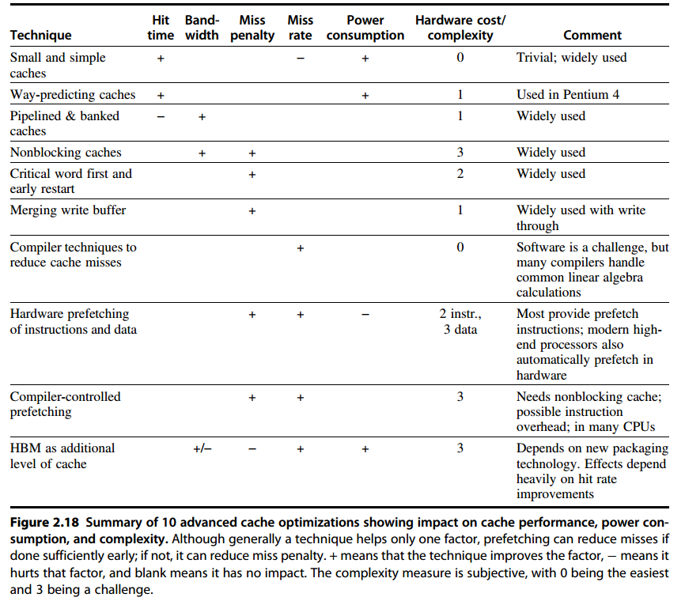

## Basic

* block = line
* block 有很多 word
* 组内并行，组外index
* n-way set associative: n路就是n line/block
* fully associative has just one set
* write-through: cache和memory都更新
* write-back: 更新cache
* write-buffer: 两种都需要
* miss rate
    - compulsory
    - capacity
    - conflict
    - coherency
* Average memory access time = Hit time + Miss rate * Miss penalty
* six basic cache optimizations
    - Larger block size to reduce miss rate
    - Bigger caches to reduce miss rate
    - Higher associativity to reduce miss rate
    - Multilevel caches to reduce miss penalty
        + Hit timeL1 + Miss rateL1 * (Hit timeL2 + Miss rateL2 * Miss penaltyL2)
    - Giving priority to read misses over writes to reduce miss penalty
        + 读优先度一般都高于写，从write buffer中先读
    - Avoiding address translation during indexing of the cache to reduce hit time
        + VIPT
* Ten Advanced Optimizations of Cache Performance
    - classify:
        + Reducing the hit time
        + Increasing cache bandwidth
        + Reducing the miss penalty
        + Reducing the miss rate
        + Reducing the miss penalty or miss rate via parallelism
    - Small and Simple First-Level Caches to Reduce Hit Time and Power
        + high associative reason
            * many processors take at least 2 clock cycles to access the cache and thus the impact of a longer hit time may not be critical
            * VIPT
            * multithreading, conflict misses can increase, making higher associativity more attractive.
    - Way Prediction to Reduce Hit Time
        + extra bits are kept in the cache to predict the way (or block within the set) of the next cache access
    - Pipelined Access and Multibanked Caches to Increase Bandwidth
        + 更深的流水线，缩短了时钟周期、提高带宽；代价increased latency 和分支预测的greater penalty
        + sequential interleaving
    - Nonblocking Caches to Increase Cache Bandwidth
        + 非阻塞：甚至容忍多重缺失
        + 决定支持多少个未处理缺失(outstanding misses)，需要考虑多重因素
            * miss 的时间和空间局域性，决定了一次缺失会除法多少次对下级的新访问
            * 对访问请求作出回应的存储器或缓存的带宽
            * 为了允许在最低级别的缓存中出现更多的未处理缺失(miss time 最长)，需要在较高级别上支持至少数目相等的缺失，这是因为这些缺失必须在最高级别缓存上启动
            * 存储器系统的延迟
        + 具体实现困难
            * arbitrating contention between hits and misses
            * tracking outstanding misses so that we know when loads or stores can proceed
    - Critical Word First and Early Restart to Reduce Miss Penalty
        + 前者：先送word，至于block再说
        + 后者：正常送block，但是到了就立刻发给处理器
        + 优化有限
    - Merging Write Buffer to Reduce Miss Penalty
        + 如果wirte buffer中的地址block和现在要写的地址block号重合，直接修改write buffer中的数据，Write merging
        + IO区域不允许写合并
    - Compiler Optimizations to Reduce Miss Rate
        + 循环嵌套顺序交换，提高空间局域性
        + 分块访问，提高时间局域性。一次算不完，算多次，例如矩阵乘法分成子矩阵乘法
    - Hardware Prefetching of Instructions and Data to Reduce Miss Penalty or Miss Rate
        + 需要利用未被充分利用的存储带宽，可以需要编译器帮助，减少无用预取
    - Compiler-Controlled Prefetching to Reduce Miss Penalty or Miss Rate
        + 编译器插入预取指令
        + 可以分为register or cache，faulting or non-faulting
            * 正常的load可以看作faulting register prefecth instruction
            * cache + non-faulting也称non-binding
    - Using HBM to Extend the Memory Hierarchy
        + DRAM-based L4 Cache with tags stored in HBM
            * Loh and Hill
            * alloy cache
        + two full DRAM accesses: one to get the initial tag and a follow-on access to the main memory

## Replacement Policies
