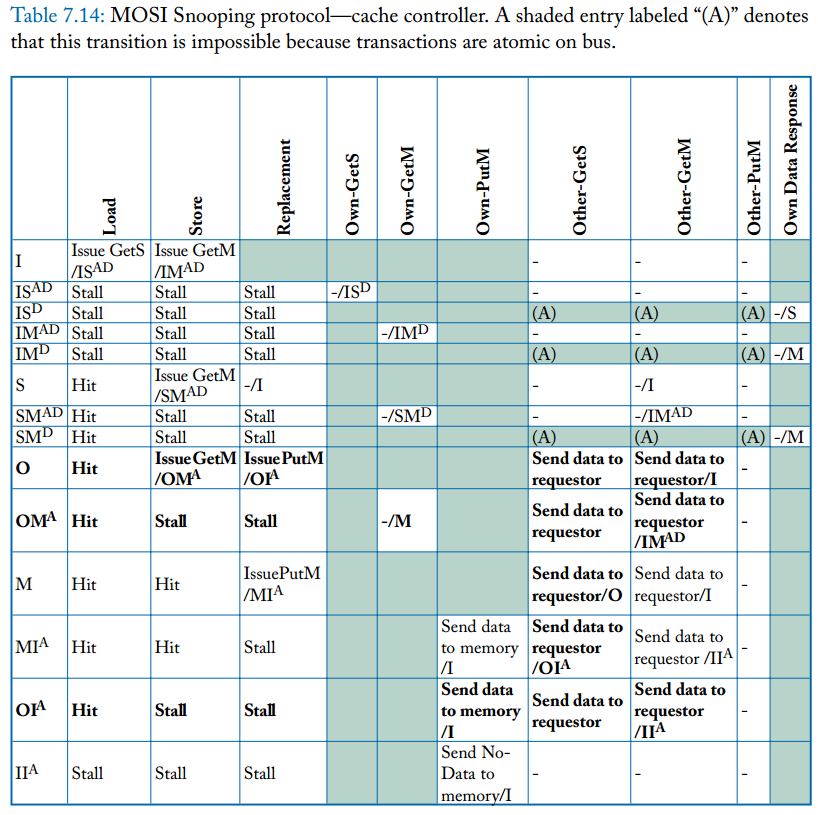
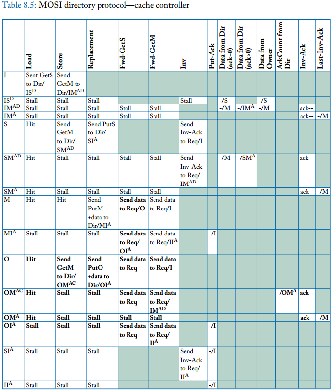

# Coherence (Cache Coherence)

多个actor对一个数据的多份copy的访问权限，并且其中一个访问是写访问。

actor: cores/DMA engine/external device(能够访问内存或者cache)

一般的实现都是传播write操作给所有的cache以至于让一个actor的写操作对其余actor可见。

cache controllers 和 memory controller的状态和动作都需要实现

对程序员不可见，同时对所有存储结构都保持一致性，包括L1/L2/LLC/main memory/L1 ICache/TLB

* 同步传播 snooping和directory都是同步
* 异步传播


## Coherence Interface

Core通过提供两种methods的interface和coherence protocol交互:

* a read-request method that takes in a memory location as the parameter and returns a value
* a write-request method that takes in a memory location and a value (to be written) as parameters and returns an acknowledgment

**分类**：基于是否将coherence和consistency清楚的隔离

1. consistency-agnostic coherence: 对应同步传播
2. Consistency-directed coherence: 对应异步传播，write响应在传播之前就返回了，因此允许不新鲜的数据被观测到，一般在异构系统里边出现（GP-GPU）用于支持吞吐量高

**Coherence Definition:**
```
SWMR: single-write-multiple-reader Invariant:
For any given memory location, at any given moment in time, there is either a single core that may write it (and that may also read it) or some number of cores that may read it. 

Data-Value Invariant:
The value of the memory location at the start of an epoch is the same as the value of the memory location at the end of the its last read-write epoch
```
**粒度：**一般cache-block granularity


*SC:execute all threads’ loads and stores to all memory locations in a total order that respects the program order of each thread.*

**Consistency-Like Definitions of Coherence:**

**Define 1:**
execute all threads’ loads and stores to a single memory location in a total order that respects the program order of each thread.

**Define 2:**
every store is eventually made visible to all cores (liveness invariant)
writes to the same memory location are serialized (safety invariant)

**Define 3:**

1. a load to memory location A by a core obtains the value of the previous store to A by that core, unless another core has stored to A in between; 
2. a load to A obtains the value of a store S to A by another core if S and the load “are sufficiently separated in time” and if no other store occurred between S and the load; and 
3. stores to the same memory location are serialized 

### State

#### Block Characteristics:

* Validity: 可以读，但是同时有也exclusive的时候才可以被写
* Dirtiness: 是最新但是和LLC/memory里的值不一样，cache controller负责最终更新LLC/memory里的值
* Exclusivity: 私有copy
* Ownership: 如果负责处理request，cache controller或者memory controller就是其owner

#### Stable States:
* M(odified): valid, exlusive, owned, and potentially dirty。 cache有valid read-write copy，必须负责请求，LLC/memory中可能stale
* S(hared): valid, not exlusive, not dirty, not owned。cache有read-only copy，其他cache也可能有
* I(nvalid): invalid。cache要不不包括该block要不有一个stale copy。该书不区分这两者，前者也可以叫做Not Present State
* O(wned): valid, owned, potentially dirty, but nor exclusive。cache有一个read-only copy，必须负责请求，其他cache可能有read-only，但是不是owner，LLC/memory中可能stale
* E(xclusive): valid, exclusive, and clean。cache有read-only copy，没有其他cache有valid copy，并且LLC/memory是最新的，将其看成owned，尽管有些协议不看成owned。
* F(orward): 和O类似但是clean的，LLC/memory中是最新的

#### Transient States:
* XY^Z, which denotes that the block is transitioning from stable state X to stable state Y, and the transition will not complete until an event of type Z occurs.
* XY^AZ, in snooping A means waiting for a request to appear on the bus, in directory A means waiting for acknowledgments.

#### States of Blocks in the LLC/Memory:
* Cache-centric: the state of a block in the LLC and memory is an aggregation聚合 of the states of this block in the caches.
* Memory-centric: he state of a block in the LLC/memory corresponds to the memory controller’s permissions to this block 
* 以下都是使用Cache-centeric:
    - If a block is in all caches in I, then the LLC/memory state for this block is I. 
    - If a block is in one or more caches in S, then the LLC/memory state is S. 
    - If a block is in a single cache in M, then the LLC/memory state is M.

#### inclusive LLC维持block的状态:
* 表明LLC保存每一个被cache的block的copy，这样主存不再需要显式的保存block的coherence state，只需要LLC通过添加state bit来维护
* 如果block在LLC，那么他的状态被显式保存
* 如果block不在LLC，那么他的状态隐式为Invalid。

#### 在没有inclusive LLC之前如何在内存中维持block的状态：
* Augment Each Block ofMemory with State Bits
* Add Single State Bit per Block at Memory: I or V
* Zero-bit logical OR: memory的状态由cache里的状态聚合可以得到

### Transactions:


### Major Design Options

Snooping vs. Directory:

* Snooping: cache controller initiates a request by broadcasting a request message to all other coherence controllers. The coherence controllers collectively “do the right thing”. in a total order, but relaxed orders are possible
* Directory: A cache controller initiates a request for a block by unicasting it to the memory controller that is the *home* for that block. The memory controller maintains a directory that holds state about each block in the LLC/memory

Invalidate vs. Update:

* When a core wishes to write to a block, it initiates a coherence transaction to invalidate the copies in all other caches.
* When a core wishes to write a block, it initiates a coherence transaction to update the copies in all other caches to reflect the new value it wrote to the block


## Snooping Coherence Protocols


serialization (ordering) point:

* 事务在不同核心中的发送顺序会影响到缓存一致性的正确性，也会影响内存一致性
* 一般要满足发送请求的Total Order，即所有core看到的请求顺序应该一致，需要仲裁逻辑保证序列化
* 从逻辑上讲，一致性事务(由广播请求和单播响应组成)在请求被排序时发生，而与响应何时到达requestor无关
* 请求出现在总线上和响应到达请求者之间的时间间隔确实会影响协议的实现，但是它不会影响事务的序列化

### Baseline

两种原子特性：

* Atomic Requests: coherence request的发射和order在同一个周期，这样状态不会在发射和order之间发生变化
* Atomic Transactions: coherence transaction是原子的，之后对于相同block的请求不会在这个transaction完成之前出现在总线上


### ATOMIC REQUESTS, ATOMIC TRANSACTIONS


* 阴影部分表示不可能发生的情况
* A表示由于Atomic Transactions的限制而不可能发生的事情
* 空白的表示合理的事件，但是不需要action
* load在S和M都会执行，store只在M时hit

### NON-ATOMIC REQUESTS, ATOMIC TRANSACTIONS


* Upgrade会invalidates all shared copies
* Upgrade操作在Atomic Request的情况下比GetM快，因为不需要等LLC/memory送数据过来，只需要等Upgrade操作serialized，
* 但是没有Atomic Request则需要中间态，在这个状态下等待自己的Upgrade被serialized
* 这个操作的存在会导致两个Upgrade同时发生有一个被invalidate掉了
* 我的评价是不如Exlusive，多加一个状态

### MESI

* motivation: 在MSI中，S->M，需要两个事务，一个getS，一个getM。对于单线程应用则没必要这么做，因此添加一个E，只需要一个getS，然后就在E状态，E到M是silent的
* implemetation:
    - wire-OR
    - Maintaining extra state
* 如果E不是ownership状态：一个解决办法是LLC/memory等cache回应，如果一段时间没有，那么自己回应
    - 缺点是使得去memory找数延迟变高，可使用speculatively prefetch的办法隐藏一些这个延迟。
    - 另外一个缺点就是必须设计可预测且短的回应延迟的系统


### MOSI

* motivation: 
    - 在MSI或MESI中，MorE->S时，需要发送data到memory controller和requestor，owner就变成了memory controller。O状态可以消除这个状态更换过程中的更新LLC/memory的信息传递
    - 同时可以消除非必要的对LLC/memory的写操作（如果在写回LLC之前又被写了）
    - 其次还可以加快其他core的访问速度，cache比memory快





### NON-ATOMIC BUS

* motivation: throughout, latency, bandwidth
* atomic bus, pipelined(non-atomic) bus, split transaction(non-atomic) bus


### STALLING MSI PROTOCOL WITH A SPLIT-TRANSACTION BUS
不足之处：

* stall sacrifices some performance
* stall raises the potential of deadlock, 这里不会因为是两个network
* it enables a requestor to observe a response to its request before processing its own request
    - C1发射X的GetM，然后X状态为IM^AD，C1观察到自己的GetM然后X状态变成IM^D，LLC/memory在内存找数据
    - C2发射X的GetM请求，然后不能被C1处理，因为stall。
    - C1发射Y的GetM，然后不能处理自己的GetM
    - 但是C2可以处理Y的GetM，因此C1能够在自己处理前观察到自己需要的数据。C1的Y的状态就从IM^AD变成了IM^A，数据先到但是request自己还没观察到（别人观察到了自己无法处理）
    - 这样就需要更多的transient states IM^A IS^A和SM^A
* 还有一处不同在于PutM操作。
    - 在之前的操作中，MI^A到II^A后，C1观察到自己的PutM后必须通知LLC的NoData，不能送Data是因为C1的数据已经是stale的
    - 在这里，LLC是带有owner域的，每次改变ownership都会改变该域，这样LLC能够知道PutM是由一个one-owner发出的，因此C1没必要发送NoData给LLC


### NON-STALLING MSI PROTOCOL WITH A SPLIT-TRANSACTION BUS
IS^DI (which denotes “in I, going to S, waiting for data, and when data arrives will go to
I”). 

* implement: add transient states 
* drawback: potential livelock problem
    -  After performing one load or store, it may then change state and forward the block to another cache. 先后顺序不能错
* memory controller还是stall的, no elegant way to bound the number of transient states needed at the LLC/memory to a small number


### OPTIMIZATIONS

这都是NOC的知识：

* separate non-bus network for data response
    - Implementability
    - Throughput
    - Latency
* logical bus for coherence requests
    - topologies with physical total order
    - Logical total order: a total order of broadcasts can be obtained even without a network topology that naturally provides such an order. 


## Directory Coherence Protocols

* transaction steps differs from snooping (unicast request and unicast response, or unicast with, K forwarded request and K response)
* multiple request, ordered in directory, the sencond request might get:
    - processed immediately after the first request
    - held at directory while awaiting the first request to complete
    - negatively acknowledged (NACKed), waiting re-issue and may induce livelock
* lack of a total order, which means explicit acknowledgment (Ack) message once it has serialized the invalidation message.


### BASELINE

特性：

* enforces point-to-point ordering. 如果A送两个消息给B，那么消息是以他们发送时的顺序到达B
* monolithic LLC with a single directory controller
* putS 可以显式或隐式(silently evict Shared block)，以下没说都是显式
* complete directory: for each block in memory, there is a corresponding directory entry.
* three network. Request network / Forwarded Request network(forced p2p ordering) / Response network


需要注意的点：

* I -> S
    - 在IS^D状态，可以接受Invalidation。考虑C1发射GetS然后进入IS^D，然后C2发射GetM。directory首先发射Data回应C1的GetS，然后发射Invalidation回应C2的GetM，由于Data和Invalidation是不同的network，所以能乱序，先看到Invalidation
* I or S -> M
    - 如果directory在I状态，发送Data with AckCount(0)然后进入M
    - 如果directory在M状态，forward the request to owner and updates owner，之前的owner发送Data with AckCount(0)回应Fwd-GetM
    - 如果在S，发送Data with AckCount，发送Invalidations给所有shares，状态改成M。cache controller接受invalidation发inv-ack给requestor，requestor到M状态
    - C1在IM^A状态，可以接受Fwd-GetS。directory已经发送了Data给C1，发送了Invalidation给shares，然后状态改成M。当C2的getS到达directory，forwards给C1，并且可能比Inv-Acks早，因为network不同
    - C1在SM^AD状态，可以接受Invalidation。directory先后收到C2和C1的GetM，所以C1可以在SM^AD收到directory为C2发的Invalidation，从而变成IM^AD，等待数据和AckCount
* M -> I
    - MI^A等效于M，因此需要回应Fwd-GetS和Fwd-getM，对应的进入SI^A和II^A，但是最终都需要等到Put-Ack
* S -> I
    - PutS需要显式发射，这样directory可以更好管理shares

### MESI

如果E不是owner状态，一个E能够被silently驱逐。考虑C1在E，directory收到C2的GetS或GetM。directory知道C1在E/M/I：

* 如果在M，forward request到C1
* 如果在E，C1或者directroy必须回应，数据相同
* 如果在I，directory需要回应

一个解决办法是C1和directory都回应，另一个解决办法是继续forward，先给C1，C1如果在I，那就notice directory去respond给C2；否则C1 responce给C2并且notice directory不要respond


### MOSI

motivation:

* a cache with a block in M that observes a Fwd-GetS changes its state to O and does not need to (immediately) copy the data back to the LLC/memory
* more coherence requests are satisfied by caches (in O state) than by the LLC/memory
* there are more 3-hop transactions (which would have been satisfied by the LLC/memory in an MSI protocol).





* OM^AC表明cache在等cache的Inv-Acks和directory的AckCount。
* C1在OM^AC状态下收到C2的Fwd-GetM，同时C2的GetM比C1的GetM先到directory。因此directory先发送C2的Fwd-GetM，C1意识到C2的GetM是order first的，因此C1会从OM^AC-> IM^AD，等待数据和AckCount
* C1在SM^AD状态下收到C2的Invalidation，同时C2的GetM比C1的GetM先到directory。因此directory先发送C2的Invalidation，因此C1会从SM^AD -> IM^AD，等待数据和AckCount

### Directory Organization

#### directory entry

* coarse directory
    - 如果那个set中一个或多个cache的那个block有S状态，那么那bit置位
    - GetM会invalidation那个set中所有K个cache
    - 用带宽换空间
* limited pointer directory
    - 只存i个shares，每一个需要 log2C bit，一共需要i\*log2C
    - 如果有多于i个shares，解决办法有以下：
* Dir_iX, where i refers to the number of pointers to sharers, and X refers to the mechanism for handling situations in which the system attempts to add an i+1th sharer
    - Broadcast (Dir_iX): 如果已经有i个share，又来一个GetS，directory进入新的状态，接下来的GetM需要broadcast Invalidation到所有cache，而不只是list里的
    - Dir_0B: 广播所有操作，4种状态，MSI+Single Sharer，后者帮助消除S->M状态的广播（类似于E）；I状态帮忙消除LLC/memory拥有block时的广播，AMD’s Coherent HyperTransport直接不需要任何状态全部广播。
    - No Broadcast (Dir_iNB): directory要求一个sharer invalidate 自身，一般不使用，penalties太大
    - Software (Dir_iSW): trapping to software, sharer list可以存在软件管理的数据结构里。performance影响很大
    


#### directory cache


* Directory Cache Backed by DRAM Directory
    - 需要DRAM的大量空间存放不再cache中的block状态
    - 和LLC解藕，可能会在LLC hit但是在directory miss，引发DRAM访问但是数据又在chip内
    - directory的replacement需要写回DRAM，latency和power
* Inclusive Directory Caches 
    - Inclusive Directory Cache Embedded in Inclusive LLC
        + LLC中不存在，就说明状态为I，通过给LLC的每一个block增加额外的状态bit实现
        + LLC需要很高的相联度，有时候需要recall机制
        + LLC inclusion条件需要在更高层的cache中保存冗余copies，因为一般上层的容量占LLC的很大部分甚至超过其容量
    - Standalone Inclusive Directory Cache
        + 需要高相联度，假设C个core每个有K路相联L1 cache，那么directory需要C\*K相联存放所有L1 cache的tags
        + 如果block被L1驱逐，需要显式通知directory。一种常见的优化是在GetS或GetX请求上附带显式的putS。因为索引位必须相同，所以可以通过指定替换的方式对putS进行编码 (replacement hint)
    - Limiting the Associativity of Inclusive Directory Caches
        + 设计A路相联，A < C\*K
        + 如果有新的block，同时全是valid，则directory controller会驱逐这个组里的一个block
        + 发送Recall request给拥有这个block且为valid的所有cache，并等待ack，之后在处理原来的request
        + Conway提出了directory cache大小的rule of thumb 经验法则 (Cache hierarchy and memory subsystem of the AMD Opteron processor. IEEE Micro)
* Null Directory Cache
    - simply forwards to all caches. popular for small-to medium-scal systems
    - Be LLC/directory controller, an ordering point


### Performance and scalability optimizations

#### distributed directories


#### non-stalling directory protocols

* IM^AS: in I, going to M, waiting for Inv-Ack, then going to S
* IM^ASI: in I, going to M, waiting for Inv-Ack, then going to S and then to I.
* memory controller还是stall的
* 


#### p2p ordering

Given that point-to-point ordering reduces complexity, it would seem an obvious design decision. However, enforcing point-to-point ordering prohibits us from implementing some potentially useful optimizations in the interconnection network. Notably, it prohibits the unrestricted use of adaptive routing

#### silent or non-silent evictions of S

* Silent PutS: 特定情况下会增加带宽，例如GetS前的PutS
* Explicit PutS
    - prcise sharer list
        + less Invalidation
        + know last sharer precisely. MESI respond to GetS with Exclusive data
        + recall can benefit
    - eliminating some races
        + 如果没有PutS，cache驱逐S，然后发送GetS重新获取可能在收到自己的GetS数据之前会收到一个来自别的Core的Invalidation，cache就不知道这个Invalidation是第一个S状态的阶段还是第二个重新获取阶段的，最简单的办法就是悲观看成跟第二阶段有关，并且总是刚收到数据就invalidate自己的block。
        

## Advanced Topics in Coherence

Instruction cache

TLB 

Virtual Cache

Write-Through Cache

Coherent DMA

Multi-level cache protocal


Migratory Sharing

False Sharing


Deadlock

Livelock

Starvation


Token COherence