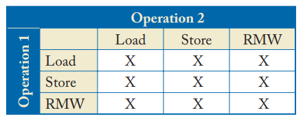
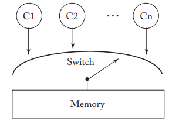
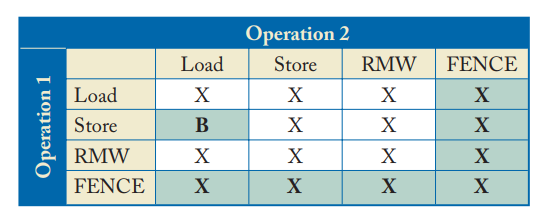
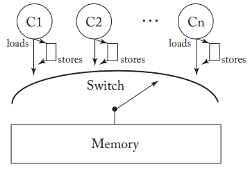
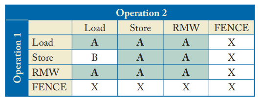
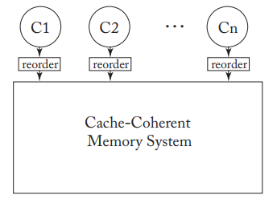
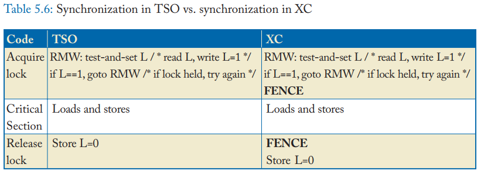
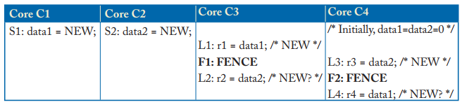

# Consistency (Memory Consistency)

Definition:

Shared memory correctness，关注哪些共享内存的操作会被允许，程序员将知道什么会发生，实现者需要注意的限制

A memory consistency model, or, more simply, a memory model, is a specification of the allowed behavior of multithreaded programs executing with shared memory. 

LLC: last-level cache

* op1 < p op2 表明op1在那个core上的顺序要比op2前
* op1 < m op2 表明op1在内存上的操作顺序要比op2前

## Metric

A good memory consistency model should possess Sarita Adve’s 3Ps plus our fourth P:

* Programmability: A good model should make it (relatively) easy to write multithreaded programs. The model should be intuitive to most users, even those who have not read the details. It should be precise, so that experts can push the envelope of what is allowed.
* Performance: A good model should facilitate high-performance implementations at reasonable power, cost, etc. It should give implementors broad latitude in options.
* Portability: A good model would be adopted widely or at least provide backward compatibility or the ability to translate among models.
* Precision: A good model should be precisely defined, usually with mathematics. Natural languages are too ambiguous to enable experts to push the envelope of what is allowed.

## Strict Consistency

一个hard thread对于数据项x的任何读操作将返回最近一次此hart对x进行写操作的结果所对应的值。

## Sequential Consistency (SC)

### FORMALISM
1. All cores insert their loads and stores into the order < m respecting their program order, regardless of whether they are to the same or different addresses (i.e., a=b or a不等于b). There are four cases：
    * If L(a) <  p L(b) => L(a) < m L(b)    /* Load  -> Load  \*/
    * If L(a) <  p S(b) => L(a) < m S(b)    /* Load  -> Store \*/
    * If S(a) <  p S(b) => S(a) < m S(b)    /* Store -> Store \*/
    * If S(a) <  p L(b) => S(a) < m L(b)    /* Store -> Load  \*/
2. Every load gets its value from the last store before it (in global memory order) to the same address:
    * Value of L(a) = Value of MAX_{< m} {S(a) | S(a) < m L(a)}, where MAX_{< m} denotes “latest
in memory order

Atomic read-modify-write (RMW) instructions

### IMPLEMENTATION

#### BaseLine

* Assume that each Ci is a multitasking uniprocessor, Thread T1’s instructions execute on core C1 until a context switch to thread T2, any pending memory operations must be completed before switching to the new thread
* each core presents memory operations to the switch one at a time in its program order.
* the switch picks one core, allows memory to fully satisfy the load or store, and repeats this process as long as requests exist & not starve a core

#### Optimized SC implementations

*除了专有指令外，普通的读指令也可以用作预读，如Non-Blocking的Load指令。这个读指令与Prefetch指令最大的区别是，这些指令不仅将数据引入Cache层次结构，而且会将结果写入某个寄存器，这类指令也被称为Binding Prefetch。与此对应，在微架构中专门设置的Prefetch指令被称为Non-Binding Prefetch指令。*

*Prefetch指令需要采用Non-Blocking，Non-Exception-Generating方式实现。Non-Blocking较易理解，因为在一个使用Blocking Cache的微架构中，没有使用Prefetch指令的任何必要。在微架构中，一个简单实现Prefetch指令的做法是借用Non-Blocking load指令，并将结果传递给Nobody寄存器，较为复杂的实现是预读数据的同时，引入一些Hint，如微架构将如何使用预读的数据，是写还是读，这些信息有助于多核处理器的一致性处理。*

*Non-Exception-Generating指在Prefetch时不得引发Exception，包括Page Fault和其他各类的Memory Exception。在一些微架构中如果Prefech引发了Exception，获得的数据将被丢弃。此外Exception还会带来较大的Overhead，对Memory Consistency的实现制造障碍。*

1. Non-Binding Prefetching (只要是non-binding的prefetch作用域只在cache-coherent的黑盒中，不会影响SC)
2. Speculative Cores （预测失败的load和store相当于non-binding的预取）
3. Dynamically Scheduled Cores 
以Load-Load违例讲解，L1 < p L2，但是由于reorder，可能会L2先运行，如果被别的core观测到了该core的reorder，将违反SC模型，有两种办法来解决：
    1. 如果任何speculation后的Load的execution和commit之间，Load的所在的block没有离开cache的话，则说明其他的core没有观测到。为了实现这一检查，该core可以将Load的地址和驱逐出去的block的地址和任何coherence的request的地址进行比较，如果相同，则说明其他core观测到了reorder，需要squash所有的推测
    2. 检查Load在commit阶段和最刚开始的时候的值是否发生了变化，如果不相等，说明别的core对该位置进行了操作，推测失败
4. Non-Binding Prefetching in Dynamically Scheduled Cores
SC is not affected by the order of non-binding prefetches
5. Multithreading
每个多线程的core应该逻辑上等价于共享一级缓存的多core。因此需要搞成同一个core上的线程和其他core上的线程应该等价，保证T2不应该比其他core上的thread之前先观测到T1（与T2是同一个core）的Store和Load。因此尽管load-store队列可能是共享的，但是一个线程不能从该队列中读取另一个线程的值用于旁路前传。

Post-retirement speculation:

SC不准简单的使用write buffer来缓解store miss所带来的延迟，因此需要更激进的implementations。

*The key idea is to speculatively retire loads and stores past pending store misses, while maintaining the state of speculatively retired instructions separately at either a fine granularity or coarse-grained chunks.*

Non-speculative reordering:

1. coherence delaying
2. predecessor serialization

#### Atomic operation

Read-Modify-Write(RMW)
1. test-and-set
2. fetch-and-increment
3. compare-and-swap

一张简单的实现原子操作的办法是lock memory system，其他的core无法发出任何memory access。

更为激进的办法在SC中，则是让RMW操作的那个core中的cache block处于M状态，直到store操作完成之后才会相应其他core的coherence request。

更优化的实现：core可以添加推测，例如在read-only state更新到read-write state的时候，load部分就可以执行；在read-write部分，write部分就可以执行；因此只需要检查是否loaded block被驱逐出cache了或者有任何coherence request修改了状态，因此需要像dynamically scheduled cores一样的检测和恢复机制，squash所有推测。

## Total Store Order (TSO)

* write buffer(commiteed stores)
* store queue(uncommiteed stores)

### FORMALISM
1. All cores insert their loads and stores into the order < m respecting their program order, regardless of whether they are to the same or different addresses (i.e., a=b or a不等于b). There are four cases：
    * If L(a) < p L(b) => L(a) < m L(b)  /* Load  -> Load  \*/
    * If L(a) < p S(b) => L(a) < m S(b)  /* Load  -> Store \*/
    * If S(a) < p S(b) => S(a) < m S(b)  /* Store -> Store \*/
    * If S(a) < p L(b) => S(a) < m L(b)  /* 该条取消  \*/
2. Every load gets its value from the last store before it (in global memory order) to the same address:
    * Value of L(a) = Value of MAX_{< m} {S(a) | S(a) < m L(a) or S(a) < p L(a)}, where MAX_{< m} denotes “latest in memory order，比之前的多一个bypass的结果
3. define FENCEs:
    * If L(a) < p FENCE => L(a) < m FENCE   /* Load  -> FENCE 不必要 \*/
    * If S(a) < p FENCE => S(a) < m FENCE   /* Store -> FENCE 必要   \*/
    * If FENCE < p FENCE => FENCE < m FENCE /* FENCE -> FEMCE 不必要 \*/
    * If FENCE < p L(a) => FENCE < m L(a)   /* FENCE -> Load  必要   \*/
    * If FENCE < p S(a) => FENCE < m S(a)   /* FENCE -> Store 不必要 \*/
    * 有必要的两条就可以保证Store->Load的顺序能够被FENCE实现即可。

### IMPLEMENTATION

#### BaseLine

* Loads and stores leave each core in that core’s program order < p.
* A load either bypasses a value from the write buffer or awaits the switch as before
* A store enters the tail of the FIFO write buffer or stalls the core if the buffer is full
* When the switch selects core Ci, it performs either the next load or the store at the head of the write buffer.

*multithreading同样不允许其将一个core中的thread1的write buffer中的值旁路给该core中的其他thread，可以使用带threadid tag的write buffer，也可以每个线程使用独立的write buffer*

#### Atomic instruction

如果将RMW拆成load+store操作，如果load可以从write buffer中pass过来，则store也有可能，但这是不允许的。

1. darins the write buffer before it can perform load part of RMW，同时为了保证load部分需要read-write的权限，cache controller 不能更改在load和store之间的coherence权限
2. 每一个entry都是在read-write权限，并且在RMW commit之前都处于该权限；并且如果一旦发生了load的值更改权限，则需要像之前SC中一样拥有恢复机制，需要squash所有推测。这种情况下不需要drain write buffer

#### Implementing Fences

FENCE禁止load从一个之前的store中bypassing数据。

1. drain write buffer当FENCE执行的时候 & 不允许之后的load执行直到之前的FENCE commite

#### Non-speculative TSO Optimizations

1. Non-speculative TSO reordering
2. RMW without write buffer drain
3. Reordering past a FENCE
(如果需要深入还需要仔细看paper about coherence delays & predecessor serialization)

## Relaxed Consistency (XC)

motivation: improve performance, a few common and important optimizations

1. Non-FIFO, Coalescing Write Buffer (如果没有FENCE隔开entry，可以冲突写，覆盖write buffer中相同的entry提高性能)
2. Simpler Support for Core Speculation (如果使用relaxed模型，可以不用实现复杂的推断判断模块，不需要比较loads和inconming coherence请求的地址是否一致)
3. Coupling Consistency and Coherence (有些情况为了踢开性能，可以open the coherence box，比如允许一部分子集的core去从一个write buffer中获取新值，而另一些cores则只能获取旧值(例如multithreading))

definition: eXample relaxed Consistency model (XC)
* FENCE order所有类型的操作
* 对于相同地址的Load->Load,Load->Store,Store->Store的多core访问强制顺序

### FORMALISM
1. All cores insert their loads, stores, and FENCEs into the order < m respecting:
    * If L(a) < p FENCE => L(a) < m FENCE  /* Load  -> FENCE \*/
    * If S(a) < p FENCE => S(a) < m FENCE  /* Store -> FENCE \*/
    * If FENCE < p FENCE => FENCE < m FENCE  /* FENCE -> FENCE \*/
    * If FENCE < p L(a) => FENCE < m L(a)  /* FENCE -> Load \*/
    * If FENCE < p S(a) => FENCE < m S(a)  /* FENCE -> Store \*/
2. All cores insert their loads and stores to the *same* address into the order < m respecting:
    * If L(a) < p L’(a) => L(a) < m L’ (a) /* Load -> Load to same address \*/
    * If L(a) < p S(a) => L(a) < m S(a)    /* Load -> Store to same address \*/
    * If S(a) < p S’(a) => S(a) < m S’ (a) /* Store -> Store to same address \*/
3. Every load gets its value from the last store before it to the same address:
    * Value of L(a) = Value of MAX_{< m} {S(a) | S(a) < m L(a) or S(a) < p L(a)}, where MAX_{< m} denotes “latest in memory order，和TSO的一致

B表示bypassing，A表示same address要强制顺序

### IMPLEMENTATION
#### Baseline

* Loads, stores, and FENCEs leave each core Ci in Ci’s program order < p and enter the tail of Ci’s reorder unit.
* Ci’s reorder unit queues operations and passes them from its tail to its head, either in program order or reordered within by rules specified below. A FENCE gets discarded when it reaches the reorder unit’s head.
* When the switch selects core Ci, it performs the load or store at the head of Ci’s reorder unit.

The reorder units obey rules for (1) FENCEs, (2) operations to the same address, and
(3) bypassing:

1. 不管地址相不相同，不能reorder: Load->FENCE, Store->FENCE, FENCE->FENCE, FENCE->Load, or FENCE->Store
2. 对于相同地址，不能reorder: Load->Load, Load->Store, Store->Store
3. reorder unit必须保证load能够立即看到他们自己store后的更新值

#### Atomic Instruction
假设动态调度，每一个core都和一个non-FIFO coalescing write buffer连着。

1. 可以借用TSO的，在执行原子操作之前，core先drains write buffer，获得block的read-write coherence权限，然后再执行load部分和store部分，在这期间cache controller不准驱逐block，如果有任何coherence请求到来，必须延迟defer直到store部分完成
2. 但是由于XC允许load和store部分传递和使用之前的stores，因此简单的获取read-write coherence权限之后就行并且不准放弃该block（不放弃等价于不驱逐+defer request）

同步如何实现：

#### Implementing Fences
三种基本的办法实现 Xi < m FENCE < m Yi：
* 实现SC并且将所有的FENCE视为no-ops，商业肯定不这么做
* 等待所有的Xi完成，然后在执行Yi，就是drain
* 将一些必要的操作推前，而不是draining，更加复杂。（如何这么做不在这个书的范围内）

### DATA RACE FREE

DRF要求多线程程序中不能有冲突的操作。用于提供给程序员的一种描述，用于隐藏weak模型下的具体顺序。具体就是保证必要的顺序可以程序再弱一致模型下的执行结果与SC模型下的执行结果一致。具体如下：

* 内存操作分为同步操作，和数据操作。同步操作包括锁获取和释放
* 两个数据操作冲突指他们来自不同的线程，访问相同的内存地址，并且至少有一个是store
* 两个同步操作冲突指他们来自不同的线程，访问相同的内存地址，并且至少有一个同步操作是写
* 两个同步操作Si和Sj轨迹上冲突是指要不他们之间冲突，要不Si与Sk冲突，Sk < p Sk'且Sk'与Sj轨迹上冲突
* 两个数据操作race是指他们冲突并且它们以全局的内存顺序出现，而不会在同一线程i和j之间插入一对轨迹冲突的同步操作。也就是说Di < m Dj不是数据冒险有且仅有当一组轨迹冲突的同步操作Si和Sj使得Di < m Si < m Sj < m Dj
* 一个SC执行如果没有数据冒险则说它是DRF
* 一个程序是DRF如果他的所有SC执行都是DRF的
* 一个内存模型支持 "SC for DRF programs" 指的是如果所有DRF程序的所有执行都是SC执行的结果。这种支持一般需要更多特殊的动作用于同步
* 一个最简单的办法说明XC支持 "SC for DRF prgrams"就是在每一个XC程序中的内存操作之间都加入FENCE，它满足DRF
* 但是要保证DRF的同时情况下还保持高性能是很难的事情，例如编译器需要架构师的帮忙

### RELAXED MODEL CONCEPTS

#### Release Consistency

在XC中，Acquire只需要一个后置的FENCE，Release只需要一个前置的FENCE。但实际上，还可以更激进一些，让临界区FENCE之前的Store和Load在改FENCE之后运行也没有关系，反之在临界区FENCE之后的Store和Load在改FENCE之前运行也没有关系。

RC提供ACQUIRE和RELEASE两个操作类似于FENCE，然是只限定一个方向，而不是像FENCE一样指定两个方向。

* ACQUIRE -> Load, Store (不强求 Load, Store -> ACQUIRE)
* Load, Store -> RELEASE (不强求 RELEASE -> Load, Store)
* ACQUIRE 和 RELEASE 则是SC顺序：
    * ACQUIRE -> ACQUIRE
    * ACQUIRE -> RELEASE
    * RELEASE -> ACQUIRE
    * RELEASE -> RELEASE

#### CAUSALITY AND WRITE ATOMICITY

causality: 如果我看见并且告诉你了，那你也会看见（因果关系）
write(store, multi-copy) atomicity: 一个core的store逻辑上只被所有其他core看到一次

* Write atomicity implies causality
* Causality does not imply write atomicity

假设C1和C3是同一个mutithreading core的两个thread，共用一个write buffer，所以C3能够提前看到L1。同样假设C2和C4一样，所以C4能够提前看到L3。这样C3的r1位new，r2为0；C4的r3为new，r4为0。这样C4看到了新的值，但是C3却没有看到，违反了write atomicity，但是没有违背因果关系。

XC两者都满足，XC is write atomic by definition since its memory order (< m) specifies a logically atomic point at which a store take effect at memory。

### CASE STUDIES

#### RISC-V Weak Memory Order (RVWMO)

* RISC-V also specifies a TSO variant called zTSO(standard extension for TSO) which is not discussed in this section.
* combine aspects of RC and XC
* loads and stores can carry annotations:
    * a load instruction can carry an ACQUIRE annotation
    * a store instruction can carry a RELEASE annotation
    * an RMW instruction can be annotated with a RELEASE, ACQUIRE, or both RELEASE and ACQUIRE.
* RELEASE/ACQUIRE orderings
    * ACQUIRE-RC_pc, ACQUIRE-RC_sc, RELEASE-RC_pc and RELEASE-RC_sc
    * PC means Processor Consistency, a less-foarmal precusor to TSO, without TSO's write atomicity property
    * load(store) 可以带任何一种annotations, RMW只能带RC_sc annotations
    * ACQUIRE -> Load, Store (两种ACQUIRE都是)
    * Load, Store -> RELEASE (两种RELEASE都是)
    * RELEASE-RC_sc -> ACQUIRE-RC_sc
    * pc和sc的下标区别没说，不知道啥意思
* FENCE orderings
    * FENCE RW, RW: 和XC一样强制Load, Store -> Load，Store顺序
    * FENCE RW, W: 强制 Load, Store -> Store
    * FENCE R, RW: 强制 Load -> Load, Store
    * FENCE R, R:  强制 Load -> Load
    * FENCE W, W:  强制 Store -> Store
    * FENCE.TSO.FENCE R, R: enforces the Load -> Load orderings only. FENCE.TSO enforces the Load -> Load, Store -> Store and the Load -> Store orderings but not Store -> Load.
* Dependency-induced orderings
    * adderss dependency induced ordering
    * data dependency induced ordering
    * control dependency induced ordering
    * pipeline dependency induced ordering
    * 所有的dependencies是指语法syntactic上的依赖而不是semantic语义上的依赖，也就是是寄存器级别的依赖不是真实内存值的依赖
* Same address orderings
    * enforces Load -> Store, Store -> Store orderings and does not enforce Store -> Load orderings to the same address
    * does not enforce Load -> Load ordering to the same address in all situations.
    *  It is only enforced when: (a) there is no store to the same address between the two loads and (b) the two loads return values written by different stores. 
* RMWs
    * (atomic memory operations) AMO
    * load reserved/store conditionals (LdR/StC) 加载保留条件存储
    * LdR load一个值并注册，StC只有reservation还成立才能成功
    * AMO当load和store在global memory order上是连续的，则是原子性的
    * 假如LdR读取了一个store s产生的值，LdR/StC只有当全局内存上的s和StC之间没有store操作才说是原子性的。

#### IBM Power

暂略

## Processor Consistency

在单一一个处理器上完成的所有写操作，将会被以它实际发生的顺序通知给所有其它的处理器，但是在不同处理器上完成的写操作也许会被其它不同的处理器以不同于它实际执行的顺序所看到。基本的想法是“处理器一致性“可以更好的反映真实的网络 — 网络中不同节点的延迟可能是不相同的。

wherein a core’s stores reach other cores in order but do not necessarily reach other cores at the same "time".

## Reference

S. V. Adve and K. Gharachorloo. Shared memory consistency models: A tutorial. IEEE Computer, 29(12):66–76, December 1996. 

Gharachorloo, K., D. Lenoski, J. Ludon, P. Gibbons, A. Gupta, and J. Hennessy, “Memory consistency and event ordering in scalable shared-memory multiprocessors,” in Proceedings of the 17th International Symposium on Computer Architecture (1990) 15-26

