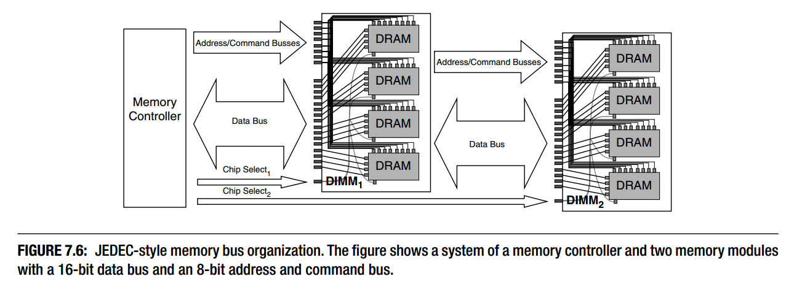

## RAM & ROM

### SRAM

* Array
* Cell
    - 6T

* 具体操作：
    - 写： BL写1，BLB写0，然后WL写1，写数值1；WL写0，BLB写1，两侧晶体管尺寸更大，驱动能力更强，导致内部锁存的值翻转变为0
    - 读： 将BL和BLB写1，然后WL有效，如果是1，那么BL会被拉向1，BLB会被拉向0。如果是0，那么BL会被拉向0，BLB会被拉向1

### DRAM

* DIMMs
    - 一般有两个rank
* Rank
    - 一般有9个bank，第9个是ECC
* Bank
    - 一般是x8，也就是8bit的位宽；也叫x8 DRAM
* Array
    - x1，x8的bank里边有8个array
* Cell
    - 1T1C

具体操作（以后再细写）：

* 发行地址i，RAS(Row Access Strobe)
* 然后列地址j，CAS(Column Access Strobe)

### ROM

* ROM
* PROM
* EPROM
* EEPROM
* flash, 基于EEPROM
* SSD, 基于flash

### Flash

* NOR Flash
    - 支持XIP
    - Parallel NOR Flash(SRAM Controller): 速度慢被淘汰了
    - Serial NOR Flash(SPI controller)
* NAND Flash: SSD
    - U盘，SSD，eMMC
    - SLC（Single-Level Cell）、MLC（Multi-Level Cell） 和 TLC（Triple-Level Cell）
    - 单个存储单元存储的比特位越多，读写性能会越差，寿命也越短，但是成本会更低
    - 高端SSD会选取MLC甚至SLC，低端SSD则选取TLC。SD卡一般选取TLC。

NAND Flash相对NOR Flash更可能发生比特翻转，就必须采用错误探测/错误更正(EDC/ECC)算法，同时NAND Flash随着使用会渐渐产生坏块；我们在使用NAND Flash的SD卡上经常使用FAT文件系统，文件分配表会被频繁改写，而每块的擦写次数是NAND Flash寿命的决定性因素。如何才能平衡各块的擦写和为可能的坏块寻找替换呢？通常需要有一个特殊的软件层次，实现坏块管理、擦写均衡、ECC、垃圾回收等的功能，这一个软件层次称为 FTL（Flash Translation Layer）。根据 FTL 所在的位置的不同，可以把 Flash Memory 分为 Raw Flash 和 Managed Flash 两类：

## Disk

组件：

* platter
    - 每个platter有两个surface
* spindle
    - 固定的rotational rate，通常是5400 ~ 15000没分钟 RPM(revolution per minute)
* track
    - 同心圆
* sector
    - 每个磁道划分为一组扇区，每个扇区包含相等数量的数据位，通常是512字节
* gap
    - 扇区之间没有数据
* disk drive
    - 整个装置包括一个或多个platter
* cylinder
    - 描述多个盘片驱动器的构造

容量计算：

* 记录密度(recording density)
    - 位/英寸：磁道一英寸的段中可以放入的位数
* 磁道密度(track density)
    - 道/英寸：从盘片中心出发半径上一英寸的段内可以有的磁道数
* 面密度(areal density)
    - 位/平方英寸：两者的乘积
* 磁盘容量=字节数/扇区 * 平均扇区数/磁道 * 磁道数/表面 * 表面/盘片 * 盘片数/磁盘

延迟计算：

* seek time
    - 定位磁道，平均3~9ms，最大甚至达到20ms
* rotational latency
    - 定位扇区，最大延迟是刚错过，Tmax = 1/RPM * 60s/1min，平均是最大的一般
* transfer time
    - 依赖于旋转速度和每条磁道的扇区数目，Tavg = 1/RPM * 1/(平均扇区数/磁道) * 60s/1min

寻址：

* 逻辑磁盘块，磁盘控制器硬件转化为盘面，磁道，扇区

## CAM

* 里边存 (key, value); 要求给key，查value
* content addressable memory，其实在chach查找tag就是类似的过程

