# Virtual Memory

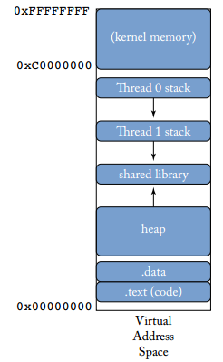

## Share Memory

1. HOMONYMS: 不同进程的相同虚拟地址映射到了不同的物理地址

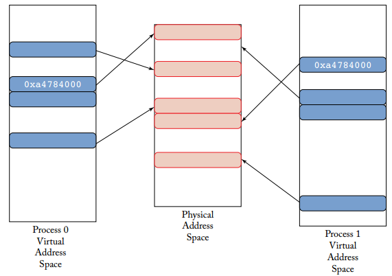

2. SYNONYMS: 同一个进程的不同的虚拟地址映射到了同一个物理地址

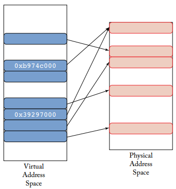

## Introduction

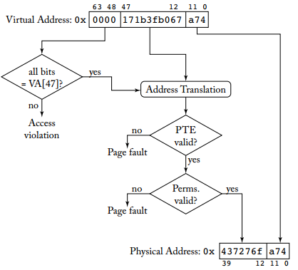

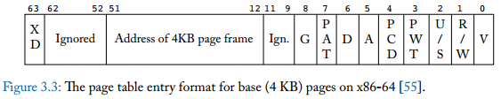

* XD: Excution or data
* G: global
* PAT,PCD,PWT: cacheability of th memory region
* D: dirty
* A: access
* U/S: privilege
* R/W: read or write
* V: valid

1. Multi-level page table

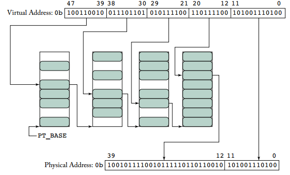

2. page table walk
3. translation lookaside buffer
4. page fault
    1. minor page fault: frame在，但是translation不在（出现的情况可能实在lazy allocation的时候）
    2. major page fault: 需要从磁盘里获取
5. segmentation

## Modern VM Hardware Stack

1. Inverted Page Table

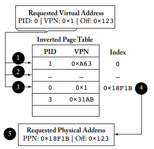
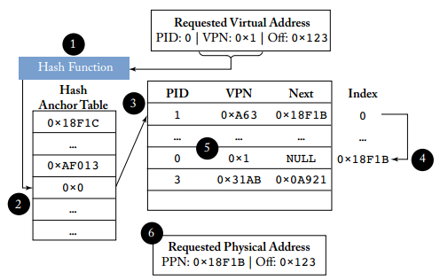

2. TLB
    1. MULTI-LEVEL TLBS
    2. TLB PLACEMENT RELATIVE TO CACHES
        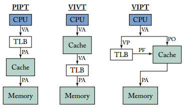
        1. PIPT
        2. VIVT
        3. VIPT
            1. page coloring
        4. PIVT
    3. TLB REPLACEMENT POLICIES
        1. L1 randomized replacement
        2. L2 FIFO/pseudo-LRU/LRU
3. MULTIPLE PAGE SIZES
4. PAGE TABLE ENTRY METADATA
    1. permission bit
    2. access & dirty bit
    3. pid(asid) & global bit
5. PAGE TABLE WALKERS
    1. Software-Managed
    2. Hardware-Managed
    3. MMU cache
    
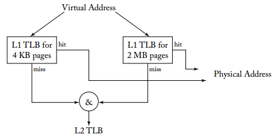
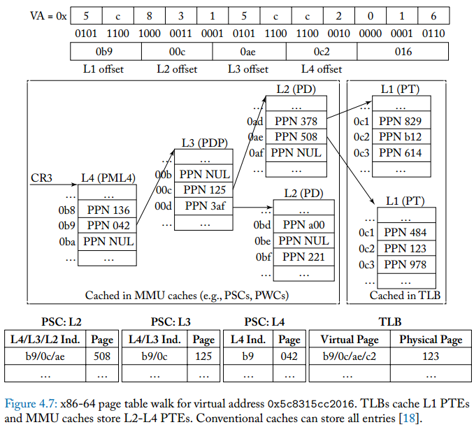

## Modern VM Software Stack

1. VIRTUAL MEMORY MANAGEMENT
    1. DEMAND PAGING AND LAZY ALLOCATION
        * 分配只出现在程序尝试访问一个新的页面的时候
    2. COPY-ON-WRITE
    3. ADDRESS SPACE LAYOUT RANDOMIZATION
2. MANAGING LOCALITY
    1. WORKING SETS
    2. PAGE REPLACEMENT POLICIES
        1. Belady’s algorithm
        2. FIFO
        3. LRU (pseudo-LRU)
    3. PAGE BUFFERING
3. PHYSICAL MEMORY ALLOCATION
    1. MEMORY ALLOCATORS
        1. Best Fit
        2. First Fit
        3. Worst Fit
        4. BUDDY ALLOCATION
        5. SLAB ALLOCATION
    2. PAGE COLORING
    3. REVERSE MAPPINGS