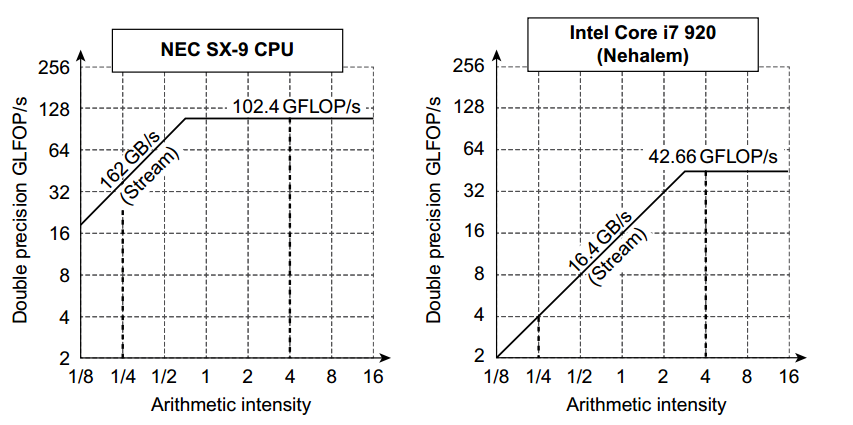

# SIMD

## VECTOR

* Loops can be vectorized when they do not have dependences between iterations of a loop, which are called loop-carried dependences
* pipeline stalls are required only once per vector instruction, rather than once per vector element. Vector architects call forwarding of elementdependent operations chaining, in that the dependent operations are “chained” together
* excution time
    - length of operand vector
    - structural harzards among the operations
    - data dependences
* convoy 护航指令组
    - 一组一直可以执行的向量指令，可以通过计算护航指令组的数目估计性能
    - 不能包含任何结构性冒险
    - 原本应该不能包含RAW相关冒险，但是可以通过chain操作允许位于同一个convoy
* chain 实现
    - 允许处理器同时读写一个特定的向量寄存器，不过读写不同元素；类似转发
    - 灵活链接，在没有结构性冒险的情况下可以链接到其他任何活动指令
* chime 钟鸣
    - 执行convoy需要的时间单位，m个convoy需要m次chime
    - clock cycle = vector length * chime / lane
* start-up time
    - the latency in clock cycles until the pipeline is full
    - 这个时间由流水线中的vector functional unit的延迟决定
* trip mining
* vector-mask control
    - 编译器显式操作，不像GPU硬件操作
* memory bank
    - 一周期多个load/store
    - 非连续取址
    - multiple processors sharing the same memory system, so each processor will be generating its own separate stream of addresses
* address mode
    - unit
    - stride
    - gather-scatter

## Multi-Media SIMD

* 简化Vector
    - 固定了操作代码中数据操作数的数目，而不是通过向量长度寄存器指定
    - 只支持unit adderss
    - 没有mask
* 一般来说该扩展目的是为了加快库的运算速多，而不是有编译器生成这些库
* roofline模型
    - 运算密度 Arithmetic intensity：运行程序是所执行的浮点运算数除以在主存储器中访问的字节数；FLOPS/byte
        + 越大说明受带宽的影响越小
        + 越小说明受带宽的影响越大
    - 双精度浮点性能：FLOPS/s
    - 针对单位stride的存储访问和双精度浮点性能
    - Attainable GFLOPs = Mins(Peak Memory BW * Arithmetic Intensity, Peak Floating - Point Perf)
    - roof：受计算功能限制
    - scope：受带宽限制

## GPU

以下已Fermi体系结构为例：

* grid: the code that runs on a GPU that consists of a set of Thread Blocks
* thread block: 最多512个线程，类似于一个向量长度为32(warp大小为32)的带条挖掘向量循环
* Thread Block Scheduler: assign a thread block to a MP(SM) to execute that code
* SM: multithreaded SIMD Processor. (Streaming Multiprocessor)
    - warp调度程序
    - 线程处理器(SP, streaming processor)
* 调度层
    - 线程块调度: 将block分配给SM
    - warp调度: 将warp调度给SP们运行
        + 每次调度一个warp(n个线程)执行同一条指令

具体：

* Fermi把32个thread作为一个Warp
* Warp Scheduler的准入容量是48个Warp
* 2个Warp Scheduler，core也被分成2组，每组16个core，因此一个Warp分两个cycle执行完一条指令
* LD/ST
    - 16个LD/ST辅助模块，可满足一个Warp从Share Memory或Video Memory加载(Load)或存储(Store)数据。
* SFU
    - Fermi有4个SFU，负责计算特殊的ALU运算，如SIN、COS，平方根等等，另外SFU还负责为每个像素插值。
* Dispatch Unit
    - 48个Warp是以SIMT（单指令多线程）的方式同时运行在16个core上的，每个Warp在Register File都有自己的一份。
    - 在每个cycle，Dispatch Unit负责决定何个Warp的何条指令来使用这16个core，执行一条指令。
* 存储
    - RF
        + 一块on-chip的SRAM，当一个Warp被Warp Schedule接受时，Warp Schedule将从Register Files中为其分配一组物理寄存器，知道Warp运行结束后才释放回收。
        + 每个core(lane，车道）上运行的thread拥有自己的一份寄存器。类似CPU，从寄存器加载或存储到寄存器只需一个或几个cycle。
    - L1 cache & Share Memory
        + Fermi有一个64K的on-chip SRAM作为L1 Cache，L1 Cache有两种使用模式
            * 48K数据缓存+16K Share Memory
            * 16K数据缓存+48K Share Memory
        + 数据缓存pipeline中临时Geometry数据，Share Memory一般作为通用计算中Warp的每条thread共享存储，交流数据。
    - L2 Cache
        + Fermi有768K的L2 Cache，作用与CPU类似，到DRAM（Memory）读数据需要几百个cycle，L1 Cache不够存储量不够大的情况下，通过L2提高命中率减少些访问时间

条件分支：

* 每个warp都有自己的栈，栈项包括标识符标记，目标指令地址和目标线程活动mask
* 内部mask
    - 简单的IF ELSE
* 分支同步栈
    - 复杂的采用特殊指令+标记，当某些车道跳转到目标地址时，这些GPU分支指令会使用这个栈压入一个栈顶，说明发生了分支分叉diverges，汇合时弹出栈顶，并跳转到具有栈顶线程mask的栈顶地址
* 指令标记

