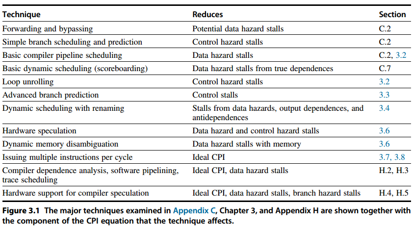
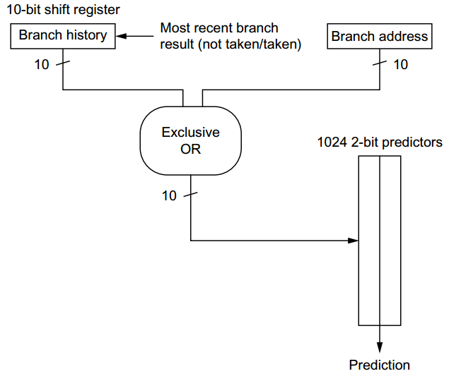
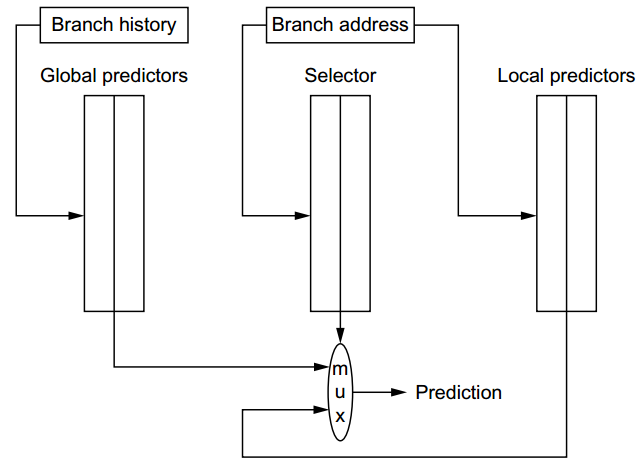
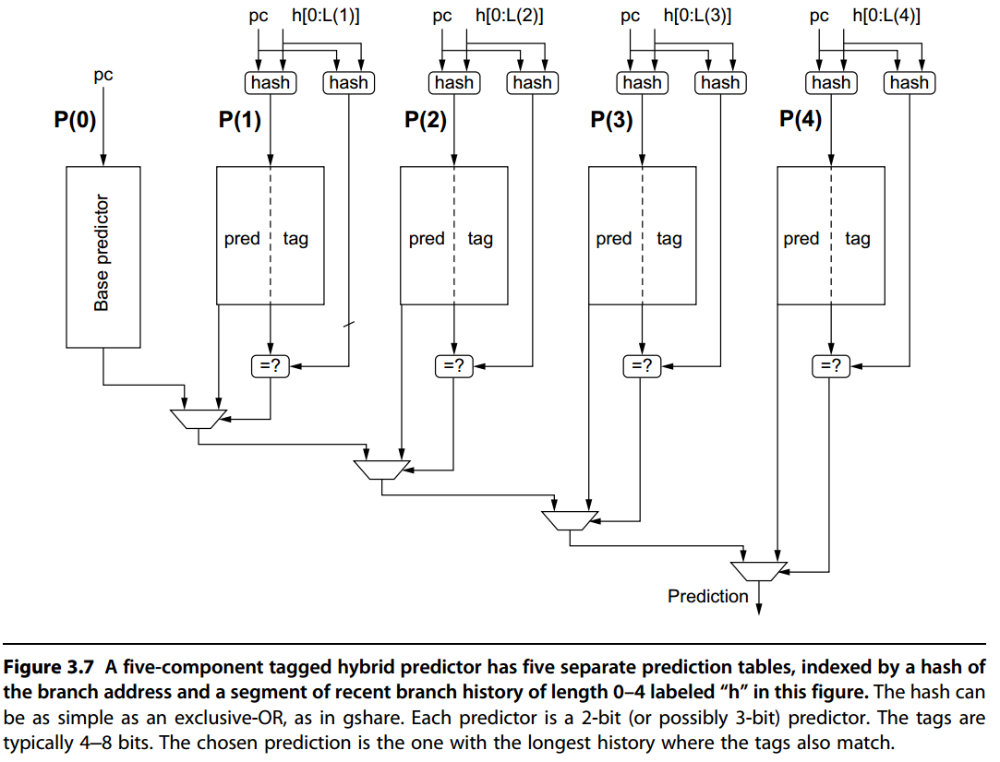
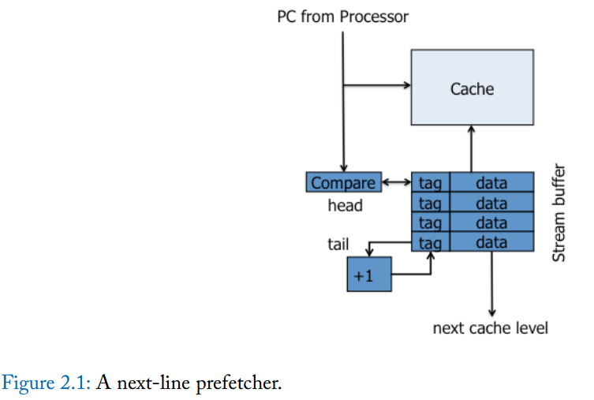
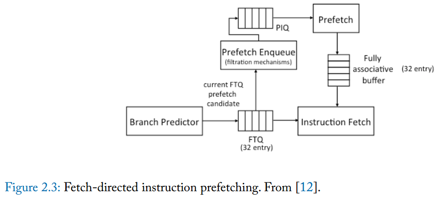
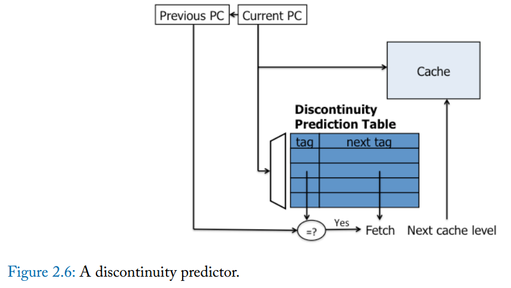
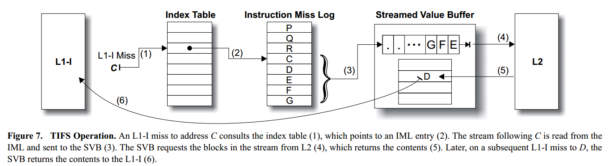
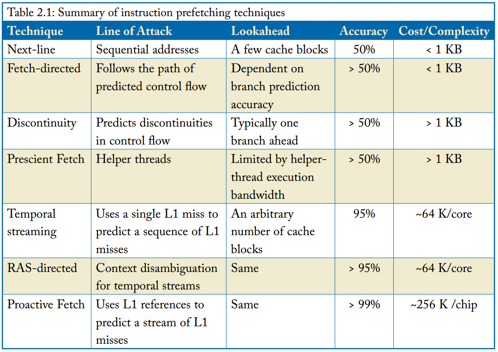
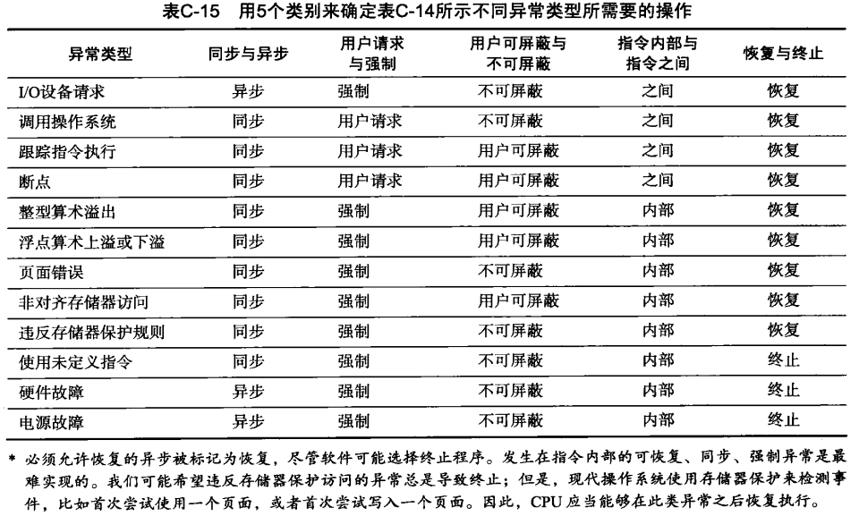

# ILP

amdahl定律：加速比=1/[(1-a)+a/k],k为并行带来的提升比例，a为可以并行的部分

Pipeline CPI = Ideal pipeline CPI + Structural stalls + Data hazard stalls + Control stalls

## 数据相关

* 真数据相关 RAW
* 名称相关
    - 反相关 WAR
    - 输出相关 WAW
    - 可通过寄存器重命名解决，可软可硬
* 控制相关
    - 分支预测
    - 推测，可软可硬

## 基本编译器技术

* 确认循环迭代不相关，判定展开循环有用
* 使用不同寄存器，避免名称相关
* 去除多余的测试和分支指令，调整循环终止与迭代代码
* 代码调度，保留任何必要相关

## 分支预测

* 预测方向
    - 一级预测器
    - (m,n)相关分支预测/二级预测器:
        + 二级的意思是先index再hitory (用PC和history来concat或者某一项当tag都可以使用，相联度的问题；也有hash版本)
        + 最近的m次分支的全局历史能被存在一个m-bit的移位寄存器中
        + idea: combine local and global info to predict
            * local : n-bit 预测器
            * global: m-bit 移位寄存器
        + branch prediction buffer/branch history table/pattern history table
            * 每个index 存在一个n位的预测器
            * index为分支PC的低位+m位移位寄存器的值
        + 没有全局历史的2位预测器就是(0,2)预测器，退化为了一级预测器
        + 1K项的(2,2)预测器甚至比4K项的(0,2)预测器强不少
        + 最出名的相关预测器为 McFarling’s gshare predictor；经常被拿去与更复杂的预测器对比
        + combine local branch info 和 global branch history的预测器也叫alloyed predictors 或 hybrid predictors
    - Tournament Predictors（竞赛预测器）： Adaptively Combining Local and Global Predictors
        + another form of hybrid or alloyed predictors
        + 拥有全局预测器和局部预测器，并动态选择结果
        + 全局预测器：使用most recent branch history来index preditor
        + 局部预测器：使用address of the branch来index preditor，更复杂的甚至可以使用二级预测器，例如Alpha 21264
        + 选择器：使用address of the branch来index一个2bit预测器，用来选择使用哪个预测器的结果
    - Tagged Hybrid Predictors
        + Prediction by Partial Matching
        + TAGE—TAgged GEometic—predictors

gshare predictor: XOR hashed result is used to index a prediction array of 2-bit counters

tournament predictor:

tagged hybrid predictor:

* 预测地址
    - BTB
        + branch-target buffer 也叫 branch-target cache
        + idea: 上次branch X选择跳转去了Y，下次也有可能跳转去Y，所以我要记住Y
        + IF阶段通过BHT决定是否跳转，如果跳转则选择BTB中的PC；所以BHT预测需要跳转时必须和BTB中有对应的项
        + ID阶段到EX阶段
            * 已经预测跳转获得了跳转目的地址
                - 实际跳转了，但地址不对：更新目的地址
                - 实际跳转了，地址是对的：啥都不做
                - 实际不跳转：根据更新后的BHT选择是否删除BTB或者不删除
            * 预测不跳转，PC=PC+4
                - 实际需要跳转：把跳转地址加入BTB
                - 实际不需要跳转：啥都不做
        + 存储多个Target变体：
            * 存储多次跳转
            * Branch folding is a technique where, on the prediction of most branches, the branch instruction is completely removed from the instruction stream presented to the execution pipeline
    - RAS return address stack
        + 目的：间接跳转，指那些跳转地址会变化的，大多数都是函数的返回操作，尽管可以用BTB预测，但是调用地方分散，预测准确性会很低
        + 当执行函数调用(call)时，将函数返回地址(Return Address)入栈
        + 当函数返回(return)时，直接从栈中弹出地址进行取指令
        + riscv-spec中还明确了RAS的push/pop条件与规范

## 预取

* 预测地址
    - 覆盖率衡量预测成功占处理器显式请求的比例
    - 精确度衡量预测有用占所有预测的比例
* 预测什么时候发射预取
    - 早了会没地方放或者驱逐了有用的数据
    - 晚了性能不好，降低有效性，而且增加了带宽
* 选择在哪里存放预取数据
    - binding prefetch，预取结果在预取发射的时候直接存放带寄存器内
        + 占用寄存器数量
        + 强制硬件执行预取，即使内存系统已经高负载
        + 在预测地址错误的情况下，导致语义困难（一个invalid地址的预取是否应该导致内存错误）
        + 不清楚如何将这一策略应用到指令中
    - non-binding prefetch
        + directly into cache hierarchy
        + or into supplemental buffers that augment the cache hierarchy 并且并发access
            * 一起参与coherence protocol，因此预取和真实访问之间可能也会发生变化

### 指令预取

* next-line prefetching
    - stream buffer: stores prefetched 从更低cache级检索来的instruction cache blocks
    - 每次prefech buffer中的block被processor requested，则把这个block传给cache，并prefetch下一个连续的block
* fetch-directed prefetching
    - fetch-directed instruction prefetching (FDIP) is one of the best branch-predictor-directed techniques
    - fetch target queue (FTQ)，该模块需要由分支预测器来决定，应该就是现在的PC+一堆后边的PC+后边的PC是否在BTB有项，有的话就从BTB里区target
        +  On every cycle, the branch prediction unit predicts the next basic block and inserts it into the FTQ
        +  需要basic-block-oriented BTB
    - 需要一个prefecth enqueue模块
        + 利用空闲时候，将FTQ中的地址和L1 I cache中的所有地址进行对比 查看cache中是否已经有了相应数据
        + 因此只enqueue没有的地址到prefetch instruction queue(PIQ)中，然后通过预取机制将数据存放到fully associative buffer中
    - IF模块从并行从buffer和cache中取数
    - 存在迭代，复杂度指数上升的问题
* discontinuity prefetching
    - 参考不连续表，在匹配时，除了顺序的路径之外，还会预取不连续的路径
    - 但是一次只能预取一个block，如果迭代，复杂度会指数上升，但是一个block里边可能有多个branch
* prescient fetch
    - use helper threads to identify critical computation and control transfers and perform them early, assisting the main thread that runs slower and in parallel with the helper thread
* temporal instruction fetch streaming
    - increases lookahead
    - 通过history的miss log来记录多个streaming，从而缓解看得不够深的问题
* return-address stack-directed instruction prefetching
    - 字面意思，利用RAS来预取
    - 在调用堆栈中捕获的程序上下文与L1指令丢失密切相关
* proactive instruction fetch
    - 和TIFS同作者，区别如下
    - record the sequence of cache blocks accessed by the committed instruction sequence (rather than instruction fetches that miss in the cache) 
    - separately record streams that execute in the context of interrupt/trap handlers

### 数据预取

## 流水线简介

* IF: 取指
* ID: 译码，读取寄存器并行执行，固定字段译码
* EX: 
    - 存储器引用 —— ALU将基址和偏移相加
    - 寄存器-寄存器ALU
    - 寄存器-立即数ALU
    - 条件分支，决定是否条件为真
* MEM: 访问内存
* WB: 寄存器-寄存器ALU指令或load指令

Speedup = Pipeline depth / (1 + Pipeline stall cycles per instruction)

## 流水线冒险

* 结构冒险：硬件无法同时支持指令的所有可能组合方式，出现资源冲突
    - 完全流水化指该非流水话单元能以没周期一条指令速度前进，如果没有则会出现结构冒险
    - 另一种常见方式是某资源复制不足
        + 如果内存只有一个端口且不是Inst和Data分开(MEM和IF不能同时)。解决办法是bubble，占据空间不执行，不同于流水线停顿，和flush相同
        + 寄存器堆只有一个写端口。使用停顿解决
* 数据冒险：指令取决与之前指令的结果，i->j都使用寄存器x
    - 分类：
        + RAW: j读x出现在流水线i写x的前边
        + WAR: j写x出现在流水线i读x的前边，简单五级流水线不可能出现
        + WAW: j写x出现在流水线i写x的前边，同样不可能出现在简单五级流水线
    - 解决办法：
        + forwarding，旁路转发
            * ex/mem和mem/wb -> ALU输入
            * mem/wb -> memory load输入 （ld x4, 0(x1)）
        + stall，停顿，流水线互锁 pipeline interlock
            * 流水线互锁检测冒险，冒险清除之前流水线停顿，冒险指令之后的所有指令停止前往下一个阶段，直到清除冒险
            * 载入互锁需要stall，因此需要流水控制额外判断
* 控制冒险：分支指令一级其他改变PC的指令可能导致的冒险
    -  解决办法：
        +  如果在ID截断检测分支，则对分支之后的指令重新取值，第一个IF是一个停顿
        +  降低流水线分支代价
            *  冲刷流水线，保留或删除分支之后的所有指令，如果在ID检测到跳转则冲刷一个指令，如果在EX则冲刷两个指令
            *  静态分支预测
                -  预测不跳转
                -  预测跳转
                -  延迟分支，分支槽，一般都不用了。局限性：对于可排的指令有限制，编译时预测分支可被选中的能力优先。一般都有一种取消分支的能力，取消的时候分支槽里边转为空
            *  动态分支预测
                -  branch-prediction buffer也叫branch history table，用来存预测位
                -  两位更好，因为分支选中和不选中并非均等，而是严重偏向一种状态，2为预测率更低，但是n位效果几乎和2位一样
                -  4000项，性能和无限缓冲区相当
        +  分支预测性能
            *  Pipeline speedup = Pipeline depth / (1 + Branch frequency * Branch penalty)

## 流水线实现
 
* stall机制（载入互锁）的控制判断
* 旁路转发的机制控制判断
* 分支提前在ID阶段发送给PC

## 异常

* 异常
    - 同步和异步
    - 用户请求与强制
    - 可屏蔽和不可屏蔽
    - 指令内（这条指令触发异常）与指令之间
    - 恢复与终止

发生异步时：

* 可在下一个IF想流水线强制插入一个trap指令
* 在选中该trap指令之前，进制错误指令的所有写入操作，禁止流水线中后续所有指令的写入操作
    - 从该异常指令开始，将流水线中所有的指令的流水线锁存置零。这样可以禁止在处理异常之前对未完成指令的状态进行任何更改
* 在操作系统的异常处理程序接受控制权之后，立刻保存故障指令的PC，后边从异常返回时用到该PC
    - 流水线中的指令可能不是顺序相关，所以仅用一个PC不再可能重建处理器的状态。需要保存和恢复的PC数目等于分支延迟的长度加1

恢复时：

* 特殊指令重新加载PC并重启指令流。
    - 如果流水线可以停止，使紧邻错误之前的指令能够完成，之后的指令可以从头重新开始，则说拥有精确异常
* 同步异常一般都是精确的
* 非精确异步异常一般是读写存储器出错，在写回机制的cache中，在真正写回时发生了异常，但是你已经定位不到之前的异常指令了。

## 多周期操作

* 延迟： 生成结果的指令和使用结果的指令之前的周期数
    - ALU运算的延迟为0，因为可以转发
    - 载入指令的延迟为1，载入互锁需要stall
* 启动间隔：发出两个相同类型的操作之间必须相隔的周期数

### 长延迟流水线中的冒险和转发

* 结构冒险
    - 除法单元未被完全流水化，需要停顿同类型指令发射
    - 同一个周期可能需要写多次寄存器组
        + 可以跟踪ID级对写端口的使用，并在该指令发射之前使其停顿（如果没有buffer则需要同时停顿之后的指令获取）其实就是暂停之后的所有指令
            * 实现方法是使用一个移位寄存器跟踪写端口的使用，如果ID的指令需要于已发射的指令在通已周期使用寄存器，则停顿1周期，移位寄存器没周期一位一次
            * 能够保持所有互联检测和停顿插入都在ID级
        + 也可以在指令尝试进入MEM或WB级是，使其停顿。
            * 简单的启发式方法是为那些延迟最长的单元赋予优先级，先停顿其他的指令，因为这种指令最可能导致RAW
            * 进入MEM之前的停顿将会导致流水级被占用，可能会强制停顿返回流水线中，同理WB也是。需要buffer
* 数据冒险
    - RAW: 同样可能发生，且更加频繁
        + 一直等待源寄存器未被列入流水线某些寄存器中的目的地为止
        + 大量检查，使用中间寄存器的值进行检查，例如ID浮点运算用到F2做源寄存器，那流水线寄存器中的ID/A1、A1/A2、A2/A3中不能有F2做目标寄存器，因为这个时候还没算出来
    - WAW: 不会按顺序到达WB，因此可能存在
        + 在两条对目标寄存器都为写操作的指令之间一定没有读操作，因为如果有读操作，则流水线将会因为RAW冒险而停顿，因此有两种解决办法
            * 延迟后者指令的发射，直到前者指令进入MEM为止
                - 如果ID中的一条指令希望和一条已经发射的指令写同一个寄存器，就暂停向EX发射指令，stall直到冒险解除
            * 废除前者指令的结果，检测冒险并改变控制，使得前者指令不会写入结果
                - 但是检测后者指令在其中前者指令之前完成很难，因为需要知道前者指令流水长度和前者指令的位置，因此一般使用上面的办法
    - WAR: 寄存器读总是在ID中，因此不存在WAR

### 非精确异常

* 指令完成顺序与发射顺序不同会导致非精确异常
    - DIV -> ADD -> SUB；ADD完成但是DIV未完成但最终会导致异常，SUB导致了算数异常，因为ADD破坏了操作数，导致无法恢复DIV之前的状态
    - 解决办法
        + 忽略问题，容忍非精度异常
            * 可以通过指令切换精确模式和不精确模式，精确模式浮点流水线允许的重叠和重新排序数目都收到严重限制，以实现同意时间只有一条浮点指令是活动的
            * 精确模式较慢，非精确模式较快
        + buffer指令的结果数，直到先前发射的所有操作都完成为止。用buffer存放很多结果数会很昂贵，而且queue必须bypass结果数从而允许继续发射指令
            * 历史文件
                - 跟踪寄存器的原始值，发生异常而且必须状态回滚到某一乱序完成的指令之前时，可以从历史文件恢复寄存器的原始值
            * 未来文件
                - 跟踪寄存器的较新值，当所有先前指令均已完成时，则从未来文件中更新主寄存器堆，当异常发生是，主寄存器拥有中断状态的精确值
                - 而且该方案可以和speculation结合
        + 允许异常变的不十分精确，但是保存足够信息，以便处理异常程序可以生成精确的异常序列
            * 需要知道流水线所有操作和PC，在处理异常之后，有软件完成那些最后完成指令之前的所有指令，然后可以从一完成指令之后的指令重新启动了。相当麻烦...
        + 仅在确保所发射指令之前的所有指令都已经完成，而且没有导致异常时，才允许继续指令发射
            * 在发射短指令之前，保证之前的长指令都已完成，因此需要停顿CPU以保持精确异常
            * 为使这一方案有效，浮点单元必须在EX流水级之前判断是否可能存在异常
            

## 动态调度

* 编译器调度=静态调度
* 动态调度
* ID拆成发射和读取操作数两个阶段

### Scoreboard

#### Idea

* 发射
    - 指令译码，检查结构性冒险，要求发射的指令需要的功能单元空闲
    - 如果没有其他活动指令以同一寄存器为目标寄存器，则记分卡向功能单元发射指令，并更新内部数据结构。避免了WAW冒险
    - 如果buffer填满了，IF停顿
* 读取操作数
    - 记分卡监视源操作数的可用性，如果发射的活动指令都不再写入源操作数，则说明源操作数可用。
    - 记分卡在源操作数可用时告诉功能单元从寄存器读取操作数并开始执行。避免了RAW冒险，一旦RAW冒险没了就可以送出去执行（乱序）
* 执行
    - 接到操作数后开始执行，结果准备就绪后告诉记分卡已经完成执行
* 写结果
    - 一旦记分卡知道功能单元已经完成，则检查WAR冒险，并在必要是停顿正在完成指令
    - 在正在执行的指令前面还有一条指令没有读取其操作数，并且其中一个操作数和正在完成的指令结果是同一个寄存器
    

#### Implementation

* 指向寄存器对的源操作数总线和结果总线数目是优先的，所以可能存在结构性冒险。记分卡必须确保进入2、4步的功能单元数不会超过可用的总线数\
    - CDC 6600将16个功能单元分为4组，并为每一组提供一组总线，在一个时钟周期内，一个组只有一个单元可以读取其操作数或写入结果（感觉有饥饿问题？）
* 记分卡组成
    - 指令状态： 是否发射/是否读取完了操作数/是否执行完了/是否写结果了
    - 功能单元状态：
        + 忙
        + Op        操作例如加or减
        + Fi        目标寄存器
        + Fj,Fk     源寄存器编号
        + Qj,Qk     生成源寄存器Fj,Fk的功能单元；如果没有则为0
        + Rj,Rk     在Fj,Fk已经准备好了但没读取的标记，没准备好或准备好了并读完为0，准备好了没读取为1
    - 目标寄存器状态
        + 如果一条指令以该寄存器为目标寄存器，则指出哪个功能单元将写入每个寄存器。
        + 如果没有指令想写该寄存器，则设置为0
* 记分卡操作
    - 发射
        + 前：通过目标寄存器状态判断要发射的指令是否和已经发射指令写同一个寄存器(WAW)；发射的指令需要的功能单元不忙；要满足这两个才可以发射，否则停顿
        + 后：记录功能单元为忙; 设置功能单元状态的Fi、Fj、Fk、Op; 根据目标寄存器状态将Qj和Qk填了，如果为空则Qj也为空；填写目标寄存器状态；Rj和Rk设为not Qj和not Qk
    - 读取操作数
        + 前：在Rj和Rk为1之前，一直停顿
        + 后：Rj设否，Rk设否，Qk设0，Qk设0
    - 执行完成
        + 功能单元完成
    - 写结果
        + 前：
            * 目标寄存器Fi和已经发射的指令的源寄存器Fj一致但是Rj为1，说明有WAR相关性并且Fj还没被取走，也就是相关性没消除
            * 目标寄存器Fi和已经发射的指令的源寄存器Fk一致但是Rk为0且Rj为0，说明有WAR相关性并且Fk被取走了，也就是相关性消除了
            * 目标寄存器Fi和之前指令的源寄存器Fj和Fk都不同，说明没有相关性
            * 在解决相关性之前，必须停顿
            * 对于任何一个已经发射的指令，都要满足((Fj和Fr != MyFi) 或 (Fj|Fk = MyFi but Rj和Rk = 0))，才能继续运行
        + 后：
            * 如果有任何一条指令的Qj等于本指令的功能单元，则写Rj为1
            * 如果有任何一条指令的Qk等于本指令的功能单元，则写Rk为1
            * 本指令的Fi对应的目标寄存器状态置位0，表示没有指令写该寄存器了
            * Busy设为0

#### Notations

* 记分卡影响因素
    - 指令间可用并行数
    - 记分卡项数
        + 决定了向前查找指令的窗口大小，假定窗口不超过一个分支
    - 功能单元数目和类型
    - 存在反相关与输出相关（tomasolu没有）
        + 如果分支预测，允许重叠执行一个循环多个迭代，WAW冒险也会变得重要

### Tomasulo

#### Idea

* 保留站 reservation stations
    - 实现寄存器重命名功能，非FIFO，是buffer
    - 每一个功能单元都有多个保留站，包括load, store
    - 冒险检测和执行控制是分布式的，每个功能单元保留栈保存的信息决定了一条指令什么时候可以开始在该单元中执行
    - 结果将直接从缓存他们的保留栈中传递给功能单元，而不需要经过寄存器组
        + 使用CDB，公共数据总线，允许同时载入所有等待一个操作数的单元
        + 在具有多个执行单元多发射流水线中，不止需要一条总线
* 发射
    - 这一阶段有时候也叫派遣：指令经过译码之后被派发给不同运算单元的等待队列中的过程
    - 从instruction queue的头部获取下一条指令，instruction queue是同步FIFO
    - 如果有一个匹配的保留站为空，则发送到该站，如果操作数值已经在寄存器内，则一并发送到站中
    - 如果没有匹配的空保留栈，说明结构冒险，该指令停顿，直到保留站释放
        + 如果还是可以取下一条指令（除非指令buffer区满了），这样可能会导致乱序派遣，乱序派遣可能会导致WAW冒险，因此在该算法禁止乱序派遣
        + 如果不能取下一条指令，称为顺序派遣
    - 如果操作数不再寄存器中，则一致跟踪将生成这些操作数的功能单元
    - 在这一步骤将对寄存器重命名，消除WAR和WAW冒险
* 执行
    - 这一步骤的前部分也叫发射：指令从运算单元的等待队列（解决了数据依赖性之后）发射到运算单元开始执行的过程
    - 如果还有一个或多个操作数不可用，则在等待计算的同时监视CDB。
    - 当一个操作数变为可用时，就放到所有等待它的保留站中
    - 当所有操作数都可以用了，就可以在相应单元中执行，避免RAW
    - 如果单个功能单元有多条指令准备就绪，则需要做选择
    - load和store
        + 计算有效地址，按程序顺序放入对应queue
        + load queue可以在存储器能够访问时直接执行
        + store queue需要等带存储的值计算完成，然后在发送给存储
    - 异常
        + 任何一条指令，必须等到program order前的指令所有分支全部完成之后，才能执行该指令。
        + 意味着必须知道分支预测是正确的才可以执行分支后的下一条指令
        + speculation会更灵活完整
* 写结果
    - 在计算出结果之后，将其写到CDB上，再从CDB传送给寄存器和任意等待这结果的保留站
    - 重命名寄存器，等价于保留站的标签，从而避免WAW和WAR，也可能有别的办法拥有虚拟寄存器，例如ROB
    - 生成结果的指令与使用结果的指令至少要比生成该结果的功能单元的延迟长一个周期
    - 标签引用的是将会生成结果的保留站的ID，例如add1, mult1等，等这些标签的结果
    

#### Implementation
* 数据结构
    - 指令状态： 发射/执行/写结果
    - 每个保留站组成
        + Op        运算
        + Qj,Qk     将生成相应源操作数的保留站；当取值为0，说明可以在Vj或Vk中获得源操作数，或者不需要源操作数
        + Vj,Vk     源操作数的值。load指令Vk保存offset
        + A         保存load或store的存储器地址，计算之前是imm，计算之后是address
        + Busy      占用
    - 寄存器状态
        + Qi        如果运算结果应该存在该寄存器，则Qi是这个运算的保留站编号；如果Qi为0，则没有正在执行的指令要写该寄存器，也就是该寄存器的值可以直接送到保留站而不需要等待
* 发射
    - 普通指令
        + 前：等保留站空
        + 后：
            * 如果源寄存器的Qi不为0，说明有指令在写源寄存器，将对应的保留站编号Qi给Qj和Qk，否则直接从寄存器组里把值送入Vj或Vk，Qj和Qk则赋0
            * busy赋1，将目标寄存器的Qi设为保留站编号(后边派遣的会把前边的派遣覆盖掉从而避免WAW)
    - load or store
        + 前：等queue空
        + 后：
            * 如果第一个源寄存器（基地址）的Qi不为0，说明有指令再写寄存器，将源寄存器对应的保留站编号Qi给Qj，否则直接从寄存器组里把值送入Vj，Qj则赋0
            * busy赋1，将imm赋值给A
            * 如果是load，将本保留站编号赋值给目标寄存器的Qi
            * 如果是store，如果第二个源寄存器（要存的数值）的Qi不为0，说明有指令再写该寄存器，将源寄存器对应的保留站编号Qi给Qk，否则直接从寄存器组里把值送入Vk，Qj则赋0
* 执行
    - 普通指令
        + 前：Qj和Qk都为0
        + 后：利用Vj和Vk计算结果
    - load or store
        + 前：等Qj为0，说明基地址已知，并且本指令是load or store queue的head，那么就可以继续往下阶段走
        + 后：Vj+A->A
        + load会有第二步骤，等第一步骤算完，将A地址的mem读出
* 写结果
    - 普通指令和load
        + 前：等计算完成并且CDB总线可用
        + 后：
            * 如果有任意的寄存器的Qi是本保留站，说明该指令等我的结果，将结果写给该寄存器，同时该寄存器的清除Qi
            * 如果有任何保留站的Qj是本保留站，说明该保留站等我的结果，将结果写进那个保留站的Vj，并清除Qj
            * 如果有任何保留站的Qk是本保留站，说明该保留站等我的结果，将结果写进那个保留站的Vk，并清除Qk
            * busy赋0
    - store
        + 前：等计算完并且Qk为0，后者意味着要存的数据准备好了并且在Vk中
        + 后：将Vk的值写进mem的A地址，busy赋0

#### Notations

* tomasulo优势
    - 冒险检测逻辑的分布
        + 分布式保留站和CDB广播；如果使用集中的寄存器堆，必须在寄存器总线可用时才可以读结果
    - 消除了WAW和WAR
        + 通过保留站重命名寄存器，并在操作数可以用时立刻存储在保留站
* 存储器访问的冒险
    - 只要load和store访问的不同地址，可以放心乱序执行。（当然是单核，多核有consistency问题，而且这里没有引入commit机制，执行就等于真正访问）
    - 如果load和store访问相同地址
        + in program order load在store前，交换会产生WAR冒险
        + in program order store在load前，交换会产生RAW冒险
        + in program order store在store前，交换会产生WAW冒险
    - store和load queue必须是一个整体queue，并且有队列的顺序号，而且必须要知道A是计算之前的还是之后的，这样才能判断一下的条件吗？
        + 对于store指令，如果按照程序顺序排在它前面的load或store指令访问的地址相同，必须等到所有这些指令都执行完毕之后才能开始执行
        + 对于load指令，如果按照程序顺序排在它之前的store指令的地址相同，必须等到所有这些指令都执行完毕之后才能开始执行
        + 顺序派遣不会出现WAW冒险，因为访问mem总是从store queue head开始
    - 否？如果按照程序顺序执行有效A的计算
        + 如果当一条load指令算完地址时，就可以查看所有活动store queue中的A字段来确定是否有地址冲突，冲突则不送到load queue？（可问题是它已经在queue里了啊，除非该上边的算法提前算地址或者停顿之后的所有有效A的产生）
        + store的工作方式类似，但是既要查看store也要查看load，冲突就不送到store或load queue
* 缺点
    - 每个保留站都需要告诉运转的 associative buffer
    - 复杂的控制逻辑
    - 受CDB影响，每个保留站都需要tag匹配
* 使用技术
    - 寄存器重命名 + 缓存寄存器堆的源操作数 buffering of source operand from regfile
* 后边的speculation
    - 寄存器重命名 + buffering of a result until no outstanding references to the earlier version of the register remain
* 用的多的原因
    - cache的存在称为动态调度的主要动力
    - 发射能力越强越需要动态调度，推测，寄存器重命名
    - 不需要编译器针对特定流水线结构优化
    

### Speculation

#### Idea
* 动态分支预测选择要执行的指令
* 推测，解决控制相关问题之前就执行指令，但能撤销对错误推测序列的影响
* 进行动态调度，以应对基本模块不同组合方式的调度
* 数据流执行
* 保留站重命名功能由ROB代替，标记改成ROB编号。
    - 替代方法：使用额外的寄存器进行重命名，使用queue替代ROB
* 发射
    - 从指令队列获得一条指令
    - 如果存在空保留站且ROB有空槽，则派遣
    - 如果寄存器或ROB中已经含有本指令的操作数，则发送到保留站。
    - 设busy为1
    - 为该结果分配的ROB项目标号也发送到保留站，一边在CDB广播时，可以用该编号标记结果
    - 所有保留站满或ROB满，停止派遣
* 执行
    - 如果操作数不可用，则利用CDB监视等待寄存器
    - 当保留站拥有这两个操作数，指令行该运算。
    - 指令这一阶段可能站多个时钟周期，例如load需要两个步骤
    - store这一阶段只计算有效地址
* 写结果
    - 结果可用，data with ROB label send to CDB，写道ROB和任何等待该结果的保留站
    - 设busy为0
    - 如果store的值准备就绪，则写ROB的Value字段，以备store。假定监视CDB更新Value字段在这一阶段进行
* 提交
    - 当一个指令达到ROB的头部而且value已经出现，则正常提交，用value更新寄存器/存储器，并从ROB清除该指令
    - 当预测错误的分支到达ROB头部时
        + 推测是错误的：ROB被刷新，执行过程从该分支后续正常指令除重新开始（预测错误的代价很大，因此分支预测也要求更准确）
        + 推测是正确的：branch commit

#### Implementation

* 数据结构
    - ROB
        + busy
        + 指令类型： 分支、store、reg-reg(load)
        + dest：   无、mem地址、寄存器编号
        + value：  值
        + ready：  表明指令是否完成
    - 保留站
        + busy
        + Op
        + Vj,Vk
        + Qj,Qk 将生成相应源操作数的ROB编号；当取值为0，说明可以在Vj或Vk中获得源操作数，或者不需要源操作数
        + Dest  需要将结果写回的ROB项编号
        + A
    - 寄存器状态
        + ROB编号 生成该寄存器值的ROB编号
        + busy
* 发射
    - 前：保留站 r 和 ROB b 都可用
    - 后：
        + 所有指令：
            * 如果源寄存器rs状态忙，由ROB编号h的指令生成。
                - 如果h已经完成了，将h里的Value赋给保留站的Vj同时Qj赋0
                - 如果h没有完成，则将h填给Qj
            * 如果源寄存器状态不忙
                - 将寄存器组的rs值赋给Vj同时Qj赋0
            * 保留站的busy赋1，dest赋b
            * ROB的指令类型赋值为本指令opcode，dest赋rd，ready赋0
        + 普通指令和store指令：
            * 如果源寄存器rt状态忙，由ROB编号h的指令生成。
                - 如果h已经完成了，将h里的Value赋给保留站的Vk同时Qk赋0
                - 如果h没有完成，则将h填给Qk
            * 如果源寄存器状态不忙
                - 将寄存器组的rs值赋给Vk同时Qk赋0
        + 普通指令：
            * rd寄存器的ROB编号设为b，busy为1
        + load：
            * rd寄存器的ROB编号设为b，busy为1
            * 保留站的A设为imm，
        + store：
            * 保留站的A设为imm
* 执行
    - 普通指令
        + 前：等Qj和Qk为0
        + 后：使用Vj和Vk计算结果
    - load
        + 第一阶段
            * 前：等Qj为0，就是地址Vj准备好了
            * 后：计算 A <- Vj + A
        + 第二阶段
            * 前：第一阶段做完了，并且在queue之前没有同地址的stores
            * 后：读Mem的A地址
    - store
        + 前：等Qj为0，就是地址准备好了并且在queue head
        + 后：A <- Vj + A
* 写回
    - store以外：
        + 前：保留站计算完成并且CDB可用
        + 后：
            * 保留站busy赋0
            * 如果有任何保留站的Qj等于本保留站的目标地址，将那个保留站的Vj设为本保留站的计算结果，同时Qj赋0
            * 如果有任何保留站的Qk等于本保留站的目标地址，将那个保留站的Vk设为本保留站的计算结果，同时Qk赋0
            * ROB的value赋i本保留站的计算结果，ROB ready赋1
    - store：
        + 前：保留站计算完成并且Qk为0，说明要存的数据准备好了
        + 后：将Vk写到ROB的value
* 提交
    - 前：ROB的头h，并且ROB[h]的ready准备好了
    - 后：
        + ROB[h]的目的地为d
        + 如果是branch指令，并且预测失败，则clear ROB[h]，寄存器状态，fetch branch dest （？）
        + 如果是store指令，将Value写到h目标地址的Mem
        + 如果是普通指令或load指令，将Value写到h目标寄存器里
        + Busy赋0
        + 如果目标寄存器状态的ROB编号是本指令，则说明没有别人写该寄存器，把该寄存器的busy状态设为0
        

In reality, however, the value to be stored need not arrive until just before the store commits and can be placed directly into the store’s ROB entry by the sourcing instruction. This is accomplished by having the hardware track when the source value to be stored is available in the store’s ROB entry and searching the ROB on every instruction completion to look for dependent stores.

#### Notations

* 存储器访问的冒险
    - WAW：循序
    - WAR：循序，当load发生时，前面不可能有没有完成的store或load。但是load却可能提前发生，所以要注意RAW
    - RAW：
        + 如果一个store占用的ROB的目的地字段与一条载入指令的A字段取值匹配，则不允许第二阶段
        + 在计算有效地址时，保持相对与先前所有store指令的顺序
        + 3.9采用值预测的方式预测可能出现的冲突
        + 我感觉这里可以bypass数据

### 多发射

* Assign a reservation station and a reorder buffer for every instruction that might be issued in the next issue bundle. This assignment can be done before the instruction types are known simply by preallocating the reorder buffer entries sequentially to the instructions in the packet using n available reorder buffer entries and by ensuring that enough reservation stations are available to issue the whole bundle, independent of what it contains. By limiting the number of instructions of a given class (say, one FP, one integer, one load, one store), the necessary reservation stations can be preallocated. Should sufficient reservation stations not be available (such as when the next few instructions in the program are all of one instruction type), the bundle is broken, and only a subset of the instructions, in the original program order, is issued. The remainder of the instructions in the bundle can be placed in the next bundle for potential issue.
* Analyze all the dependences among the instructions in the issue bundle.
* If an instruction in the bundle depends on an earlier instruction in the bundle, use the assigned reorder buffer number to update the reservation table for the dependent instruction. Otherwise, use the existing reservation table and reorder buffer information to update the reservation table entries for the issuing instruction.

### Advanced Topic

* 寄存器显式重命名
    - 使用更大的物理器寄存器组+循序commit队列
    - WAR和WAR通过目标寄存器重命名实现，提交之前，该寄存器不会称为真实寄存器，同时解决了推测恢复问题
    - 显然该方法也需要一个硬件结构跟踪信息，严格按顺序更新重命名表
    - 提交过程简化：
        + 体系结构编号与物理寄存器标号映射不再是推测记过
        + 释放所有用于保存体系结构旧值的物理接存器
    - 多发射与采用ROB的多发射类似
        + The issue logic reserves enough physical registers for the entire issue bundle (say, four registers for a four-instruction bundle with at most one register result per instruction).
        + The issue logic determines what dependences exist within the bundle. If a  dependence does not exist within the bundle, the register renaming structure is used to determine the physical register that holds, or will hold, the result on which instruction depends. When no dependence exists within the bundle, the result is from an earlier issue bundle, and the register renaming table will have the correct register number.
        +  If an instruction depends on an instruction that is earlier in the bundle, then the pre-reserved physical register in which the result will be placed is used to update the information for the issuing instruction
*  多分支预测
*  值预测，预测一条指令可能生成的值
*  地址别名预测，用来预测两个store指令或者一个load指令与一个store指令是否引用同一个地址，如果没有，则可以放心交换顺序（多核还是不能）
        

## OITF

* Outstanding Intructions Track FIFO (OITF)

OITF 和 ROB 功能类似