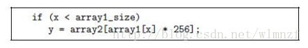
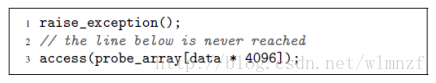

## Transient Execution Attacks and Side-channels

### Meltdown and Spectre

* 本质上都属于cache测信道攻击
* Spectre
    - 边界检查绕过和分支目标注入
    - 利用分支预测将一个原本不该放到cache中的数据放到cache当中
        + 假如x是我们要窃取的值的位置，array1[x]会将其放到缓存中，尽管超过了array1的边界
        + 其结果就是，一个array2的某一个值放到了cache当中
        + 然后根据访问这个array2所有元素的时间，知道下标index
        + 然后根据index，就知道x处内存里的值是多少了
* Meltdown
    - 乱序执行缓存污染
        + 比如触发一个异常，然后kernel数据被抓进了cache
        + 比如突然执行一次内核数据的读取
    - 将kernel数据抓入了cache之后，恶意代码随之读取对应的数据，如果发现访问时间短，则其将得知对应的数据在缓存里，否则就不在缓存里
    - 当然，在以上的第3步中，恶意代码只能得知对应地址的数据是否在缓存中，但是并不能读取到真正的数据内容。为此，可以使用间接寻址的方式猜测数据的具体内容。
        + 例如假设地址为2000的数据无法被恶意代码直接读取，但其值可能为1~5。此时，如果执行执行下列指令：“读取地址为5000+(地址为2000的数据)的数据”，则处理器可以读取的数据地址范围即为5001 ~ 5005。如果我们现在发起了对此地址的读取，然后再依次读取5001 ~ 5005地址的数据，而且发现5004地址的数据读取最快，则显然地址为2000的内存中存放的数据就是4了。

## Code Reuse Attacks

## Rowhammer Attacks
