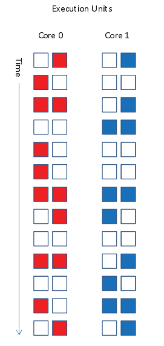

# 多线程

Vertical Waste: long-latency

Horizontal Waste: short of hardware ILP

Chip Multiprocessors

Conjoined Core Architectures

Coarse-Grain Multithreading

Fine-Grain Multithreading

Simultaneous Multithreading

combination of register renaming, the active list, and three instruction queues (integer, floating point, and address queue for loads and stores).

free list: physical registers not currently assigned to an architectural register.
active list: maintains the ordering of instructions and holds the name of the physical register that will become obsolete if the particular instruction commits
queues: The instruction queues hold instructions waiting for their operands to become available

在乱序执行中的效率不如顺序执行

Hybrid Models

SMP+CGMP

GPUs and Warp Scheduling

## limiting the negative performance impact of resource contention

### MANAGING CACHE AND MEMORY CONTENTION
tolerant of long latencies and cache hit misses
1. the global efficiency and adaptability of a "shared" cache, but the predictability and performance isolation of "partitioned" caches.
2. multithreaded core prefers larger, slower caches (SMT creates more misses yet tolerates long latencies)

In summary, then, we see that the best cache design for a multithreaded core would be larger and more associative, possibly with smaller cache lines, than a single-threaded cache. In fact, we would gladly trade those features for slightly increased latency. A multithreaded cache will both incur more misses/access (due to conflict between threads) and potentially significantly more accesses/second (due to increased latency tolerance). This greatly increases misses/second sent on to
further levels of the cache hierarchy, requiring careful attention to the bandwidth and throughput of the cache/memory hierarchy and interconnect.

### BRANCH PREDICTOR CONTENTION
tolerant of branch mispredicts
1. fetch few same thread instruction, relying less on speculation to provide the necessary instruction level parallelism, and instead relying on thread-level parallelism to supply the ILP.
2. thread branch mispredicts do not influence the other thread

In summary, shared prediction tables, even with a full compliment of threads, significantly outperform partitioned tables. but, in short threads, incorporate global history can be nearly useless for threads that execute only hundreds of instructions.

### MANAGING CONTENTION THROUGH THE FETCH UNIT
1. to achieve high fetch throughput so that the fetch unit does not become a bottleneck
2. to maximize parallelism within the instruction scheduling window
3. to minimize the scheduling and execution resources held by stalled threads.

* the fetch unit can fetch from multiple threads at once, increasing our utilization of the fetch bandwidth
* it can be selective about which thread or threads to fetch from (fetch policy)

#### fetch policy
1. BRCOUNT: fetch from the least speculative threads by counting unresolved branches
2. MISSCOUNT: fetch from the threads with fewest outstanding cache misses
3. ICOUNT: fetch from the threads with the fewest instructions in, or heading toward, the instruction queue
4. FLUSH: actually flushes all instructions from a stalled thread, freeing resources for other threads, and requiring the stalled thread to refetch those instructions when the load miss returns
5. DCRA(Dynamically Controlled Resource Allocation): monitors a wider set of resources (each instruction queue is considered separately, as well as integer and floating point registers); distinguish between memory-intensive and CPU-intensive threads; more resources to the memory-intensive threads, providing them more opportunity to find instruction and memory parallelism within those threads
6. FLUSH+MLP(memory level parallelism):  explicitly predict the MLP available at each load. For a load miss with no expected MLP, there is no gain to continuing to fetch that thread, but when there is MLP, they execute just far enough to exploit that MLP (and get subsequent cache miss events into the memory hierarchy) before applying the FLUSH mechanism; 简单来说预测成功的继续，没预测成功的不用fetch了（此外如果有可以利用的MLP）
7. dynamic hill-climbing approach to learn the best allocation of resources to threads (Choi and Yeung [2006])

### MANAGING REGISTER FILES

a register may have been dead for a long time before it is overwritten
proposals:

1. doing register renaming later in the pipeline so that stalled instructions do not consume a register before they are ready to produce a value
2. using sw and hw to identify the last access to a register, allowing it to be freed early
3. register hierarchy (near function unit cache)
4. Mini-threads [Redstone et al., 2003]
5. Physical register inlining （有些数没必要用32位的寄存器，直接用指针存这个数）
6. Register packing （多个数存在一个寄存器里边）

### OPERATING SYSTEM THREAD SCHEDULING

using performance counters monitor to achieve symbiotic jobscheduling (use careful performance monitoring to create a model of thread performance, allowing them to model, or predict, whether a group of threads will demonstrate symbiotic behavior)

1. priority
2. unbalanced schedules (3 thread on one core, 1 thread on one core)
3. thermal management (scheduling an integer-heavy application with a floating point application is likely to perform better than scheduling two floating-point benchmarks together)
4. finer-grain performance counters

### COMPILING FOR MULTITHREADED PROCESSORS
1. false sharing between threads is typically positive with multithreading
2. 任何试图通过增加指令数(例如，预测执行，软件流水线)来实现吞吐量的优化都需要在多线程环境中重新检查——优化可能仍然值得，但最好的设置可能会改变。
3. cache/TLB optimizations: avoid using whole cache 

### MULTITHREADED PROCESSOR SYNCHRONIZATION

1. a thread stalled on synchronization should not slow down other threads.(一个线程的自旋锁不应该占用别的线程的资源，比如fetch\cache\execution带宽，指令队列空间，solution: full-empty bits)
2. synchronization that takes place between two threads on the same core should not leave the core (solution: lock box)

### SECURITY ON MULTITHREADED SYSTEMS

side-channel vulnerability factor
disabling SMT for secure processes can foil SMT-specific attacks, and statically partitioned resources can limit vulnerability
much of the vulnerability comes from the shared caches, but they show additional vulnerability from the pipeline sharing, as well

## exploiting positive interference between threads

### HELPER THREADS AND NON-TRADITIONAL PARALLELISM

1. precomputation of addresses the main thread is going to load in the future, so that they can be prefetched into the data cache 
2. precompute future branch outcomes
3. compute future instruction fetch addresses to support instruction cache prefetch （刨去计算和控制的代码肯定比原本代码快）
4. dynamically recompile the running code to customize it to the runtime behavior of the main thread （当硬件性能监视器识别出感兴趣的运行时行为时，Helper线程就会生成，生成一个轻量级编译器线程来修改和调整执行的代码）

simultaneous subordinate microthreading (SSMT), an architecture with specialized lightweight threads that accelerate the main thread.

### FAULT TOLERANCE

### SPECULATIVE MULTITHREADING ON MULTITHREADED PROCESSORS

(Speculative multithreading / thread level Speculation)TLS 从串行代码中提取线程，并与安全线程并行推测地执行它们。如果推测线程对输入状态的推定被证明是无效的，则需要丢弃或重新运行该线程。它是一种动态（运行时）并行化技术，可以揭示静态（编译时）并行化技术可能无法利用的并行性，因为在编译时无法保证线程独立性。要使该技术实现减少总体执行时间的目标，必须有可用的 CPU 资源，这些资源可以与主安全线程并行有效地执行。

SMP提供的好处：
1. cheap parallelism
2. cheap communication and short spawning and committing time
3. secure isolation

Dynamic Multithreading Processor
Data Speculative Multithreaded Architecture
Implicitly-Multithreaded Processor

Even a 2-thread SMT configuration is competitive with a 4-core CMP

### ENERGY AND POWER
1. the SMT architecture relies much less heavily on speculation to achieve performance
2. multithreaded architectures amortize the power that is consumed much more effectively.
3. multithreaded architectures can be even further modified to decrease speculation, often with minimal impact on performance.
4. a multithreaded processor can be made to degrade gracefully (simply decreasing the thread count) during power or thermal emergencies

total power increase incurred by SMT is about 24% of baseline power. Of that, about 15% comes from the increased structure sizes, and about 9% comes from increased utilization

## Experimentation and Metrics

1. repeatability: average speedup
2. measurement interval: weighted speedup

