# debug specification

## terminology

* component: A RISC-V core, or other part of a hardware platform. Typically all components will be connected to a single system bus.

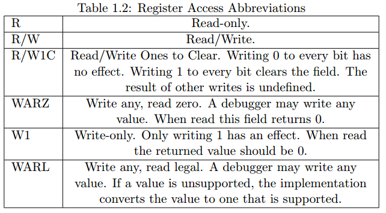

## intro

debug spec 解决以下情况的问题，imp选择性实现：

* 调试 low-level software，没有OS和其他软件的情况下
* 调试OS自身的问题
* 在有任何可执行文件之前，引导硬件平台测试配置和编程 componments
* 在没有工作中的CPU的情况下访问硬件

具体支持的特性：

* 所有hart的寄存器包括CSR都能被读写
* 内存能够通过hart访问或者系统总线直接访问，或者两者方式都可
* RV32, RV64和RV128都支持
* 任何hart都可以被独立调试
* debugger能够找到他想知道的任何事情，无需用户配置
* 每个hart都可以从最刚开始执行的指令开始调试
* 当软件断点执行被执行时，hart能被暂停
* 硬件单步调试能够一次执行一条指令
* 调试功能独立于所使用的调试传输
* debugger不需要知道hart的任何微架构
* harts的任意子集都能同时被暂停和重启（可选）
* 任意指令可以在暂停的hart上执行。这意味着，当核心有额外的或自定义指令或状态时，只要存在可以将该状态转移到GPRs中的程序，不需要新的调试功能（可选）
* 寄存器能够在不暂停的情况下访问到（可选）
* 一个跑着的hart能够被引导去执行短序列指令，而开销很小（可选）
* 系统总线主机允许在不涉及任何hart的情况下访问内存（可选）
* 当trigger匹配PC、读/写地址/数据或指令操作码时，RISC-V hart可以被停止（可选）
* hart可以分组，当其中任何一个停止时，同一组中的所有hart都会停止。这些组还可以对外部trigger作出反应或通知外部trigger。

## System Overview

实例：

* Debug Host: laptop
* debugger: gdb
* Debug Translator: OpenOCD
* Debug Transport Hardware: USB-JTAG adpator
* Debug Transport Module: DTM
* Debug Module Interface: DMI
* Debug Module: DM，一般对应一个hart，但也没有限制；但是也可能一个core有多个hart，但是对应一个DM；最常见的还是一个DM控制多个hart
* Program Buffer: 允许debugger在一个hart上执行任意指令
* Trigger Module: 当trigger条件满足，harts会暂停并通知Trigger Module他们暂停了，一般一个hart对应一个TM

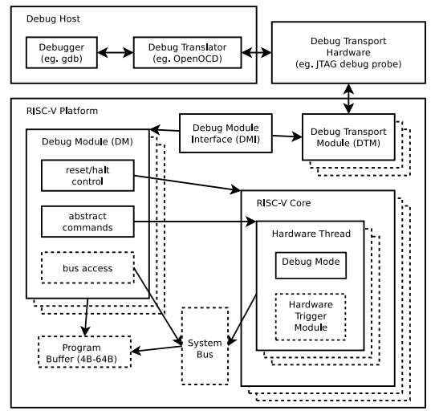

## Debug Transport Module (DTM), non-ISA

只规定了JTAG接口的imp spec，需要加上RISC-V Debug Specification 1.0.0-STABLE, with JTAG DTM

### JTAG DTM

#### Register

IR至少5bit，如果实际超过5bit，除了0x1f的BYPASS是1扩展，其他的全是0扩展
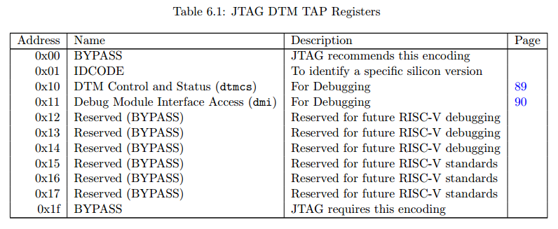

* IDCODE: 当TAP状态机复位时，这个寄存器被在IR中被选择
* dtmcs: DTM Control and Status
* dmi: Debug Module Interface Access
    - 大写DMI表示传输
    - 小写dmi表示寄存器
* BYPASS: 1-bit register that has no effect.

##### dtmcs细节

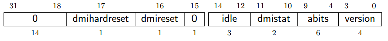

* dmihardreset: 写1表示做hard reset，导致DTM忘记之前的所有DMI，使所有寄存器和内部状态为reset，一般只在debugger觉得DMI永远不会有结果的时候进行复位，W1
* dmireset:清除sticky error state，不影响已经发过的DMI，W1
* idle: 表明debugger在每个DMI之后应该在Run-Test/Idle状态持续的周期数，以免返回busy（dmistat为3），R，给debuffer用的
    - 0: 不需要进入Run-Test/Idle状态，可以直接从Updata-DR到Select-DR
    - 1: 进入Run-Test/Idle状态并下个周期进入Select-DR
    - so on
* dmistat: DMI状态，R
    - 0: 没有错误
    - 1: Reserved
    - 2: 一个操作失败，会导致dmi的op为2
    - 3: 一个操作之前DMI仍然运行的时候尝试过，会导致dmi的op为3
* abits: dmi中的address的size，R
* version: 版本，R
    - 0: spec version 0.11
    - 1: spec version 0.13 和 1.0
    - 15: 本规范中任何可用版本中没有描述的版本

##### dmi细节

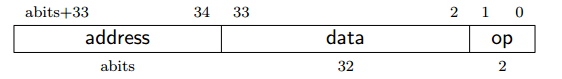

* 在Update-DR的时候，DTM开始执行DMI的操作，除非op是sticky的
* 在Capture-DR的时候，DTM开始用DMI的结果更新data，如果op不是sticky则更新op

当debugger写op这个域，他有以下意义：

* 0: 忽略 data 和 address，也就是在Update-DR的时候，在DMI中不发送任何东西，也不会产生任何busy或者error。
* 1: 在DMI中发送指令，从address中读，下次Capture-DR的时候放入data
* 2: 在DMI中发送指令，将data写入address
* 3: Reserved

当debudder读op这个域，他有一下意义：

* 0: 表明之前的操作成功完成
* 1: Reserved
* 2: 一个之前的操作失败了，这个时候寄存器里的数据将会被忽略，这个状态是sticky的，能被写dtmcs中的dmireset域清零。
* 3: 表明：有操作在DMI请求仍然在进行中曾经尝试过，这个时候寄存器里的数据将会被忽略，这个状态是sticky的，能被写dtmcs中的dmireset域清零。
    - 如果debugger看到这个状态，它需要在UpdateDR和Capture-DR之间给目标更多的TCK上升沿。最简单的方法是在Run-Test/Idle中添加额外的transitions。

## Debug Module, non-ISA

### register

#### Debug Module Status (dmstatus, 0x11)

reset之后hafvereset会被置一，能被ackhavereset清除（除非dmactive为0）

当hart从reset状态出来的时候hartreq或者resethartreq置一，则hart立刻进入Debug Mode；否则，原来是什么状态hart在reset之后还是什么状态

#### Hart Info (hartinfo, 0x12)

* 可选，如果不存在则应该全是0
* 如果存在，debugger就可以用Program Buffer对data和dscratch寄存器显式操作
* 整个寄存器都只读

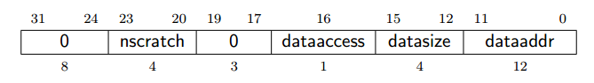

#### Hart Array Window Select (hawindowsel, 0x14)
* 选择哪个window进行注入，假如有48个hart，由于window size是32，则有两个window
* 如果要mask第40个hart，则hawindowsel=1，然后设置hawindow中的mask数据

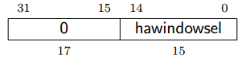

#### Hart Array Window (hawindow, 0x15)
* 先选择Window，例如是第0个window，hawindowsel=0，
* 再写该portion的hawindow寄存器，会将maskdata注入到Hart Array Mask寄存器中

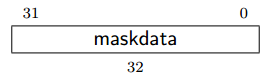

#### Abstract Control and Status (abstractcs, 0x16)

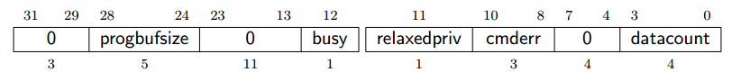

* progbufsize: Prohram Buffer的字数，0\~16字都可以，R
* busy: 1表示一条command正在执行；只要command被写，这一位就会为1，并且直到command运行完成之前都不会被清除，R
* relaxedpriv: 可选，控制PB和abstract memory accesses是否通过基于当前体系结构状态的精确和完整的权限检查来执行或者使用一组宽松的权限检查(例如PMP限制被忽略)。后者的细节是特定于实现的。当设置为0时，应用完全权限;当设置为1时，relaxed的权限适用。WARL
* cmderr: 如果一条指令失败，这位被置位；只能通过写1来清除，清除之前不会运行任何指令；R/W1C
    - 0: no error
    - 1: busy，一条指令正在运行，但是command, abstractcs, 或者abstractauto寄存器被写了，或者data或者progbuf寄存器被读写了
    - 2: not supported
    - 3: exception: 执行command的出现异常，例如执行Program Buffer的时候发生异常
    - 4: hart/resume: hart不在需要的状态（running/halt），或者处于unavailable
    - 5: bus: 错误源于bus错误，包括对齐，访问大小，超时等
    - 6: Reserved
    - 7: other: 其他错误
* datacount: data寄存器的数量，合理值为1\~12，R

#### Abstract Command (command, 0x17)

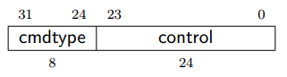

* 写这个寄存器会导致对应的指令被执行
* 在一条指令正在执行的时候写该寄存器会导致 abstractcs域的cmderr为1，同时正在执行的指令将会失去他产生的所有错误信息
* 如果指令需要参数，那么debugger必须在写这个寄存器之前写data寄存器
* 如果指令有返回参数，那么DM必须保证他们在busy清0之前被放置在data寄存器里边
* 如果cmderr非0，写该寄存器会被忽略
* 在执行指令之前，debugger必须要保证dmcontrol寄存器中的haltreq，resumreq和ackhavereset都为0
* 在执行指令的时候，debugger禁止更改dmcontrol寄存器中的hartsel域，并且进制写1到haltreq, resumereq, ackhavareq, setresethaltreq 或 clrresthaltreq
* 如果一条指令看起来完成不了了，debugger可以尝试reset这个hart（使用dmcontrol寄存器里的hartreset和ndmreset），如果busy还是没有清除，还能尝试reset DM（使用dmactive）
* 如果一条指令在hart unavailable的时候开启，或者执行的时候hart变成了unavailable，那么DM可能终止该指令（busy为0，cmderr为4），也可能悬挂该指令（busy一直为1）

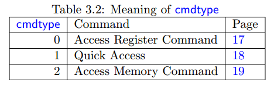
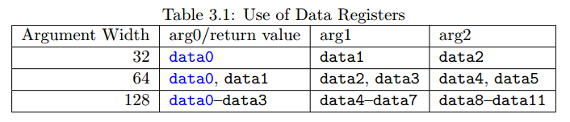

##### Access Register
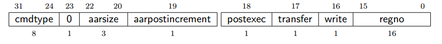

##### Quick Access (optional)

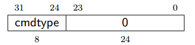

##### Access Memory

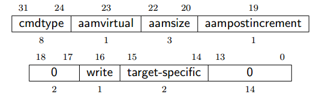

#### Abstract Command Autoexec (abstractauto, 0x18)