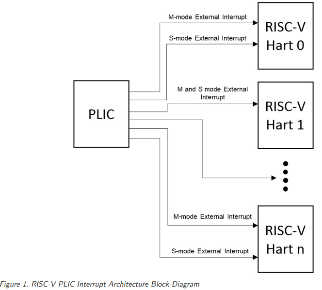
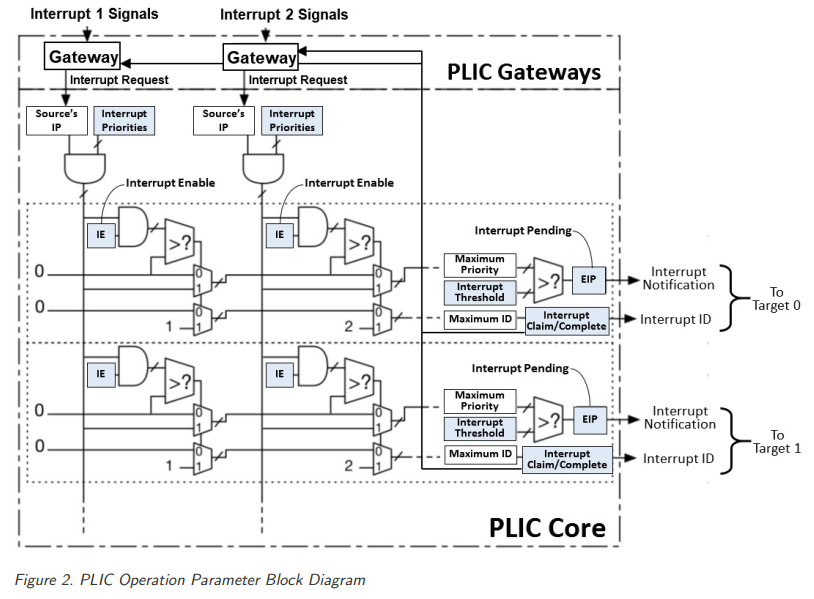

## 介绍
平台级别中断控制器





## 寄存器控制

### Interrupt Priorities registers

* 中断优先级，越大优先级越高，0不发生中断
* 同优先级下低中断号优先级更高

### Interrupt Pending Bits registers

* 等待处理寄存器，对应每个模式的每个hart的每个intr
* 最多可以有用15871个context
* 可以通过claiming清零
* 0是不存在的中断源

### Interrupt Enables registers

* 全局中断使能寄存器，对应每个模式的每个hart的每个中断
* 最多可以有用15871个context
* 例如4核的2路SMT，拥有M和S模式，需要16个context

### Priority Thresholds registers

* WARL域；PLIC将屏蔽所有优先级小于或等于阈值的PLIC中断
* 例如0阈值允许所有非0优先级的中断

### Interrupt Claim registers

* 读取claim/complete寄存器，返回最高优先级等待中断的ID
* 如果没有等待中断则返回0
* 成功的claim也会自动清除中断源上相应的等待bit
* PLIC可以在任何时候执行claim，claim操作不受设置优先级阈值寄存器的影响

### Interrupt Completion registers

* PLIC通过将从claim接收到的中断ID写入claim/complete寄存器来表示它已经完成了一个中断处理程序的执行
* PLIC不检查completion ID是否与该目标的最后一个 claim ID相同
* 如果completion ID是一个未启动的中断源，则completion将被忽略

## 内存映射关系

```
base + 0x000000: Reserved (interrupt source 0 does not exist)
base + 0x000004: Interrupt source 1 priority
base + 0x000008: Interrupt source 2 priority
...
base + 0x000FFC: Interrupt source 1023 priority
base + 0x001000: Interrupt Pending bit 0-31
base + 0x00107C: Interrupt Pending bit 992-1023
...
base + 0x002000: Enable bits for sources 0-31 on context 0
base + 0x002004: Enable bits for sources 32-63 on context 0
...
base + 0x00207C: Enable bits for sources 992-1023 on context 0
base + 0x002080: Enable bits for sources 0-31 on context 1
base + 0x002084: Enable bits for sources 32-63 on context 1
...
base + 0x0020FC: Enable bits for sources 992-1023 on context 1
base + 0x002100: Enable bits for sources 0-31 on context 2
base + 0x002104: Enable bits for sources 32-63 on context 2
...
base + 0x00217C: Enable bits for sources 992-1023 on context 2
...
base + 0x1F1F80: Enable bits for sources 0-31 on context 15871
base + 0x1F1F84: Enable bits for sources 32-63 on context 15871
base + 0x1F1FFC: Enable bits for sources 992-1023 on context 15871
...
base + 0x1FFFFC: Reserved
base + 0x200000: Priority threshold for context 0
base + 0x200004: Claim/complete for context 0
base + 0x200008: Reserved
...
base + 0x200FFC: Reserved
base + 0x201000: Priority threshold for context 1
base + 0x201004: Claim/complete for context 1
...
base + 0x3FFF000: Priority threshold for context 15871
base + 0x3FFF004: Claim/complete for context 15871
base + 0x3FFF008: Reserved
...
base + 0x3FFFFFC: Reserved
```