# 量化

## 量化的基本原理

量化是指对在某一区间内可以连续变化的变量做近似处理，使其只可能在有限多个离散值中变化。模型压缩中的量化指对模型中的输入与权重变量做近似，使其从浮点数变成定点数，从而达到减小计算量，适应硬件计算资源的目的[12]。也就是说，量化是针对模型的输入与权重变量进行的，通过近似，将其从浮点数转化成定点数。

简而言之，模型量化是将浮点存储（运算）转换为整型存储（运算）的一种模型压缩技术。

以线性均匀非对称量化为例。映射步长比△（scale）与零点z（zero-point）是在量化操作中的两个参数。

假设有一个浮点型变量*x*，要将其量化成8bit定点数。那么它量化后可变化的值$N_{level}$就是$2^8 = 256$，具体来讲就是可以取0到255这些整数值。对于给定的映射步长比△，与零点*z*，就有这样的公式。其中，$x_Q$就是量化后的新变量。

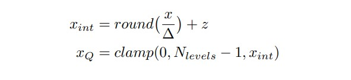

这里的两个函数round与clamp，其中round可以理解为四舍五入取整，clamp是分段函数，其函数图像如图。

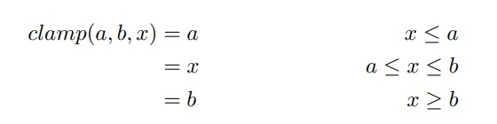

## 线性量化与非线性量化

根据映射函数是否是线性可以分为两类-即线性量化和非线性量化。

### 线性量化

常见的线性量化过程可以用数学表达式来表示： 
$$
r=round(S(q-Z))
$$
其中，q 表示的是原始的float32数值；Z表示的是float32数值的偏移量，在很多地方又叫Zero Point；S表示的是float32的缩放因子，在很多地方又叫Scale；Round(⋅) 表示的是四舍五入近似取整的数学函数，除了四舍五入，使用向上或者向下取整也是可以的；r表示的是量化后的一个整数值。根据参数 Z 是否为零可以将线性量化分为两类—即对称量化和非对称量化。

### 非线性量化

当量化浮点到定点之间映射函数为非线性时，我们称这种量化方法为非线性量化。其中比较经典的模型有Shuchang Zhou等在“Dorefa-net: training low bitwidth convolutional neural networks with low bitwidth gradients”中提出的Dorefa量化方法。

## 对称量化与非对称量化

根据映射后量化值的零点是否跟量化前一致 可以分为两类-即线性量化和非线性量化。

### 对称量化

均匀对称量化可以说是均匀映射量化的一种特殊情况，如图3.4所示，在均匀对称量化中，零点默认取0。那么量化公式就可写为：

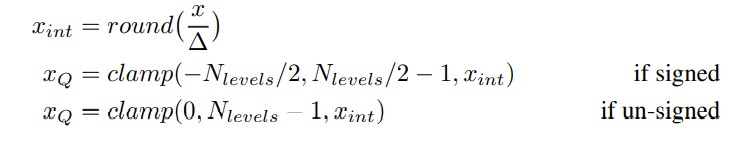

由于零点为零，在量化前后变量的正负不变。因此，对于可能为负的变量，在量化后需要用定点有符号数的方法来表示，这是均匀对称量化不同的地方。 

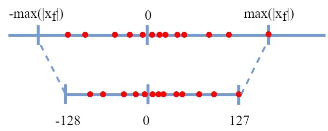

### 非对称量化

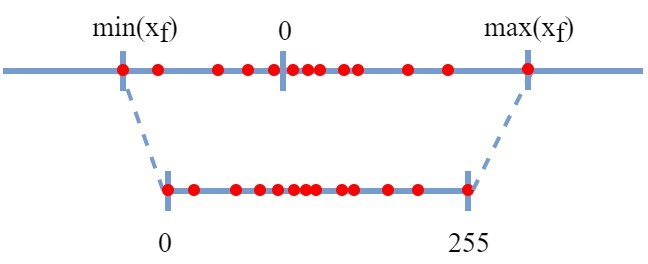

所谓的非对称量化，即使用一个映射公式将输入数据映射到[0,255]的范围内，图中min(Xf)表示的是输入数据的最小值，max(Xf)表示输入数据的最大值。总而言之，对称量化通过映射关系将输入数据映射在[0,255]的范围内，对于映射关系而言，我们需要求解的参数即Z和S。

在非对称量化中，r 是用有符号的整型数值(uint8)来表示的。在非对称量化中，我们可以取Z=min(x)，S的取值可以使用如下的公式，也可以采用其它的公式。
$$
S=\frac{2^{n-1}-1}{max(x)-min(x)}
$$

## 逐层量化和逐通道量化

根据量化的粒度（共享量化参数的范围）可以分为逐层量化、逐组量化和逐通道量化。

### 逐层量化

逐层量化以一个层为单位，整个layer的权重共用一组缩放因子S和偏移量Z；

### 逐通道量化

逐通道量化则以通道为单位，每个channel单独使用一组S和Z。

## 在线量化和离线量化

根据激活值的量化方式，可以分为在线（online）量化和离线（offline）量化。

### 在线量化

在线量化，指激活值的S和Z在实际推断过程中根据实际的激活值动态计算。

### 离线量化

离线量化，指提前确定好激活值的S和Z；由于不需要动态计算量化参数，通常离线量化的推断速度更快些，通常通过以下的三种方法来确定相关的量化参数：

**指数平滑法：** 即将校准数据集送入模型，收集每个量化层的输出特征图，计算每个batch的S和Z值，并通过指数平滑法来更新S和Z值。

**直方图截断法：** 在计算量化参数Z和S的过程中，由于有的特征图会出现偏离较远的奇异值，导致max非常大，所以可以通过直方图截取的形式，比如抛弃最大的前1%数据，以前1%分界点的数值作为max计算量化参数。

**KL散度校准法：** 通过计算KL散度（也称为相对熵，用以描述两个分布之间的差异）来评估量化前后的两个分布之间存在的差异，搜索并选取KL散度最小的量化参数Z和S作为最终的结果。TensorRT中就采用这种方法。

## 有数据量化和Data-Free量化

根据需要量化是否需要激活和权重的数据可以分类有数据量化和Data-free量化。

## 经典量化模型

### Google whitepaper量化方法

Google的量化白皮书把线性量化的方法做一个完整的梳理，提出权重选择每通道量化/激活使用每层量化进行硬件加速和内核优化的量化建议。这篇文章最优秀的地方在于有完整的工程实践流程，给很多工程中会遇到的问题予以解决方案。在实际的工程中，白皮书针对遇到的问题，对线性量化的工程的实现准备如下的方案。

#### Add和Concat融合的量化参数

为可以正确进行 Add加/Concat融合 运算，需要重新缩放定点值，因此可以采用下图所示两种方法来解决量化参数的确定问题。

为确保在训练过程中正确建模推理时的操作融合，可以考虑Add后

添加ReLU操作。 在这种情况下，大多数平台都可以在推理时融合加法和ReLU操作。可以不在加法运算和ReLU运算之间放置模拟量化运算。

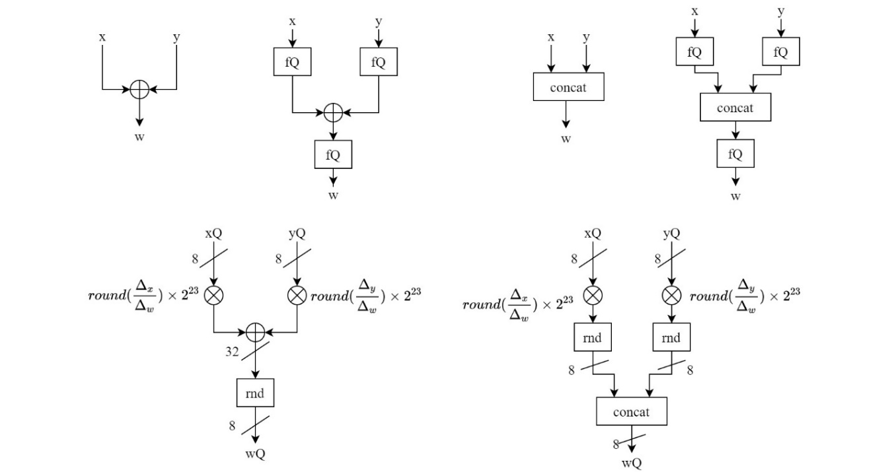

#### BN融合量化方案

##### 一般的BN融合方案

对于量化推理，使用如图的BN融合方式并对其进行训练——在QAT训练期间使用BN层每个batch的统计信息，在推理期间使用BN层长期统计信息（滑动平均形式来统计），具体请查询BN层训练和推理时不同处理方式。  

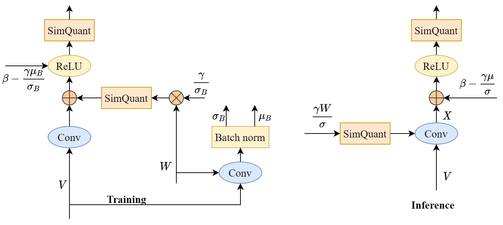

##### QAT的冻结训练

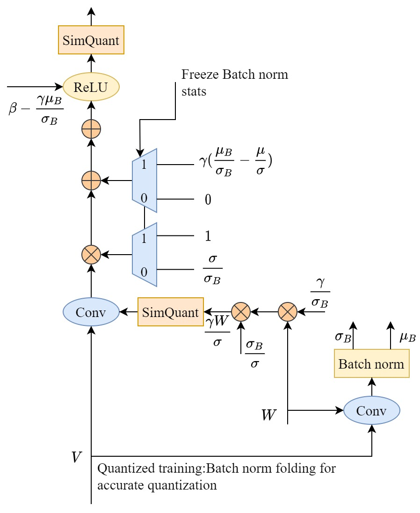

由于一般的BN融合的方法中，批统计量在每个batch批之间变化很大，这会在量化的权重中引入不希望的跳变，也会使量化模型难以收敛，最后模型的精度不高。一个简单的解决方法是，在训练时也使用整个训练集的均值和标准差，但是这样会使“批(batch)”归一化失去意义（即BN的均值、标准差参数和批统计量完全没有了关系），并且会导致训练不稳定（这是因为训练集统计出来的均值和方差是fp32的，跟int8的模型不吻合）。

谷歌白皮书是这样做的：在一开始做QAT时，先采用一般的BN融合方案，使用BN层每个batch的统计信息，当训练到一定程度后，将上述统计出来的BN参数滑动平均值拿来使用。

### DorefaNet量化方法

DoReFa-Net在对权重的量化过程中加入*tanh*函数。参数在进行量化之前，要先经过*tanh*函数，使变化区间局限在[-1,1]上。由于*tanh*函数是非线性的，所以量化前后的权重参数也不符合线性的映射关系。此外，DoReFa-Net除了对权重与激活层进行量化，对反向传播的梯度也进行量化，能够有效加快网络的参数更新速度。

简单来讲，DoReFa-Net的量化包含三个部分，即对权重的量化，对激活层的量化以及对梯度的量化。其中，对权重的量化是非线性的，对激活层和梯度的量化是线性的。另外，DoReFa-Net也是最先实现对梯度的量化。

#### $quantize_k$函数

在DoReFa-Net具体的量化操作中，有一个被多次使用的函数——$quantize_k$，先了解这个函数，有助于理解整个量化操作过程。$quantize_k$函数的具体表达式如下：

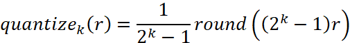

观察该函数，自变量r在乘以$2^k-1$后被四舍五入取整，之后又缩小相同的倍数。因此，这个函数的输入和输出数值在期望上是相等的。可以看作$quantize_k$对输入做k比特的量化，再量化回去，只损失精度。

在DoReFa-Net中，作者将量化与反量化融合在这一个函数中实现。虽然函数的输出仍然不是整数，但在实际的卷积计算中已经可以用k比特的定点数来表示（相当于小数点在最高位的前面），也可以加速计算。

#### 对权重的量化

DoReFa-Net对权重做非线性量化。权重参数首先要过一个tanh函数，由于tanh函数的特性，输出会被约束在$[-max(|tanh(r_i)|), max(|tanh(r_i)|)]$的范围内($r_i$是权重中的任意元素)。进过平移，均匀映射到[0,1]上。这之后再过$quantize_k$函数量化。量化后，重新平移，映射到[-1,1]区间上。

用$f_w^k$来表示权重的量化函数，$r_i$表示量化前的权重，$r_o$表示量化后的权重。对权重的量化过程就可以写成：

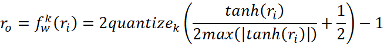

#### 对激活的量化

在DoReFa-Net中，对激活层的量化很简单，就是一个$quantize_k$函数。

#### 对梯度的量化

对梯度的量化方法类似于对权重的量化，不过并没有过*tanh*函数。另外，为使梯度的函数曲线在量化前后在期望上更加相似。量化中加入噪声函数$N(k)=\frac{\sigma}{2^k-1}$，$\sigma$是在（-0.5，0.5）上的随机数。

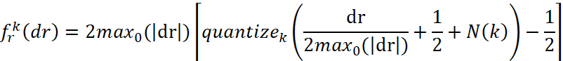

### TensorRT量化

NVIDIA的TensorRT方案是公开的，但是并没有开源，也就是说只能用他的工具（tensorRT）来进行量化、部署.如果想用他的量化校准部分获取校准参数给移动端直接用，目前发现是导不出来这些中间参数的，而且也没源码，在安装包内的python接口也是调用的so文件。

不饱和的量化映射示意图：

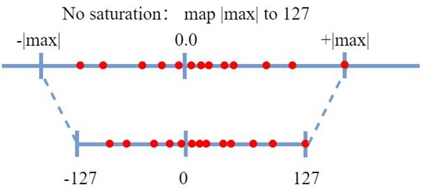

饱和的量化映射示意图：

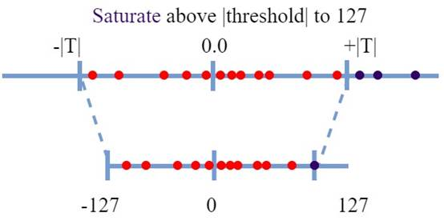

非饱和量化的问题是当数据分布极不均匀的时，有很多动态范围是被浪费的，TensorRT的主要思路就是用饱和量化弥补这个问题。具体实现上,NVIDIA采用KL散度算法。

KL散度又称相对熵,它表示两个分布的差异，差异越大，相对熵越大。

##### KL散度算法具体实现步骤

1.首先不断地截断参考样本P，长度从128开始到2048;(为防止128~|MAX|数据太多,所以将原数据分为2048bins,每个bin包含一个数据)

2.将截断区外的值全部求和；

3.截断区外的值加到截断样本P的最后一个值之上(尽可能地将截断后的信息给加进来）;

4.求得样本P的概率分布；

5.创建样本Q，其元素的值为截断样本P的int8量化值；

6.将Q样本长度拓展到 i ，使得和原样本P具有相同长度；

7.求得Q的概率分布；

8.然后就求P、Q的KL散度值

循环执行以上步骤，遍历128~2048的区间,不断地构造P和Q，并计算相对熵，然后找到最小（截断长度为m）的相对熵，此时表示Q能较好地拟合P分布，因此有：

|T| = (m + 0.5) * lenth(bin)

其中T是我们所需的截断阈值，m为截断长度，lenth(bin)为一个bin的长度。
