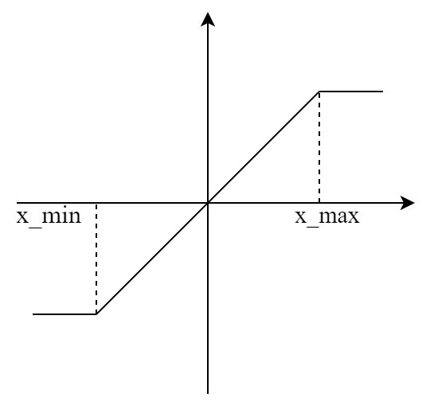

# 量化

## 量化的基本原理

量化是指对在某一区间内可以连续变化的变量做近似处理，使其只可能在有限多个离散值中变化。模型压缩中的量化指对模型中的输入与权重变量做近似，使其从浮点数变成定点数，从而达到减小计算量，适应硬件计算资源的目的[12]。也就是说，量化是针对模型的输入与权重变量进行的，通过近似，将其从浮点数转化成定点数。

简而言之，模型量化是将浮点存储（运算）转换为整型存储（运算）的一种模型压缩技术。

以线性均匀非对称量化为例。映射步长比△（scale）与零点z（zero-point）是在量化操作中的两个参数。

假设有一个浮点型变量*x*，要将其量化成8bit定点数。那么它量化后可变化的值$N_{level}$就是$2^8 = 256$，具体来讲就是可以取0到255这些整数值。对于给定的映射步长比△，与零点*z*，就有这样的公式。其中，$x_Q$就是量化后的新变量。

这里的两个函数round与clamp，其中round可以理解为四舍五入取整，clamp是分段函数，其函数图像如图。

## 线性量化与非线性量化

根据映射函数是否是线性可以分为两类-即线性量化和非线性量化。

### 线性量化

常见的线性量化过程可以用数学表达式来表示： 
$$
r=round(S(q-Z))
$$
其中，q 表示的是原始的float32数值；Z表示的是float32数值的偏移量，在很多地方又叫Zero Point；S表示的是float32的缩放因子，在很多地方又叫Scale；Round(⋅) 表示的是四舍五入近似取整的数学函数，除了四舍五入，使用向上或者向下取整也是可以的；r表示的是量化后的一个整数值。根据参数 Z 是否为零可以将线性量化分为两类—即对称量化和非对称量化。

### 非线性量化

当量化浮点到定点之间映射函数为非线性时，我们称这种量化方法为非线性量化。其中比较经典的模型有Shuchang Zhou等在“Dorefa-net: training low bitwidth convolutional neural networks with low bitwidth gradients”中提出的Dorefa量化方法。

## 对称量化与非对称量化

根据映射后量化值的零点是否跟量化前一致 可以分为两类-即线性量化和非线性量化。

### 对称量化

均匀对称量化可以说是均匀映射量化的一种特殊情况，如图3.4所示，在均匀对称量化中，零点默认取0。那么量化公式就可写为：

由于零点为零，在量化前后变量的正负不变。因此，对于可能为负的变量，在量化后需要用定点有符号数的方法来表示，这是均匀对称量化不同的地方。 

### 非对称量化

所谓的非对称量化，即使用一个映射公式将输入数据映射到[0,255]的范围内，图中min(Xf)表示的是输入数据的最小值，max(Xf)表示输入数据的最大值。总而言之，对称量化通过映射关系将输入数据映射在[0,255]的范围内，对于映射关系而言，我们需要求解的参数即Z和S。

在非对称量化中，r 是用有符号的整型数值(uint8)来表示的。在非对称量化中，我们可以取Z=min(x)，S的取值可以使用如下的公式，也可以采用其它的公式。
$$
S=\frac{2^{n-1}-1}{max(x)-min(x)}
$$

## 逐层量化和逐通道量化

根据量化的粒度（共享量化参数的范围）可以分为逐层量化、逐组量化和逐通道量化。

### 逐层量化

逐层量化以一个层为单位，整个layer的权重共用一组缩放因子S和偏移量Z；

### 逐通道量化

逐通道量化则以通道为单位，每个channel单独使用一组S和Z。

## 在线量化和离线量化

根据激活值的量化方式，可以分为在线（online）量化和离线（offline）量化。

### 在线量化

在线量化，指激活值的S和Z在实际推断过程中根据实际的激活值动态计算。

### 离线量化

离线量化，指提前确定好激活值的S和Z；由于不需要动态计算量化参数，通常离线量化的推断速度更快些，通常通过以下的三种方法来确定相关的量化参数：

**指数平滑法：** 即将校准数据集送入模型，收集每个量化层的输出特征图，计算每个batch的S和Z值，并通过指数平滑法来更新S和Z值。

**直方图截断法：** 在计算量化参数Z和S的过程中，由于有的特征图会出现偏离较远的奇异值，导致max非常大，所以可以通过直方图截取的形式，比如抛弃最大的前1%数据，以前1%分界点的数值作为max计算量化参数。

**KL散度校准法：** 通过计算KL散度（也称为相对熵，用以描述两个分布之间的差异）来评估量化前后的两个分布之间存在的差异，搜索并选取KL散度最小的量化参数Z和S作为最终的结果。TensorRT中就采用这种方法。

## 有数据量化和Data-Free量化

根据需要量化是否需要激活和权重的数据可以分类有数据量化和Data-free量化。

