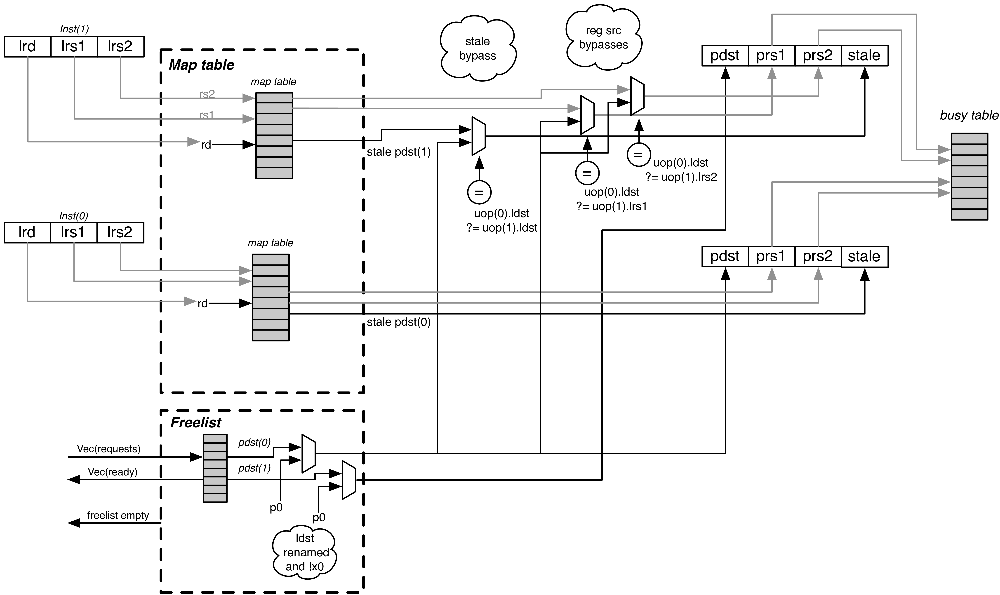

## Branch Prediction

## Rename Stage

* map_table 记录逻辑寄存器与物理寄存器之间的映射关系，是speculative的
* free_list记录物理寄存器的空闲状态；
* busy_table 记录寄存器是否可读。

* 重命名请求：
    - 通过map_table获取物理寄存器
    - 由free_list分配一个物理寄存器作为目的寄存器
    - 通过busy_table判断指令的源操作是否可读，如果可以读将被issue，不可读说明是RAW

* Rename 阶段在流水线中占用两个时钟周期
    - 第一个时钟周期中 FreeList 和 MapTable 模块将译码级传入的微指令中的逻辑寄存器映射为物理寄存器
    - 第二个时钟周期通过 BusyTable 模块判断源操作数寄存器是否可读
    
* BusyTable
    - 当某个寄存器被分配为pdst时，对应表项会置位，当指令写回时，清零表明可以读了

* MapTable
    - 每个branch都有自己的rename map table快照，分支预测失败后可以一周期退回
    - 有一个可选的Committed Map Table
        + 用于保存committed architectural state，以便在flush和exception的时候1周期的reset
        + 否则需要几个周期unwind ROB来退回重命名前状态，1行ROB1周期
    
* FreeList
    - bit-vector，可以用优先译码器找到第一个free register
    - 对于多发射可以使用cascading priority decoder在1个周期内找到多个free register
    - 每个branch都有一个allocation list，初始化为0
        + 在之后的任何一个物理寄存器被分配，则对应位写1
        + 如果speculation错误，则通过FreeList和Allocation List进行OR退回

* stale physical destination
    - 比如说要写一个逻辑寄存器，刚开始他对应的物理寄存器就是stale pdst
    - 在这个指令commit之后，这个stale pdst需要被写回到free list

## ROB and Dispatch Stage

* ROB
    - valid
    - busy
    - exception
    - branch mask(这个entry在哪个分支下推测执行)
    - rename state(logical destination和stale physical destination)
    - floating-point status updates
    - pc
    
* Commit Stage
    - 当head no busy no expcetion，commit
    - commit结束时，pdst写回free list

* Exception 和 Flush
    - Rename Map Table需要恢复到non-speculative committed state
    - Front-end要directed to 合适的PC

* the instructions ahead of the commit head and behind the PNR head are guaranteed to be non-speculative, even if they have not yet written back.

