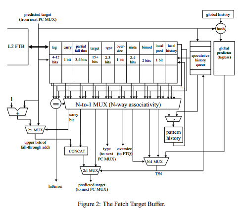

## FTB fetch target buffer

* interconnect scaling bottleneck.
    - 由于memory的存在，一大块，占用面积，导致wire length变长，导致延迟的问题，因此要解决不能scale的问题；一种办法是减少memory结构的大小，本文则是使用解藕的办法；使得Icache在容量大的情况下能够pipelined。

* 目的：decouple branch predictors and branch target buffers from $I
    - 最大化每次预测的可以fetch的指令数目
    - 每周期形成有用的预测
    - icache有自己的fetch address，branch predictor有自己的PC来控制预测；现周期的PC会用来接下来的周期的fetch address

* BBTB:
    - indexed by starting address of the basic block
    - 如果预测taken，那么taken address用于下个cycle的fetch
    - 如果预测不taken，那么fall-through address用于下个cycle的fetch
    - 如果miss，那么现在的fetch address + offset用于下个cycle的fecth
    - 如果需要fetch超过一个周期，则BBTB会等fetch完了才能下一次预测，FTQ则允许FTB快于Icache访问

* FTB相对与BBTB的改进：
    - 对于那些strongly biased not-taken；就直接不存在FTB里边且不更新history
    - 不存fall-through address，只存低位和carry位

* fetch blocks:
    - starting: a branch target (fall-through address或taken address)
    - ending: strong biased taken（无条件跳转） or unbiased branch
        + 那些biased或且不跳转的处于fecth blcoks里边
* FTB：
    - start是pc index，也是current fetch address
    - fall-through address-4是branch指令的Pc
    - 预测器的目标就是判断这个branch指令是taken还是not taken
        + 如果taken，那么taken address用于下周期的预测地址
        + 如果不taken，那么fall-through address用于下周期的预测地址
    - 如果在FTB miss，则下个fetch address等于预测地址等于current fetch address + offset
    - oversize位表明是否跨line

* 论文中的预测器使用的是竞赛预测器
    - 在local history-based, global history, bimodal里选

* FTQ：
    - 每个周期FTB产生下一个fetch block的
        + starting address
        + address where the fetch block ends
        + the predicted target address (fall-through or taken)
    - 这些信息在每次预测之后会存入queue中，然后被之后的Icache pipeline所使用

