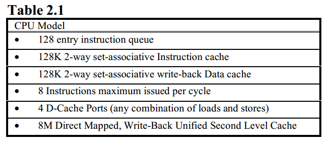

把load依赖的store set称为load's store set
目标就是发现和使用这个store set来预测load能安全执行的最早时间
这里不用bypass来解决memory-order violation的一个原因就是有的时候store的addr还没计算出来，不能用于bypass

goals:

* 预测load指令执行是否会导致memory-order violation
* delay执行这些loads

metric:

* 预测器导致的memory-order的violation
* 预测器导致的false dependencies

首先让所有load都推测执行，如果检测到一个当store执行时检测memory-order violation，那么把这个store加载load's store set

### Baseline

* alpha 21264但是double cache和issue width
* 128 instrution queue entries.

assume baseline检测violation的方式如下:

* 通过表存放所有在执行的loads指令的地址
* 每次store都会check该表看是否有推测的load依赖于我
* 如果有，则需要恢复到该loads的PC位置，重新取该load指令
* 假设N周期恢复，也就是下边的memory trap penalty
* benchmarks是 SPEC95

### Motivation

#### No speculation

load 不会推测执行：

* violation无了
* 但是false dependencies很多
    - loads必须等store计算完addr和data才能发射；本文不考虑data和addr分开流水的情况

#### Naive speculation

只要寄存器依赖已经解决，load推测执行；

* violation造成trap
    - memory trap penalty: 取决于程序中这个store执行所需的时间
* 有的设计可以不用flush 推测load之后的所有指令，只需要flush跟load相关的指令即可。（这个可以通过保留站的机制实现，只需要relay一些指令(香山的s2 feedbackfast就是这么处理的)，但是在论文中的baseline中，他是尽可能快的de-allocated from instruction queue）
    - 这样可以让小的queue也能够找到更多的ILP，因为发射的指令出去的快说明进来的快
    - 论文的目的就是尽可能消除violation，使得memory trap penalty不重要，同时还能更早的de-allovation
    
#### Perfect Memory dependence prediction

* 不产生violation
* 不产生false dependencies

### Related work

* Digital Equipment Corporation: synchronizing？
* IBM: store barrier cache
* Moshovos: comprehensive description of memory dependence prediction， first paper指出memory dependenciese在ooo CPU中是有问题的

* paper work的前提就是历史记录的dependencies能够精确预测未来的dependencies

### Store Sets

* 预测one load依赖于多个store
* 也预测多个load依赖于相同store

store sets： 每个load指令会有一个相联的store指令

当load被fetch，处理器会决定那些store被fetch但是没有被发射的处于store set中那些指令，加上dependence的annoation

* 允许一个store对应多个load，这个很显然
* 多个store对应一个load
    - if (expr) then x = a; else x = b; ..... c = x;
    - load可能是packed的结构体，例如rgba
    - WAW也认为是dependecies

需要对比这两种的重要性，做了三种实验：

* 每个load有自己的store set，及可能保存多的store，但是store只能存在一个store set里，如果一个store导致了violation，从store set中删掉，保存到last导致violation的load's store set里
    - 可以存2，4，8 stores情况下： 8和没有限制性能基本一致
* 允许每个load指定最多一个store dependence。如果有新的violation直接替代，允许一个store存在多个store sets
* 不限制store set size，也不限制store能出现在几个store sets里

