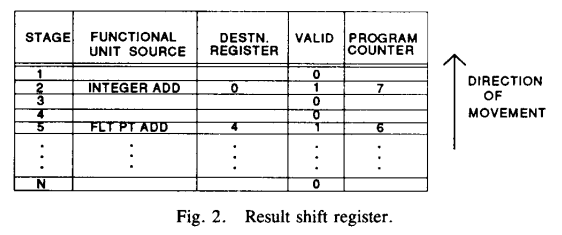
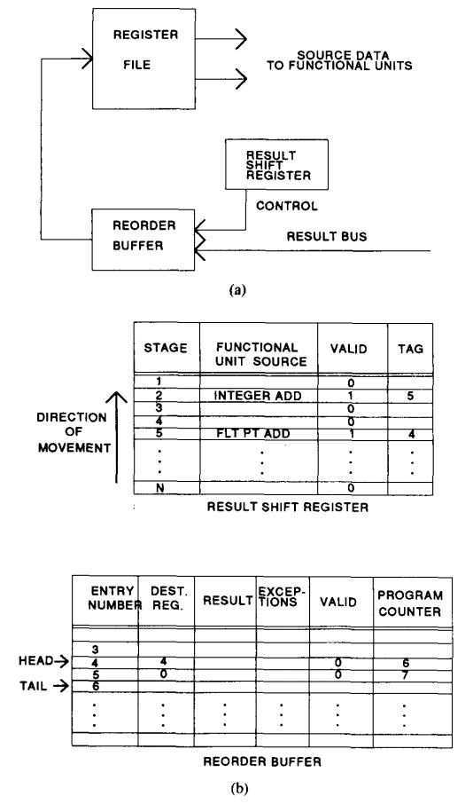
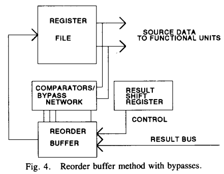
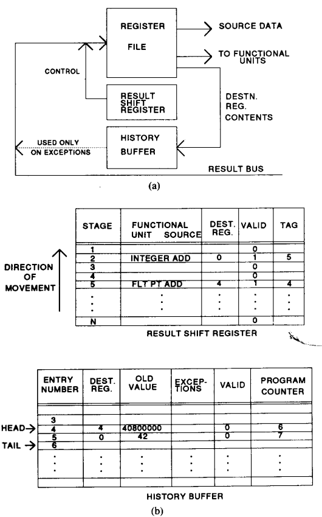
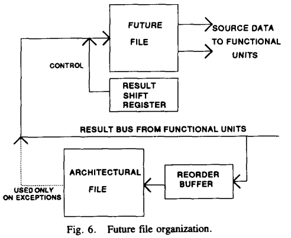

# Implementing Precise Interrupts in Pipelined

tomasulo: IBM 360/91
scoreboard: CDC 6600
explicit renaming: R10000, alpha 21264, Intel Sandy Bridge, and ARM Cortex A15
implicit renaming: Pentium 4, ARM Cortex A57

## Result Shifter Register

* 一条花费i个时钟周期的指令在发射的时候，保留存在rsr的第i个stage
* 如果这个stage已经有一个valid control info，则在下一个clock再发射
* contro info包括
    - function unit
    - destination resgiter
    - valid
* 当指令达到第1个state，则在下一个周期控制result bus将这个function unit的结果放到正确的结果寄存器中
* 缺点
    - 一些快指令尽管没有数据依赖也无法跑到前面去执行了而必须在issue阶段
    - 它们阻塞了发射，而后面较慢的指令原本可以指令而被阻塞

### Register

* 发射一个j时钟周期的指令应该满足，只能往后放，不能往前放
    - i小于j的stages中那些没有valid信息的stage也被reserved了，就是不能用了
    - 如果有遇到异常，则cancel rsr中的所有entry
* 这种方法的关键是保证一条指令在完成之前是没有异常发生的，只有在stage1的时候才看到异常

### Memory

* store指令修改驻留在主存中的process state部分
    - 有一种解决办法是强制store等待rsr清空再issue
* 替代方法：先放在load/store pipeline知道前面的所有指令都是exception-free的，然后在released to memory
    - store在rsr中也放一个entry，dummy store，满足上面register的顺序完成条件
    - 只有前面的指令全部无异常完成，才会执行store
    - 否则会被cancell掉

### Program Counter

* rsr扩展加上一个域，用于存放每条指令的PC，在发射的时候添加上去
* 当一条指令带着异常条件出现在result bus，则rsr中pc成为saved state的一部分

## Reorder Buffer

* circular buffer with head and tail
    - entries between head & tail 都是valid
    - 当一个instruction issues，从tail分配一个
* result shifter regitser
    - 跟上面不同的一个地方就是带tag，tag就是rob中的entry nubmer
* 当一条指令完成，结果和exception condition都被送到rob
* 当rob的head的results是valid，说明指令完成，那么检查他的exception
    - 如果是none，那么结果写道register
    - 如果有异常，则发射停止，并且后续的所有对寄存器的更改被禁止

### Memory

* 之前发射的所有指令都是free of exception了，发送store
* 或者允许发射，但是被阻塞直到轮到他commit

### Program Counter

* 发射的时候可以存放在rob的一个域内
    - 尽管可以放在rsr中，但是rsr通常比rob都大，因为rsr需要保证延迟最大的指令都能放进去

### Bypass

* 这些路径允许保存在重排序缓冲区中的数据代替寄存器数据使用。此方法的实现需要为每个重排序缓冲区级和操作数指示符提供比较器。
* Clearly only the latest reorder buffer entry that corresponds to an operand designator should generate a bypass path to the register output latch
* 为了防止同一寄存器的多次bypass，当一条指令被放入重排序缓冲区时，任何具有相同目标寄存器指示符的条目都必须被禁止匹配bypass

## History Buffer

* 和future file一样，旨在减少或消除使用简单的重排序缓冲区时的性能损失，但不需要多个旁路路径所需的所有控制逻辑。
* 当一条指令发射的时候，在hb中tail分配一个entry，同时也将destination register的值读出来放入buffer中
* 当一条指令完成的时候，result bus中的数据直接写到register file当中；同时异常报告也写到history buffer中。同上用rsr中的tag索引hb中的entry
* 当hb的head完成并且没有异常，那么这个entry不再需要，head pointer可以加1
* 当hb的head完成并且有异常
    - buffer保持不变
    - 停止指令发射
    - 等待流水线全部完成
    - 从tail到head，将原本的register中的值load会他们自己的register
* store的处理方式同上
* 额外的硬件：
    - old value buffer
    - register file必须有三个读口
        + rd,rs1,rs2都需要在发射的时候一次读出来
    - 如果原来的基本实现就需要将结果bypass，那么这个时候bypass也需要练到history buffer
    
## Future File

* architectural file & future file
* 结果返回到future file是无序的，同时结果还会valid rob
* 当head pointer找到一个valid entry
    - 如果没有错误，对应的结果写进architectural file
    - 如果有错误，与头指针和尾指针之间的缓冲区条目相关的寄存器指示符将用于从体系结构文件中恢复未来文件中的值。
    

## Extensions

* 解释如何处理以下的精确异常。因为process state，不仅包括上述的register, memory 和 pc，可能还有以下内容

### Handling Other State Values

### Virtual Memory

### Cache Memory

### Linear Pipeline Structures

### Vectors