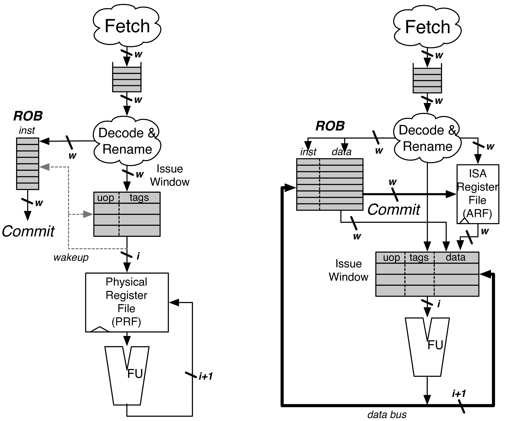

# Explicit Renaming

映射表的两种结构：RAM和CAM

* RAM: 用逻辑寄存器索引，表项数目等于逻辑寄存器数目
* CAM: 用逻辑寄存器作为content，查找物理寄存器的index，表项数量等于物理寄存器数量
    - 由于一个逻辑寄存器可能有多个物理寄存器映射关系，因此需要加标识位，表示是否为最新的映射关系

## BOOM

见 BOOM.md 的 Rename Stage

## R10000

# Implicit Renaming

## Reservation stations

future file, rob
